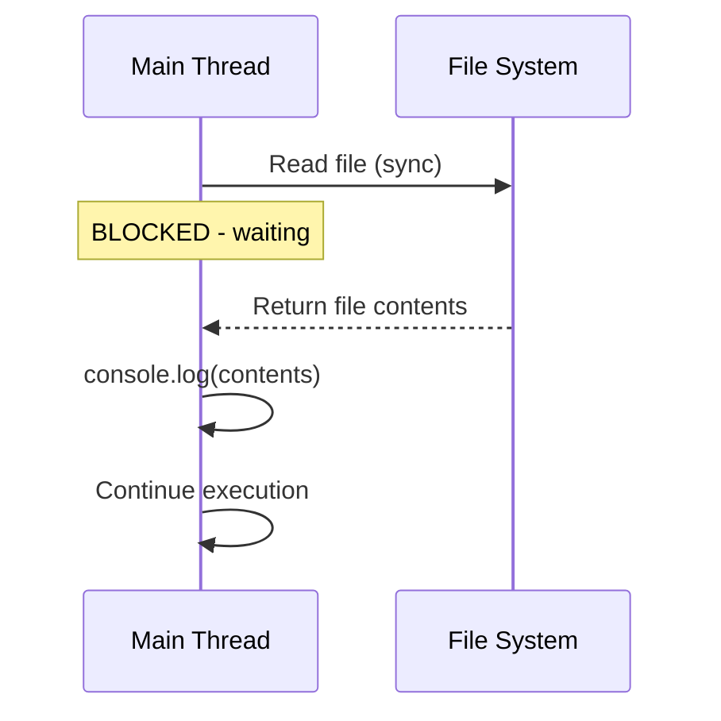
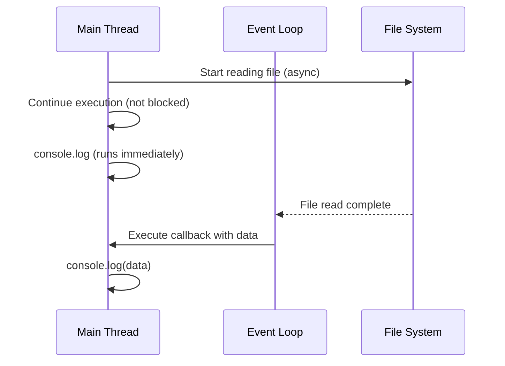
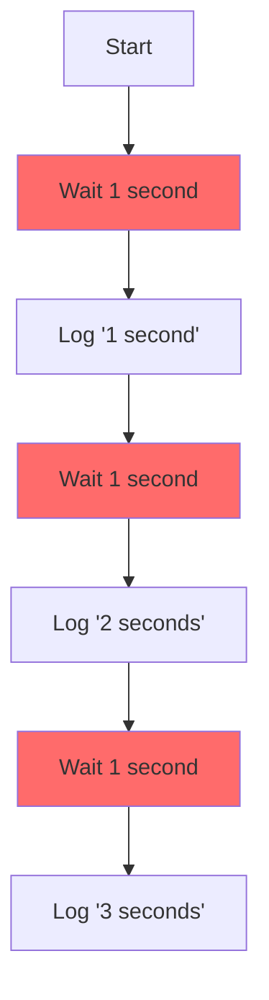
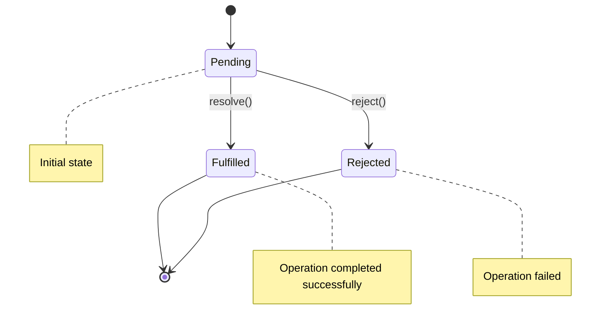
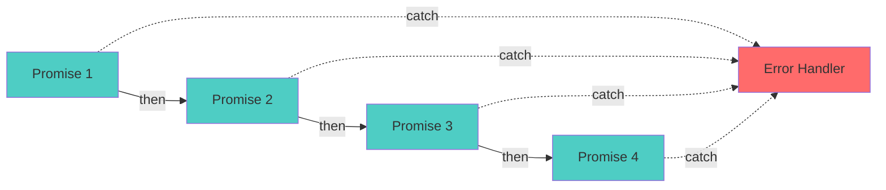
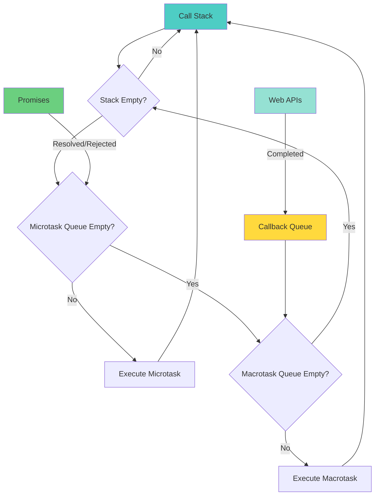
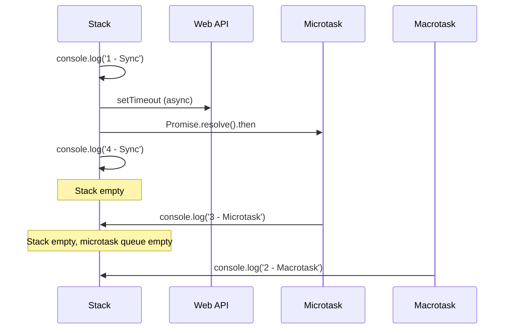

# Week 2: Asynchronous JavaScript & Modern JavaScript Concepts

A comprehensive guide covering asynchronous programming, promises, async/await, modern JavaScript features, and essential bash commands.

---

## Table of Contents

1. [JavaScript Fundamentals](#javascript-fundamentals)
   - [Classes](#classes)
   - [Map](#map)
   - [Set](#set)
   - [Date](#date)
2. [Asynchronous JavaScript](#asynchronous-javascript)
   - [Synchronous vs Asynchronous](#synchronous-vs-asynchronous)
   - [The Problem with Callbacks](#the-problem-with-callbacks)
   - [Promises](#promises)
   - [Async/Await](#asyncawait)
   - [The Event Loop](#the-event-loop)
3. [Bash Commands Reference](#bash-commands-reference)
4. [Key Takeaways](#key-takeaways)

---

## JavaScript Fundamentals

### Classes

Classes in JavaScript are blueprints for creating objects with predefined properties and methods.

**Syntax:**
```javascript
class ClassName {
    constructor(param1, param2) {
        this.property1 = param1;
        this.property2 = param2;
    }

    method() {
        // method implementation
    }
}
```

**Example:**
```javascript
class Rectangle {
    constructor(width, height, color) {
        this.width = width;
        this.height = height;
        this.color = color || 'blue';  // default value
    }

    area() {
        return this.width * this.height;
    }

    print() {
        console.log(`Rectangle: ${this.area()} ${this.color}`);
    }
}

// Creating an instance
const rect = new Rectangle(10, 20, 'red');
rect.print();  // Output: Rectangle: 200 red
```

**Key Points:**
- `constructor()` is called when creating a new instance
- `this` refers to the instance of the class
- Methods are defined without the `function` keyword
- Default parameter values can be set using `||` operator

---

### Map

A `Map` is a collection of key-value pairs where keys can be of any type (unlike objects where keys are strings/symbols).

**Common Operations:**
```javascript
const map = new Map();

// Setting values
map.set('name', 'John');
map.set('age', 30);
map.set('city', 'New York');

// Getting values
console.log(map.get('name'));   // 'John'
console.log(map.get('age'));    // 30
console.log(map.get('city'));   // 'New York'

// Other useful methods
map.has('name');     // true - check if key exists
map.delete('age');   // removes the key-value pair
map.size;            // number of entries
map.clear();         // removes all entries
```

**Map vs Object:**
| Feature | Map | Object |
|---------|-----|--------|
| Key Types | Any type | String/Symbol only |
| Size | `map.size` | Manual counting |
| Iteration | Built-in iterators | Requires `Object.keys()` |
| Performance | Better for frequent additions/deletions | Better for simple structures |

---

### Set

A `Set` is a collection of unique values - no duplicates allowed.

**Common Operations:**
```javascript
const set = new Set();

// Adding values
set.add('John');
set.add('Jane');
set.add('Jim');
set.add('Jill');
set.add('John');  // Duplicate - will be ignored

console.log(set.size);        // 4 (not 5, duplicates ignored)
console.log(set.has('John')); // true
console.log(set.has('Jack')); // false

// Removing values
set.delete('John');           // removes 'John'
console.log(set.size);        // 3

// Clearing all values
set.clear();
console.log(set.size);        // 0
```

**Use Cases:**
- Removing duplicates from arrays: `[...new Set(array)]`
- Checking membership quickly
- Storing unique IDs or values

---

### Date

The `Date` object is used to work with dates and times.

**Common Operations:**
```javascript
const date = new Date();

// Getting date/time components
date.getFullYear();          // e.g., 2024
date.getMonth();             // 0-11 (0 = January)
date.getDate();              // 1-31 (day of month)
date.getHours();             // 0-23
date.getMinutes();           // 0-59
date.getSeconds();           // 0-59
date.getMilliseconds();      // 0-999

// Other useful methods
date.getTime();              // milliseconds since Jan 1, 1970
date.getTimezoneOffset();    // offset in minutes from UTC
date.toISOString();          // ISO format string
```

**Important Note:** `getMonth()` returns 0-11, not 1-12!

---

## Asynchronous JavaScript

### Synchronous vs Asynchronous

**Synchronous Code** executes line by line, blocking the next operation until the current one completes.

```javascript
const fs = require('fs');

// SYNCHRONOUS - Blocks the main thread
const contents = fs.readFileSync('./a.txt', 'utf8');
console.log(contents);
console.log('This runs AFTER file is read');
```



**Asynchronous Code** doesn't block execution. It schedules work and continues, handling results via callbacks.

```javascript
// ASYNCHRONOUS - Doesn't block
const asyncContents = fs.readFile('./a.txt', 'utf8', (err, data) => {
    if (err) {
        console.error(err);
    } else {
        console.log(data);  // Runs later
    }
});
console.log(asyncContents);  // undefined - runs immediately
console.log('This runs BEFORE file is read');
```



**Key Difference:**
- **Synchronous**: Wait → Execute → Continue
- **Asynchronous**: Start → Continue → Handle result later

---

### The Problem with Callbacks

While callbacks enable asynchronous code, they lead to deeply nested structures known as **Callback Hell** (or **Pyramid of Doom**).

**Callback Hell Example:**
```javascript
setTimeout(function () {
    console.log("1 second passed");
    setTimeout(function () {
        console.log("2 seconds passed");
        setTimeout(function () {
            console.log("3 seconds passed");
            setTimeout(function () {
                console.log("4 seconds passed");
                // ... and it keeps getting worse!
            }, 1000);
        }, 1000);
    }, 1000);
}, 1000);
```

**Problems:**
1. **Hard to Read**: Deep nesting makes code difficult to follow
2. **Hard to Maintain**: Modifications require careful indentation tracking
3. **Error Handling**: Each level needs its own error handling
4. **Testing**: Difficult to test nested callbacks independently



---

### Promises

Promises are objects representing the eventual completion (or failure) of an asynchronous operation.

**Promise States:**



**Creating a Promise:**
```javascript
function setTimeoutPromisified(duration) {
    return new Promise(function (resolve) {
        setTimeout(resolve, duration);
    });
}
```

**Basic Promise Structure:**
```javascript
const promise = new Promise((resolve, reject) => {
    // Asynchronous operation
    if (/* success */) {
        resolve(result);  // Move to fulfilled state
    } else {
        reject(error);    // Move to rejected state
    }
});
```

#### Promisified Examples

**1. Promisified setTimeout:**
```javascript
function promiseTimeout(ms) {
    return new Promise((resolve) => {
        setTimeout(() => {
            resolve(`Waited for ${ms}ms`);
        }, ms);
    });
}

// Usage
promiseTimeout(2000)
    .then(result => console.log(result))  // "Waited for 2000ms"
    .catch(error => console.error(error));
```

**2. Promisified fs.readFile:**
```javascript
function promiseReadFile(filePath, encoding = 'utf8') {
    return new Promise((resolve, reject) => {
        fs.readFile(filePath, encoding, (err, data) => {
            if (err) {
                reject(err);
            } else {
                resolve(data);
            }
        });
    });
}

// Usage
promiseReadFile('./a.txt')
    .then(data => console.log('File contents:', data))
    .catch(error => console.error('Error reading file:', error));
```

**3. Promisified fetch (with error handling):**
```javascript
function promiseFetch(url) {
    return fetch(url)
        .then(response => {
            if (!response.ok) {
                throw new Error(`HTTP error! status: ${response.status}`);
            }
            return response.json();
        })
        .catch(error => {
            console.error('Fetch error:', error);
            throw error;
        });
}
```

#### Promise Chaining

Promises solve callback hell through chaining - each `.then()` returns a new promise.

**Callback Hell Solution with Promises:**
```javascript
setTimeoutPromisified(1000)
    .then(function () {
        console.log("1 second passed");
        return setTimeoutPromisified(1000);
    })
    .then(function () {
        console.log("2 seconds passed");
        return setTimeoutPromisified(1000);
    })
    .then(function () {
        console.log("3 seconds passed");
    });
```

**Complex Chaining Example:**
```javascript
promiseTimeout(1000)
    .then(() => {
        console.log('After 1 second, reading file...');
        return promiseReadFile('./a.txt');
    })
    .then(data => {
        console.log('File read:', data);
        return promiseTimeout(1000);
    })
    .then(() => console.log('Done!'))
    .catch(error => console.error('Error:', error));
```



**Promise Chaining Rules:**
1. Each `.then()` returns a new promise
2. Return a value → next `.then()` receives it
3. Return a promise → next `.then()` waits for it
4. A single `.catch()` handles all errors in the chain

---

### Async/Await

`async/await` is syntactic sugar over promises, making asynchronous code look synchronous.

**Basic Syntax:**
```javascript
async function functionName() {
    const result = await promiseFunction();
    // code here runs after promise resolves
}
```

**Callback Hell Solution with Async/Await:**
```javascript
async function asyncAwait() {
    await setTimeoutPromisified(1000);
    console.log("1 second (async/await) passed");

    await setTimeoutPromisified(1000);
    console.log("2 seconds (async/await) passed");

    await setTimeoutPromisified(1000);
    console.log("3 seconds (async/await) passed");
}

asyncAwait();
```

**Comparison: All Three Approaches**

```mermaid
graph TB
    subgraph "Callback Hell"
        A1[setTimeout] --> A2[callback]
        A2 --> A3[setTimeout]
        A3 --> A4[callback]
        A4 --> A5[setTimeout]
    end

    subgraph "Promise Chain"
        B1[promise.then] --> B2[promise.then]
        B2 --> B3[promise.then]
    end

    subgraph "Async/Await"
        C1[await promise]
        C2[await promise]
        C3[await promise]
        C1 ~~~ C2 ~~~ C3
    end

    style A1 fill:#ff6b6b
    style A3 fill:#ff6b6b
    style A5 fill:#ff6b6b
    style B1 fill:#ffd93d
    style B2 fill:#ffd93d
    style B3 fill:#ffd93d
    style C1 fill:#6bcf7f
    style C2 fill:#6bcf7f
    style C3 fill:#6bcf7f
```



**Error Handling with Async/Await:**
```javascript
async function readFileWithErrorHandling() {
    try {
        const data = await promiseReadFile('./a.txt');
        console.log('File contents:', data);
    } catch (error) {
        console.error('Error reading file:', error);
    }
}
```

**Key Benefits:**
- ✅ Cleaner, more readable code
- ✅ Easier error handling with try/catch
- ✅ Looks like synchronous code
- ✅ Better debugging experience

**Important Notes:**
- `async` functions always return a Promise
- `await` can only be used inside `async` functions
- `await` pauses function execution until promise resolves

---

### The Event Loop

The Event Loop is the mechanism that handles asynchronous operations in JavaScript's single-threaded environment.

**How It Works:**



**Event Loop Execution Flow:**

1. **Call Stack**: Executes synchronous code
2. **Web APIs**: Handles async operations (setTimeout, fetch, fs.readFile)
3. **Microtask Queue**: High-priority tasks (Promises, async/await)
4. **Macrotask Queue**: Lower-priority tasks (setTimeout, setInterval)

**Example Execution:**
```javascript
console.log('1 - Sync');

setTimeout(() => console.log('2 - Macrotask'), 0);

Promise.resolve().then(() => console.log('3 - Microtask'));

console.log('4 - Sync');

// Output:
// 1 - Sync
// 4 - Sync
// 3 - Microtask
// 2 - Macrotask
```

**Execution Order:**


**Key Points:**
- JavaScript is **single-threaded** (one call stack)
- Async operations don't block the main thread
- Event loop manages when callbacks execute
- **Microtasks** (Promises) have priority over **Macrotasks** (setTimeout)
- Callbacks execute only when the call stack is empty

---

## Bash Commands Reference

Essential bash commands for file and text manipulation.

### File and Directory Operations

```bash
# List files
ls newdir              # List contents
ls -l                  # Long format with permissions
ls -R newdir           # Recursive listing
ls -lta newdir         # Long format, all files, sorted by time
ls -lr newdir          # Long format, reverse order
ls -s newdir           # Show file sizes

# Pattern matching
ls xoo*                # Files starting with 'xoo'
ls -lR | grep .json    # Find all .json files recursively

# Create directories
mkdir -p newdir/subdir # Create nested directories (-p: create parents)

# Copy and remove
cp -r newdir/subdir newdir/subdir2    # Copy directory recursively
rm -r folder                           # Remove directory recursively

# Permissions
chmod +R ugo-rwx newdir    # Remove all permissions recursively
chmod u+x file.txt         # Add execute permission for user
```

### File Content Operations

```bash
# View file content
head -20 file.txt          # First 20 lines
tail -n 20 file.txt        # Last 20 lines
tail -n 20 file.txt | head -n 10  # Lines 11-20 from end

# Word count
wc file.txt                # Lines, words, characters
grep "hii" | wc -l         # Count matching lines
```

### Text Searching with grep

```bash
# Basic search
grep "hii" file.txt        # Find lines containing 'hii'
grep 'error' log.txt       # Find lines with 'error'
grep 'error' -v log.txt    # Invert match (exclude 'error')

# Search options
grep -c "hii" file.txt     # Count matching lines
grep -h "hii" file.txt     # Suppress filename in output
grep -rn "hii" .           # Recursive search with line numbers
grep -o "hii" file.txt     # Show only matched text
grep -w "hii" file.txt     # Match whole words only

# Context lines
grep -A 3 "error" log.txt  # Show 3 lines After match
grep -B 3 "error" log.txt  # Show 3 lines Before match
grep -C 3 "error" log.txt  # Show 3 lines of Context (before & after)
```

**grep Options Quick Reference:**
| Option | Description |
|--------|-------------|
| `-i` | Case insensitive |
| `-v` | Invert match (exclude) |
| `-r` | Recursive search |
| `-n` | Show line numbers |
| `-c` | Count matches |
| `-w` | Match whole words |
| `-o` | Show only matched part |
| `-A n` | Show n lines after |
| `-B n` | Show n lines before |
| `-C n` | Show n lines context |

### Text Manipulation with sed

```bash
# Print matching lines
sed -n '/error/p' log.txt              # Print lines with 'error'

# Substitute text
sed -n 's/error/Critical/' log.txt     # Replace first occurrence per line
sed -i 's/error/Critical/' log.txt     # Replace in-place

# Backup before replacing
sed -ibackup 's/error/Critical/' log.txt

# Replace in specific lines
sed -i '3,7 s/error/Critical/' log.txt  # Lines 3-7 only
```

**sed Quick Reference:**
| Command | Description |
|---------|-------------|
| `s/old/new/` | Substitute old with new (first occurrence) |
| `s/old/new/g` | Global substitution (all occurrences) |
| `-n` | Suppress automatic printing |
| `-i` | Edit in-place |
| `'3,7 s/old/new/'` | Apply to lines 3-7 only |
| `/pattern/p` | Print matching lines |

---

## Key Takeaways

### JavaScript Concepts

1. **Classes**: Blueprint for creating objects with properties and methods
2. **Map**: Key-value pairs with any type of keys
3. **Set**: Collection of unique values
4. **Date**: Object for working with dates and times

### Asynchronous Programming

**Evolution:**
```
Callbacks → Promises → Async/Await
(Nested Hell) → (Chainable) → (Synchronous-looking)
```

**When to Use:**
- **Callbacks**: Legacy code, simple one-time async operations
- **Promises**: Multiple async operations, need chaining
- **Async/Await**: Modern approach, cleanest syntax, best readability

**Remember:**
- JavaScript is **single-threaded**
- Async operations use the **Event Loop**
- **Microtasks** (Promises) run before **Macrotasks** (setTimeout)
- Always handle errors in async code

### Best Practices

```javascript
// ❌ Bad: Callback Hell
setTimeout(() => {
    setTimeout(() => {
        setTimeout(() => {
            // deeply nested
        }, 1000);
    }, 1000);
}, 1000);

// ✅ Good: Promise Chain
promise()
    .then(() => promise())
    .then(() => promise())
    .catch(handleError);

// ✅ Better: Async/Await
async function run() {
    try {
        await promise();
        await promise();
        await promise();
    } catch (error) {
        handleError(error);
    }
}
```

---

## Additional Resources

**Concepts Covered:**
- ✅ Synchronous vs Asynchronous code
- ✅ Callback functions and callback hell
- ✅ Promises and promise chaining
- ✅ Async/await syntax
- ✅ Event loop mechanism
- ✅ Promisifying callback-based functions
- ✅ Modern JavaScript features (Classes, Map, Set, Date)
- ✅ Bash commands for file operations and text processing

**Practice Exercises:**
1. Convert a callback-based function to use Promises
2. Rewrite promise chains using async/await
3. Create your own promisified version of `setTimeout`
4. Practice bash commands for log file analysis

---

**Last Updated:** Week 2, 2024
**Topics:** Asynchronous JavaScript, Promises, Async/Await, Event Loop, Modern JS Features, Bash Commands
