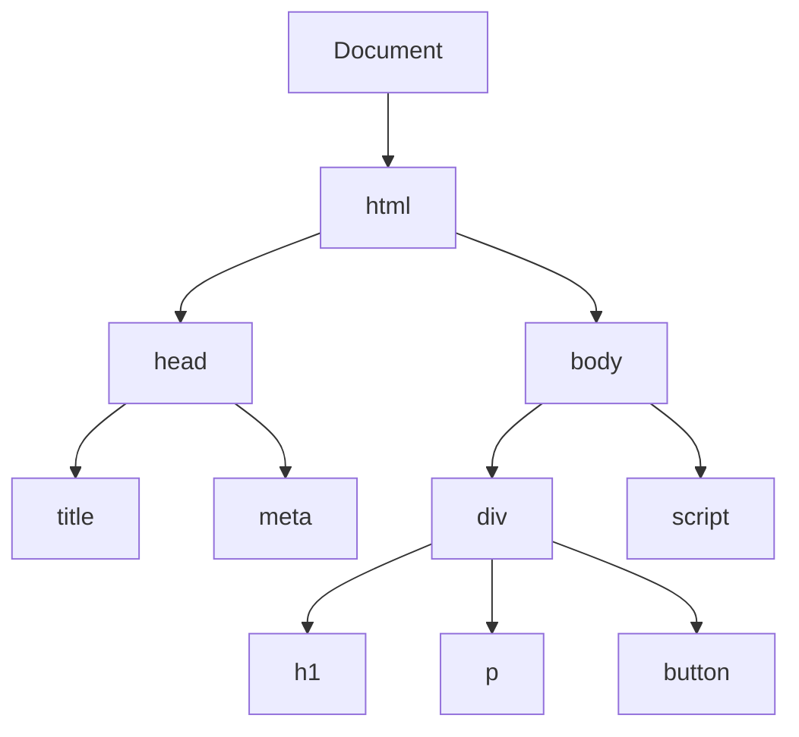
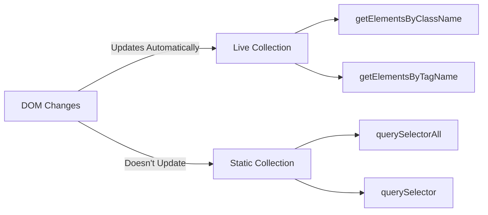
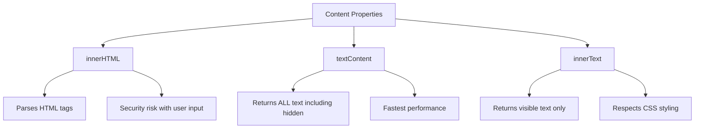
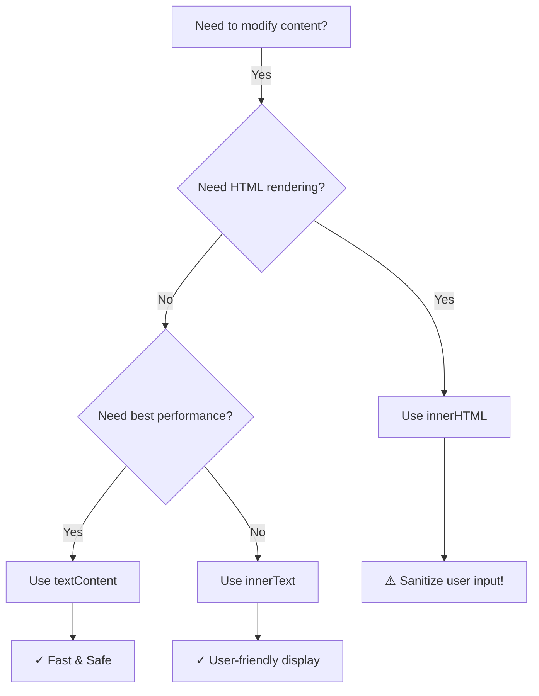
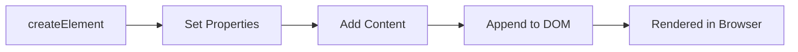
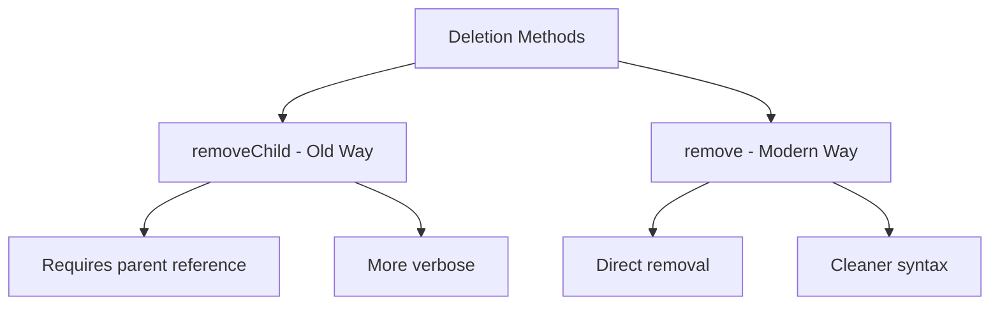
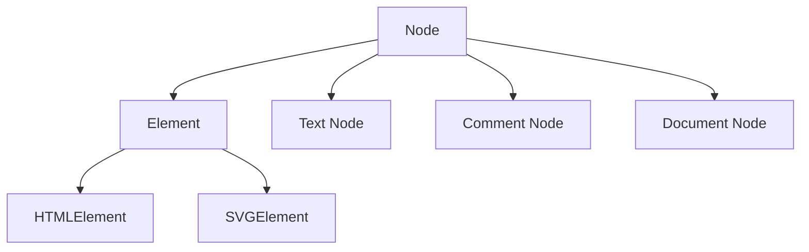
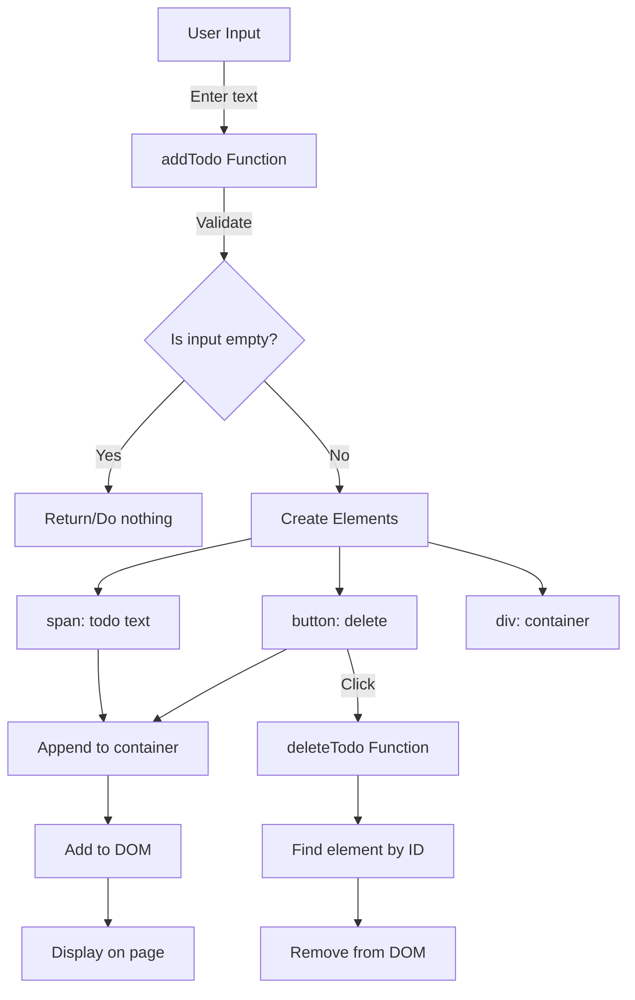

# Week 3: DOM Manipulation & Advanced JavaScript

> **A comprehensive guide to understanding and manipulating the Document Object Model**

## Table of Contents
- [Introduction to DOM](#introduction-to-dom)
- [DOM Selection Methods](#dom-selection-methods)
- [Reading & Modifying Content](#reading--modifying-content)
- [Creating Elements](#creating-elements)
- [Deleting Elements](#deleting-elements)
- [Element vs Node](#element-vs-node)
- [Practical Example: Todo Application](#practical-example-todo-application)
- [Best Practices](#best-practices)

---

## Introduction to DOM

### What is the Document Object Model?

The **DOM (Document Object Model)** is a programming interface for web documents. It represents the page structure as a tree of objects that can be manipulated with JavaScript.



**Key Concepts:**
- The DOM is NOT HTML or JavaScript - it's a bridge between them
- Every HTML element becomes a JavaScript object
- You can read, modify, add, or delete elements programmatically
- Changes to the DOM immediately reflect in the browser

---

## DOM Selection Methods

### Overview of Selection Methods

```javascript
// 1. querySelector - Returns the FIRST matching element
document.querySelector('h1');
document.querySelector('.className');
document.querySelector('#idName');

// 2. getElementById - Returns element by ID (fastest method)
document.getElementById('h1');

// 3. getElementsByClassName - Returns HTMLCollection of all matching elements
document.getElementsByClassName('h1');

// 4. querySelectorAll - Returns NodeList of ALL matching elements
document.querySelectorAll('h1');
```

### Comparison Table

| Method | Returns | Live/Static | Speed | Use Case |
|--------|---------|-------------|-------|----------|
| `querySelector()` | Single element | Static | Medium | When you need ONE element with CSS selector |
| `querySelectorAll()` | NodeList | Static | Medium | When you need MULTIPLE elements with CSS selector |
| `getElementById()` | Single element | Static | Fastest | When you have an ID (most efficient) |
| `getElementsByClassName()` | HTMLCollection | **Live** | Fast | When you need elements by class name |
| `getElementsByTagName()` | HTMLCollection | **Live** | Fast | When you need elements by tag |

### Live vs Static Collections



**Example:**
```javascript
// Live Collection - automatically updates
const liveList = document.getElementsByClassName('item');
console.log(liveList.length); // 3

// Add a new element with class 'item'
const newItem = document.createElement('div');
newItem.className = 'item';
document.body.appendChild(newItem);

console.log(liveList.length); // 4 (automatically updated!)

// Static Collection - doesn't update
const staticList = document.querySelectorAll('.item');
console.log(staticList.length); // Still 3
```

---

## Reading & Modifying Content

### Three Main Properties: innerHTML, textContent, and innerText



### Detailed Comparison

#### 1. innerHTML
```javascript
const div = document.querySelector('div');

// READ
div.innerHTML; // "<span>Hello</span> <b>World</b>"

// WRITE
div.innerHTML = "<p>New content</p>"; // Parses HTML
```

**Characteristics:**
- Parses and renders HTML tags
- Can execute scripts (XSS vulnerability)
- Slower than textContent
- Use when you need to render HTML

#### 2. textContent
```javascript
const div = document.querySelector('div');

// READ
div.textContent; // "Hello World" (includes hidden text)

// WRITE
div.textContent = "<p>Text</p>"; // Shows as plain text: "<p>Text</p>"
```

**Characteristics:**
- Returns ALL text content (including `<script>` and `<style>`)
- Doesn't parse HTML
- Fastest performance
- Returns hidden elements' text (display:none)
- Safe from XSS attacks

#### 3. innerText
```javascript
const div = document.querySelector('div');

// READ
div.innerText; // "Hello World" (only visible text)

// WRITE
div.innerText = "New text";
```

**Characteristics:**
- Returns only VISIBLE text
- Respects CSS (ignores display:none)
- Triggers reflow (slower)
- More "human-readable"

### Comparison Example

```html
<div id="example">
  Hello <span style="display:none">Hidden</span> World
</div>
```

```javascript
const div = document.getElementById('example');

div.innerHTML;    // "Hello <span style="display:none">Hidden</span> World"
div.textContent;  // "Hello Hidden World"
div.innerText;    // "Hello World"
```

### When to Use What?



**Rules of Thumb:**
- **innerHTML**: When inserting HTML markup (be careful with user input!)
- **textContent**: For plain text, best performance, or when you need all text
- **innerText**: When you want only visible text as shown to users

---

## Creating Elements

### The createElement Workflow



### Basic Element Creation

```javascript
// Step 1: Create element
const divElement = document.createElement('div');

// Step 2: Set properties
divElement.id = 'myDiv';
divElement.className = 'container';
divElement.textContent = 'Hello World';

// Step 3: Add to DOM
document.querySelector('body').appendChild(divElement);
```

### appendChild vs append

| Feature | appendChild | append |
|---------|-------------|--------|
| **Parameters** | Only one Node object | Multiple nodes and strings |
| **Return Value** | Returns the appended node | Returns undefined |
| **Text Support** | No - needs text node | Yes - accepts strings directly |
| **Browser Support** | All browsers | Modern browsers (IE not supported) |

#### Examples:

```javascript
const parent = document.getElementById('parent');

// appendChild - Traditional way
const child1 = document.createElement('div');
child1.textContent = 'Child 1';
parent.appendChild(child1); // Returns child1

// Can't do this with appendChild:
// parent.appendChild('Plain text'); // ERROR!

// Need to create text node for appendChild:
const textNode = document.createTextNode('Plain text');
parent.appendChild(textNode);

// append - Modern way
const child2 = document.createElement('div');
parent.append(child2, 'Plain text', 'More text'); // Multiple arguments!
parent.append('Just a string'); // Returns undefined
```

### Accessing Document Elements

```javascript
// Multiple ways to access elements:

// Method 1: Direct access
document.body.appendChild(divElement);

// Method 2: Via children property
document.children[0]; // Gets <html> element
document.children[0].children[1]; // Gets <body> element

// Method 3: Via querySelector
document.querySelector('body').appendChild(divElement);
```

---

## Deleting Elements

### Removing Elements from DOM

```javascript
function deleteTodo(index) {
    // Step 1: Find the element
    const element = document.getElementById(`todo-${index}`);

    // Step 2: Remove from parent
    element.parentNode.removeChild(element);
}
```

### Deletion Methods Comparison



#### Old Way: removeChild()
```javascript
const element = document.getElementById('myElement');
element.parentNode.removeChild(element);
```

#### Modern Way: remove()
```javascript
const element = document.getElementById('myElement');
element.remove(); // Much cleaner!
```

### Safe Deletion Pattern

```javascript
function deleteTodo(index) {
    const element = document.getElementById(`todo-${index}`);

    // Always check if element exists!
    if (element) {
        element.parentNode.removeChild(element);
    }
}
```

---

## Element vs Node

### Understanding the Hierarchy



### What's the Difference?

**Node:**
- Base interface for everything in the DOM tree
- Includes: elements, text, comments, document itself
- More generic, less specific

**Element:**
- A specific type of Node
- Represents HTML/XML tags only
- Has attributes, can have children

### Properties Comparison

| Property | Node Version | Element Version | Difference |
|----------|-------------|-----------------|------------|
| Parent | `parentNode` | `parentElement` | parentNode can return document; parentElement returns null |
| Children | `childNodes` | `children` | childNodes includes text/comments; children only elements |
| Siblings | `nextSibling` | `nextElementSibling` | Sibling includes text nodes; ElementSibling skips them |

### Visual Example

```html
<div id="parent">
    Hello
    <span>World</span>
    <!-- Comment -->
</div>
```

```javascript
const parent = document.getElementById('parent');

// childNodes (returns ALL nodes)
parent.childNodes;
// NodeList(5) [
//   text (whitespace),
//   text ("Hello"),
//   element (<span>),
//   text (whitespace),
//   comment
// ]

// children (returns only ELEMENTS)
parent.children;
// HTMLCollection(1) [<span>]

// nextSibling vs nextElementSibling
const span = parent.querySelector('span');
span.nextSibling;        // Text node (whitespace)
span.nextElementSibling; // null (no more elements)
```

### parentNode vs parentElement

```javascript
const html = document.documentElement; // <html>

html.parentNode;    // #document
html.parentElement; // null (document is not an element)
```

**When to use what?**
- Use **Element** versions when working with HTML elements (most common)
- Use **Node** versions when you need to handle all types of nodes
- `parentNode.removeChild()` is more common because it works with all node types

---

## Practical Example: Todo Application

### Application Architecture



### Complete Implementation

```html
<html lang="en">
  <head>
    <meta charset="UTF-8" />
    <meta name="viewport" content="width=device-width, initial-scale=1.0" />
    <title>Todo App</title>
  </head>
  <body>
    <input type="text" id="input" placeholder="Enter a todo" />
    <button id="button" onclick="addTodo()">Add</button>
    <div id="todos"></div>

    <script>
      const input = document.getElementById("input");
      let todoIndex = 0;

      function addTodo() {
        const value = input.value;

        // Validation: Don't add empty todos
        if (value.trim() === "") return;

        // Create elements
        const spanElement = document.createElement("span");
        const buttonElement = document.createElement("button");
        const divElement = document.createElement("div");

        // Set content
        spanElement.textContent = value;
        buttonElement.textContent = "Delete";

        // Set up delete functionality
        const currentIndex = todoIndex;
        buttonElement.onclick = () => deleteTodo(currentIndex);

        // Set unique ID
        divElement.id = `todo-${todoIndex}`;

        // Build structure
        divElement.appendChild(spanElement);
        divElement.appendChild(buttonElement);

        // Add to DOM
        document.querySelector("#todos").appendChild(divElement);

        // Clear input and increment index
        input.value = "";
        todoIndex++;
      }

      function deleteTodo(index) {
        const element = document.getElementById(`todo-${index}`);
        if (element) {
          element.parentNode.removeChild(element);
        }
      }
    </script>
  </body>
</html>
```

### Two Approaches to Creating Elements

#### Approach 1: Using innerHTML (Simpler but less safe)

```javascript
function addTodo() {
    const value = input.value;
    if (value.trim() === "") return;

    const newTodoElement = document.createElement("div");
    const currentIndex = todoIndex++;

    // ⚠️ Security risk if value comes from untrusted source
    newTodoElement.innerHTML = `
        <div>
            ${value}
            <button onclick="deleteTodo(${currentIndex})">Delete</button>
        </div>
    `;

    newTodoElement.id = `todo-${currentIndex}`;
    document.querySelector("#todos").appendChild(newTodoElement);
    input.value = "";
}
```

**Pros:**
- Shorter code
- Easier to read
- Faster to write

**Cons:**
- XSS vulnerability with user input
- Inline event handlers (onclick)
- Harder to modify individual parts

#### Approach 2: Using createElement (Safer and more flexible)

```javascript
function addTodo() {
    const value = input.value;
    if (value.trim() === "") return;

    // Create individual elements
    const spanElement = document.createElement("span");
    const buttonElement = document.createElement("button");
    const divElement = document.createElement("div");

    // Set content safely
    spanElement.textContent = value; // ✓ Safe from XSS
    buttonElement.textContent = "Delete";

    // Use proper event listener
    const currentIndex = todoIndex++;
    buttonElement.onclick = () => deleteTodo(currentIndex); // ✓ Closure captures index

    divElement.id = `todo-${currentIndex}`;

    // Build structure
    divElement.appendChild(spanElement);
    divElement.appendChild(buttonElement);

    // Add to DOM
    document.querySelector("#todos").appendChild(divElement);
    input.value = "";
}
```

**Pros:**
- Safe from XSS attacks
- More control over individual elements
- Better for complex structures
- Easier to debug

**Cons:**
- More verbose
- More code to write

### Key Implementation Details

#### 1. Unique ID System
```javascript
let todoIndex = 0;

function addTodo() {
    // Each todo gets unique ID
    divElement.id = `todo-${todoIndex}`;
    todoIndex++; // Increment for next todo
}

function deleteTodo(index) {
    // Find by unique ID
    const element = document.getElementById(`todo-${index}`);
}
```

#### 2. Closure for Delete Button
```javascript
const currentIndex = todoIndex;
buttonElement.onclick = () => deleteTodo(currentIndex);
// Arrow function captures the current value of currentIndex
```

**Why we need closure:**
```javascript
// ❌ WRONG - Will always use latest todoIndex value
buttonElement.onclick = () => deleteTodo(todoIndex);

// ✓ CORRECT - Captures current value
const currentIndex = todoIndex;
buttonElement.onclick = () => deleteTodo(currentIndex);
```

#### 3. Input Validation
```javascript
if (value.trim() === "") return;
```
- `trim()` removes whitespace from both ends
- Prevents adding empty or whitespace-only todos

---

## Best Practices

### 1. Always Validate User Input
```javascript
// ✓ Good
if (value.trim() === "") return;

// ❌ Bad
// No validation - can add empty todos
```

### 2. Use textContent for User Input (Security)
```javascript
// ✓ Good - Safe from XSS
element.textContent = userInput;

// ❌ Bad - XSS vulnerability
element.innerHTML = userInput;
```

### 3. Check Element Exists Before Deleting
```javascript
// ✓ Good
const element = document.getElementById('id');
if (element) {
    element.remove();
}

// ❌ Bad - Will throw error if element doesn't exist
document.getElementById('id').remove();
```

### 4. Cache DOM References
```javascript
// ✓ Good - Cache reference
const input = document.getElementById('input');
function addTodo() {
    const value = input.value; // Reuse cached reference
}

// ❌ Bad - Query DOM every time
function addTodo() {
    const value = document.getElementById('input').value;
}
```

### 5. Use Meaningful IDs and Classes
```javascript
// ✓ Good
divElement.id = `todo-${index}`;
divElement.className = 'todo-item';

// ❌ Bad
divElement.id = `d${index}`;
divElement.className = 'x';
```

### 6. Prefer Modern Methods
```javascript
// ✓ Good - Modern
element.remove();

// ⚠️ Old but widely supported
element.parentNode.removeChild(element);
```

### 7. Use Event Delegation for Dynamic Content
```javascript
// ✓ Good - Single listener for all delete buttons
document.getElementById('todos').addEventListener('click', (e) => {
    if (e.target.tagName === 'BUTTON') {
        const todoId = e.target.parentElement.id;
        deleteTodo(todoId);
    }
});

// ❌ Less efficient - New listener for each button
buttonElement.onclick = () => deleteTodo(index);
```

---

## Quick Reference Cheat Sheet

### Selection Methods
```javascript
document.querySelector('selector')      // First matching element
document.querySelectorAll('selector')   // All matching elements (NodeList)
document.getElementById('id')           // Element by ID (fastest)
document.getElementsByClassName('cls')  // By class (live HTMLCollection)
```

### Content Manipulation
```javascript
element.innerHTML     // Get/set HTML content
element.textContent   // Get/set text (fastest, safest)
element.innerText     // Get/set visible text
```

### Creating & Adding
```javascript
document.createElement('tag')           // Create element
element.appendChild(child)              // Add one node
element.append(child1, child2, 'text')  // Add multiple
```

### Removing
```javascript
element.remove()                        // Modern way
element.parentNode.removeChild(element) // Old way
```

### Properties & Attributes
```javascript
element.id = 'value'           // Set ID
element.className = 'value'    // Set class
element.setAttribute('key', 'value')  // Set attribute
```

---

## Summary

In this week, we covered:

1. **DOM Fundamentals**: Understanding the document object and tree structure
2. **Selection Methods**: Different ways to query and select elements
3. **Content Manipulation**: innerHTML vs textContent vs innerText
4. **Element Creation**: How to create and add elements dynamically
5. **Element Deletion**: Removing elements from the DOM
6. **Node vs Element**: Understanding the difference and when to use each
7. **Practical Application**: Building a functional todo app

### Key Takeaways

- Always prefer `textContent` over `innerHTML` for user input (security)
- Use `getElementById` when possible (fastest)
- Cache DOM queries to avoid repeated lookups
- Always validate user input
- Understand the difference between live and static collections
- Use closures to capture values in event handlers
- Check if elements exist before manipulating them

---

## Additional Resources

**Mozilla MDN Documentation:**
- [Document Object Model (DOM)](https://developer.mozilla.org/en-US/docs/Web/API/Document_Object_Model)
- [Element](https://developer.mozilla.org/en-US/docs/Web/API/Element)
- [Node](https://developer.mozilla.org/en-US/docs/Web/API/Node)

**Practice Projects:**
- Todo List (✓ Completed in this section)
- Dynamic Form Validation
- Shopping Cart
- Image Gallery

---

*Last Updated: November 2025*
*Week 3 - DOM Manipulation & Advanced JavaScript*
