# Week 4: Node.js, Express & Backend Development

> A comprehensive guide to Node.js runtime, HTTP servers, Express framework, and middleware patterns

## Table of Contents

1. [Node.js Runtime & Package Management](#1-nodejs-runtime--package-management)
2. [HTTP Servers with Express](#2-http-servers-with-express)
3. [RESTful API Design & CRUD Operations](#3-restful-api-design--crud-operations)
4. [Middleware Architecture](#4-middleware-architecture)
5. [Practical Examples](#5-practical-examples)
6. [Key Takeaways](#6-key-takeaways)

---

## 1. Node.js Runtime & Package Management

### 1.1 What is Node.js?

Node.js is a JavaScript runtime built on Chrome's V8 JavaScript engine that allows you to run JavaScript on the server-side. It's event-driven, non-blocking I/O model makes it lightweight and efficient.

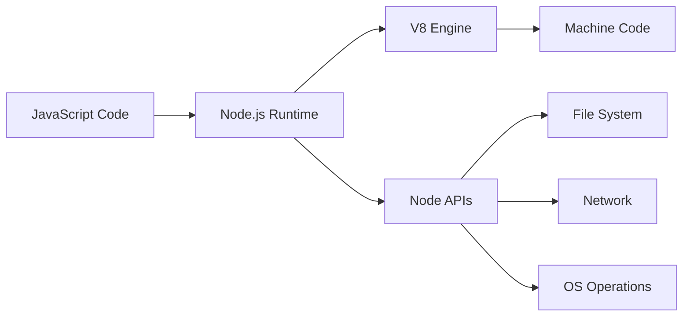

### 1.2 Internal Modules

Node.js comes with built-in modules that don't require installation. These are core modules that provide essential functionality.

**Example: Path Module**
```javascript
const Path = require('path');
console.log(__dirname);  // Current directory path
console.log(Path.join(__dirname, 'test.txt'));  // Joins path segments
```

**Common Internal Modules:**
- `path` - File path operations
- `fs` - File system operations
- `http` - HTTP server/client
- `url` - URL parsing
- `os` - Operating system utilities

### 1.3 Package Version Semantics

Understanding version syntax in `package.json`:

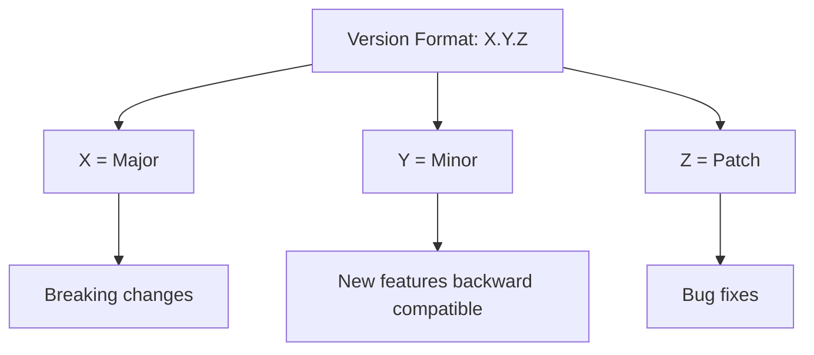

**Version Operators:**

| Operator | Example | Meaning |
|----------|---------|---------|
| `^` | `^5.3.0` | ≥5.3.0 and <6.0.0 (compatible with minor/patch updates) |
| `>` | `>5.3.0` | Greater than 5.3.0 |
| `>=` | `>=5.3.0` | Greater than or equal to 5.3.0 |
| `<` | `<5.3.0` | Less than 5.3.0 |
| `<=` | `<=5.3.0` | Less than or equal to 5.3.0 |
| `~` | `~5.3.0` | ≥5.3.0 and <5.4.0 (compatible with patch updates only) |

### 1.4 package-lock.json

**Purpose:** Locks exact versions of all dependencies (including nested dependencies) to ensure consistent installations across different environments.

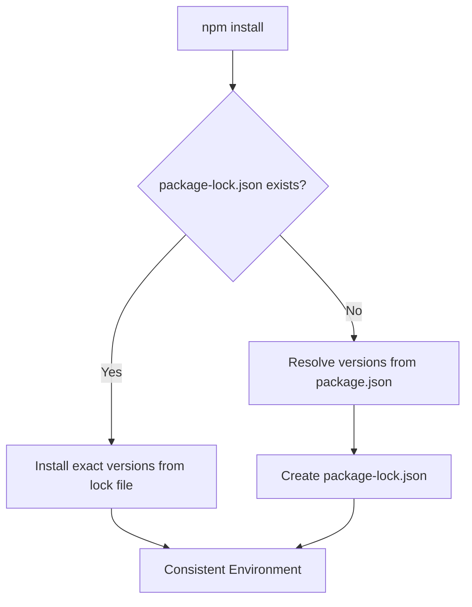

**Benefits:**
- **Reproducible builds** - Same dependencies everywhere
- **Faster installations** - No need to resolve dependency tree
- **Security** - Know exactly what versions are installed

### 1.5 Building CLI Tools with Commander

Commander.js makes it easy to build command-line interfaces.

**Word Counter CLI Example:**
```javascript
const { Command } = require('commander');
const fs = require('fs');
const program = new Command();

program
    .name('word-counter')
    .description('CLI tool to count words in a file')
    .version('1.0.0');

program
    .argument('<filepath>', 'path to the file')
    .action((filepath) => {
        try {
            const content = fs.readFileSync(filepath, 'utf-8');
            const words = content.trim().split(/\s+/).filter(word => word.length > 0);
            console.log(`Number of words: ${words.length}`);
        } catch (error) {
            console.error(`Error reading file: ${error.message}`);
            process.exit(1);
        }
    });

program.parse(process.argv);
```

**Key Components:**
- `.name()` - CLI tool name
- `.description()` - What the tool does
- `.version()` - Version number
- `.argument()` - Positional arguments
- `.action()` - Callback function to execute

**Usage:**
```bash
node 4.1-nodejs-bun-jsruntime.js myfile.txt
# Output: Number of words: 42
```

---

## 2. HTTP Servers with Express

### 2.1 What is Express?

Express is a minimal and flexible Node.js web application framework that provides a robust set of features for web and mobile applications.

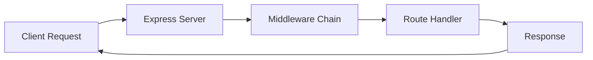

### 2.2 Basic Express Server Setup

```javascript
const express = require('express');
const app = express();

// Basic route
app.get('/', (req, res) => {
    console.log('Get request received');
    res.send('Hello World');
});

// Start server
app.listen(3000, () => {
    console.log('Server is running on port 3000');
});
```

**Core Concepts:**
- `app` - Express application instance
- `req` - Request object (data from client)
- `res` - Response object (data to client)
- `next` - Function to pass control to next middleware

### 2.3 Request-Response Cycle

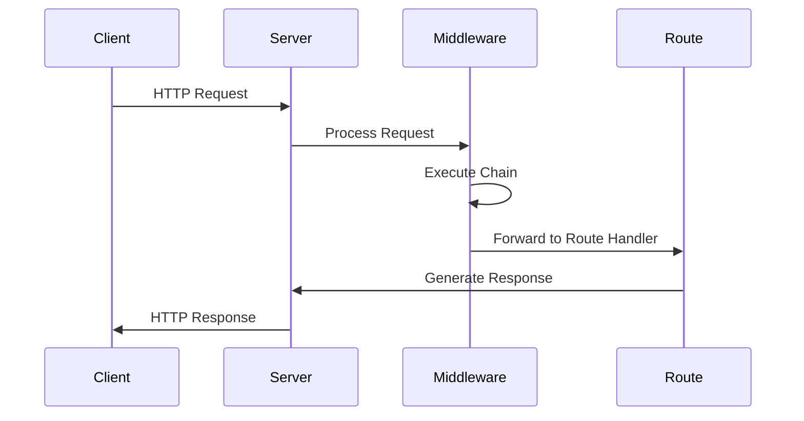

### 2.4 Reaching a Server

Servers can be reached through:
- **Domain name**: `www.example.com` (human-readable)
- **IP address**: `192.168.1.1` (machine-readable)
- **Localhost**: `localhost` or `127.0.0.1` (local development)

---

## 3. RESTful API Design & CRUD Operations

### 3.1 REST Principles

REST (Representational State Transfer) is an architectural style for designing networked applications.

**HTTP Methods:**

| Method | Purpose | Idempotent | Safe |
|--------|---------|------------|------|
| GET | Retrieve data | Yes | Yes |
| POST | Create new resource | No | No |
| PUT | Update entire resource | Yes | No |
| PATCH | Update partial resource | No | No |
| DELETE | Remove resource | Yes | No |

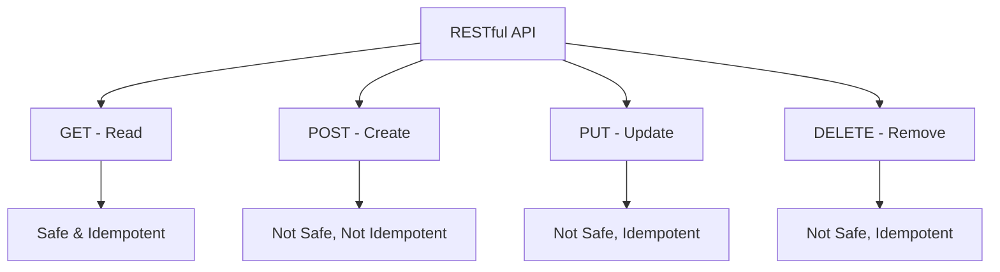

### 3.2 Complete CRUD Example: Kidney Health Tracker

This example demonstrates a complete RESTful API for managing kidney health data.

**Data Model:**
```javascript
const users = [{
    id: 1,
    name: 'John',
    kidney: [
        { healthy: false },
        { healthy: true }
    ]
}];
```

#### 3.2.1 GET - Retrieve Data

```javascript
app.get('/', (req, res) => {
    if (!users[0]) {
        return res.status(404).json({ error: 'User not found' });
    }

    const johnKidney = users[0].kidney;
    const numberOfKidneys = johnKidney.length;
    const healthyKidneys = johnKidney.filter(kidney => kidney.healthy).length;
    const unhealthyKidneys = johnKidney.filter(kidney => !kidney.healthy).length;

    res.json({
        name: users[0].name,
        id: users[0].id,
        numberOfKidneys,
        healthyKidneys,
        unhealthyKidneys,
    });
});
```

**Response:**
```json
{
    "name": "John",
    "id": 1,
    "numberOfKidneys": 2,
    "healthyKidneys": 1,
    "unhealthyKidneys": 1
}
```

#### 3.2.2 POST - Create New Resource

```javascript
app.post('/', (req, res) => {
    if (!users[0]) {
        return res.status(404).json({ error: 'User not found' });
    }

    const isHealthy = req.body.isHealthy;

    // Input validation
    if (typeof isHealthy !== 'boolean') {
        return res.status(400).json({ error: 'isHealthy must be a boolean' });
    }

    users[0].kidney.push({ healthy: isHealthy });

    res.json({
        message: 'Kidney added successfully',
        numberOfKidneys: users[0].kidney.length,
        healthyKidneys: users[0].kidney.filter(kidney => kidney.healthy).length,
        unhealthyKidneys: users[0].kidney.filter(kidney => !kidney.healthy).length,
    });
});
```

**Request:**
```bash
POST /
Content-Type: application/json

{
    "isHealthy": true
}
```

#### 3.2.3 PUT - Update Resources

```javascript
app.put('/', (req, res) => {
    if (!users[0]) {
        return res.status(404).json({ error: 'User not found' });
    }

    const unhealthyKidneys = users[0].kidney.filter(kidney => !kidney.healthy);

    if (unhealthyKidneys.length === 0) {
        return res.status(400).json({ error: 'No unhealthy kidneys to update' });
    }

    // Update all unhealthy kidneys to healthy
    users[0].kidney.forEach(kidney => {
        kidney.healthy = true;
    });

    res.json({
        message: 'All kidneys updated to healthy',
        numberOfKidneys: users[0].kidney.length,
        healthyKidneys: users[0].kidney.filter(kidney => kidney.healthy).length,
        unhealthyKidneys: 0,
    });
});
```

#### 3.2.4 DELETE - Remove Resources

```javascript
app.delete('/', (req, res) => {
    if (!users[0]) {
        return res.status(404).json({ error: 'User not found' });
    }

    const unhealthyKidneys = users[0].kidney.filter(kidney => !kidney.healthy);

    if (unhealthyKidneys.length === 0) {
        return res.status(411).json({ error: 'No unhealthy kidneys to remove' });
    }

    // Remove all unhealthy kidneys
    users[0].kidney = users[0].kidney.filter(kidney => kidney.healthy);

    res.json({
        message: 'All unhealthy kidneys removed successfully',
        numberOfKidneys: users[0].kidney.length,
        healthyKidneys: users[0].kidney.filter(kidney => kidney.healthy).length,
        unhealthyKidneys: 0,
    });
});
```

### 3.3 Body Parsing Middleware

To read JSON data from requests:

```javascript
app.use(express.json());  // Parse JSON bodies
app.use(express.urlencoded({ extended: true }));  // Parse URL-encoded bodies
```

---

## 4. Middleware Architecture

### 4.1 What is Middleware?

Middleware functions are functions that have access to the request object (`req`), response object (`res`), and the next middleware function in the application's request-response cycle.

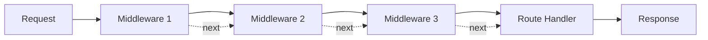

### 4.2 Types of Middleware

#### 4.2.1 Application-Level Middleware

Applied to all routes using `app.use()`.

```javascript
// Logger middleware - runs for every request
app.use((req, res, next) => {
    console.log('Request received (from middleware)');
    next();  // Pass control to next middleware
});
```

#### 4.2.2 Route-Level Middleware

Applied to specific routes.

```javascript
function isOldEnough(req, res, next) {
    const age = parseInt(req.query.age);
    if (isNaN(age) || age < 18) {
        return res.status(401).json({
            error: 'You are not old enough to ride the ride1'
        });
    }
    next();
}

// Only applies to /ride1 route
app.get('/ride1', isOldEnough, (req, res) => {
    res.json({
        message: "you have successfully ridden the ride1"
    });
});
```

#### 4.2.3 Conditional Middleware

Middleware that only runs under certain conditions.

```javascript
app.use((req, res, next) => {
    if (req.method === 'POST') {
        console.log('Post request received (from middleware)');
    }
    next();  // Always call next() to continue
});
```

#### 4.2.4 Request Counter Middleware

Track total number of requests.

```javascript
let requestCounter = 0;

app.use((req, res, next) => {
    requestCounter++;
    console.log(`Total requests: ${requestCounter}`);
    next();
});
```

### 4.3 Rate Limiting Middleware

Prevent abuse by limiting requests per user.

```javascript
let numberOfRide1Requests = {};

// Reset counters every second
setInterval(() => {
    numberOfRide1Requests = {};
}, 1000);

app.use((req, res, next) => {
    const userId = req.headers["user-id"];
    numberOfRide1Requests[userId] = (numberOfRide1Requests[userId] || 0) + 1;

    if (numberOfRide1Requests[userId] > 1) {
        return res.status(429).json({
            error: 'You have made too many requests to ride1'
        });
    }
    next();
});
```

**How it works:**
1. Extract `user-id` from request headers
2. Track request count per user in an object
3. Reset all counters every 1000ms (1 second)
4. Block requests if user exceeds limit (1 request/second)

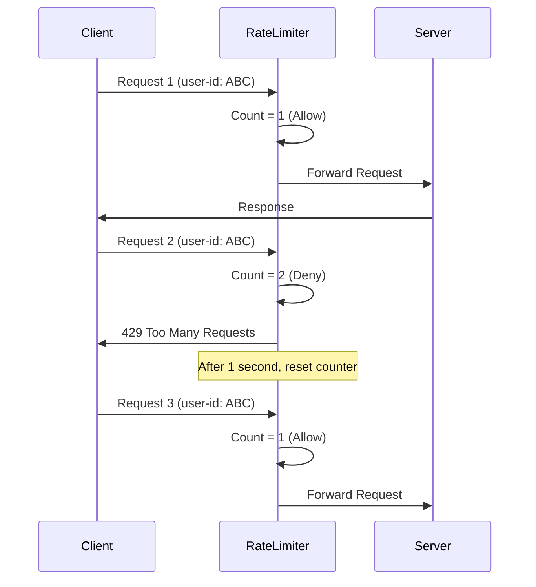

### 4.4 Error Handling Middleware

Error handling middleware has **4 parameters** (err, req, res, next).

```javascript
// Error-throwing route
app.get('/', (req, res) => {
    throw new Error("This is a test error");
});

// Error handler (must be defined AFTER routes)
app.use((err, _req, res, _next) => {
    res.status(500).json({ error: err.message });
});
```

**Important Notes:**
- Error middleware must have 4 parameters (even if unused, use `_` prefix)
- Must be defined **after** all routes
- Catches all errors thrown in previous middleware/routes

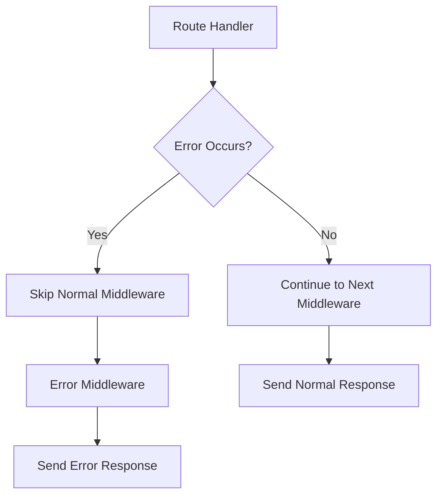

### 4.5 Middleware Execution Order

The order in which middleware is defined matters!

```javascript
const express = require('express');
const app = express();

// 1. Runs first for all requests
app.use((req, res, next) => {
    console.log('Middleware 1');
    next();
});

// 2. Runs second for all requests
app.use((req, res, next) => {
    console.log('Middleware 2');
    next();
});

// 3. Route handler
app.get('/', (req, res) => {
    console.log('Route Handler');
    res.send('Hello');
});

// 4. Error handler (last)
app.use((err, req, res, next) => {
    console.log('Error Handler');
    res.status(500).json({ error: err.message });
});
```

**Output when accessing `/`:**
```
Middleware 1
Middleware 2
Route Handler
```

### 4.6 Understanding Duplicate Routes

**Question:** Why does "Request received (from middleware)" print twice?

```javascript
// Middleware
app.use((req, res, next) => {
    console.log('Request received (from middleware)');
    next();
});

// Route 1
app.get('/', (req, res) => {
    console.log('Get request received');
    res.send('Hello World');
});

// Route 2 - DUPLICATE!
app.get('/', (req, res) => {
    console.log('Get request received');
    res.send('Hello World');
});
```

**Answer:** The middleware runs once, but there are two GET handlers defined for `/`. However, only the **first matching route** will execute because `res.send()` ends the response. The second route is never reached.

**Correct Output:**
```
Server is running on port 3000
Request received (from middleware)  // Middleware runs
Get request received                 // First route runs
```

The middleware runs once per request, regardless of duplicate routes.

---

## 5. Practical Examples

### 5.1 Complete Middleware Example

This example combines multiple middleware concepts:

```javascript
const express = require('express');
const app = express();
app.use(express.json());

let requestCounter = 0;
let numberOfRide1Requests = {};

// Rate limiter reset
setInterval(() => {
    numberOfRide1Requests = {};
}, 1000);

// 1. Rate limiting middleware
app.use((req, res, next) => {
    const userId = req.headers["user-id"];
    numberOfRide1Requests[userId] = (numberOfRide1Requests[userId] || 0) + 1;
    if (numberOfRide1Requests[userId] > 1) {
        return res.status(429).json({
            error: 'You have made too many requests to ride1'
        });
    }
    next();
});

// 2. Age verification middleware (route-specific)
function isOldEnough(req, res, next) {
    const age = parseInt(req.query.age);
    if (isNaN(age) || age < 18) {
        return res.status(401).json({
            error: 'You are not old enough to ride the ride1'
        });
    }
    next();
}

// 3. Request counter middleware
app.use((req, res, next) => {
    requestCounter++;
    console.log(`Total requests: ${requestCounter}`);
    next();
});

// Routes
app.get('/', (req, res) => {
    throw new Error("This is a test error");
});

app.get('/ride1', isOldEnough, (req, res) => {
    res.json({
        message: "you have successfully ridden the ride1"
    });
});

// 4. Error handling middleware (LAST)
app.use((err, _req, res, _next) => {
    res.status(500).json({ error: err.message });
});

app.listen(3000, () => {
    console.log('Server is running on port 3000');
});
```

### 5.2 Testing the API

**Test Rate Limiting:**
```bash
# First request (allowed)
curl -H "user-id: user123" http://localhost:3000/ride1?age=25
# Output: {"message":"you have successfully ridden the ride1"}

# Second request within 1 second (blocked)
curl -H "user-id: user123" http://localhost:3000/ride1?age=25
# Output: {"error":"You have made too many requests to ride1"}
```

**Test Age Verification:**
```bash
# Under 18 (denied)
curl -H "user-id: user456" http://localhost:3000/ride1?age=16
# Output: {"error":"You are not old enough to ride the ride1"}

# 18 or over (allowed)
curl -H "user-id: user456" http://localhost:3000/ride1?age=25
# Output: {"message":"you have successfully ridden the ride1"}
```

**Test Error Handling:**
```bash
curl http://localhost:3000/
# Output: {"error":"This is a test error"}
```

---

## 6. Key Takeaways

### 6.1 Node.js Fundamentals

- Node.js enables JavaScript to run server-side
- Use internal modules for common tasks (path, fs, http)
- Understand semantic versioning (major.minor.patch)
- `package-lock.json` ensures reproducible builds
- Commander.js simplifies CLI tool development

### 6.2 Express Framework

- Express simplifies HTTP server creation
- Routes map HTTP methods to handler functions
- Body parsing middleware is essential for JSON APIs
- Always send appropriate HTTP status codes

### 6.3 REST API Best Practices

| Method | Use Case | Idempotent | Example |
|--------|----------|------------|---------|
| GET | Read data | Yes | Get user list |
| POST | Create new | No | Add new user |
| PUT | Update entire | Yes | Replace user data |
| DELETE | Remove | Yes | Delete user |

### 6.4 Middleware Patterns

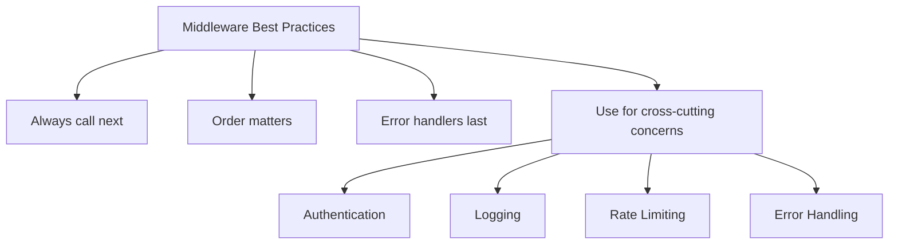

**Golden Rules:**
1. **Always call `next()`** unless sending a response
2. **Order matters** - middleware executes top-to-bottom
3. **Error handlers last** - must be defined after routes
4. **4 parameters for error handlers** - (err, req, res, next)
5. **Return after responses** - prevents "headers already sent" errors

### 6.5 Common HTTP Status Codes

| Code | Meaning | Use Case |
|------|---------|----------|
| 200 | OK | Successful GET, PUT |
| 201 | Created | Successful POST |
| 400 | Bad Request | Invalid input |
| 401 | Unauthorized | Authentication required |
| 404 | Not Found | Resource doesn't exist |
| 411 | Length Required | Missing content-length |
| 429 | Too Many Requests | Rate limit exceeded |
| 500 | Internal Server Error | Server-side error |

### 6.6 Request Flow Visualization

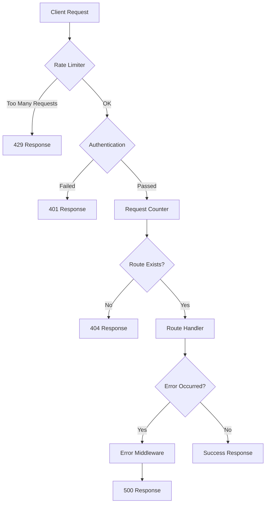

### 6.7 Development Tips

1. **Use `nodemon` for auto-restart** during development
   ```bash
   npm install -g nodemon
   nodemon server.js
   ```

2. **Test with curl or Postman**
   ```bash
   curl -X POST http://localhost:3000 -H "Content-Type: application/json" -d '{"isHealthy": true}'
   ```

3. **Log request details** for debugging
   ```javascript
   app.use((req, res, next) => {
       console.log(`${req.method} ${req.path}`);
       next();
   });
   ```

4. **Validate inputs** to prevent errors
   ```javascript
   if (typeof value !== 'expected_type') {
       return res.status(400).json({ error: 'Invalid input' });
   }
   ```

5. **Handle edge cases** (empty arrays, null values, etc.)
   ```javascript
   if (array.length === 0) {
       return res.status(400).json({ error: 'Nothing to process' });
   }
   ```

---

## Summary

This week covered the fundamentals of backend development with Node.js and Express:

- **Node.js Runtime**: JavaScript server-side execution, modules, and package management
- **Express Framework**: Simplified HTTP server creation and routing
- **RESTful APIs**: CRUD operations following REST principles
- **Middleware**: Powerful pattern for handling cross-cutting concerns like authentication, logging, and error handling

These concepts form the foundation of modern backend development and are essential for building scalable, maintainable web applications.

---

**Next Steps:**
- Explore database integration (MongoDB, PostgreSQL)
- Learn authentication strategies (JWT, OAuth)
- Understand async/await patterns
- Study advanced middleware (CORS, compression, security headers)
- Build production-ready APIs with validation and error handling

---

**Resources:**
- [Express Documentation](https://expressjs.com/)
- [Node.js Documentation](https://nodejs.org/docs/)
- [REST API Design Best Practices](https://restfulapi.net/)
- [Commander.js Documentation](https://github.com/tj/commander.js)
