# Git and GitHub - Complete Guide

## Table of Contents
1. [Version Control Systems](#version-control-systems)
2. [Git Fundamentals](#git-fundamentals)
3. [Git Object Model](#git-object-model)
4. [Basic Git Workflow](#basic-git-workflow)
5. [Essential Git Commands](#essential-git-commands)
6. [GitHub Authentication](#github-authentication)
7. [Git Branching Strategies](#git-branching-strategies)
8. [Advanced Git Operations](#advanced-git-operations)

---

## Version Control Systems

Version Control Systems (VCS) are tools that help track changes to files over time, allowing multiple developers to collaborate effectively and maintain a history of modifications.

### Centralized Version Control System (CVCS)

In a centralized system, there's a single central server that stores all versions and history of the codebase.

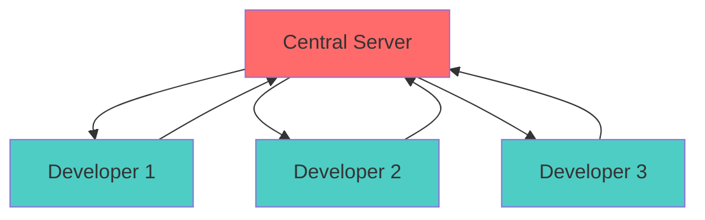

**How it works:**
- Developers check out files from the central server
- Make changes locally
- Commit changes back to the central server

**Examples:** SVN, CVS, Perforce

**Advantages:**
- Simple to understand and use
- Easy access control management
- Single source of truth
- Centralized backup

**Disadvantages:**
- Single point of failure (if server goes down, no one can work)
- Requires constant network connection
- Cannot work offline
- Slower operations (network dependent)

### Distributed Version Control System (DVCS)

In a distributed system, every developer has a complete copy of the repository including its entire history.

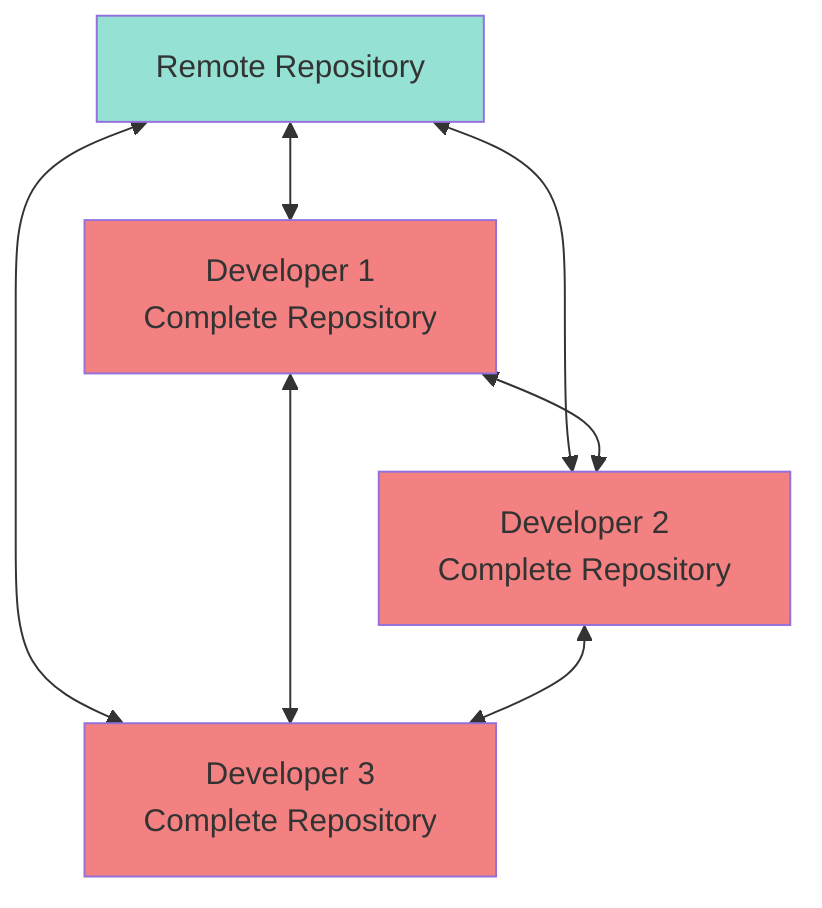

**How it works:**
- Each developer clones the entire repository
- All operations are performed locally
- Changes are synchronized between repositories

**Examples:** Git, Mercurial, Bazaar

**Advantages:**
- Fast operations (everything is local)
- Work offline without limitations
- No single point of failure (every clone is a backup)
- Powerful branching and merging capabilities
- Multiple backup points

**Disadvantages:**
- Steeper learning curve
- More disk space required
- More complex concepts to master
- Can be overwhelming for beginners

---

## Git Fundamentals

**Git** is the most popular distributed version control system, created by Linus Torvalds in 2005. It has become the industry standard for version control.

### Key Features
- **Fast:** Local operations are lightning quick
- **Distributed:** Every clone is a full backup
- **Branching:** Lightweight and powerful branching model
- **Data Integrity:** Everything is checksummed (SHA-1)
- **Staging Area:** Fine-grained control over commits

---

## Git Object Model

Git stores data as a series of snapshots using a sophisticated object model.

### Blob (Binary Large Object)

A **blob** is Git's way of storing file content.

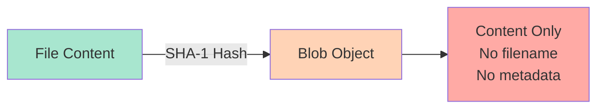

**Key Characteristics:**
- Stores only the file's content (raw data)
- Does **not** store filename, permissions, or location
- Identified by a SHA-1 hash of its content
- **Deduplication:** Identical content = same blob (saves space)
- **Immutable:** Once created, never changes

**Example:**
```bash
# Two files with identical content share the same blob
echo "Hello World" > file1.txt
echo "Hello World" > file2.txt
# Both files point to the same blob object
```

### Tree

A **tree** represents the directory structure of your project.

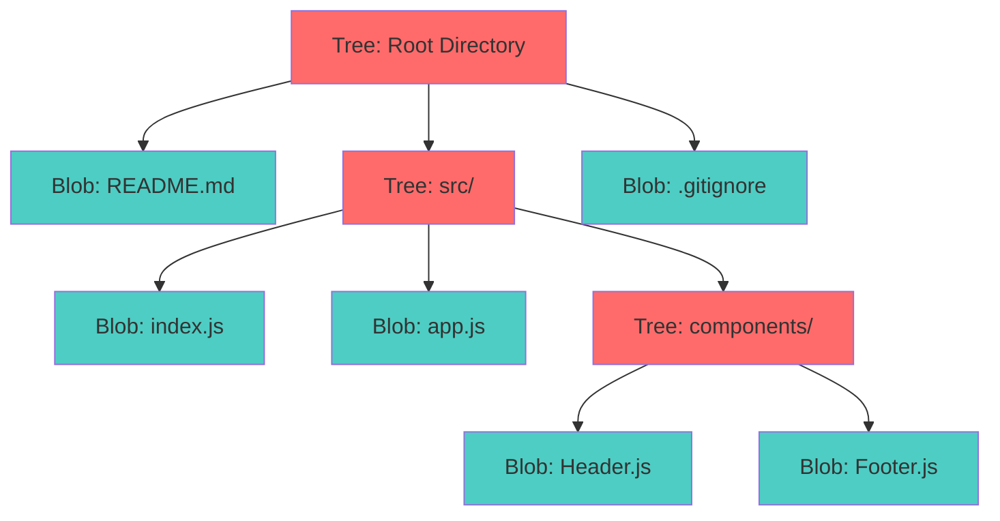

**Key Characteristics:**
- Represents folders/directories
- Contains pointers to blobs (files) and other trees (subdirectories)
- Stores filenames, file permissions, and references
- Also identified by SHA-1 hash
- Captures complete project structure snapshot

**Tree Structure Example:**
```
Tree (root)
├── blob: README.md
├── blob: package.json
└── tree: src/
    ├── blob: index.js
    └── tree: components/
        └── blob: App.js
```

---

## Basic Git Workflow

Git uses a three-stage workflow that gives you fine-grained control over what you commit.

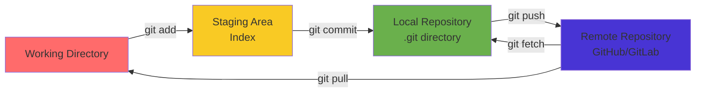

### The Three States

1. **Working Directory**
   - Your actual project files
   - Where you make modifications
   - Untracked or modified files live here

2. **Staging Area (Index)**
   - Intermediate area between working directory and repository
   - Files ready to be committed
   - Allows selective commits (choose what to commit)

3. **Repository (.git directory)**
   - Complete project history
   - All commits, branches, and metadata
   - Compressed and optimized storage

---

## Essential Git Commands

### Repository Initialization and Cloning

#### `git init`
Creates a new Git repository in the current directory.

```bash
# Initialize a new repository
git init

# Creates a .git folder containing:
# - objects/ (blobs, trees, commits)
# - refs/ (branches, tags)
# - HEAD (current branch pointer)
# - config (repository settings)
```

#### `git clone`
Creates a copy of an existing remote repository.

```bash
# Clone via HTTPS
git clone https://github.com/username/repository.git

# Clone via SSH
git clone git@github.com:username/repository.git

# Clone into specific directory
git clone https://github.com/username/repo.git my-folder

# Clone specific branch
git clone -b branch-name https://github.com/username/repo.git
```

### Staging and Committing Changes

#### `git status`
Shows the current state of your working directory and staging area.

```bash
git status

# Output shows:
# - Current branch
# - Untracked files (new files)
# - Modified files (changes not staged)
# - Staged files (ready to commit)
# - Relationship to remote branch
```

#### `git add`
Moves changes from working directory to staging area.

```bash
# Add specific file
git add filename.txt

# Add all files in current directory
git add .

# Add all files in repository
git add -A

# Add all JavaScript files
git add *.js

# Add files interactively (choose what to stage)
git add -p
```

#### `git rm --cached`
Removes files from staging area without deleting them.

```bash
# Remove file from staging (keep in working directory)
git rm --cached filename.txt

# Remove folder from staging recursively
git rm --cached -r folder/

# Useful for files accidentally added or to be ignored
```

#### `git commit`
Saves staged changes to the local repository.

```bash
# Commit with message
git commit -m "Add user authentication feature"

# Commit with detailed message (opens editor)
git commit

# Add and commit tracked files in one step
git commit -am "Update configuration"

# Amend last commit (change message or add forgotten files)
git commit --amend -m "Corrected commit message"
```

**Good Commit Message Format:**
```
Short summary (50 chars or less)

More detailed explanation if needed. Wrap at 72 characters.
Explain what and why, not how.

- Bullet points are okay
- Use imperative mood: "Add feature" not "Added feature"
```

### Remote Repository Operations

#### `git remote`
Manages connections to remote repositories.

```bash
# List all remotes
git remote -v

# Add a new remote
git remote add origin https://github.com/username/repo.git

# Change remote URL
git remote set-url origin git@github.com:username/repo.git

# Remove a remote
git remote remove origin

# Rename a remote
git remote rename origin upstream
```

#### `git push`
Uploads local commits to remote repository.

```bash
# Push to default remote branch
git push

# Push to specific remote and branch
git push origin main

# Push and set upstream (first time)
git push -u origin main

# Push all branches
git push --all

# Push tags
git push --tags

# Force push (DANGEROUS - overwrites remote)
git push --force
```

#### `git pull`
Fetches and merges changes from remote repository.

```bash
# Pull from current branch's upstream
git pull

# Pull from specific remote and branch
git pull origin main

# Pull with rebase (cleaner history)
git pull --rebase

# Pull but don't merge automatically
git fetch  # safer alternative
```

### Branching Commands

#### `git branch`
Lists, creates, or deletes branches.

```bash
# List all local branches (* shows current)
git branch

# List all branches (local and remote)
git branch -a

# Create new branch
git branch feature-login

# Delete branch (safe - prevents deleting unmerged branches)
git branch -d branch-name

# Force delete branch
git branch -D branch-name

# Rename current branch
git branch -m new-name
```

#### `git checkout`
Switches between branches or restores files.

```bash
# Switch to existing branch
git checkout main

# Create and switch to new branch
git checkout -b feature-payment

# Switch to previous branch
git checkout -

# Discard changes to file
git checkout -- filename.txt

# Checkout specific commit (detached HEAD)
git checkout abc1234
```

**Note:** Modern Git also supports `git switch` for branch operations:
```bash
git switch main              # Switch branch
git switch -c new-branch    # Create and switch
```

### Comparing Changes

#### `git diff`
Shows differences between various states.

```bash
# Show unstaged changes
git diff

# Show staged changes
git diff --staged
# or
git diff --cached

# Compare two branches
git diff main feature-branch

# Compare specific commits
git diff abc1234 def5678

# Compare specific file
git diff filename.txt
```

### Resolving Conflicts

#### `git log --merge`
Shows commits that are causing merge conflicts.

```bash
git log --merge

# Useful during merge conflicts to see:
# - Which commits are conflicting
# - Who made the changes
# - When the changes were made
```

#### `git merge --abort`
Cancels a merge and returns to pre-merge state.

```bash
# Use when merge conflicts are too complex
git merge --abort

# Returns repository to state before merge started
# All merge changes are discarded
```

#### `git reset`
Moves HEAD and optionally modifies staging/working directory.

```bash
# Soft reset (keep changes staged)
git reset --soft HEAD~1

# Mixed reset (unstage changes, keep in working directory)
git reset --mixed HEAD~1
# or simply
git reset HEAD~1

# Hard reset (DANGEROUS - discards all changes)
git reset --hard HEAD~1

# Reset to specific commit
git reset --hard abc1234
```

**Reset Modes Explained:**

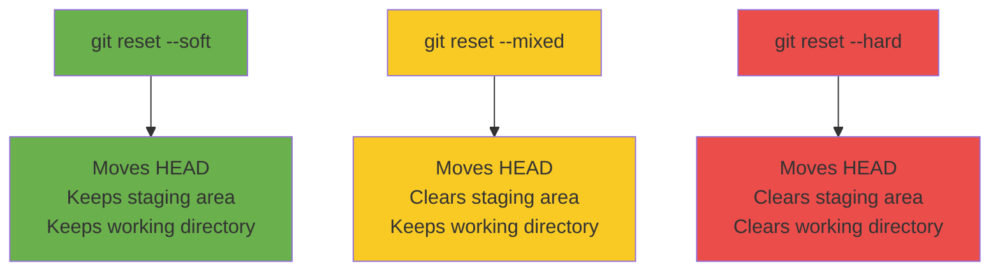

---

## GitHub Authentication

To push code to GitHub, you need to authenticate. Here are the recommended methods:

### Method 1: Personal Access Token (PAT) - HTTPS

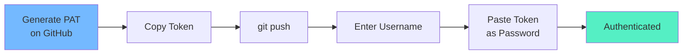

**Steps:**

1. **Generate Token:**
   - Go to GitHub → Settings → Developer settings
   - Personal access tokens → Tokens (classic)
   - Click "Generate new token"

2. **Select Scopes:**
   - `repo` - Full control of private repositories
   - `workflow` - Update GitHub Action workflows
   - `write:packages` - Upload packages

3. **Copy Token:**
   - Copy immediately (you won't see it again!)
   - Store securely (password manager recommended)

4. **Use Token:**
   ```bash
   git push origin main
   # Username: your-github-username
   # Password: paste-your-token-here
   ```

5. **Cache Credentials (Optional):**
   ```bash
   # Cache for 15 minutes (default)
   git config --global credential.helper cache

   # Cache for 1 hour
   git config --global credential.helper 'cache --timeout=3600'

   # Store permanently (less secure)
   git config --global credential.helper store
   ```

### Method 2: SSH Key Authentication (Recommended)

SSH keys provide secure, password-free authentication.

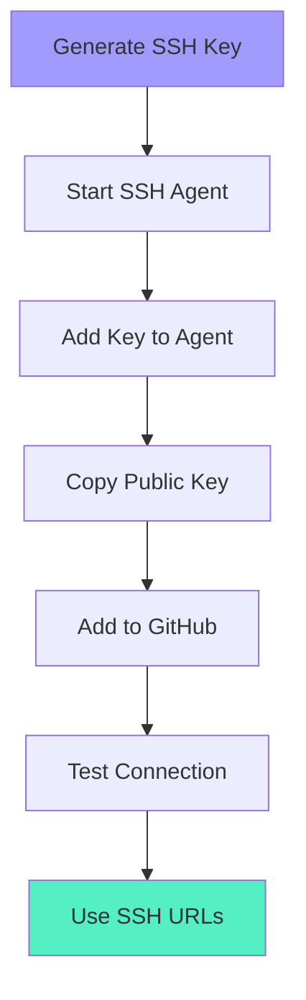

**Steps:**

1. **Generate SSH Key:**
   ```bash
   ssh-keygen -t ed25519 -C "your-email@example.com"

   # For older systems without ed25519:
   ssh-keygen -t rsa -b 4096 -C "your-email@example.com"

   # Press Enter for default location (~/.ssh/id_ed25519)
   # Enter passphrase (optional but recommended)
   ```

2. **Start SSH Agent:**
   ```bash
   # Start the agent
   eval "$(ssh-agent -s)"
   # Output: Agent pid 12345
   ```

3. **Add Key to Agent:**
   ```bash
   ssh-add ~/.ssh/id_ed25519

   # On Mac, add to keychain:
   ssh-add --apple-use-keychain ~/.ssh/id_ed25519
   ```

4. **Copy Public Key:**
   ```bash
   # Display key
   cat ~/.ssh/id_ed25519.pub

   # Mac - copy to clipboard:
   pbcopy < ~/.ssh/id_ed25519.pub

   # Windows - copy to clipboard:
   clip < ~/.ssh/id_ed25519.pub

   # Linux - copy to clipboard:
   xclip -sel clip < ~/.ssh/id_ed25519.pub
   ```

5. **Add to GitHub:**
   - Go to GitHub → Settings → SSH and GPG keys
   - Click "New SSH key"
   - Paste your public key
   - Give it a descriptive title

6. **Test Connection:**
   ```bash
   ssh -T git@github.com
   # Output: Hi username! You've successfully authenticated...
   ```

7. **Use SSH URLs:**
   ```bash
   # New repository
   git remote add origin git@github.com:username/repo.git

   # Change existing remote from HTTPS to SSH
   git remote set-url origin git@github.com:username/repo.git
   ```

### Method 3: GitHub CLI (gh)

The official GitHub command-line tool.

```bash
# Install (Mac)
brew install gh

# Install (Windows)
winget install GitHub.cli

# Authenticate
gh auth login

# Follow prompts:
# 1. Choose GitHub.com
# 2. Choose HTTPS or SSH
# 3. Login with browser or token

# Verify authentication
gh auth status

# Now use git commands normally
# gh handles authentication automatically
```

### Method 4: Git Credential Manager (GCM)

Modern, secure credential storage.

```bash
# Install from: https://github.com/git-ecosystem/git-credential-manager

# Configure
git config --global credential.helper manager

# On first push:
# - Browser opens for OAuth authentication
# - Credentials stored securely in system keychain
# - No need to enter credentials again
```

### Configure Git User

Required for commits to have proper authorship:

```bash
# Set your name
git config --global user.name "Your Name"

# Set your email
git config --global user.email "your-email@example.com"

# Verify configuration
git config --list

# Check specific values
git config user.name
git config user.email
```

---

## Git Branching Strategies

Branching allows parallel development without affecting the main codebase.

### Branching Model Overview

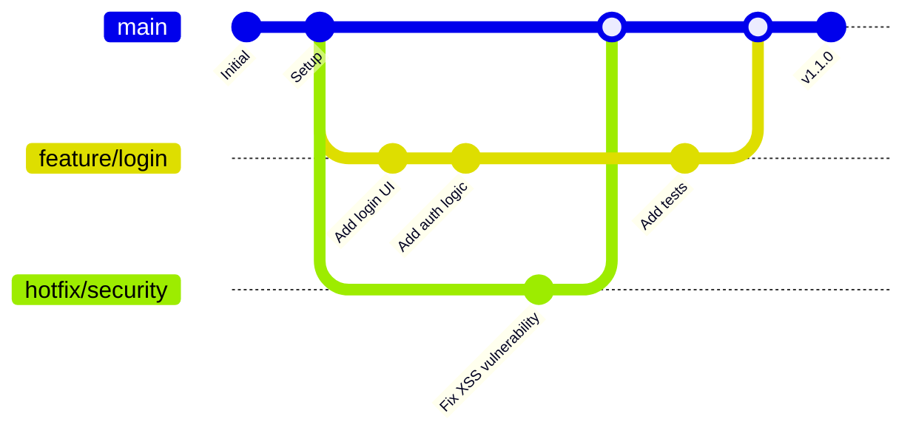

### 1. Main/Master Branch

The primary branch containing production-ready code.

**Characteristics:**
- Always stable and deployable
- Protected branch (requires pull requests)
- Represents official release history
- Never commit directly to main
- All features merge here after review

**Protection Rules:**
```bash
# On GitHub:
# Settings → Branches → Add rule
# - Require pull request reviews
# - Require status checks to pass
# - Require branches to be up to date
# - Include administrators
```

### 2. Feature Branch

Created for developing new features or enhancements.

**Naming Convention:**
```
feature/feature-name
feature/ticket-number
feature/user-authentication
feature/JIRA-123
```

**Workflow:**

```bash
# 1. Start from updated main
git checkout main
git pull origin main

# 2. Create feature branch
git checkout -b feature/user-authentication

# 3. Make changes and commit
git add .
git commit -m "Add user registration form"
git commit -m "Add password validation"
git commit -m "Add email verification"

# 4. Push to remote
git push -u origin feature/user-authentication

# 5. Create pull request on GitHub
# 6. After review and approval, merge
# 7. Delete branch after merging
git branch -d feature/user-authentication
git push origin --delete feature/user-authentication
```

**Best Practices:**
- Keep feature branches short-lived
- Commit frequently with clear messages
- Rebase on main regularly to avoid conflicts
- Write tests with features
- Update documentation

### 3. Hotfix Branch

Created for urgent production bug fixes.

**Naming Convention:**
```
hotfix/issue-description
hotfix/bug-number
hotfix/login-error
hotfix/payment-crash
hotfix/CRITICAL-456
```

**Workflow:**

```bash
# 1. Create from main (current production)
git checkout main
git pull origin main
git checkout -b hotfix/critical-security-bug

# 2. Fix the bug
git add .
git commit -m "Fix SQL injection vulnerability in login"

# 3. Test thoroughly
# Run tests, manual testing

# 4. Push and create PR
git push -u origin hotfix/critical-security-bug

# 5. Merge to main immediately
# 6. Also merge to develop branch if you have one
git checkout develop
git merge hotfix/critical-security-bug

# 7. Tag the release
git checkout main
git tag -a v1.0.1 -m "Security hotfix"
git push origin v1.0.1

# 8. Delete hotfix branch
git branch -d hotfix/critical-security-bug
```

**When to Use:**
- Production is broken
- Security vulnerability discovered
- Critical bug affecting users
- Data integrity issues

### Complete Branching Strategy

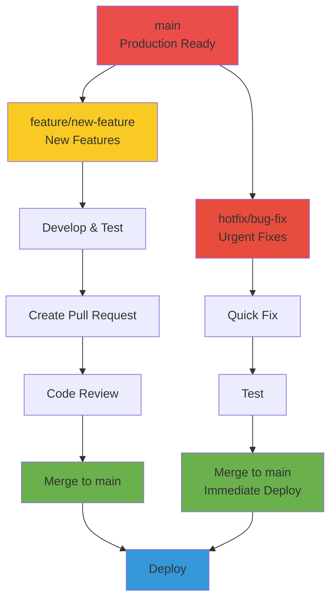

---

## Advanced Git Operations

### Viewing History

```bash
# View commit history
git log

# One line per commit
git log --oneline

# Show graph
git log --oneline --graph --all

# Show last 5 commits
git log -5

# Show commits by author
git log --author="John Doe"

# Show commits in date range
git log --since="2 weeks ago"
git log --until="2024-01-01"

# Show file changes
git log --stat

# Show actual changes
git log -p
```

### Stashing Changes

```bash
# Save changes temporarily
git stash

# Stash with message
git stash save "Work in progress on feature"

# List stashes
git stash list

# Apply most recent stash
git stash apply

# Apply and remove stash
git stash pop

# Apply specific stash
git stash apply stash@{2}

# Drop stash
git stash drop stash@{0}

# Clear all stashes
git stash clear
```

### Tagging Releases

```bash
# Create lightweight tag
git tag v1.0.0

# Create annotated tag (recommended)
git tag -a v1.0.0 -m "Release version 1.0.0"

# List tags
git tag

# Show tag details
git show v1.0.0

# Push tag to remote
git push origin v1.0.0

# Push all tags
git push origin --tags

# Delete tag
git tag -d v1.0.0
git push origin --delete v1.0.0
```

### Rebasing

```bash
# Rebase current branch on main
git checkout feature-branch
git rebase main

# Interactive rebase (edit history)
git rebase -i HEAD~3

# Continue after resolving conflicts
git rebase --continue

# Abort rebase
git rebase --abort
```

### Cherry-Picking

```bash
# Apply specific commit to current branch
git cherry-pick abc1234

# Cherry-pick multiple commits
git cherry-pick abc1234 def5678

# Cherry-pick without committing
git cherry-pick --no-commit abc1234
```

---

## Quick Reference Cheat Sheet

### Setup
```bash
git init                          # Initialize repository
git clone <url>                   # Clone repository
git config --global user.name     # Set username
git config --global user.email    # Set email
```

### Basic Operations
```bash
git status                        # Check status
git add <file>                    # Stage file
git add .                         # Stage all files
git commit -m "message"          # Commit changes
git push origin <branch>         # Push to remote
git pull origin <branch>         # Pull from remote
```

### Branching
```bash
git branch                        # List branches
git branch <name>                # Create branch
git checkout <branch>            # Switch branch
git checkout -b <branch>         # Create and switch
git merge <branch>               # Merge branch
git branch -d <branch>           # Delete branch
```

### Undoing Changes
```bash
git checkout -- <file>           # Discard changes
git reset HEAD <file>            # Unstage file
git reset --soft HEAD~1          # Undo last commit (keep changes)
git reset --hard HEAD~1          # Undo last commit (discard changes)
git revert <commit>              # Create new commit that undoes changes
```

### Inspection
```bash
git log                          # View history
git log --oneline               # Compact history
git diff                        # Show unstaged changes
git diff --staged               # Show staged changes
git show <commit>               # Show commit details
```

---

## Best Practices

1. **Commit Often**: Small, focused commits are easier to review and revert
2. **Write Clear Messages**: Explain what and why, not how
3. **Pull Before Push**: Always sync with remote before pushing
4. **Branch Naming**: Use descriptive, consistent names
5. **Review Before Committing**: Check `git diff` before staging
6. **Don't Commit Secrets**: Use `.gitignore` for sensitive files
7. **Keep Main Stable**: Always test before merging
8. **Use Pull Requests**: Enable code review and discussion
9. **Tag Releases**: Mark important milestones
10. **Document Workflow**: Keep team aligned on branching strategy

---

## Common Git Workflows Visualization

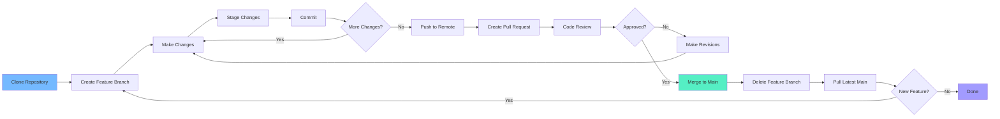

---

## Resources

- [Official Git Documentation](https://git-scm.com/doc)
- [GitHub Docs](https://docs.github.com)
- [Pro Git Book](https://git-scm.com/book/en/v2) (Free)
- [Git Cheat Sheet](https://education.github.com/git-cheat-sheet-education.pdf)
- [Interactive Git Tutorial](https://learngitbranching.js.org)

---

**Happy Coding!** 🚀
