# Week 5: Advanced Express.js, Modern JavaScript & HTTP APIs

## Table of Contents
1. [HTTP Headers](#http-headers)
2. [Express Middlewares](#express-middlewares)
3. [CORS (Cross-Origin Resource Sharing)](#cors-cross-origin-resource-sharing)
4. [Arrow Functions](#arrow-functions)
5. [Array Methods (map, filter, reduce)](#array-methods)
6. [Axios vs Fetch API](#axios-vs-fetch-api)

---

## HTTP Headers

### What are HTTP Headers?

HTTP headers are **key-value pairs** sent with HTTP requests and responses that contain metadata about the request or response. They're like labels on a package that tell you important information without opening it.


### Common Headers

| Header | Purpose | Example |
|--------|---------|---------|
| `Content-Type` | Specifies the media type of the resource | `application/json` |
| `Authorization` | Contains credentials for authentication | `Bearer eyJhbGc...` |
| `User-Agent` | Identifies the client application/browser | `Mozilla/5.0...` |
| `Accept` | Informs server about acceptable content types | `application/json` |
| `Cookie` | Contains stored HTTP cookies | `sessionId=abc123` |

### Working with Headers in Express

Headers are **case-insensitive** and automatically converted to lowercase in Express.

```javascript
app.get('/user', (req, res) => {
    // Access headers
    const contentType = req.headers['content-type'];
    const auth = req.headers.authorization;
    const userAgent = req.headers['user-agent'];

    console.log('Content-Type:', contentType);
    console.log('Authorization:', auth);

    res.json({ message: 'Headers received' });
});
```

### Custom Headers

Custom headers are often prefixed with `x-` for clarity:

```javascript
app.get('/api/data', (req, res) => {
    // Read custom headers
    const apiKey = req.headers['x-api-key'];
    const userId = req.headers['x-user-id'];
    const requestId = req.headers['x-request-id'];

    if (apiKey !== 'secret-key-123') {
        return res.status(401).json({ error: 'Invalid API key' });
    }

    res.json({ data: 'Protected data' });
});
```

### Use Cases for Headers

1. **Authentication**: Bearer tokens, API keys
2. **Rate Limiting**: Track requests per IP/user
3. **API Versioning**: `Accept: application/vnd.api.v2+json`
4. **Caching Control**: `Cache-Control`, `ETag`
5. **CORS**: `Origin`, `Access-Control-Allow-Origin`

---

## Express Middlewares

### What is Middleware?

Middleware functions are functions that have access to:
- **Request object** (`req`)
- **Response object** (`res`)
- **Next middleware function** (`next`)

Think of middleware as a **pipeline** where each function can:
- Execute code
- Modify `req` and `res` objects
- End the request-response cycle
- Call the next middleware in the stack


### Middleware Execution Flow


### Types of Middlewares

#### 1. Application-Level Middleware

Runs for **all routes** or specific path patterns.

```javascript
const express = require('express');
const app = express();

// Runs for ALL requests
app.use((req, res, next) => {
    console.log(`${req.method} ${req.url} - ${new Date().toISOString()}`);
    next(); // MUST call next() to pass control
});

// Runs for routes starting with /api
app.use('/api', (req, res, next) => {
    console.log('API route accessed');
    next();
});
```

#### 2. Built-in Middleware

Express provides several built-in middleware functions:

```javascript
// Parse JSON request bodies
app.use(express.json());

// Parse URL-encoded bodies (form data)
app.use(express.urlencoded({ extended: true }));

// Serve static files
app.use(express.static('public'));
```

#### 3. Route-Level Middleware

Applied to **specific routes**:

```javascript
// Authentication middleware
function authMiddleware(req, res, next) {
    const token = req.headers.authorization;

    if (token === 'secret-token') {
        req.user = { id: 1, name: 'John Doe' };
        next(); // Authenticated, proceed
    } else {
        res.status(401).json({ error: 'Unauthorized' });
        // Don't call next() - end the request here
    }
}

// Apply to specific route
app.get('/protected', authMiddleware, (req, res) => {
    res.json({ message: 'Protected data', user: req.user });
});

// Multiple middlewares in sequence
app.post('/user', validateData, logData, createUser);
```

#### 4. Multiple Middlewares (Chaining)

You can chain multiple middlewares together:

```javascript
const validateData = (req, res, next) => {
    if (req.body.name && req.body.email) {
        next();
    } else {
        res.status(400).json({ error: 'Name and email required' });
    }
};

const logData = (req, res, next) => {
    console.log('Creating user:', req.body);
    next();
};

const sanitizeData = (req, res, next) => {
    req.body.name = req.body.name.trim();
    req.body.email = req.body.email.toLowerCase();
    next();
};

// All three middlewares execute in order
app.post('/user', validateData, logData, sanitizeData, (req, res) => {
    res.json({ message: 'User created', user: req.body });
});
```

#### 5. Middleware Factory (Parameterized Middleware)

Create middleware functions that accept parameters:

```javascript
// Rate limiter middleware factory
function rateLimiter(maxRequests) {
    const requests = {};

    return (req, res, next) => {
        const ip = req.ip;
        requests[ip] = (requests[ip] || 0) + 1;

        if (requests[ip] > maxRequests) {
            return res.status(429).json({ error: 'Too many requests' });
        }

        next();
    };
}

// Use with different limits
app.get('/api/free', rateLimiter(10), (req, res) => {
    res.json({ data: 'Free tier data' });
});

app.get('/api/premium', rateLimiter(100), (req, res) => {
    res.json({ data: 'Premium tier data' });
});
```

#### 6. Error-Handling Middleware

Must have **4 parameters**: `(err, req, res, next)`

```javascript
// Error-handling middleware (must be defined last!)
app.use((err, req, res, next) => {
    console.error('Error occurred:', err.message);
    console.error('Stack:', err.stack);

    res.status(err.status || 500).json({
        error: {
            message: err.message,
            status: err.status || 500
        }
    });
});

// Example: Triggering an error
app.get('/error-test', (req, res, next) => {
    const error = new Error('Something went wrong!');
    error.status = 400;
    next(error); // Pass error to error handler
});
```

### Real-World Middleware Examples

#### Request Logger

```javascript
const requestLogger = (req, res, next) => {
    const start = Date.now();

    // Log when response finishes
    res.on('finish', () => {
        const duration = Date.now() - start;
        console.log(`${req.method} ${req.url} - ${res.statusCode} - ${duration}ms`);
    });

    next();
};

app.use(requestLogger);
```

#### JWT Authentication

```javascript
const jwt = require('jsonwebtoken');

function authenticateToken(req, res, next) {
    const authHeader = req.headers.authorization;
    const token = authHeader && authHeader.split(' ')[1]; // Bearer TOKEN

    if (!token) {
        return res.status(401).json({ error: 'Access token required' });
    }

    jwt.verify(token, process.env.JWT_SECRET, (err, user) => {
        if (err) {
            return res.status(403).json({ error: 'Invalid token' });
        }

        req.user = user;
        next();
    });
}

app.get('/profile', authenticateToken, (req, res) => {
    res.json({ user: req.user });
});
```

#### Request Validation

```javascript
const { body, validationResult } = require('express-validator');

app.post('/register',
    // Validation middleware
    body('email').isEmail(),
    body('password').isLength({ min: 6 }),
    body('username').isAlphanumeric().isLength({ min: 3 }),

    (req, res) => {
        const errors = validationResult(req);

        if (!errors.isEmpty()) {
            return res.status(400).json({ errors: errors.array() });
        }

        // Validation passed, create user
        res.json({ message: 'User registered successfully' });
    }
);
```

### Important Middleware Rules

1. **Order Matters**: Middlewares execute in the order they're defined
2. **Always Call `next()`**: Unless you're ending the request
3. **Error Handlers Last**: Error-handling middleware should be defined after all other middleware
4. **Don't Call `next()` Twice**: Will cause errors
5. **Use `return`**: When sending response without calling `next()`

```javascript
// ❌ BAD: Calling next() after sending response
app.use((req, res, next) => {
    res.json({ message: 'Hello' });
    next(); // This will cause an error!
});

// ✅ GOOD: Either send response OR call next()
app.use((req, res, next) => {
    if (req.url === '/') {
        return res.json({ message: 'Hello' });
    }
    next();
});
```

---

## CORS (Cross-Origin Resource Sharing)

### What is CORS?

CORS is a **security feature** implemented by browsers that restricts web pages from making requests to a different domain than the one serving the web page.

### The Same-Origin Policy Problem

```mermaid
graph TD
    A[Frontend: http://localhost:3000] -->|❌ Blocked| B[Backend: http://localhost:5000]
    A -->|✅ Allowed| C[Backend: http://localhost:3000]

    style A fill:#74b9ff
    style B fill:#ff7675
    style C fill:#55efc4
```



**Same origin** means:
- Same **protocol** (http/https)
- Same **domain** (localhost, example.com)
- Same **port** (3000, 5000)

### Why CORS Exists

Without CORS, a malicious website could:
- Read your emails from Gmail
- Access your bank account data
- Steal cookies and session tokens
- Perform actions on your behalf

### How CORS Works


### CORS Headers Explained

| Header | Purpose | Example |
|--------|---------|---------|
| `Access-Control-Allow-Origin` | Which origins can access | `*` or `http://localhost:3000` |
| `Access-Control-Allow-Methods` | Which HTTP methods allowed | `GET, POST, PUT, DELETE` |
| `Access-Control-Allow-Headers` | Which headers allowed | `Content-Type, Authorization` |
| `Access-Control-Allow-Credentials` | Allow cookies/auth | `true` |
| `Access-Control-Max-Age` | Cache preflight response | `86400` (24 hours) |

### Preflight Requests

For certain requests, browsers send a **preflight** OPTIONS request first:

**Triggers Preflight:**
- HTTP methods: `PUT`, `DELETE`, `PATCH`
- Custom headers (e.g., `Authorization`)
- Content-Type: `application/json`

```javascript
// Browser automatically sends this before your actual request:
OPTIONS /api/data HTTP/1.1
Origin: http://localhost:3000
Access-Control-Request-Method: POST
Access-Control-Request-Headers: content-type, authorization
```

### Implementing CORS in Express

#### Method 1: Manual CORS - Allow All Origins

```javascript
app.use((req, res, next) => {
    res.header('Access-Control-Allow-Origin', '*'); // Allow all origins
    res.header('Access-Control-Allow-Methods', 'GET, POST, PUT, DELETE, OPTIONS');
    res.header('Access-Control-Allow-Headers', 'Content-Type, Authorization');

    // Handle preflight requests
    if (req.method === 'OPTIONS') {
        return res.sendStatus(200);
    }

    next();
});
```

#### Method 2: Manual CORS - Specific Origins

```javascript
const allowedOrigins = [
    'http://localhost:3000',
    'http://localhost:3001',
    'https://myapp.com'
];

app.use((req, res, next) => {
    const origin = req.headers.origin;

    if (allowedOrigins.includes(origin)) {
        res.header('Access-Control-Allow-Origin', origin);
    }

    res.header('Access-Control-Allow-Methods', 'GET, POST, PUT, DELETE, PATCH, OPTIONS');
    res.header('Access-Control-Allow-Headers', 'Content-Type, Authorization, X-Requested-With');
    res.header('Access-Control-Allow-Credentials', 'true'); // Allow cookies
    res.header('Access-Control-Max-Age', '86400'); // Cache for 24 hours

    if (req.method === 'OPTIONS') {
        return res.sendStatus(200);
    }

    next();
});
```

#### Method 3: Using `cors` Package (Recommended)

```bash
npm install cors
```

**3a. Enable for all routes:**

```javascript
const cors = require('cors');

// Allow all origins
app.use(cors());
```

**3b. Specific origin:**

```javascript
app.use(cors({
    origin: 'http://localhost:3000'
}));
```

**3c. Multiple origins:**

```javascript
app.use(cors({
    origin: ['http://localhost:3000', 'https://myapp.com'],
    methods: ['GET', 'POST', 'PUT', 'DELETE'],
    credentials: true, // Allow cookies
    optionsSuccessStatus: 200
}));
```

**3d. Dynamic origin validation:**

```javascript
app.use(cors({
    origin: function (origin, callback) {
        const allowedOrigins = [
            'http://localhost:3000',
            'https://myapp.com'
        ];

        // Allow requests with no origin (mobile apps, Postman)
        if (!origin || allowedOrigins.includes(origin)) {
            callback(null, true);
        } else {
            callback(new Error('Not allowed by CORS'));
        }
    },
    credentials: true
}));
```

#### Method 4: Route-Specific CORS

```javascript
const cors = require('cors');

// Public API - allow all origins
app.get('/api/public', cors(), (req, res) => {
    res.json({ message: 'Public data' });
});

// Private API - specific origin only
app.post('/api/private', cors({ origin: 'http://localhost:3000' }), (req, res) => {
    res.json({ message: 'Private data' });
});
```

#### Method 5: Different CORS for Different Routes

```javascript
const publicCors = cors({ origin: '*' });
const restrictedCors = cors({
    origin: ['http://localhost:3000', 'https://myapp.com'],
    credentials: true
});

app.get('/api/public', publicCors, (req, res) => {
    res.json({ message: 'Accessible from anywhere' });
});

app.get('/api/private', restrictedCors, (req, res) => {
    res.json({ message: 'Restricted origins only' });
});
```

### Testing CORS

```javascript
app.get('/api/test-cors', (req, res) => {
    res.json({
        message: 'CORS test successful',
        origin: req.headers.origin,
        method: req.method
    });
});
```

### Common CORS Errors

#### Error 1: No 'Access-Control-Allow-Origin' header

```
Access to fetch at 'http://localhost:5000/api/data' from origin
'http://localhost:3000' has been blocked by CORS policy:
No 'Access-Control-Allow-Origin' header is present on the requested resource.
```

**Solution**: Add CORS middleware

#### Error 2: Preflight request failed

```
Access to fetch at 'http://localhost:5000/api/data' from origin
'http://localhost:3000' has been blocked by CORS policy:
Response to preflight request doesn't pass access control check.
```

**Solution**: Handle OPTIONS requests properly

### CORS Best Practices

1. **Never use `*` in production** with credentials
2. **Whitelist specific origins** you trust
3. **Use HTTPS** in production
4. **Be specific** with allowed methods and headers
5. **Cache preflight** responses to reduce overhead
6. **Log CORS errors** for debugging

---

## Arrow Functions

### What are Arrow Functions?

Arrow functions provide a **shorter syntax** for writing functions and handle the `this` keyword differently than traditional functions. Introduced in **ES6 (2015)**.

### Syntax Comparison

```javascript
// Traditional function
function add(a, b) {
    return a + b;
}

// Arrow function
const addArrow = (a, b) => {
    return a + b;
};

// Shorter arrow function (implicit return)
const addShort = (a, b) => a + b;

console.log(add(2, 3));        // 5
console.log(addArrow(2, 3));   // 5
console.log(addShort(2, 3));   // 5
```

### Arrow Function Syntax Variations


#### 1. Single Parameter (parentheses optional)

```javascript
const square = x => x * x;
const greet = name => `Hello, ${name}!`;

console.log(square(5));        // 25
console.log(greet('Alice'));   // Hello, Alice!
```

#### 2. No Parameters (parentheses required)

```javascript
const getRandom = () => Math.random();
const sayHello = () => console.log('Hello!');

console.log(getRandom());      // Random number
```

#### 3. Multiple Parameters (parentheses required)

```javascript
const add = (a, b) => a + b;
const fullName = (first, last) => `${first} ${last}`;

console.log(add(2, 3));              // 5
console.log(fullName('John', 'Doe')); // John Doe
```

#### 4. Multiple Lines (curly braces + explicit return)

```javascript
const calculateArea = (length, width) => {
    const area = length * width;
    console.log(`Calculating area...`);
    return area; // Explicit return required
};

console.log(calculateArea(5, 3)); // 15
```

#### 5. Returning Objects (need parentheses)

```javascript
// ❌ Wrong - this looks like a function body
const createPerson = (name, age) => { name: name, age: age }

// ✅ Correct - wrap object in parentheses
const createPerson = (name, age) => ({ name: name, age: age });

// ✅ Even better - with ES6 shorthand
const createPersonShort = (name, age) => ({ name, age });

console.log(createPerson('Alice', 25)); // { name: 'Alice', age: 25 }
```

### The `this` Keyword - KEY DIFFERENCE!

This is the **most important difference** between arrow and traditional functions.


#### Traditional Function - `this` changes

```javascript
const person1 = {
    name: 'John',
    sayHello: function () {
        console.log(`Hello, I'm ${this.name}`);
    }
};

person1.sayHello(); // ✅ Hello, I'm John
// 'this' refers to person1 object
```

#### Arrow Function - `this` is inherited

```javascript
const person2 = {
    name: 'Jane',
    sayHello: () => {
        console.log(`Hello, I'm ${this.name}`);
    }
};

person2.sayHello(); // ❌ Hello, I'm undefined
// 'this' is NOT person2! It's the global object
```

### Practical Example: `setTimeout`

```javascript
const counter = {
    count: 0,

    // ❌ Traditional function - 'this' gets lost
    startTraditional: function () {
        setTimeout(function () {
            this.count++; // 'this' is NOT counter here!
            console.log('Traditional:', this.count); // NaN or undefined
        }, 1000);
    },

    // ✅ Arrow function - 'this' is preserved
    startArrow: function () {
        setTimeout(() => {
            this.count++; // 'this' IS counter here!
            console.log('Arrow:', this.count); // Works correctly
        }, 1000);
    }
};

counter.startArrow(); // ✅ Logs: Arrow: 1
```

### When to Use Arrow Functions ✅

#### 1. Array Methods (Most Common Use)

```javascript
const numbers = [1, 2, 3, 4, 5];

// map - transform elements
const doubled = numbers.map(num => num * 2);
// [2, 4, 6, 8, 10]

// filter - keep elements that pass test
const evens = numbers.filter(num => num % 2 === 0);
// [2, 4]

// reduce - accumulate value
const sum = numbers.reduce((acc, num) => acc + num, 0);
// 15

// Chaining
const result = numbers
    .filter(n => n % 2 === 0)  // Get evens: [2, 4]
    .map(n => n * n);           // Square: [4, 16]
```

#### 2. Callbacks

```javascript
setTimeout(() => console.log('Hello'), 1000);

button.addEventListener('click', () => {
    console.log('Clicked!');
});

fetch('https://api.example.com/data')
    .then(response => response.json())
    .then(data => console.log(data));
```

#### 3. Short Functions

```javascript
const isEven = n => n % 2 === 0;
const double = x => x * 2;
const greet = name => `Hello, ${name}!`;
```

### When NOT to Use Arrow Functions ❌

#### 1. Object Methods (when you need `this`)

```javascript
// ❌ Wrong
const dog = {
    name: 'Buddy',
    bark: () => {
        console.log(`${this.name} says woof!`); // this.name is undefined
    }
};

// ✅ Correct
const dog = {
    name: 'Buddy',
    bark: function () {
        console.log(`${this.name} says woof!`); // Works!
    }
};

// ✅ Even better - ES6 method syntax
const dog = {
    name: 'Buddy',
    bark() {
        console.log(`${this.name} says woof!`);
    }
};
```

#### 2. Event Handlers (when you need `this` as element)

```javascript
// ❌ Wrong - 'this' won't refer to the button
button.addEventListener('click', () => {
    this.classList.toggle('active'); // Won't work!
});

// ✅ Correct
button.addEventListener('click', function () {
    this.classList.toggle('active'); // Works!
});
```

#### 3. Constructors

```javascript
// ❌ Error: Arrow functions can't be constructors
const Person = (name) => {
    this.name = name;
};

const john = new Person('John'); // TypeError!

// ✅ Correct
function Person(name) {
    this.name = name;
}

const john = new Person('John'); // Works!
```

### Arrow Functions Summary

| Feature | Traditional Function | Arrow Function |
|---------|---------------------|----------------|
| Syntax | `function(x) { }` | `(x) => { }` |
| `this` binding | Dynamic (depends on call) | Lexical (inherited) |
| Can be constructor | ✅ Yes | ❌ No |
| `arguments` object | ✅ Yes | ❌ No |
| Best for | Object methods, constructors | Callbacks, array methods |

**Rule of Thumb:**
- ✅ Use arrow functions for: callbacks, array methods, short functions
- ❌ Avoid arrow functions for: object methods, event handlers, constructors
- 🔑 Key difference: Arrow functions don't have their own `this`

---

## Array Methods

Modern JavaScript provides powerful methods for working with arrays. These methods are **functional** in nature - they don't mutate the original array.

### map() - Transform Elements

**Purpose**: Transform each element in an array and return a new array.


**Syntax:**
```javascript
const newArray = array.map((element, index, array) => {
    // return transformed element
});
```

**Examples:**

```javascript
// 1. Double numbers
const numbers = [1, 2, 3, 4, 5];
const doubled = numbers.map(num => num * 2);
console.log(doubled); // [2, 4, 6, 8, 10]

// 2. Add tax to prices
const prices = [10, 20, 30, 40];
const withTax = prices.map(price => price * 1.1);
console.log(withTax); // [11, 22, 33, 44]

// 3. Capitalize names
const names = ['alice', 'bob', 'charlie'];
const capitalized = names.map(name =>
    name.charAt(0).toUpperCase() + name.slice(1)
);
console.log(capitalized); // ['Alice', 'Bob', 'Charlie']

// 4. Extract property from objects
const users = [
    { name: 'John', age: 25 },
    { name: 'Jane', age: 30 }
];
const userNames = users.map(user => user.name);
console.log(userNames); // ['John', 'Jane']

// 5. Transform to new objects
const products = [
    { name: 'Laptop', price: 1000 },
    { name: 'Phone', price: 500 }
];
const withDiscount = products.map(product => ({
    name: product.name,
    originalPrice: product.price,
    discountedPrice: product.price * 0.9
}));
```

### filter() - Select Elements

**Purpose**: Keep only elements that pass a test (returns true).


**Syntax:**
```javascript
const newArray = array.filter((element, index, array) => {
    // return true to keep, false to remove
});
```

**Examples:**

```javascript
// 1. Get even numbers
const numbers = [1, 2, 3, 4, 5, 6];
const evens = numbers.filter(num => num % 2 === 0);
console.log(evens); // [2, 4, 6]

// 2. Filter adults
const ages = [12, 18, 25, 16, 30, 14];
const adults = ages.filter(age => age >= 18);
console.log(adults); // [18, 25, 30]

// 3. Filter long words
const words = ['apple', 'banana', 'kiwi', 'strawberry'];
const longWords = words.filter(word => word.length > 5);
console.log(longWords); // ['banana', 'strawberry']

// 4. Filter objects by property
const products = [
    { name: 'Laptop', price: 1000, inStock: true },
    { name: 'Phone', price: 500, inStock: false },
    { name: 'Tablet', price: 300, inStock: true }
];
const available = products.filter(product => product.inStock);
console.log(available);
// [{ name: 'Laptop', ... }, { name: 'Tablet', ... }]

// 5. Filter by multiple conditions
const affordable = products.filter(product =>
    product.price < 600 && product.inStock
);
console.log(affordable); // [{ name: 'Tablet', ... }]
```

### reduce() - Accumulate Value

**Purpose**: Reduce an array to a single value by accumulating results.


**Syntax:**
```javascript
const result = array.reduce((accumulator, current, index, array) => {
    // return updated accumulator
}, initialValue);
```

**How it works:**
```javascript
// Sum example: [1, 2, 3, 4]
// Step 1: acc = 0, curr = 1 → return 0 + 1 = 1
// Step 2: acc = 1, curr = 2 → return 1 + 2 = 3
// Step 3: acc = 3, curr = 3 → return 3 + 3 = 6
// Step 4: acc = 6, curr = 4 → return 6 + 4 = 10
// Result: 10
```

**Examples:**

```javascript
// 1. Sum numbers
const numbers = [1, 2, 3, 4, 5];
const sum = numbers.reduce((acc, num) => acc + num, 0);
console.log(sum); // 15

// 2. Find maximum
const max = numbers.reduce((acc, num) => num > acc ? num : acc, numbers[0]);
console.log(max); // 5

// 3. Count occurrences
const fruits = ['apple', 'banana', 'apple', 'orange', 'banana', 'apple'];
const count = fruits.reduce((acc, fruit) => {
    acc[fruit] = (acc[fruit] || 0) + 1;
    return acc;
}, {});
console.log(count);
// { apple: 3, banana: 2, orange: 1 }

// 4. Group by property
const people = [
    { name: 'John', age: 25 },
    { name: 'Jane', age: 30 },
    { name: 'Bob', age: 25 }
];
const groupedByAge = people.reduce((acc, person) => {
    const age = person.age;
    if (!acc[age]) {
        acc[age] = [];
    }
    acc[age].push(person.name);
    return acc;
}, {});
console.log(groupedByAge);
// { 25: ['John', 'Bob'], 30: ['Jane'] }

// 5. Flatten array
const nested = [[1, 2], [3, 4], [5, 6]];
const flattened = nested.reduce((acc, arr) => acc.concat(arr), []);
console.log(flattened); // [1, 2, 3, 4, 5, 6]

// 6. Calculate total price
const cart = [
    { item: 'Laptop', price: 1000, quantity: 1 },
    { item: 'Mouse', price: 20, quantity: 2 },
    { item: 'Keyboard', price: 50, quantity: 1 }
];
const total = cart.reduce((acc, item) =>
    acc + (item.price * item.quantity), 0
);
console.log(total); // 1090
```

### Chaining Array Methods

One of the most powerful features - combine multiple methods:

```javascript
const numbers = [1, 2, 3, 4, 5, 6, 7, 8, 9, 10];

// Get sum of squares of even numbers
const result = numbers
    .filter(n => n % 2 === 0)  // [2, 4, 6, 8, 10]
    .map(n => n * n)            // [4, 16, 36, 64, 100]
    .reduce((acc, n) => acc + n, 0); // 220

console.log(result); // 220
```

**Real-world example:**

```javascript
const transactions = [
    { type: 'income', amount: 1000, category: 'salary' },
    { type: 'expense', amount: 200, category: 'groceries' },
    { type: 'expense', amount: 100, category: 'transport' },
    { type: 'income', amount: 500, category: 'freelance' },
    { type: 'expense', amount: 50, category: 'entertainment' }
];

// Calculate total expenses
const totalExpenses = transactions
    .filter(t => t.type === 'expense')
    .map(t => t.amount)
    .reduce((sum, amount) => sum + amount, 0);

console.log(totalExpenses); // 350

// Get income by category
const incomeByCategory = transactions
    .filter(t => t.type === 'income')
    .reduce((acc, t) => {
        acc[t.category] = (acc[t.category] || 0) + t.amount;
        return acc;
    }, {});

console.log(incomeByCategory);
// { salary: 1000, freelance: 500 }
```

### Array Methods Comparison

| Method | Returns | Mutates Original? | Use Case |
|--------|---------|-------------------|----------|
| `map()` | New array (same length) | ❌ No | Transform elements |
| `filter()` | New array (≤ length) | ❌ No | Select elements |
| `reduce()` | Single value | ❌ No | Accumulate/aggregate |
| `forEach()` | undefined | ❌ No | Side effects only |
| `find()` | Single element | ❌ No | Find one element |
| `some()` | boolean | ❌ No | Test if any pass |
| `every()` | boolean | ❌ No | Test if all pass |

### Best Practices

1. **Use `map()`** when you need to transform every element
2. **Use `filter()`** when you need to select some elements
3. **Use `reduce()`** when you need a single value
4. **Chain methods** for complex operations
5. **Keep it readable** - break into multiple lines if needed
6. **Avoid side effects** in map/filter (use forEach instead)

```javascript
// ❌ Bad - side effects in map
const numbers = [1, 2, 3];
numbers.map(num => console.log(num)); // Don't do this

// ✅ Good - use forEach for side effects
numbers.forEach(num => console.log(num));

// ✅ Good - map for transformation
const doubled = numbers.map(num => num * 2);
```

---

## Axios vs Fetch API

Both Axios and Fetch are used to make HTTP requests, but they have important differences.

### Quick Comparison

```mermaid
graph TD
    A[HTTP Request Tools] --> B[Fetch API]
    A --> C[Axios Library]

    B --> B1[✅ Built into browser]
    B --> B2[❌ More verbose]
    B --> B3[❌ Manual JSON parsing]
    B --> B4[❌ No request timeout]
    B --> B5[❌ Doesn't reject on HTTP errors]

    C --> C1[❌ Needs installation]
    C --> C2[✅ Cleaner syntax]
    C --> C3[✅ Auto JSON parsing]
    C --> C4[✅ Built-in timeout]
    C --> C5[✅ Rejects on HTTP errors]

    style A fill:#74b9ff
    style B fill:#ffeaa7
    style C fill:#55efc4
```



### Installation

```bash
# Fetch - No installation needed (built-in)

# Axios - Install via npm
npm install axios
```

### Basic GET Request

#### Fetch API

```javascript
async function fetchData() {
    // Step 1: Make request
    const response = await fetch('https://api.example.com/data');

    // Step 2: Parse JSON manually
    const data = await response.json();

    console.log(data);
}

fetchData();
```

#### Axios

```javascript
const axios = require('axios');

async function axiosData() {
    // One step - JSON parsed automatically
    const response = await axios.get('https://api.example.com/data');

    console.log(response.data); // Already parsed!
}

axiosData();
```

### POST Request with Data

#### Fetch API

```javascript
async function fetchPost() {
    const response = await fetch('https://api.example.com/users', {
        method: 'POST',
        headers: {
            'Content-Type': 'application/json',
            'Authorization': 'Bearer <token>'
        },
        body: JSON.stringify({
            name: 'John',
            age: 30
        })
    });

    const data = await response.json();
    console.log(data);
}
```

#### Axios

```javascript
async function axiosPost() {
    const response = await axios.post(
        'https://api.example.com/users',
        {
            name: 'John',
            age: 30
        },
        {
            headers: {
                'Content-Type': 'application/json',
                'Authorization': 'Bearer <token>'
            }
        }
    );

    console.log(response.data);
}
```

### Detailed Feature Comparison

#### 1. JSON Handling

**Fetch:**
```javascript
// Must manually parse JSON
const response = await fetch(url);
const data = await response.json(); // Extra step
```

**Axios:**
```javascript
// JSON parsed automatically
const response = await axios.get(url);
const data = response.data; // Already parsed
```

#### 2. Error Handling

**Fetch:**
```javascript
// Does NOT reject on HTTP errors (404, 500, etc.)
try {
    const response = await fetch('https://api.example.com/data');

    // Must manually check status
    if (!response.ok) {
        throw new Error(`HTTP error! status: ${response.status}`);
    }

    const data = await response.json();
} catch (error) {
    console.error('Error:', error);
}
```

**Axios:**
```javascript
// Automatically rejects on HTTP errors
try {
    const response = await axios.get('https://api.example.com/data');
    console.log(response.data);
} catch (error) {
    if (error.response) {
        // HTTP error (404, 500, etc.)
        console.log('Status:', error.response.status);
        console.log('Data:', error.response.data);
    } else if (error.request) {
        // No response received
        console.log('No response');
    } else {
        // Other errors
        console.log('Error:', error.message);
    }
}
```

#### 3. Request Timeout

**Fetch:**
```javascript
// No built-in timeout - must implement manually
const controller = new AbortController();
const timeoutId = setTimeout(() => controller.abort(), 5000);

try {
    const response = await fetch(url, {
        signal: controller.signal
    });
    clearTimeout(timeoutId);
} catch (error) {
    if (error.name === 'AbortError') {
        console.log('Request timed out');
    }
}
```

**Axios:**
```javascript
// Built-in timeout
try {
    const response = await axios.get(url, {
        timeout: 5000 // 5 seconds
    });
} catch (error) {
    if (error.code === 'ECONNABORTED') {
        console.log('Request timed out');
    }
}
```

#### 4. Request/Response Interceptors

**Axios:**
```javascript
// Add token to all requests
axios.interceptors.request.use(config => {
    config.headers.Authorization = `Bearer ${token}`;
    return config;
});

// Log all responses
axios.interceptors.response.use(response => {
    console.log('Response:', response.status);
    return response;
});
```

**Fetch:**
```javascript
// Must wrap fetch or create helper function
async function fetchWithAuth(url, options = {}) {
    options.headers = {
        ...options.headers,
        'Authorization': `Bearer ${token}`
    };
    return fetch(url, options);
}
```

#### 5. Upload Progress

**Axios:**
```javascript
await axios.post('/upload', formData, {
    onUploadProgress: progressEvent => {
        const percentCompleted = Math.round(
            (progressEvent.loaded * 100) / progressEvent.total
        );
        console.log(`Upload: ${percentCompleted}%`);
    }
});
```

**Fetch:**
```javascript
// No built-in progress support
```

#### 6. Request Cancellation

**Fetch:**
```javascript
const controller = new AbortController();

fetch(url, {
    signal: controller.signal
});

// Cancel request
controller.abort();
```

**Axios:**
```javascript
const CancelToken = axios.CancelToken;
const source = CancelToken.source();

axios.get(url, {
    cancelToken: source.token
});

// Cancel request
source.cancel('Request canceled');
```

### All HTTP Methods

#### Fetch

```javascript
// GET
await fetch(url);

// POST
await fetch(url, {
    method: 'POST',
    headers: { 'Content-Type': 'application/json' },
    body: JSON.stringify(data)
});

// PUT
await fetch(url, {
    method: 'PUT',
    headers: { 'Content-Type': 'application/json' },
    body: JSON.stringify(data)
});

// DELETE
await fetch(url, {
    method: 'DELETE'
});

// PATCH
await fetch(url, {
    method: 'PATCH',
    headers: { 'Content-Type': 'application/json' },
    body: JSON.stringify(data)
});
```

#### Axios

```javascript
// GET
await axios.get(url);

// POST
await axios.post(url, data);

// PUT
await axios.put(url, data);

// DELETE
await axios.delete(url);

// PATCH
await axios.patch(url, data);

// Custom config
await axios({
    method: 'post',
    url: '/api/users',
    data: { name: 'John' },
    headers: { 'Authorization': 'Bearer token' },
    timeout: 5000
});
```

### When to Use Which?

#### Use Fetch When:
- ✅ Working in modern browsers
- ✅ Want to avoid dependencies
- ✅ Need minimal bundle size
- ✅ Simple API calls with minimal configuration

#### Use Axios When:
- ✅ Need better error handling
- ✅ Want automatic JSON transformation
- ✅ Need request/response interceptors
- ✅ Want upload/download progress tracking
- ✅ Need easy request cancellation
- ✅ Working with complex API integrations
- ✅ Want built-in timeout support

### Feature Comparison Table

| Feature | Fetch | Axios |
|---------|-------|-------|
| Built-in | ✅ Yes | ❌ No (npm install) |
| Browser Support | Modern browsers only | IE 11+ |
| JSON Parsing | Manual (`response.json()`) | Automatic |
| Error Handling | Must check `response.ok` | Auto-rejects on errors |
| Request Timeout | Manual implementation | Built-in |
| Interceptors | ❌ No | ✅ Yes |
| Progress Events | ❌ No | ✅ Yes |
| Request Cancellation | AbortController | CancelToken |
| Automatic Transforms | ❌ No | ✅ Yes |
| CSRF Protection | ❌ No | ✅ Yes |

### Real-World Example: API Service

#### Using Axios (Recommended)

```javascript
// api.js
const axios = require('axios');

const api = axios.create({
    baseURL: 'https://api.example.com',
    timeout: 5000,
    headers: {
        'Content-Type': 'application/json'
    }
});

// Add auth token to all requests
api.interceptors.request.use(config => {
    const token = localStorage.getItem('token');
    if (token) {
        config.headers.Authorization = `Bearer ${token}`;
    }
    return config;
});

// Handle errors globally
api.interceptors.response.use(
    response => response,
    error => {
        if (error.response?.status === 401) {
            // Redirect to login
            window.location.href = '/login';
        }
        return Promise.reject(error);
    }
);

// API methods
export const getUsers = () => api.get('/users');
export const createUser = (data) => api.post('/users', data);
export const updateUser = (id, data) => api.put(`/users/${id}`, data);
export const deleteUser = (id) => api.delete(`/users/${id}`);
```

---

## Summary

### Week 5 Key Takeaways

1. **HTTP Headers**: Metadata for requests/responses - use for auth, rate limiting, API versioning

2. **Middlewares**: Functions with access to req/res/next - use for logging, auth, validation, CORS

3. **CORS**: Security feature that restricts cross-origin requests - configure properly for production

4. **Arrow Functions**: Shorter syntax with lexical `this` - use for callbacks and array methods

5. **Array Methods**:
   - `map()` → transform
   - `filter()` → select
   - `reduce()` → accumulate

6. **Axios vs Fetch**:
   - Fetch → minimal, built-in
   - Axios → feature-rich, better DX

---

## Practice Exercises

### Exercise 1: Create Authentication Middleware
Create a middleware that checks for a valid JWT token and attaches user info to the request.

### Exercise 2: Implement Rate Limiting
Build a rate limiter middleware that restricts each IP to 100 requests per hour.

### Exercise 3: Array Methods Challenge
Given an array of products, use `filter()`, `map()`, and `reduce()` to:
- Filter products in stock
- Add 10% tax to prices
- Calculate total value

### Exercise 4: Build API Client
Create an API client using Axios with:
- Base URL configuration
- Request interceptor (add auth token)
- Response interceptor (handle errors)
- Methods for CRUD operations

---

## Additional Resources

- [Express.js Documentation](https://expressjs.com/)
- [MDN Web Docs - Arrow Functions](https://developer.mozilla.org/en-US/docs/Web/JavaScript/Reference/Functions/Arrow_functions)
- [MDN Web Docs - Array Methods](https://developer.mozilla.org/en-US/docs/Web/JavaScript/Reference/Global_Objects/Array)
- [Axios Documentation](https://axios-http.com/)
- [CORS Explained](https://developer.mozilla.org/en-US/docs/Web/HTTP/CORS)

---

**Happy Coding! 🚀**
