# React Basics & Fundamentals - Complete Revision Guide

> 📚 **Standalone Revision Guide**: This document consolidates all concepts from Week 9.3 & 9.4 covering React fundamentals, hooks, error handling, and component patterns.

---

## 📋 Table of Contents

1. [React Application Architecture](#-react-application-architecture)
2. [Core Concepts](#-core-concepts)
   - [Component Structure](#component-structure)
   - [JSX Fundamentals](#jsx-fundamentals)
   - [Props & Children](#props--children)
3. [React Hooks Deep Dive](#-react-hooks-deep-dive)
   - [useState](#usestate---state-management)
   - [useEffect](#useeffect---side-effects)
4. [Error Boundaries](#-error-boundaries)
5. [List Rendering & Keys](#-list-rendering--keys)
6. [Component Composition Patterns](#-component-composition-patterns)
7. [React Lifecycle Flow](#-react-lifecycle-flow)
8. [Code Patterns & Examples](#-code-patterns--examples)
9. [Summary & Key Takeaways](#-summary--key-takeaways)

---

## 🏗️ React Application Architecture


### How React Apps Bootstrap

| File | Purpose |
|------|---------|
| `index.html` | Single HTML page with `<div id="root">` |
| `main.jsx` | JavaScript entry point, mounts React app |
| `App.jsx` | Root React component |

```jsx
// main.jsx - The Bootstrap Process
import { StrictMode } from 'react'
import { createRoot } from 'react-dom/client'
import App from './App.jsx'

createRoot(document.getElementById('root')).render(
  <StrictMode>
    <App />
  </StrictMode>
)
```

> **Key Insight**: `StrictMode` is a development-only wrapper that helps identify potential problems by intentionally double-invoking certain functions.

---

## 📚 Core Concepts

### Component Structure

A React component is simply a **JavaScript function that returns JSX**.


### JSX Fundamentals

| Feature | JavaScript | JSX |
|---------|------------|-----|
| Class attribute | `class` | `className` |
| Inline styles | String | Object with camelCase |
| Event handlers | `onclick` | `onClick` |
| Self-closing | Optional | Required (``) |

```jsx
// JSX Syntax Examples
<div 
  style={{
    backgroundColor: 'white',  // camelCase
    padding: 20,               // Numbers = pixels
    borderRadius: '10px'       // String for units
  }}
>
  Content
</div>
```

### Props & Children

**Props** = Data passed from parent to child component


#### The Special `children` Prop

`children` represents whatever you put **between** the component's opening and closing tags.

```jsx
// Usage
<Card>
  <h2>This is children!</h2>
  <p>Everything here goes into children prop</p>
</Card>

// Card Component Definition
function Card({ children }) {
  return (
    <div className="card-wrapper">
      {children}  {/* Renders the h2 and p above */}
    </div>
  )
}
```

> **Key Insight**: The `children` prop enables **composition** - building complex UIs by nesting components like HTML elements.

---

## 🪝 React Hooks Deep Dive

### useState - State Management

**State** = Data that changes over time and triggers re-renders.


#### Syntax Patterns

```jsx
// Basic Usage
const [count, setCount] = useState(0);

// Object State
const [user, setUser] = useState({ name: '', age: 0 });

// Array State
const [posts, setPosts] = useState([]);

// Functional Update (when new state depends on old state)
setCount(prevCount => prevCount + 1);  // ✅ Correct
setCount(count + 1);                    // ⚠️ Can cause stale closure bugs
```

#### Important: Immutable Updates

```jsx
// ❌ WRONG - Mutating state directly
posts.push(newPost);
setPosts(posts);

// ✅ CORRECT - Creating new array
setPosts([...posts, newPost]);
```

> **Key Insight**: Always use the **functional update form** (`prev => ...`) when the new state depends on the previous state.

---

### useEffect - Side Effects

**Side effects** = Operations that affect things outside the component (timers, API calls, subscriptions, DOM manipulation).


#### The Three Forms of useEffect

```jsx
// 1️⃣ Empty Dependencies - Runs ONCE on mount
useEffect(() => {
  console.log('Component mounted');
  return () => console.log('Cleanup on unmount');
}, []);  // ← Empty array

// 2️⃣ With Dependencies - Runs when dependencies change
useEffect(() => {
  console.log(`Tab changed to: ${activeTab}`);
  // Maybe fetch data for this tab
}, [activeTab]);  // ← Runs when activeTab changes

// 3️⃣ No Dependencies - Runs on EVERY render (usually avoid this)
useEffect(() => {
  console.log('Runs every render - performance issue!');
}); // ← No array = every render
```

#### Cleanup Function Pattern

```jsx
useEffect(() => {
  // SETUP: Create side effect
  const intervalId = setInterval(() => {
    setCount(prev => prev + 1);
  }, 1000);

  // CLEANUP: Remove side effect
  return () => {
    clearInterval(intervalId);  // Prevent memory leak!
  };
}, []);
```

> **Key Insight**: Without cleanup, `setInterval` creates a **new interval on every render** (memory leak). The cleanup function runs before the next effect and on unmount.

---

## 🛡️ Error Boundaries

Error Boundaries are special components that **catch JavaScript errors** in child components and display a fallback UI.

```mermaid
flowchart TD
    subgraph "With Error Boundary"
        A["App"] --> B["ErrorBoundary"]
        B --> C["ChildComponent"]
        C -->|"Throws Error"| B
        B --> D["Shows Fallback UI"]
    end
    
    subgraph "Without Error Boundary"
        E["App"] --> F["ChildComponent"]
        F -->|"Throws Error"| G["💥 Entire App Crashes"]
    end
    
    style D fill:#c8e6c9
    style G fill:#ffcdd2
```



### What Errors ARE Caught

- ✅ Errors during **rendering**
- ✅ Errors in **lifecycle methods**
- ✅ Errors in **constructors** of child tree

### What Errors ARE NOT Caught

- ❌ Event handlers (use try-catch)
- ❌ Asynchronous code (setTimeout, promises)
- ❌ Server-side rendering
- ❌ Errors in the error boundary itself

### Implementation Pattern

```jsx
// Error Boundaries MUST be class components
class ErrorBoundary extends Component {
  constructor(props) {
    super(props);
    this.state = { hasError: false };
  }

  // Called when error is thrown in child
  static getDerivedStateFromError(error) {
    return { hasError: true };  // Update state to show fallback
  }

  // Called with error details for logging
  componentDidCatch(error, errorInfo) {
    console.error('Error:', error, errorInfo);
  }

  render() {
    if (this.state.hasError) {
      return <h2>Something went wrong!</h2>;  // Fallback UI
    }
    return this.props.children;  // Normal render
  }
}

// Usage
<ErrorBoundary>
  <SomeComponentThatMightFail />
</ErrorBoundary>
```

> **Key Insight**: Error Boundaries are like `try-catch` for React components. They prevent one broken component from crashing your entire app.

---

## 📝 List Rendering & Keys

### The `.map()` Pattern

```jsx
// Transform array into JSX elements
{items.map(item => (
  <ItemComponent 
    key={item.id}      // ← REQUIRED unique identifier
    data={item} 
  />
))}
```

### Why Keys Matter

```mermaid
flowchart LR
    subgraph "Without Keys"
        A["React Compares Positions"]
        A --> B["Recreates All Elements"]
        B --> C["❌ Poor Performance"]
    end
    
    subgraph "With Keys"
        D["React Tracks by Key"]
        D --> E["Only Updates Changed Items"]
        E --> F["✅ Efficient Updates"]
    end
    
    style C fill:#ffcdd2
    style F fill:#c8e6c9
```



### Key Rules

| ✅ Good Keys | ❌ Bad Keys |
|-------------|------------|
| Database IDs (`post.id`) | Array index (if list reorders) |
| Unique identifiers | Random values |
| Stable values | Math.random() |

```jsx
// ✅ Good - Using stable unique ID
{posts.map(post => (
  <PostCard key={post.id} {...post} />
))}

// ⚠️ Avoid - Index as key (problematic if list can reorder)
{posts.map((post, index) => (
  <PostCard key={index} {...post} />
))}
```

---

## 🧩 Component Composition Patterns

### Pattern 1: Container Components

Wrap children with styling/behavior without knowing what's inside.

```jsx
function Card({ children }) {
  return (
    <div style={{
      backgroundColor: 'white',
      padding: 20,
      borderRadius: 10,
      boxShadow: '0 2px 8px rgba(0,0,0,0.1)'
    }}>
      {children}
    </div>
  )
}

// Usage - Card doesn't care what's inside
<Card>
  <h2>Any Content</h2>
  <p>Goes here</p>
</Card>
```

### Pattern 2: Controlled Components

Parent controls the state, child just displays and signals changes.

```jsx
function App() {
  const [selectedId, setSelectedId] = useState(null);
  
  return (
    <PostCard 
      isSelected={selectedId === post.id}  // Parent provides state
      onSelect={() => setSelectedId(post.id)}  // Child signals changes
    />
  );
}

function PostCard({ isSelected, onSelect }) {
  return (
    <div 
      onClick={onSelect}
      style={{ border: isSelected ? '3px solid green' : 'none' }}
    >
      Content
    </div>
  );
}
```

---

## 🔄 React Lifecycle Flow


---

## 💻 Code Patterns & Examples

### Complete Post Feed Example

This example combines multiple concepts into a working application:

```jsx
function App() {
  // 1️⃣ State Management
  const [posts, setPosts] = useState([/* initial posts */]);
  const [selectedPostId, setSelectedPostId] = useState(null);
  const [activeTab, setActiveTab] = useState('feed');

  // 2️⃣ Side Effect - Runs once on mount
  useEffect(() => {
    const intervalId = setInterval(() => {
      setNotificationCount(prev => prev + 1);
    }, 3000);
    
    return () => clearInterval(intervalId);  // Cleanup
  }, []);

  // 3️⃣ Side Effect - Runs when dependency changes
  useEffect(() => {
    console.log(`Fetching data for: ${activeTab}`);
    // fetch(`/api/${activeTab}`)
  }, [activeTab]);

  // 4️⃣ Adding to list immutably
  const addPost = () => {
    const newPost = { id: Date.now(), /* ... */ };
    setPosts([...posts, newPost]);  // Spread to create new array
  };

  return (
    // 5️⃣ Error Boundary wraps potentially failing children
    <ErrorBoundary>
      {/* 6️⃣ List rendering with keys */}
      {posts.map(post => (
        <PostComponent
          key={post.id}
          {...post}
          isSelected={selectedPostId === post.id}
          onSelect={() => setSelectedPostId(post.id)}
        />
      ))}
    </ErrorBoundary>
  );
}
```

### Tab Navigation Pattern

A common UI pattern showing active state management:

```jsx
const tabs = ['feed', 'notifications', 'messages', 'jobs'];
const [activeTab, setActiveTab] = useState('feed');

// Effect triggers API call when tab changes
useEffect(() => {
  fetch(`/api/${activeTab}`);
}, [activeTab]);

// Rendering tabs with active state
{tabs.map(tab => (
  <button
    key={tab}
    onClick={() => setActiveTab(tab)}
    style={{
      backgroundColor: activeTab === tab ? '#4CAF50' : '#888'
    }}
  >
    {tab}
  </button>
))}
```

---

## ✅ Summary & Key Takeaways

### React Mental Model


### Quick Reference Card

| Concept | What It Does | When to Use |
|---------|--------------|-------------|
| `useState` | Manages component state | When data changes over time |
| `useEffect` | Handles side effects | Timers, API calls, subscriptions |
| `useEffect([])` | Runs once on mount | Initial data fetching |
| `useEffect([dep])` | Runs when dep changes | React to state changes |
| Error Boundary | Catches child errors | Prevent app crashes |
| `children` prop | Receives nested JSX | Wrapper components |
| `key` prop | Identifies list items | Efficient list updates |

### Core Principles

1. **State is Immutable**: Never mutate state directly. Always create new objects/arrays.
2. **Props Flow Down**: Parent → Child communication via props.
3. **Effects Cleanup**: Always clean up subscriptions, timers, event listeners.
4. **Keys for Lists**: Use stable, unique IDs for list items.
5. **Error Boundaries**: Wrap risky components to prevent total app crashes.

### Common Mistakes to Avoid

| ❌ Mistake | ✅ Correct |
|-----------|-----------|
| `state.push(item)` | `setState([...state, item])` |
| `setCount(count + 1)` in loops | `setCount(prev => prev + 1)` |
| Forgetting cleanup in useEffect | Return cleanup function |
| Using index as key for dynamic lists | Use unique IDs |
| Side effects directly in component body | Use useEffect |

---

> 📖 **Pro Tip**: React's philosophy is **"UI as a function of state"**. When state changes, the UI automatically updates. Focus on managing state correctly, and React handles the DOM updates.

---

*Last updated: December 2024*