# Week 10: SPA Routing & React Hooks Deep Dive

> **A Complete Revision Guide for Single Page Applications with React Router and useRef Hook**

---

## Table of Contents

1. [Introduction](#introduction)
2. [Theoretical Concepts](#theoretical-concepts)
   - [What is a Single Page Application (SPA)?](#what-is-a-single-page-application-spa)
   - [React Router Fundamentals](#react-router-fundamentals)
   - [The useRef Hook](#the-useref-hook)
3. [Code & Patterns](#code--patterns)
   - [Setting Up React Router](#1-setting-up-react-router)
   - [Layout Pattern with Outlet](#2-layout-pattern-with-outlet)
   - [Programmatic Navigation with useNavigate](#3-programmatic-navigation-with-usenavigate)
   - [useRef for Value Storage (Timer Example)](#4-useref-for-value-storage-timer-example)
   - [useRef for DOM References (Form Example)](#5-useref-for-dom-references-form-example)
   - [Complete Routing Setup](#6-complete-routing-setup)
4. [Visual Aids](#visual-aids)
5. [Summary & Key Takeaways](#summary--key-takeaways)

---

## Introduction

This module covers two critical concepts in React development:

1. **SPA Routing** – How to create multi-page experiences without actual page reloads using React Router
2. **useRef Hook** – A powerful hook for storing mutable values and accessing DOM elements directly

By the end of this guide, you'll understand how to build seamless navigation experiences and master the subtle but powerful `useRef` hook.

---

## Theoretical Concepts

### What is a Single Page Application (SPA)?

A **Single Page Application** is a web application that loads a single HTML page and dynamically updates content as the user interacts with the app. Instead of requesting new HTML pages from the server, SPAs:

- **Load once** – The initial HTML, CSS, and JavaScript are loaded once
- **Update dynamically** – Only the content that changes is re-rendered
- **No page reloads** – Navigation feels instant and app-like
- **Client-side routing** – The browser URL changes without server requests


**Key Benefits of SPAs:**
- ⚡ **Faster Navigation** – No server round-trips for page changes
- 🎯 **Better UX** – Smooth, app-like experience
- 📦 **Reduced Server Load** – Server only handles API requests
- 🔄 **State Preservation** – Application state persists across "pages"

---

### React Router Fundamentals

**React Router** is the standard library for handling routing in React applications. It provides components and hooks to manage navigation in a declarative way.

#### Core Components

| Component | Purpose |
|-----------|---------|
| `BrowserRouter` | Wraps the entire app, provides routing context |
| `Routes` | Container for `Route` components |
| `Route` | Maps a URL path to a component |
| `Link` | Navigation without page reload (replaces `<a>` tags) |
| `Outlet` | Placeholder for nested route content |

#### Core Hooks

| Hook | Purpose |
|------|---------|
| `useNavigate` | Programmatic navigation (redirects, conditional navigation) |
| `useParams` | Access URL parameters (e.g., `/user/:id`) |
| `useLocation` | Access current location object and state |
| `useSearchParams` | Access and modify query parameters |

```mermaid
graph TB
    subgraph Router["BrowserRouter Context"]
        direction TB
        R["Routes"] --> R1["Route path='/'"]
        R1 --> L["Layout Component"]
        L --> O["Outlet <br/>(Child routes render here)"]
        R1 --> R2["Route index → Home"]
        R1 --> R3["Route path='blogs' → Blogs"]
        R1 --> R4["Route path='contact' → Contact"]
        R1 --> R5["Route path='*' → 404 Page"]
    end
    
    style Router fill:#1a1a2e,stroke:#4ecdc4,color:#ffffff
    style L fill:#16213e,stroke:#e94560,color:#ffffff
    style O fill:#0f3460,stroke:#ffd460,color:#ffffff
```



---

### The useRef Hook

`useRef` is a React hook that returns a **mutable ref object** whose `.current` property is initialized to the passed argument. The returned object persists for the full lifetime of the component.

#### Two Primary Use Cases


#### useRef vs useState

| Feature | `useState` | `useRef` |
|---------|-----------|----------|
| Triggers re-render | ✅ Yes | ❌ No |
| Persists across renders | ✅ Yes | ✅ Yes |
| Best for | UI-affecting data | Non-UI data, DOM access |
| Access value | `state` | `ref.current` |
| Update value | `setState()` | `ref.current = value` |

> [!IMPORTANT]
> **When to use useRef over useState:**
> - Storing interval/timeout IDs
> - Keeping track of previous values
> - Storing any mutable value that doesn't require a re-render
> - Accessing DOM elements directly

---

## Code & Patterns

### 1. Setting Up React Router

**Importing the Required Components:**

```jsx
import ReactDOM from "react-dom/client";
import { 
    BrowserRouter,  // Provides routing context
    Routes,         // Container for all routes
    Route,          // Individual route definition
    Link,           // Navigation component (replaces <a>)
    useNavigate,    // Hook for programmatic navigation
    Outlet          // Placeholder for nested routes
} from "react-router-dom";
```

> [!NOTE]
> **Key Insight:** `Link` is preferred over `<a>` tags because:
> - It prevents full page reloads
> - It maintains React state
> - It updates the URL using the History API

---

### 2. Layout Pattern with Outlet

The **Layout Pattern** allows you to create a consistent structure (header, navigation, footer) that persists across all pages while only the content area changes.

```jsx
function Layout() {
    return (
        <div>
            {/* Navigation - appears on ALL pages */}
            <nav>
                <ul>
                    <li><Link to="/">Home</Link></li>
                    <li><Link to="/blogs">Blogs</Link></li>
                    <li><Link to="/contact">Contact</Link></li>
                </ul>
            </nav>

            {/* Content Area - CHANGES based on route */}
            <main>
                <Outlet />  {/* Child routes render HERE */}
            </main>

            {/* Footer - appears on ALL pages */}
            <footer>
                <p>© 2024 My SPA Application</p>
            </footer>
        </div>
    );
}
```

> [!TIP]
> **Key Insight:** The `<Outlet />` component is the magic that makes nested routing work. It acts as a placeholder where React Router injects the matched child route's component.

**How Outlet Works:**


---

### 3. Programmatic Navigation with useNavigate

`useNavigate` allows you to navigate programmatically – useful for redirects after form submissions, conditional navigation, or button clicks.

```jsx
function NavigateExample() {
    const navigate = useNavigate();

    // Basic navigation
    const handleGoHome = () => {
        navigate('/');  // Navigate to specific path
    };

    // History navigation (like browser buttons)
    const handleGoBack = () => {
        navigate(-1);  // Go back in history
    };

    const handleGoForward = () => {
        navigate(1);   // Go forward in history
    };

    // Replace history entry (no back button to previous page)
    const handleReplaceNavigation = () => {
        navigate('/blogs', { replace: true });
    };

    // Pass data to the next route
    const handleNavigateWithState = () => {
        navigate('/contact', { 
            state: { 
                from: 'navigate-example', 
                message: 'Hello from useNavigate!' 
            } 
        });
    };

    // Conditional navigation (common auth pattern)
    const handleConditionalNavigation = () => {
        const isLoggedIn = true;
        if (isLoggedIn) {
            navigate('/blogs');
        } else {
            navigate('/login');
        }
    };
}
```

> [!IMPORTANT]
> **Key Insight: `replace: true` Option**
> 
> Use `{ replace: true }` when you don't want users to navigate back to the previous page:
> - After login (don't let users go back to login form)
> - After form submission (prevent duplicate submissions)
> - After logout (don't let users go back to protected pages)

**Navigation Options Summary:**

| Method | Usage | Example |
|--------|-------|---------|
| `navigate('/path')` | Navigate to specific route | `navigate('/dashboard')` |
| `navigate(-1)` | Go back in history | Back button equivalent |
| `navigate(1)` | Go forward in history | Forward button equivalent |
| `navigate('/path', { replace: true })` | Replace current history | Post-login redirect |
| `navigate('/path', { state: {...} })` | Pass data to route | Form data, messages |

---

### 4. useRef for Value Storage (Timer Example)

This pattern demonstrates using `useRef` to store values that **persist across re-renders but don't trigger re-renders when changed**.

```jsx
function TimerExample() {
    // useState for the display (triggers re-render to update UI)
    const [count, setCount] = useState(0);

    // useRef for the interval ID (does NOT trigger re-render)
    const intervalId = useRef(null);

    const startTimer = () => {
        // Guard: prevent multiple intervals
        if (intervalId.current !== null) return;

        // Store interval ID in ref
        intervalId.current = setInterval(() => {
            setCount(prevCount => prevCount + 1);
        }, 1000);
    };

    const stopTimer = () => {
        if (intervalId.current !== null) {
            clearInterval(intervalId.current);  // Use stored ID to clear
            intervalId.current = null;          // Reset the ref
        }
    };

    const resetTimer = () => {
        stopTimer();
        setCount(0);
    };

    return (
        <div>
            <p>Counter: {count} seconds</p>
            <button onClick={startTimer}>Start</button>
            <button onClick={stopTimer}>Stop</button>
            <button onClick={resetTimer}>Reset</button>
        </div>
    );
}
```

> [!WARNING]
> **Why useRef is essential here:**
> 
> If we used `useState` for `intervalId`:
> 1. Each `setIntervalId()` would trigger a re-render
> 2. The function closures would capture stale values
> 3. `clearInterval` might receive the wrong ID
> 
> With `useRef`:
> - The `.current` property is always the latest value
> - No re-renders when we update it
> - Perfect for async operations like `setInterval`

**Visual: useState vs useRef for Timer ID**


---

### 5. useRef for DOM References (Form Example)

This pattern demonstrates using `useRef` to **access and manipulate DOM elements directly**.

```jsx
function FormExample() {
    // Create refs for DOM elements (initially null)
    const inputRef = useRef(null);
    const emailRef = useRef(null);

    const handleSubmit = (e) => {
        e.preventDefault();

        // Access DOM element values via .current
        const nameValue = inputRef.current.value;
        const emailValue = emailRef.current.value;

        if (!nameValue) {
            // Focus on empty input using native DOM method
            inputRef.current.focus();
            alert('Please enter your name');
            return;
        }

        if (!emailValue) {
            emailRef.current.focus();
            alert('Please enter your email');
            return;
        }

        alert(`Submitted! Name: ${nameValue}, Email: ${emailValue}`);
    };

    const focusNameInput = () => {
        inputRef.current.focus();  // Programmatically focus
    };

    return (
        <form onSubmit={handleSubmit}>
            {/* Attach ref to DOM element */}
            <input
                ref={inputRef}
                type="text"
                placeholder="Enter your name"
            />
            
            <input
                ref={emailRef}
                type="email"
                placeholder="Enter your email"
            />
            
            <button type="submit">Submit</button>
            <button type="button" onClick={focusNameInput}>
                Focus Name
            </button>
        </form>
    );
}
```

> [!TIP]
> **Key Insight: The `ref` Attribute**
> 
> When you add `ref={inputRef}` to a JSX element:
> 1. React creates a reference to the actual DOM node
> 2. After render, `inputRef.current` points to that DOM element
> 3. You can call any native DOM method: `.focus()`, `.blur()`, `.scrollIntoView()`, etc.

**Common DOM Operations with useRef:**

```jsx
// Focus management
inputRef.current.focus();
inputRef.current.blur();

// Getting values
const value = inputRef.current.value;

// Scroll control
elementRef.current.scrollIntoView({ behavior: 'smooth' });

// Getting dimensions
const { width, height } = elementRef.current.getBoundingClientRect();

// Style manipulation (avoid in React, but possible)
elementRef.current.style.backgroundColor = 'red';
```

---

### 6. Complete Routing Setup

Here's the complete pattern for setting up routing with nested routes:

```jsx
export default function App() {
    return (
        <BrowserRouter>
            <Routes>
                {/* Parent Route: Wraps all children with Layout */}
                <Route path="/" element={<Layout />}>
                    
                    {/* Index Route: Renders at "/" */}
                    <Route index element={
                        <>
                            <NavigateExample />
                            <TimerExample />
                            <FormExample />
                            <Home />
                        </>
                    } />

                    {/* Named Routes */}
                    <Route path="blogs" element={<Blogs />} />
                    <Route path="contact" element={<Contact />} />

                    {/* Catch-all 404 Route */}
                    <Route path="*" element={<NoPage />} />
                </Route>
            </Routes>
        </BrowserRouter>
    );
}

// Render the app
const root = ReactDOM.createRoot(document.getElementById('root'));
root.render(<App />);
```

> [!NOTE]
> **Key Syntax Points:**
> - `index` attribute: Renders when parent path matches exactly
> - `path="*"`: Catches all unmatched routes (404 handler)
> - Child routes don't need leading `/` (they're relative to parent)

**Route Matching Logic:**


---

## Visual Aids

### Complete SPA Architecture


### useRef Mental Model


---

## Summary & Key Takeaways

### 🚀 SPA & React Router

| Concept | Key Point |
|---------|-----------|
| **SPA** | Single HTML page, dynamic content updates, no full page reloads |
| **BrowserRouter** | Required wrapper that provides routing context |
| **Routes/Route** | Define URL-to-component mappings |
| **Link** | Navigate without page reload (use instead of `<a>`) |
| **Outlet** | Placeholder where child routes render inside parent |
| **useNavigate** | Programmatic navigation for redirects and conditional logic |

### 🔗 Navigation Patterns

```jsx
// Declarative (in JSX)
<Link to="/blogs">Go to Blogs</Link>

// Programmatic (in handlers)
navigate('/blogs');           // Simple navigation
navigate(-1);                 // Go back
navigate('/login', { replace: true });  // No back button
navigate('/page', { state: { data } }); // Pass data
```

### 📌 useRef Essentials

| Use Case | When to Use | Example |
|----------|-------------|---------|
| **Value Storage** | Values that persist but shouldn't trigger re-renders | Timer IDs, counters, previous values |
| **DOM Reference** | Direct DOM manipulation | Focus, scroll, measure elements |

```jsx
// Value Storage Pattern
const intervalId = useRef(null);
intervalId.current = setInterval(...);
clearInterval(intervalId.current);

// DOM Reference Pattern
const inputRef = useRef(null);
<input ref={inputRef} />
inputRef.current.focus();
```

### ⚡ Quick Reference Card

```
┌─────────────────────────────────────────────────────────┐
│                    REACT ROUTER                         │
├─────────────────────────────────────────────────────────┤
│  BrowserRouter  →  Wrap entire app                      │
│  Routes         →  Container for Route components       │
│  Route          →  path + element mapping               │
│  Link           →  <a> replacement, no page reload      │
│  Outlet         →  Where child routes render            │
│  useNavigate    →  Programmatic navigation              │
├─────────────────────────────────────────────────────────┤
│                      useRef                             │
├─────────────────────────────────────────────────────────┤
│  useRef(initial) →  Creates { current: initial }       │
│  ref.current     →  Access/modify the value            │
│  ref={myRef}     →  Attach to DOM element              │
│  NO re-render    →  Unlike useState                     │
└─────────────────────────────────────────────────────────┘
```

---

> **Next Steps:** Practice building a multi-page SPA with authentication flow, using `useNavigate` for redirects and `useRef` for form handling!

---

*Last Updated: December 2024*
