# Week 10.2: State Management in React

> **A Complete Revision Guide for Rolling Up State, Prop Drilling, Context API & Recoil**

---

## Table of Contents

1. [Introduction](#introduction)
2. [Theoretical Concepts](#theoretical-concepts)
   - [The State Management Problem](#the-state-management-problem)
   - [Rolling Up State (Lifting State Up)](#rolling-up-state-lifting-state-up)
   - [Prop Drilling - The Problem](#prop-drilling---the-problem)
   - [Context API - The Solution](#context-api---the-solution)
   - [Recoil - Modern State Management](#recoil---modern-state-management)
3. [Code & Patterns](#code--patterns)
   - [The Light Bulb App Example](#the-light-bulb-app-example)
   - [Approach 1: Prop Drilling Implementation](#approach-1-prop-drilling-implementation)
   - [Approach 2: Context API Implementation](#approach-2-context-api-implementation)
   - [Approach 3: Recoil Implementation](#approach-3-recoil-implementation)
4. [Visual Aids](#visual-aids)
5. [Comparison Table](#comparison-table)
6. [Summary & Key Takeaways](#summary--key-takeaways)

---

## Introduction

When building React applications, one of the biggest challenges is **how to share state between components**. This guide covers three approaches to solve this problem:

| Approach          | When to Use                                           | Complexity |
| ----------------- | ----------------------------------------------------- | ---------- |
| **Prop Drilling** | Simple apps, 1-2 levels deep                          | Low        |
| **Context API**   | Medium apps, 3+ levels, theme/auth                    | Medium     |
| **Recoil**        | Complex apps, many state pieces, performance-critical | Higher     |

All examples in this guide use a **Light Bulb App** with this component tree:

```
App
 └── Light
      └── LightBulb (displays ON/OFF state)
           └── ToggleBulb (button to toggle)
```

---

## Theoretical Concepts

### The State Management Problem

In React, data flows **one way: top to bottom** (parent to child). This creates a challenge when:

- A deeply nested component needs data from a parent
- Sibling components need to share the same state
- Multiple components at different levels need the same data

```mermaid
flowchart TD
    subgraph Problem["The Core Problem"]
        Q1["How does ToggleBulb<br/>(deeply nested) update state<br/>that LightBulb needs to read?"]
    end

    subgraph Solutions["Three Solutions"]
        S1["1️⃣ Prop Drilling<br/>Pass through every level"]
        S2["2️⃣ Context API<br/>Skip intermediate components"]
        S3["3️⃣ Recoil<br/>Global atoms any component can access"]
    end

    Problem --> Solutions

    style Problem fill:#1e1e2e,stroke:#f38ba8,color:#cdd6f4
    style Solutions fill:#1e1e2e,stroke:#a6e3a1,color:#cdd6f4
```



---

### Rolling Up State (Lifting State Up)

**Rolling Up State** (or "Lifting State Up") is a fundamental React pattern where you move state to the **closest common ancestor** of all components that need it.

#### The Principle

When multiple components need to reflect the same changing data, lift the shared state up to their closest common ancestor.

#### Why It Works

- Creates a **single source of truth** for shared data
- Parent component becomes the "owner" of the state
- Children receive state via props and can request changes via callback functions
- Ensures data consistency across all components

```mermaid
flowchart TB
    subgraph Before["❌ Before: State in Wrong Place"]
        direction TB
        A1["App"] --> B1["Light"]
        B1 --> C1["LightBulb<br/>state: isOn ❓"]
        C1 --> D1["ToggleBulb<br/>Can't access isOn!"]
    end

    subgraph After["✅ After: State Lifted Up"]
        direction TB
        A2["App<br/>state: isOn ✓"] --> B2["Light"]
        B2 --> C2["LightBulb<br/>receives isOn via props"]
        C2 --> D2["ToggleBulb<br/>receives toggleBulb via props"]
    end

    style Before fill:#1e1e2e,stroke:#f38ba8,color:#cdd6f4
    style After fill:#1e1e2e,stroke:#a6e3a1,color:#cdd6f4
```



#### Key Points

- State should live in the **closest common ancestor** of components that need it
- Children receive state through **props**
- Children modify state through **callback functions** passed as props
- This creates a **single source of truth** for shared data

---

### Prop Drilling - The Problem

**Prop Drilling** occurs when you pass props through multiple layers of components that don't actually use those props—they just pass them down to their children.

#### The Problem Visualized

```mermaid
flowchart TB
    subgraph PropDrilling["Prop Drilling Flow"]
        direction TB
        App["App<br/>state: isOn, toggleBulb"]
        App -->|"isOn, toggleBulb"| Light
        Light["Light Component<br/>❌ Doesn't use these props!<br/>Just passes them down"]
        Light -->|"isOn, toggleBulb"| LightBulb
        LightBulb["LightBulb<br/>✅ Uses isOn<br/>❌ Passes toggleBulb down"]
        LightBulb -->|"toggleBulb"| ToggleBulb
        ToggleBulb["ToggleBulb<br/>✅ Uses toggleBulb"]
    end

    style PropDrilling fill:#1e1e2e,stroke:#fab387,color:#cdd6f4
    style Light fill:#302d41,stroke:#f38ba8,color:#cdd6f4
```



#### Why It's Problematic

| Issue                     | Description                                                   |
| ------------------------- | ------------------------------------------------------------- |
| **Middleman Components**  | Components receive and pass props they never use              |
| **Tight Coupling**        | Every component in the chain must know about the props        |
| **Maintenance Nightmare** | Renaming a prop requires changes in multiple files            |
| **Scalability Issues**    | Gets worse as component trees grow deeper                     |
| **Code Clutter**          | Components have props in their signature that they don't need |

#### When Prop Drilling is OK

- Component tree is **shallow** (1-2 levels)
- Props are **genuinely needed** by intermediate components
- The data is **specific** to that component branch

---

### Context API - The Solution

The **Context API** is React's built-in solution for sharing data across components without explicitly passing props through every level.

#### The Mental Model

Think of Context as a **"broadcast channel"** that any component in the tree can tune into:

```mermaid
flowchart TB
    subgraph ContextAPI["Context API Flow"]
        direction TB
        Provider["🔊 BulbContext.Provider<br/>Broadcasts: isOn, toggleBulb"]

        Provider --> Light2
        Provider -.->|"Direct Access"| LightBulb2
        Provider -.->|"Direct Access"| ToggleBulb2

        Light2["Light Component<br/>✅ Clean! No props needed"]
        Light2 --> LightBulb2
        LightBulb2["LightBulb<br/>📡 useContext(BulbContext)<br/>Gets isOn directly"]
        LightBulb2 --> ToggleBulb2
        ToggleBulb2["ToggleBulb<br/>📡 useContext(BulbContext)<br/>Gets toggleBulb directly"]
    end

    style ContextAPI fill:#1e1e2e,stroke:#a6e3a1,color:#cdd6f4
    style Provider fill:#302d41,stroke:#89b4fa,color:#cdd6f4
    style Light2 fill:#302d41,stroke:#a6e3a1,color:#cdd6f4
```



#### Three Steps to Use Context

```mermaid
flowchart LR
    subgraph Steps["Context API: 3 Steps"]
        direction LR
        S1["1️⃣ CREATE<br/>createContext()"]
        S2["2️⃣ PROVIDE<br/>Context.Provider"]
        S3["3️⃣ CONSUME<br/>useContext()"]

        S1 --> S2 --> S3
    end

    style Steps fill:#1e1e2e,stroke:#cba6f7,color:#cdd6f4
```



| Step        | Code                                  | Purpose                               |
| ----------- | ------------------------------------- | ------------------------------------- |
| **Create**  | `const MyContext = createContext()`   | Creates a context object              |
| **Provide** | `<MyContext.Provider value={{...}}>`  | Makes values available to descendants |
| **Consume** | `const value = useContext(MyContext)` | Accesses the context value            |

#### When to Use Context API

✅ **Good for:**

- Theme data (dark/light mode)
- Authentication state (logged in user)
- Language/locale preferences
- Any data needed by many components at different nesting levels

❌ **Avoid for:**

- Frequently changing state (performance issues)
- Data needed by only one or two components (use props)
- Complex state logic (consider state management libraries)

---

### Recoil - Modern State Management

**Recoil** is a state management library by Facebook (Meta) that provides a more granular approach to state management.

#### Installation

```bash
npm install recoil
```

#### Core Concepts

```mermaid
flowchart TB
    subgraph Recoil["Recoil Architecture"]
        direction TB

        subgraph Atoms["🔵 Atoms (State Units)"]
            A1["atom({<br/>  key: 'unique',<br/>  default: value<br/>})"]
        end

        subgraph Selectors["🟢 Selectors (Derived State)"]
            S1["selector({<br/>  key: 'unique',<br/>  get: ({get}) => ...<br/>})"]
        end

        subgraph Hooks["🟡 Hooks (Access State)"]
            H1["useRecoilState()<br/>Read + Write"]
            H2["useRecoilValue()<br/>Read Only"]
            H3["useSetRecoilState()<br/>Write Only"]
        end

        Atoms --> Selectors
        Atoms --> Hooks
        Selectors --> Hooks
    end

    style Recoil fill:#1e1e2e,stroke:#89b4fa,color:#cdd6f4
    style Atoms fill:#302d41,stroke:#89b4fa,color:#cdd6f4
    style Selectors fill:#302d41,stroke:#a6e3a1,color:#cdd6f4
    style Hooks fill:#302d41,stroke:#f9e2af,color:#cdd6f4
```



#### Key Concepts Explained

| Concept        | Description                                  | Analogy                           |
| -------------- | -------------------------------------------- | --------------------------------- |
| **Atom**       | A unit of state that components subscribe to | A "cell" of data                  |
| **Selector**   | Derived state computed from atoms            | A "formula" that depends on cells |
| **RecoilRoot** | Provider that wraps your app                 | The "spreadsheet" container       |

#### Recoil Hooks Comparison

| Hook                      | Returns           | Use When                                            |
| ------------------------- | ----------------- | --------------------------------------------------- |
| `useRecoilState(atom)`    | `[value, setter]` | Component needs to read AND write                   |
| `useRecoilValue(atom)`    | `value`           | Component only needs to read                        |
| `useSetRecoilState(atom)` | `setter`          | Component only needs to write (better performance!) |

#### Why Recoil Over Context?

| Feature           | Context API                           | Recoil                               |
| ----------------- | ------------------------------------- | ------------------------------------ |
| **Re-renders**    | All consumers re-render on any change | Only subscribed components re-render |
| **Boilerplate**   | Provider component for each context   | Just atoms, no providers needed      |
| **Derived State** | Manual with useMemo                   | Built-in selectors                   |
| **Async State**   | Complex, needs useEffect              | Built-in support                     |
| **DevTools**      | Limited                               | Excellent debugging tools            |

---

## Code & Patterns

### The Light Bulb App Example

All three approaches implement the same functionality:

- Display whether a bulb is ON or OFF
- Toggle the bulb state with a button

**Component Tree:**

```
App
 └── Light (intermediate component)
      └── LightBulb (displays state)
           └── ToggleBulb (modifies state)
```

---

### Approach 1: Prop Drilling Implementation

```jsx
import React, { useState } from "react";

// App holds the state (Rolling Up State)
function AppWithPropDrilling() {
  const [isOn, setIsOn] = useState(false);
  const toggleBulb = () => setIsOn((prev) => !prev);

  return (
    <div>
      <h1>Light Bulb App (Prop Drilling)</h1>
      {/* Props passed down */}
      <LightWithDrilling isOn={isOn} toggleBulb={toggleBulb} />
    </div>
  );
}

// Light: MIDDLEMAN - receives props it doesn't use
function LightWithDrilling({ isOn, toggleBulb }) {
  return (
    <div>
      <h2>Light Component</h2>
      <p>(I don't need isOn or toggleBulb, but I have to pass them down)</p>
      <LightBulbWithDrilling isOn={isOn} toggleBulb={toggleBulb} />
    </div>
  );
}

// LightBulb: Uses isOn, passes toggleBulb down
function LightBulbWithDrilling({ isOn, toggleBulb }) {
  return (
    <div>
      <h3>LightBulb Component</h3>
      <p>Bulb is: {isOn ? "ON 💡" : "OFF 🌑"}</p>
      <ToggleBulbWithDrilling toggleBulb={toggleBulb} />
    </div>
  );
}

// ToggleBulb: Uses toggleBulb to modify state
function ToggleBulbWithDrilling({ toggleBulb }) {
  return <button onClick={toggleBulb}>Toggle Bulb</button>;
}
```

#### Key Insight

The `Light` component is a **middleman**—it receives `isOn` and `toggleBulb` but never uses them. It exists only to pass props to its children. This is the **prop drilling problem**.

#### Syntax Tricks

- `setIsOn(prev => !prev)` - Functional update ensures we're working with the latest state
- Destructuring props: `{ isOn, toggleBulb }` - Clean way to extract props

---

### Approach 2: Context API Implementation

```jsx
import React, { useState, createContext, useContext } from "react";

// Step 1: CREATE the Context
const BulbContext = createContext();

// Step 2: CREATE a Provider Component
function BulbProvider({ children }) {
  const [bulbOn, setBulbOn] = useState(true);

  return (
    <BulbContext.Provider
      value={{
        bulbOn: bulbOn,
        setBulbOn: setBulbOn,
      }}
    >
      {children}
    </BulbContext.Provider>
  );
}

// App wraps children with Provider
function AppWithContext() {
  return (
    <div>
      <h1>Light Bulb App (Context API)</h1>
      <BulbProvider>
        <Light />
      </BulbProvider>
    </div>
  );
}

// Light: CLEAN - no props needed!
function Light() {
  return (
    <div>
      <h2>Light Component</h2>
      <p>(Clean! No props to pass through)</p>
      <LightBulb />
    </div>
  );
}

// LightBulb: Consumes context directly
function LightBulb() {
  // Step 3: CONSUME the context
  const { bulbOn } = useContext(BulbContext);

  return (
    <div>
      <h3>LightBulb Component</h3>
      <p>Bulb is: {bulbOn ? "ON 💡" : "OFF 🌑"}</p>
      <ToggleBulb />
    </div>
  );
}

// ToggleBulb: Consumes context directly
function ToggleBulb() {
  const { bulbOn, setBulbOn } = useContext(BulbContext);

  return <button onClick={() => setBulbOn(!bulbOn)}>Toggle Bulb</button>;
}
```

#### Key Insight

The `Light` component is now **clean**—no props passing! Components that need the data (`LightBulb`, `ToggleBulb`) access it directly via `useContext`.

#### Syntax Tricks

- `createContext()` - Creates the context object (can pass a default value)
- `<Context.Provider value={{...}}>` - The value prop is what gets shared
- `useContext(BulbContext)` - Returns whatever was passed to value prop
- Destructuring: `const { bulbOn } = useContext(BulbContext)` - Extract only what you need

---

### Approach 3: Recoil Implementation

```jsx
import React from "react";
import { atom, useRecoilValue, useSetRecoilState, RecoilRoot } from "recoil";

// Step 1: CREATE an Atom (global state)
const bulbState = atom({
  key: "bulbState", // Unique ID (must be unique across all atoms!)
  default: true, // Initial value
});

// App wraps with RecoilRoot
function AppWithRecoil() {
  return (
    <RecoilRoot>
      <div>
        <h1>Light Bulb App (Recoil)</h1>
        <LightRecoil />
      </div>
    </RecoilRoot>
  );
}

// Light: Clean, no props needed
function LightRecoil() {
  return (
    <div>
      <h2>Light Component</h2>
      <p>(Clean! No props, no context consumption needed here)</p>
      <LightBulbRecoil />
    </div>
  );
}

// LightBulb: READS the atom
function LightBulbRecoil() {
  // useRecoilValue - Read only (this component doesn't write)
  const bulbOn = useRecoilValue(bulbState);

  return (
    <div>
      <h3>LightBulb Component</h3>
      <p>Bulb is: {bulbOn ? "ON 💡" : "OFF 🌑"}</p>
      <ToggleBulbRecoil />
    </div>
  );
}

// ToggleBulb: WRITES to the atom
function ToggleBulbRecoil() {
  // useSetRecoilState - Write only (better performance!)
  // This component won't re-render when bulbState changes
  const setBulbOn = useSetRecoilState(bulbState);

  return (
    <button onClick={() => setBulbOn((prev) => !prev)}>Toggle Bulb</button>
  );
}
```

#### Key Insight

- **Separation of Concerns**: `LightBulbRecoil` only reads (useRecoilValue), `ToggleBulbRecoil` only writes (useSetRecoilState)
- **Performance**: `ToggleBulbRecoil` uses `useSetRecoilState` which means it **won't re-render** when the bulb state changes—it only needs to update the state, not read it

#### Syntax Tricks

- `atom({ key, default })` - key must be globally unique
- `useRecoilValue(atom)` - Subscribe to read only
- `useSetRecoilState(atom)` - Get setter only, no subscription (performance win!)
- `useRecoilState(atom)` - Returns `[value, setter]` like useState

---

## Visual Aids

### Complete State Flow Comparison


### When State Changes: Re-render Behavior


### Decision Tree: Which Approach to Use?

```mermaid
flowchart TD
    Start["Need to share state<br/>between components?"] --> Q1{"How deep is the<br/>component tree?"}

    Q1 -->|"1-2 levels"| Props["✅ Use Props<br/>(Prop Drilling is OK)"]
    Q1 -->|"3+ levels"| Q2{"How often does<br/>state change?"}

    Q2 -->|"Rarely<br/>(theme, auth)"| Context["✅ Use Context API"]
    Q2 -->|"Frequently"| Q3{"How complex is<br/>the state?"}

    Q3 -->|"Simple"| Context
    Q3 -->|"Complex,<br/>many pieces"| Recoil["✅ Use Recoil<br/>(or Redux/Zustand)"]

    style Start fill:#1e1e2e,stroke:#cba6f7,color:#cdd6f4
    style Props fill:#302d41,stroke:#a6e3a1,color:#cdd6f4
    style Context fill:#302d41,stroke:#89b4fa,color:#cdd6f4
    style Recoil fill:#302d41,stroke:#f9e2af,color:#cdd6f4
```



---

## Comparison Table

| Feature              | Props (Drilling) | Context API                      | Recoil                         |
| -------------------- | ---------------- | -------------------------------- | ------------------------------ |
| **Setup Complexity** | None             | Low                              | Medium                         |
| **Bundle Size**      | 0 KB             | 0 KB (built-in)                  | ~20 KB                         |
| **Boilerplate**      | Low              | Medium                           | Low                            |
| **Performance**      | Good             | Can cause unnecessary re-renders | Excellent (fine-grained)       |
| **DevTools**         | React DevTools   | React DevTools                   | Recoil DevTools                |
| **Learning Curve**   | Easy             | Easy                             | Medium                         |
| **Best For**         | Shallow trees    | Theme, Auth, i18n                | Complex apps, frequent updates |
| **Derived State**    | Manual           | Manual (useMemo)                 | Built-in (selectors)           |
| **Async State**      | useEffect        | useEffect                        | Built-in                       |

---

## Summary & Key Takeaways

### 🎯 Core Concepts

| Concept              | One-Line Summary                                                     |
| -------------------- | -------------------------------------------------------------------- |
| **Rolling Up State** | Move state to the closest common ancestor of components that need it |
| **Prop Drilling**    | Passing props through components that don't use them (anti-pattern)  |
| **Context API**      | React's built-in way to share state without prop drilling            |
| **Recoil**           | Atomic state management with fine-grained subscriptions              |

### 📝 Quick Reference

```jsx
// PROP DRILLING
// Pass props at every level (tedious, but simple)
<Parent data={data}>
  <Child data={data}>
    <GrandChild data={data} /> // Finally uses data
  </Child>
</Parent>

// CONTEXT API
// 1. Create: const MyContext = createContext()
// 2. Provide: <MyContext.Provider value={{...}}>
// 3. Consume: const value = useContext(MyContext)

// RECOIL
// 1. Atom: const myAtom = atom({ key: 'unique', default: value })
// 2. Root: <RecoilRoot>...</RecoilRoot>
// 3. Hooks:
//    - useRecoilState(atom)     → [value, setter]
//    - useRecoilValue(atom)     → value (read-only)
//    - useSetRecoilState(atom)  → setter (write-only, no re-render!)
```

### ⚡ Performance Tips

1. **Context API**: Split contexts by update frequency (don't put everything in one context)
2. **Recoil**: Use `useSetRecoilState` when component only needs to write (prevents re-renders)
3. **General**: Keep state as close to where it's used as possible

### 🚀 When to Use What

```
┌─────────────────────────────────────────────────────────────┐
│                    STATE MANAGEMENT GUIDE                    │
├─────────────────────────────────────────────────────────────┤
│                                                              │
│  Props          →  1-2 levels, parent-child specific        │
│                                                              │
│  Context API    →  3+ levels, theme/auth/locale             │
│                    (data that rarely changes)               │
│                                                              │
│  Recoil         →  Complex apps, many state pieces,         │
│                    frequent updates, need performance       │
│                                                              │
│  Redux/Zustand  →  Very large apps, need middleware,        │
│                    time-travel debugging                    │
│                                                              │
└─────────────────────────────────────────────────────────────┘
```

---

> **Practice Exercise**: Try converting the Light Bulb app to use multiple bulbs with different colors. Notice how each approach scales differently!

---

*Last Updated: December 2025*
