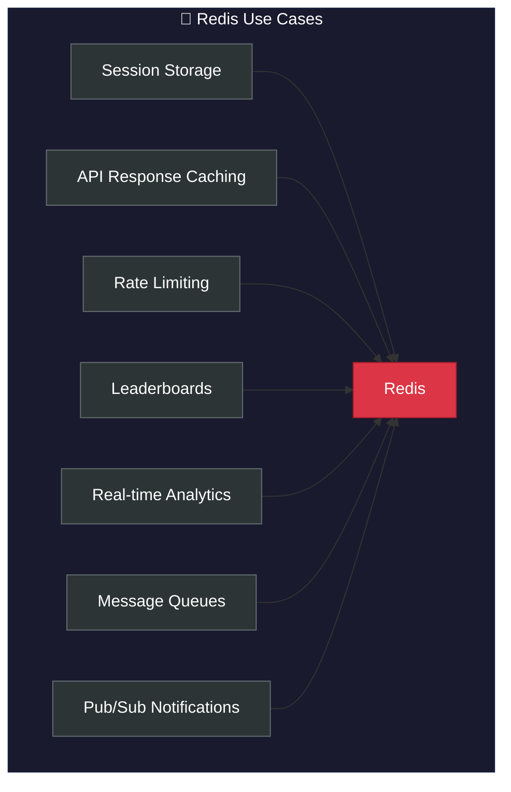
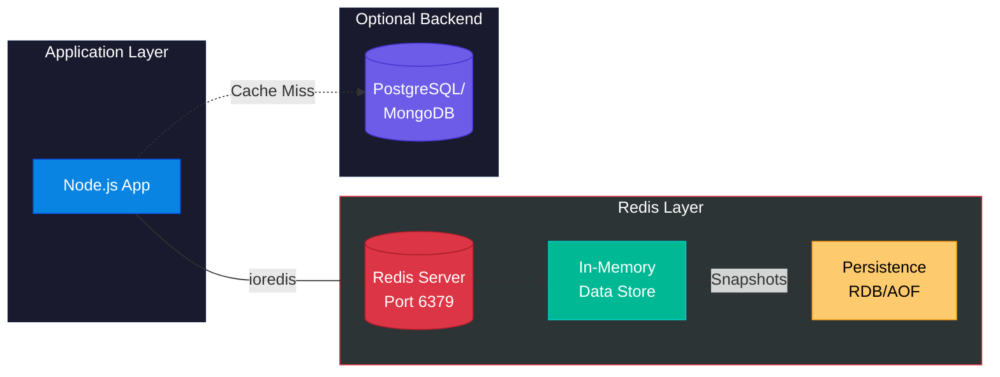
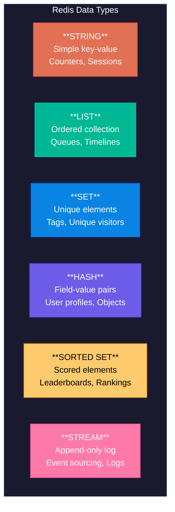
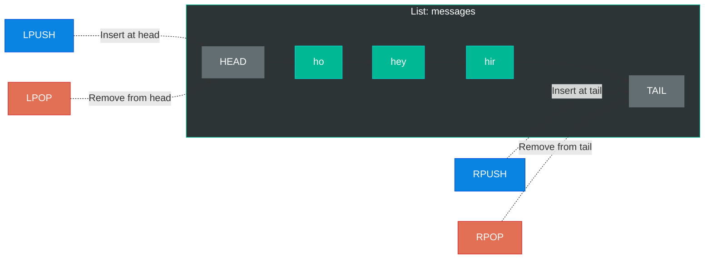
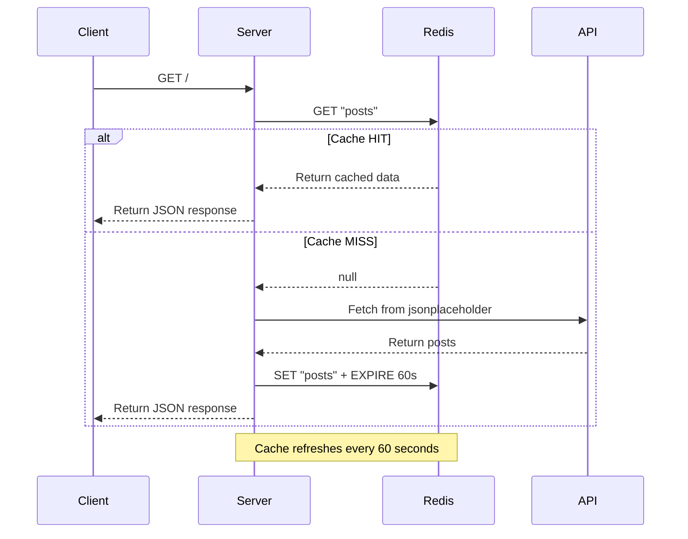
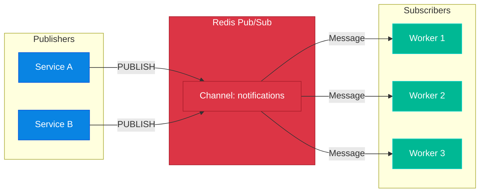
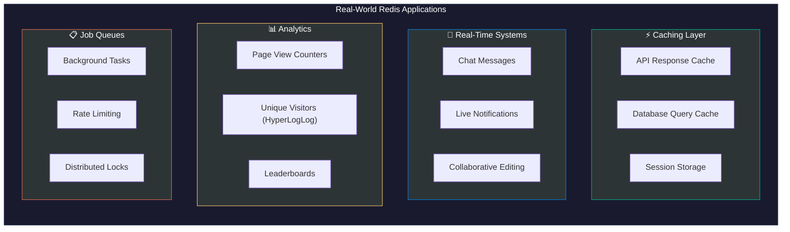

# 🚀 Redis: The Complete Revision Guide

> **Redis** (Remote Dictionary Server) is a blazing-fast, in-memory data structure store used as a **database**, **cache**, **message broker**, and **streaming engine**.

---

## 📑 Table of Contents

1. [What is Redis?](#-what-is-redis)
2. [Core Architecture](#-core-architecture)
3. [Getting Started](#-getting-started)
4. [Data Types & Commands](#-data-types--commands)
   - [Strings](#1-strings)
   - [Lists](#2-lists)
   - [Sets](#3-sets)
   - [Hashes](#4-hashes)
   - [Sorted Sets](#5-sorted-sets)
   - [Streams](#6-streams)
5. [Caching Patterns](#-caching-patterns)
6. [Code Patterns & Examples](#-code-patterns--examples)
7. [Pub/Sub Messaging](#-pubsub-messaging)
8. [Expiration & Eviction](#-expiration--eviction)
9. [Industry Use Cases](#-industry-use-cases)
10. [Key Takeaways](#-key-takeaways--cheat-sheet)

---

## 🧠 What is Redis?

Redis is an **in-memory data structure store** that provides sub-millisecond response times. Unlike traditional databases that store data on disk, Redis keeps everything in RAM, making it extremely fast.

### Why Redis?

| Feature | Benefit |
|---------|---------|
| **In-Memory Storage** | Microsecond latency reads/writes |
| **Persistence Options** | RDB snapshots + AOF logs for durability |
| **Rich Data Structures** | Strings, Lists, Sets, Hashes, Sorted Sets, Streams |
| **Atomic Operations** | Thread-safe without external locking |
| **Pub/Sub** | Real-time messaging between services |
| **Clustering** | Horizontal scaling across nodes |

### When to Use Redis



---

## 🏗 Core Architecture



### Key Architectural Concepts

1. **Single-Threaded Event Loop**: Redis uses a single thread for command processing, eliminating race conditions
2. **I/O Multiplexing**: Handles thousands of connections efficiently using `epoll`/`kqueue`
3. **Memory-First**: All data lives in RAM; persistence is asynchronous
4. **Binary-Safe Keys**: Keys can be any binary sequence (commonly strings with `:` namespacing)

---

## 🚀 Getting Started

### Running Redis with Docker

```bash
# Pull and run Redis container
docker run -d --name redis-server -p 6379:6379 redis:latest

# Connect to Redis CLI inside container
docker exec -it redis-server bash
root@container:/# redis-cli
```

### Verify Connection

```redis
127.0.0.1:6379> PING
PONG
```

> 💡 **Key Insight**: The `PING` command is the simplest health check. A `PONG` response confirms Redis is running and accepting connections.

### Node.js Client Setup

```javascript
// client.js - Redis Connection Module
const { Redis } = require("ioredis");

// Creates a new Redis client instance
// Default: connects to localhost:6379
const redis = new Redis();

module.exports = redis;
```

**Key Insight**: The `ioredis` library is the most popular Node.js Redis client. It:
- Supports all Redis commands
- Handles connection pooling automatically
- Provides Promise-based async/await API
- Auto-reconnects on connection loss

---

## 📊 Data Types & Commands

Redis supports several data types, each optimized for specific use cases.



---

### 1. Strings

The most fundamental data type. Stores text, numbers, or serialized objects.

#### Basic Operations

```redis
# SET: Store a value
127.0.0.1:6379> SET name aniket
OK

# GET: Retrieve a value
127.0.0.1:6379> GET name
"aniket"

# Namespaced keys (convention: use colons)
127.0.0.1:6379> SET user:1 aniket
OK
127.0.0.1:6379> GET user:1
"aniket"
```

#### Conditional Sets (NX - Set if Not Exists)

```redis
# First time: key doesn't exist → SET succeeds
127.0.0.1:6379> SET msg:1 "hello" NX
OK

# Second time: key exists → SET fails, returns nil
127.0.0.1:6379> SET msg:1 "hello new" NX
(nil)
```

> ⚠️ **Syntax Note**: Multi-word values MUST be quoted!
> ```redis
> SET msg:1 hello new nx    # ❌ Syntax error
> SET msg:1 "hello new" nx  # ✅ Correct
> ```

#### Atomic Counters

```redis
# Initialize counter
127.0.0.1:6379> SET count 0
OK

# Increment by 1
127.0.0.1:6379> INCR count
(integer) 1

# Increment by N
127.0.0.1:6379> INCRBY count 10
(integer) 11
```

**Key Insight**: `INCR` and `INCRBY` are **atomic operations**. Even with thousands of concurrent clients incrementing the same counter, Redis guarantees no race conditions.

#### Multiple Gets

```redis
# Retrieve multiple keys in one round-trip
127.0.0.1:6379> MGET user:1 msg:1
1) "aniket"
2) "hello"
```

**Industry Use Case**: Session tokens, feature flags, atomic counters (views, likes), distributed locks.

#### Node.js String Example

```javascript
// string.js - Working with Redis Strings
const client = require("./client");

async function init() {
    // SET: Store a namespaced key
    await client.set("name:2", "aniket");
    
    // GET: Retrieve the value
    const value = await client.get("name:2");
    
    // EXPIRE: Set TTL to 0 (immediate deletion)
    await client.expire("name:2", 0);

    console.log(value); // Output: aniket
}

init();
```

**Key Insight**:
- `expire(key, 0)` immediately deletes the key
- Always use namespaced keys (e.g., `user:1`, `session:abc123`) for organization
- Keys are automatically removed when TTL expires

---

### 2. Lists

Ordered collections of strings. Implemented as linked lists for fast insertions.



#### List Operations

```redis
# LPUSH: Add to the LEFT (head) of the list
127.0.0.1:6379> LPUSH messages hey
(integer) 1
127.0.0.1:6379> LPUSH messages ho
(integer) 2

# RPUSH: Add to the RIGHT (tail) of the list
127.0.0.1:6379> RPUSH messages hir
(integer) 3

# List is now: [ho, hey, hir]

# LPOP: Remove from LEFT
127.0.0.1:6379> LPOP messages
"ho"

# RPOP: Remove from RIGHT
127.0.0.1:6379> RPOP messages
"hir"

# LRANGE: Get range (0 to -1 = all elements)
127.0.0.1:6379> LRANGE messages 0 -1
1) "hey"
```

#### Blocking Pop (BLPOP)

```redis
# BLPOP: Block until element available or timeout
127.0.0.1:6379> BLPOP messages 10
1) "messages"
2) "hey"

# If list is empty, blocks for 10 seconds
127.0.0.1:6379> BLPOP messages 10
(nil)
(10.02s)  # ← Blocked for 10 seconds before returning nil
```

**Key Insight**: `BLPOP` is perfect for implementing **job queues**. Workers block waiting for jobs, waking up instantly when work arrives. This is more efficient than polling!

#### Node.js List Example

```javascript
// list.js - Working with Redis Lists
const client = require("./client");

async function init() {
    // LPUSH: Add elements to head
    await client.lpush("messages", "hey");
    await client.lpush("messages", "ho");
    
    // RPUSH: Add element to tail
    await client.rpush("messages", "hir");
    
    // List: [ho, hey, hir]
    
    // LPOP: Remove and return head element
    const value = await client.lpop("messages");
    console.log(value); // Output: ho
}

init();
```

**Industry Use Cases**:
- **Job Queues**: Background task processing (Sidekiq, Bull)
- **Activity Feeds**: Recent user activities
- **Message Buffers**: Temporary message storage before processing

---

### 3. Sets

Unordered collections of unique strings. No duplicates allowed.

```redis
# SADD: Add members to a set
127.0.0.1:6379> SADD ip 1
(integer) 1
127.0.0.1:6379> SADD ip 2
(integer) 1
127.0.0.1:6379> SADD ip 3
(integer) 1

# SREM: Remove a member
127.0.0.1:6379> SREM ip 3
(integer) 1

# SISMEMBER: Check if member exists
127.0.0.1:6379> SISMEMBER ip 2
(integer) 1  # ← 1 = true, 0 = false
```

**Key Insight**: Sets automatically deduplicate. Adding the same element twice has no effect. `SISMEMBER` runs in O(1) constant time!

**Industry Use Cases**:
- **Unique Visitor Tracking**: Count unique IPs per day
- **Tags**: Store unique tags for articles
- **Social Features**: Followers, following, mutual friends (set intersection)

---

### 4. Hashes

Field-value pairs within a single key. Perfect for representing objects.

```redis
# HSET: Set fields on a hash
127.0.0.1:6379> HSET user:100 name "aniket" age 25 email "aniket@example.com"
(integer) 3

# HGET: Get single field
127.0.0.1:6379> HGET user:100 name
"aniket"

# HGETALL: Get all fields
127.0.0.1:6379> HGETALL user:100
1) "name"
2) "aniket"
3) "age"
4) "25"
5) "email"
6) "aniket@example.com"
```

**Industry Use Cases**:
- **User Profiles**: Store user objects without serialization overhead
- **Configuration**: Application settings as field-value pairs
- **Shopping Carts**: Product ID → quantity mapping

---

### 5. Sorted Sets

Sets with a **score** for each member. Automatically sorted by score.

```redis
# ZADD: Add scored members
127.0.0.1:6379> ZADD leaderboard 100 "player1"
127.0.0.1:6379> ZADD leaderboard 250 "player2"
127.0.0.1:6379> ZADD leaderboard 180 "player3"

# ZRANGE: Get by rank (ascending)
127.0.0.1:6379> ZRANGE leaderboard 0 -1 WITHSCORES
1) "player1"
2) "100"
3) "player3"
4) "180"
5) "player2"
6) "250"

# ZREVRANGE: Get by rank (descending - highest first)
127.0.0.1:6379> ZREVRANGE leaderboard 0 2 WITHSCORES
1) "player2"
2) "250"
3) "player3"
4) "180"
5) "player1"
6) "100"
```

**Industry Use Cases**:
- **Leaderboards**: Gaming scores, rankings
- **Priority Queues**: Tasks with priority scores
- **Time-Series**: Score = timestamp for ordered events

---

### 6. Streams

Append-only log data structure. Perfect for event sourcing.

```redis
# XADD: Append to stream
127.0.0.1:6379> XADD events * action login user aniket
"1706824800000-0"

# XREAD: Read from streams
127.0.0.1:6379> XREAD STREAMS events 0
```

> 📘 **Note**: "Very fast moving data can be dumped in Redis streams" - ideal for high-velocity event processing, logs, and real-time analytics.

---

## 🗄 Caching Patterns

### Cache-Aside Pattern (Lazy Loading)

The most common caching strategy, demonstrated in the project's `server.js`:



#### Implementation

```javascript
// server.js - Express Server with Redis Caching
const express = require("express");
const app = express();
const axios = require("axios");
const client = require("./client");

app.get("/", async (req, res) => {
    // Step 1: Check cache first
    const cachedData = await client.get("posts");
    
    if (cachedData) {
        // Cache HIT: Return cached data immediately
        // Parse from JSON string back to object
        return res.json(JSON.parse(cachedData));
    }
    
    // Step 2: Cache MISS - Fetch from API
    const { data } = await axios.get(
        "https://jsonplaceholder.typicode.com/posts"
    );
    
    // Step 3: Store in cache
    await client.set("posts", JSON.stringify(data));
    
    // Step 4: Set expiration (TTL)
    // Option A: Separate expire command
    client.expire("posts", 60);
    
    // Option B: Set with EX flag (commented alternative)
    // await client.set("posts", JSON.stringify(data), "EX", 60);
    
    // Step 5: Return fresh data
    return res.json(data);
});

app.listen(3000, () => {
    console.log("Server started on port 3000");
});
```

### Key Insights

1. **Why `JSON.stringify` / `JSON.parse`?**
   - Redis stores strings. Objects must be serialized.
   - `set("key", object)` would store `"[object Object]"`
   
2. **TTL (Time-To-Live)**:
   - `expire("posts", 60)` = Key deleted after 60 seconds
   - Two syntax options:
     ```javascript
     // Separate command (used in code)
     await client.set("posts", data);
     client.expire("posts", 60);
     
     // Single command with EX flag
     await client.set("posts", data, "EX", 60);
     ```

3. **First Request vs Subsequent Requests**:
   - First request: ~200-500ms (API call)
   - Cached requests: ~1-5ms (Redis only)

---

## 📡 Pub/Sub Messaging

Redis provides publish/subscribe messaging for real-time communication.



```redis
# Terminal 1: Subscribe to channel
127.0.0.1:6379> SUBSCRIBE notifications
1) "subscribe"
2) "notifications"
3) (integer) 1

# Terminal 2: Publish message
127.0.0.1:6379> PUBLISH notifications "New order received!"
(integer) 1  # ← Number of subscribers who received the message
```

**Industry Use Cases**:
- Real-time notifications
- Chat applications
- Live updates (stock prices, sports scores)
- Microservice communication

---

## ⏰ Expiration & Eviction

### Setting TTL (Time-To-Live)

```redis
# Method 1: SET with EX (seconds)
SET session:abc123 "user_data" EX 3600

# Method 2: SET with PX (milliseconds)
SET session:abc123 "user_data" PX 3600000

# Method 3: EXPIRE command (set after creation)
SET session:abc123 "user_data"
EXPIRE session:abc123 3600

# Method 4: EXPIREAT (Unix timestamp)
EXPIREAT session:abc123 1706900000

# Check remaining TTL
TTL session:abc123
```

### Eviction Policies

When Redis runs out of memory, it uses eviction policies:

| Policy | Description |
|--------|-------------|
| `noeviction` | Return error on writes when memory full |
| `allkeys-lru` | Remove least recently used keys |
| `allkeys-lfu` | Remove least frequently used keys |
| `volatile-lru` | LRU among keys with TTL set |
| `volatile-ttl` | Remove keys with shortest TTL |
| `allkeys-random` | Random key eviction |

---

## 🏭 Industry Use Cases



### Common Industry Patterns

| Pattern | Implementation | Example |
|---------|---------------|---------|
| **Rate Limiting** | `INCR` + `EXPIRE` | 100 requests/minute per IP |
| **Distributed Lock** | `SET key value NX EX 10` | Prevent duplicate job processing |
| **Session Store** | `HSET` + `EXPIRE` | User session with 24h TTL |
| **Leaderboard** | Sorted Sets | Top 100 players by score |
| **Recent Items** | `LPUSH` + `LTRIM` | Show last 10 notifications |

---

## 🎯 Key Takeaways & Cheat Sheet

### Essential Commands

```redis
# Strings
SET key value             # Store value
GET key                   # Retrieve value
SET key value NX          # Set if not exists
SET key value EX 60       # Set with 60s expiry
INCR key                  # Atomic increment
MGET key1 key2            # Get multiple keys

# Lists
LPUSH list value          # Add to head
RPUSH list value          # Add to tail
LPOP list                 # Remove from head
RPOP list                 # Remove from tail
BLPOP list timeout        # Blocking pop
LRANGE list 0 -1          # Get all elements

# Sets
SADD set member           # Add member
SREM set member           # Remove member
SISMEMBER set member      # Check membership

# Hashes
HSET key field value      # Set field
HGET key field            # Get field
HGETALL key               # Get all fields

# Expiration
EXPIRE key seconds        # Set TTL
TTL key                   # Check remaining TTL

# Pub/Sub
SUBSCRIBE channel         # Subscribe to channel
PUBLISH channel message   # Publish message
```

### Memory Aids

| Mnemonic | Meaning |
|----------|---------|
| **L**PUSH | **L**eft (head) push |
| **R**PUSH | **R**ight (tail) push |
| **B**LPOP | **B**locking left pop |
| **S**ADD | **S**et add |
| **Z**ADD | Sorted set (Z for ordered) |
| **H**SET | **H**ash set |
| **NX** | **N**ot e**X**ists |
| **EX** | **EX**pire (seconds) |

### Quick Reference: Node.js with ioredis

```javascript
const { Redis } = require("ioredis");
const client = new Redis();  // localhost:6379

// All commands return Promises
await client.set("key", "value");
await client.set("key", "value", "EX", 60);  // with TTL
const value = await client.get("key");
await client.expire("key", 60);
await client.del("key");

// Lists
await client.lpush("list", "item");
const item = await client.lpop("list");

// Close connection
client.quit();
```

### Project Structure

```
101-redis/
├── client.js      # Redis connection singleton
├── server.js      # Express + Cache-aside pattern
├── string.js      # String operations example
├── list.js        # List operations example
└── package.json   # Dependencies: ioredis, express, axios
```

---

## 📚 Further Learning

- [Redis Official Documentation](https://redis.io/documentation)
- [ioredis GitHub](https://github.com/luin/ioredis)
- [Redis University](https://university.redis.com/)

---

> **Last Updated**: February 2026
