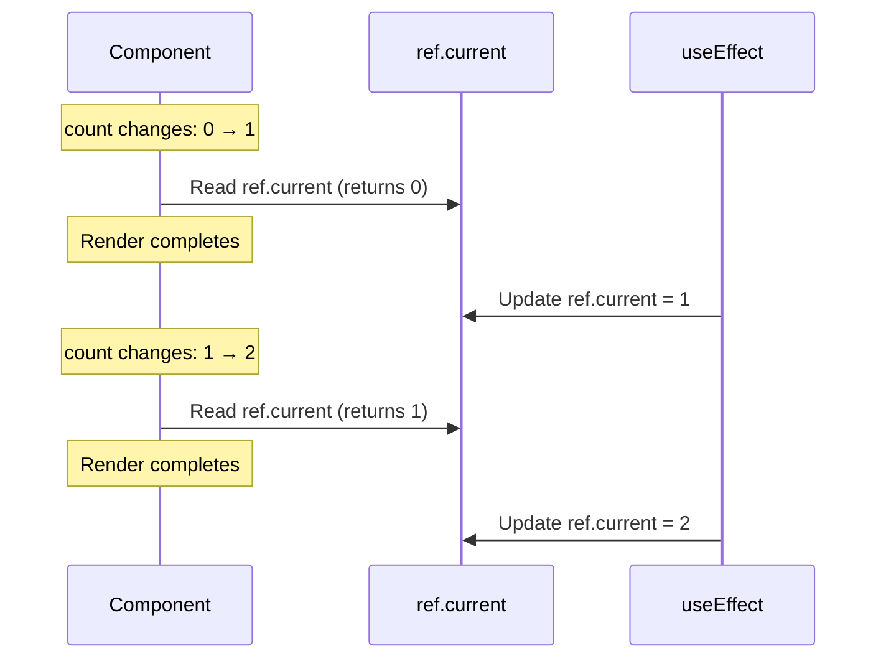
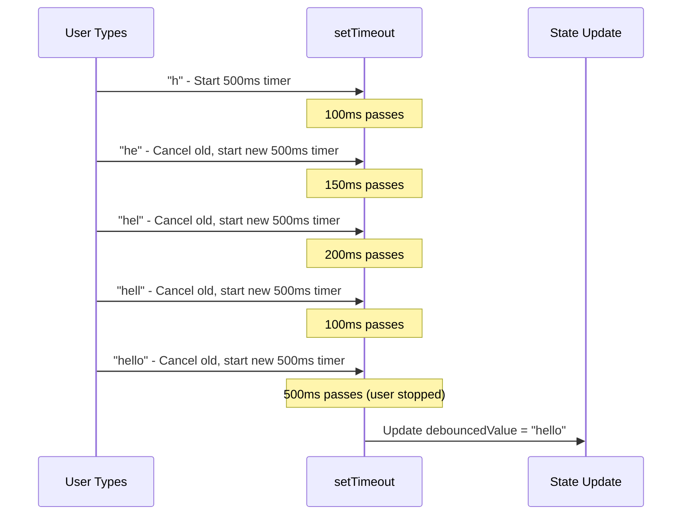
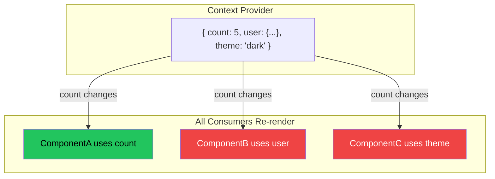
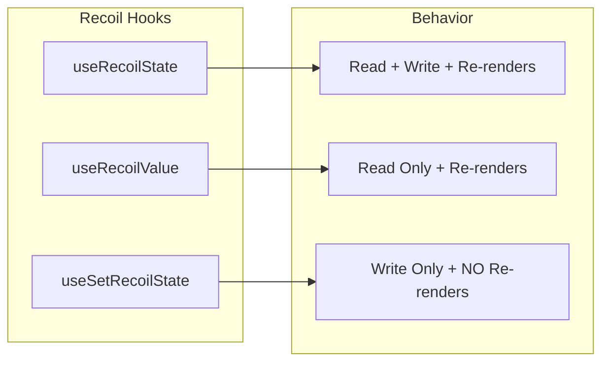
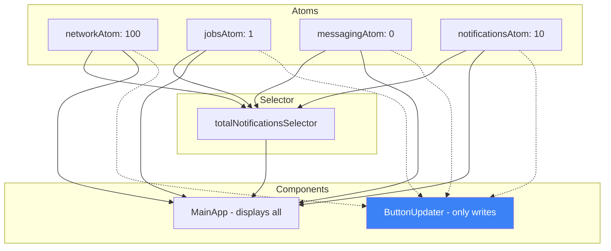
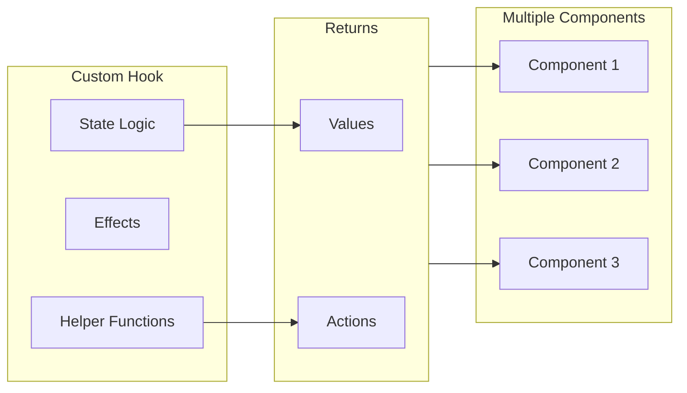
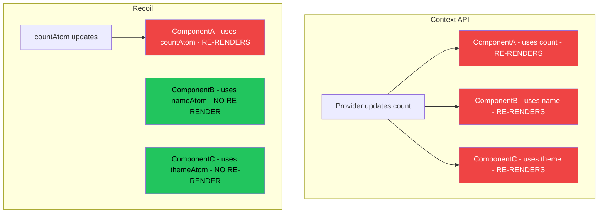
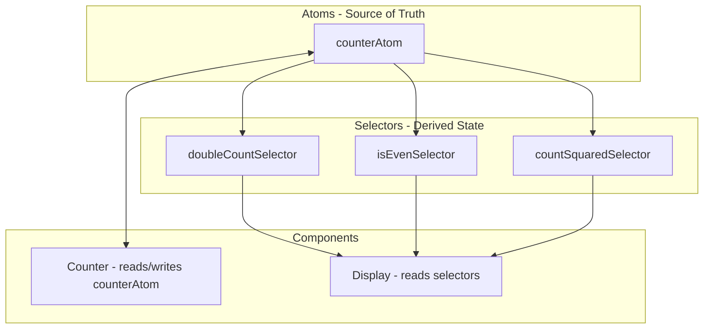

# Week 11: Custom Hooks & Recoil State Management

> A comprehensive guide to building custom React hooks and mastering Recoil for scalable state management.

---

## Table of Contents

1. [Introduction](#introduction)
2. [Part 1: Custom Hooks](#part-1-custom-hooks)
   - [What Are Custom Hooks?](#what-are-custom-hooks)
   - [The Rules of Hooks](#the-rules-of-hooks)
   - [Pattern 1: useCounter](#pattern-1-usecounter---encapsulating-state--actions)
   - [Pattern 2: usePrev](#pattern-2-useprev---tracking-previous-values)
   - [Pattern 3: useDebounce](#pattern-3-usedebounce---optimizing-user-input)
   - [Pattern 4: usePostTitle](#pattern-4-useposttitle---data-fetching-abstraction)
3. [Part 2: State Management Evolution](#part-2-state-management-evolution)
   - [The Problem with Props Drilling](#the-problem-with-props-drilling)
   - [Context API: The First Solution](#context-api-the-first-solution)
   - [Why Context API Falls Short](#why-context-api-falls-short)
4. [Part 3: Recoil - Modern State Management](#part-3-recoil---modern-state-management)
   - [What is Recoil?](#what-is-recoil)
   - [Core Concepts](#core-concepts)
   - [Atoms: Units of State](#atoms-units-of-state)
   - [Selectors: Derived State](#selectors-derived-state)
   - [Recoil Hooks](#recoil-hooks)
   - [Real-World Example: Notification Badges](#real-world-example-notification-badges)
5. [Part 4: Performance Optimization with memo()](#part-4-performance-optimization-with-memo)
6. [Visual Diagrams](#visual-diagrams)
7. [Quick Reference Cheat Sheet](#quick-reference-cheat-sheet)
8. [Key Takeaways](#key-takeaways)

---

## Introduction

This week covers two critical React concepts:

1. **Custom Hooks** - Extracting and reusing stateful logic across components
2. **Recoil** - A modern, atomic state management library that solves Context API's re-render problems

By the end of this guide, you'll understand:
- How to create custom hooks for any reusable logic
- Why Context API causes performance issues
- How Recoil's atomic model provides fine-grained reactivity
- When to use each state management approach

---

## Part 1: Custom Hooks

### What Are Custom Hooks?

Custom hooks are JavaScript functions that:
- **Start with the word `use`** (this is a naming convention React uses to identify hooks)
- **Can call other hooks** (useState, useEffect, useRef, etc.)
- **Extract reusable stateful logic** from components

Think of custom hooks as a way to create your own building blocks, just like `useState` and `useEffect` are building blocks provided by React.

#### The Core React Hooks Recap

Before diving into custom hooks, let's remember what the core hooks do:

| Hook | Purpose | Triggers Re-render? |
|------|---------|---------------------|
| `useState` | Store a variable and re-render when it changes | Yes |
| `useEffect` | Run side effects after dependency changes | No (but can trigger state changes) |
| `useRef` | Store a value that persists across re-renders | No |

### The Rules of Hooks

1. **Only call hooks at the top level** - Never inside loops, conditions, or nested functions
2. **Only call hooks from React functions** - Either from function components or custom hooks
3. **Custom hooks must start with `use`** - This tells React it's a hook and should follow hook rules

---

### Pattern 1: useCounter - Encapsulating State + Actions

The simplest custom hook pattern: wrapping state and its related actions together.

```jsx
function useCounter() {
    const [count, setCount] = useState(0);
    
    const increment = () => {
        setCount(count + 1);
    }
    
    return [count, increment];
}

// Usage in component
function Counter() {
    const [count, increment] = useCounter();
    
    return (
        <div>
            <h1>Counter: {count}</h1>
            <button onClick={increment}>Increment</button>
        </div>
    );
}
```

#### Key Insight

This pattern **encapsulates the "how"** (implementation) and exposes the **"what"** (interface). The component doesn't need to know about `setCount` - it just gets `count` and `increment`. This is the **Single Responsibility Principle** in action.

#### When to Use This Pattern
- When multiple components need the same state logic
- When you want to hide implementation details
- When state and actions are logically coupled

---

### Pattern 2: usePrev - Tracking Previous Values

This hook tracks the previous value of any variable - useful for comparisons and animations.

```jsx
function usePrev(value) {
    // useRef creates a mutable object that persists across re-renders
    // Unlike useState, changing ref.current does NOT trigger a re-render
    const ref = useRef();

    // useEffect runs AFTER the render is committed to the screen
    // So during the current render, ref.current still holds the OLD value
    // After render completes, we update ref.current to the NEW value
    useEffect(() => {
        ref.current = value;
    });

    // Return the previous value (which is still in ref.current during this render)
    return ref.current;
}

// Usage
function Counter() {
    const [count, increment] = useCounter();
    const prevCount = usePrev(count);

    return (
        <div>
            <h1>Counter: {count}</h1>
            <p>Previous count was: {prevCount !== undefined ? prevCount : 'N/A'}</p>
            <button onClick={increment}>Increment</button>
        </div>
    );
}
```

#### Key Insight

The magic here is **timing**. The execution order is:

1. Component renders with new `count` value
2. `usePrev` is called, returns `ref.current` (still the OLD value)
3. React commits the render to the DOM
4. `useEffect` runs, updating `ref.current` to the NEW value
5. Next render cycle begins...

This leverages the fact that **useEffect runs after render**, not during it.



---

### Pattern 3: useDebounce - Optimizing User Input

Debouncing delays executing an action until the user stops performing it for a specified time. Essential for search inputs, auto-save, and API rate limiting.

```jsx
function useDebounce(value, delay) {
    const [debouncedValue, setDebouncedValue] = useState(value);

    useEffect(() => {
        // Set up a timer to update the debounced value after the delay
        const handler = setTimeout(() => {
            setDebouncedValue(value);
        }, delay);

        // Cleanup function: clear the timeout if value changes before delay expires
        // This ensures only the last value (after user stops typing) gets set
        return () => {
            clearTimeout(handler);
        };
    }, [value, delay]);

    return debouncedValue;
}
```

#### Usage Example: Search Input

```jsx
function SearchWithDebounce() {
    const [searchTerm, setSearchTerm] = useState('');
    const debouncedSearchTerm = useDebounce(searchTerm, 500);

    // This effect runs only when debouncedSearchTerm changes
    // Not on every keystroke, but only after user stops typing for 500ms
    useEffect(() => {
        if (debouncedSearchTerm) {
            console.log('Searching for:', debouncedSearchTerm);
            // fetch(`/api/search?q=${debouncedSearchTerm}`)
        }
    }, [debouncedSearchTerm]);

    return (
        <div>
            <input
                type="text"
                value={searchTerm}
                onChange={(e) => setSearchTerm(e.target.value)}
                placeholder="Type to search..."
            />
            <p>Current input: {searchTerm}</p>
            <p>Debounced value (used for search): {debouncedSearchTerm}</p>
        </div>
    );
}
```

#### Key Insight

The **cleanup function** is the hero here. Every time `value` changes:
1. The cleanup function from the previous effect runs, clearing the old timeout
2. A new timeout is set with the latest value
3. Only when the user stops typing for `delay` ms does the timeout complete

This creates a "sliding window" effect where only the final value matters.



---

### Pattern 4: usePostTitle - Data Fetching Abstraction

A custom hook that handles data fetching with loading state.

```jsx
function usePostTitle(url) {
    const [posts, setPosts] = useState([]);
    const [loading, setLoading] = useState(false);

    async function fetchPosts() {
        setLoading(true);
        const response = await fetch(url);
        const data = await response.json();
        setPosts(data);
        setLoading(false);
    }

    useEffect(() => {
        fetchPosts();
    }, [url]); // Refetch whenever URL changes

    return [posts, loading];
}

// Usage
function Post() {
    const [currentUrl, setCurrentUrl] = useState('https://jsonplaceholder.typicode.com/posts');
    const [posts, loading] = usePostTitle(currentUrl);

    return (
        <div>
            <h1>Posts</h1>
            <div>
                <button onClick={() => setCurrentUrl('.../posts')}>Posts</button>
                <button onClick={() => setCurrentUrl('.../users')}>Users</button>
                <button onClick={() => setCurrentUrl('.../comments')}>Comments</button>
            </div>
            {loading ? <div>Loading...</div> : null}
            {posts.map(post => (
                <div key={post.id}>
                    <h2>{post.title || post.name || post.email}</h2>
                </div>
            ))}
        </div>
    );
}
```

#### Key Insight

This hook **abstracts away the complexity** of data fetching. The component doesn't need to:
- Manage loading state manually
- Handle the fetch/async logic
- Remember to refetch when URL changes

The dependency array `[url]` ensures automatic refetching when the URL changes.

---

## Part 2: State Management Evolution

### The Problem with Props Drilling

As applications grow, passing state through multiple component layers becomes painful:

```
App
├── Header (needs user)
│   └── UserMenu (needs user)
│       └── Avatar (needs user)
└── Main
    └── Sidebar (needs user)
        └── UserCard (needs user)
```

Every component in the chain must accept and pass the prop, even if it doesn't use it.

### Context API: The First Solution

Context API was React's answer to props drilling:

```jsx
const CountContext = createContext();

function CountProvider({ children }) {
    const [count, setCount] = useState(0);
    return (
        <CountContext.Provider value={{ count, setCount }}>
            {children}
        </CountContext.Provider>
    );
}

function Counter() {
    const { count, setCount } = useContext(CountContext);
    return (
        <div>
            <p>Count: {count}</p>
            <button onClick={() => setCount(count + 1)}>Increment</button>
        </div>
    );
}

function App() {
    return (
        <CountProvider>
            <Counter />
        </CountProvider>
    );
}
```

### Why Context API Falls Short

**The Problem: Unnecessary Re-renders**

When ANY value in the context changes, ALL consumers re-render - even if they don't use that specific value.



Even though only `count` changed, ComponentB and ComponentC (which only use `user` and `theme`) also re-render!

---

## Part 3: Recoil - Modern State Management

### What is Recoil?

Recoil is a state management library by Facebook that provides:
- **Atomic state** - Break state into small, independent pieces
- **Minimal re-renders** - Only components using changed atoms re-render
- **Hooks-based API** - Familiar React patterns
- **Derived state** - Computed values with selectors

### Installation

```bash
npm install recoil
```

### Core Concepts

| Concept | Description | Analogy |
|---------|-------------|---------|
| **Atom** | A unit of state | Like a single `useState` but global |
| **Selector** | Derived/computed state | Like `useMemo` but global |
| **RecoilRoot** | Provider component | Like Context.Provider |

### Atoms: Units of State

Atoms are the fundamental building blocks of Recoil state.

```jsx
import { atom, RecoilRoot, useRecoilState, useRecoilValue, useSetRecoilState } from 'recoil';

// Define atoms OUTSIDE of components (they're global)
const counterState = atom({
    key: 'counter',    // Unique identifier (must be unique across all atoms)
    default: 0         // Initial value
});
```

#### Key Insight: Atom Keys Must Be Unique

Every atom needs a unique `key` string. This is how Recoil tracks and identifies atoms internally. Duplicate keys will cause bugs!

### Recoil Hooks

Recoil provides three hooks for different use cases:

```jsx
// 1. useRecoilState - Read AND Write (like useState)
// Component RE-RENDERS when atom changes
function Counter() {
    const [count, setCount] = useRecoilState(counterState);
    return <button onClick={() => setCount(count + 1)}>{count}</button>;
}

// 2. useRecoilValue - Read-only
// Component RE-RENDERS when atom changes
function Display() {
    const count = useRecoilValue(counterState);
    return <p>Count: {count}</p>;
}

// 3. useSetRecoilState - Write-only
// Component does NOT re-render when atom changes!
function IncrementButton() {
    const setCount = useSetRecoilState(counterState);
    return <button onClick={() => setCount(c => c + 1)}>+1</button>;
}
```

#### Key Insight: useSetRecoilState for Performance

If a component only needs to UPDATE state but not display it, use `useSetRecoilState`. This prevents unnecessary re-renders!



### Selectors: Derived State

Selectors compute derived values based on atoms or other selectors.

```jsx
const counterState = atom({
    key: 'counter',
    default: 0
});

// Selector for doubled value
const doubleCountState = selector({
    key: 'doubleCount',
    get: ({ get }) => {
        const count = get(counterState);  // Subscribe to counterState
        return count * 2;
    }
});

// Selector for even/odd check
const isEvenState = selector({
    key: 'isEven',
    get: ({ get }) => {
        const count = get(counterState);
        return count % 2 === 0;
    }
});

// Usage
function DerivedValues() {
    const doubleCount = useRecoilValue(doubleCountState);
    const isEven = useRecoilValue(isEvenState);

    return (
        <div>
            <p>Double Count: {doubleCount}</p>
            <p>Is Even: {isEven ? 'Yes' : 'No'}</p>
        </div>
    );
}
```

#### Key Insight: Automatic Dependency Tracking

When you call `get(someAtom)` inside a selector, Recoil automatically:
1. Subscribes the selector to that atom
2. Re-computes the selector when the atom changes
3. Only triggers re-renders in components using the selector

---

### Real-World Example: Notification Badges

A LinkedIn-style navigation with notification counts demonstrates multi-atom patterns:

#### Step 1: Define Atoms (Separate File for Organization)

```jsx
// atoms.js
import { atom } from 'recoil';

export const networkAtom = atom({
    key: 'network',
    default: 100
});

export const jobsAtom = atom({
    key: 'jobs',
    default: 1
});

export const notificationsAtom = atom({
    key: 'notifications',
    default: 10
});

export const messagingAtom = atom({
    key: 'messaging',
    default: 0
});
```

#### Step 2: Create Selector for Total

```jsx
import { selector } from 'recoil';
import { networkAtom, jobsAtom, messagingAtom, notificationsAtom } from './atoms';

const totalNotificationsSelector = selector({
    key: 'totalNotifications',
    get: ({ get }) => {
        const network = get(networkAtom);
        const jobs = get(jobsAtom);
        const messaging = get(messagingAtom);
        const notifications = get(notificationsAtom);
        return network + jobs + messaging + notifications;
    }
});
```

#### Step 3: Build the UI

```jsx
function App() {
    return (
        <RecoilRoot>
            <MainApp />
        </RecoilRoot>
    );
}

function MainApp() {
    const network = useRecoilValue(networkAtom);
    const jobs = useRecoilValue(jobsAtom);
    const messaging = useRecoilValue(messagingAtom);
    const notifications = useRecoilValue(notificationsAtom);
    const totalNotifications = useRecoilValue(totalNotificationsSelector);

    return (
        <>
            <button>Home</button>
            <button>My network ({network > 100 ? "99+" : network})</button>
            <button>Jobs ({jobs})</button>
            <button>Messaging ({messaging})</button>
            <button>Notifications ({notifications})</button>
            <button>Total: {totalNotifications}</button>
            <ButtonUpdater />
        </>
    );
}

// This component uses useSetRecoilState - it won't re-render when atoms change!
function ButtonUpdater() {
    const setNetwork = useSetRecoilState(networkAtom);
    const setJobs = useSetRecoilState(jobsAtom);
    const setMessaging = useSetRecoilState(messagingAtom);
    const setNotifications = useSetRecoilState(notificationsAtom);

    return (
        <div>
            <button onClick={() => setNetwork(n => n + 1)}>+ Network</button>
            <button onClick={() => setJobs(j => j + 1)}>+ Jobs</button>
            <button onClick={() => setMessaging(m => m + 1)}>+ Messaging</button>
            <button onClick={() => setNotifications(n => n + 1)}>+ Notifications</button>
        </div>
    );
}
```



---

## Part 4: Performance Optimization with memo()

When a parent component re-renders, all its children re-render too - even if their props haven't changed. `React.memo()` prevents this.

```jsx
import { memo } from 'react';

function App() {
    const [count, setCount] = useState(0);

    return (
        <div>
            <h1>Parent Count: {count}</h1>
            <button onClick={() => setCount(count + 1)}>Increment Parent</button>
            <ChildWithoutMemo />
            <ChildWithMemo />
        </div>
    );
}

// This child re-renders EVERY time parent re-renders
function ChildWithoutMemo() {
    console.log('ChildWithoutMemo rendered');
    return <p>I re-render on every parent update</p>;
}

// This child only re-renders if its props change
const ChildWithMemo = memo(function ChildWithMemo() {
    console.log('ChildWithMemo rendered');
    return <p>I only re-render if my props change</p>;
});
```

#### Key Insight

`memo()` is a Higher-Order Component (HOC) that:
1. Compares previous and next props (shallow comparison)
2. Skips re-render if props are the same
3. Only works for props - internal state changes still trigger re-renders

**When to use memo():**
- Child components that render often due to parent updates
- Components with expensive render logic
- Components that receive the same props frequently

**When NOT to use memo():**
- Components that almost always receive new props
- Very simple/cheap components (memo overhead not worth it)
- Components that need to re-render with parent

---

## Visual Diagrams

### Custom Hook Mental Model



### Context API vs Recoil Re-rendering



### Atom-Selector Dependency Graph



---

## Quick Reference Cheat Sheet

### Custom Hooks

| Hook Pattern | Use Case | Key Technique |
|--------------|----------|---------------|
| `useCounter` | Encapsulate state + actions | Return `[value, action]` tuple |
| `usePrev` | Track previous values | `useRef` + `useEffect` timing |
| `useDebounce` | Delay value updates | Cleanup function + `setTimeout` |
| `usePostTitle` | Data fetching | `useEffect` with dependency array |

### Recoil API

| API | Type | Re-renders? | Use When |
|-----|------|-------------|----------|
| `atom()` | State container | N/A | Define a piece of state |
| `selector()` | Derived state | N/A | Compute values from atoms |
| `useRecoilState()` | Hook | Yes | Need to read AND write |
| `useRecoilValue()` | Hook | Yes | Only need to read |
| `useSetRecoilState()` | Hook | **No** | Only need to write |
| `RecoilRoot` | Component | N/A | Wrap app root |

### State Management Comparison

| Feature | Context API | Redux | Recoil |
|---------|-------------|-------|--------|
| Boilerplate | Low | High | Low |
| Re-render efficiency | Poor | Good | Excellent |
| Learning curve | Easy | Steep | Easy |
| Derived state | Manual | Selectors | Selectors |
| Async support | Manual | Middleware | Built-in |
| React integration | Native | External | Native-like |

---

## Key Takeaways

### Custom Hooks

1. **Name custom hooks with `use` prefix** - React uses this to enforce hook rules
2. **Extract when logic is reused** - DRY principle for stateful logic
3. **Return what consumers need** - Hide implementation, expose interface
4. **Leverage timing** - `useEffect` runs after render, `useRef` persists without re-renders

### Recoil

1. **Atoms are the source of truth** - Keep them small and focused
2. **Selectors for derived state** - Never store computed values in atoms
3. **Choose the right hook:**
   - `useRecoilState` when you need read + write
   - `useRecoilValue` for read-only
   - `useSetRecoilState` when you only write (performance optimization!)
4. **Unique keys are mandatory** - Every atom and selector needs a unique key
5. **Organize atoms in separate files** - Better maintainability for large apps

### Performance

1. **Context API re-renders all consumers** - Fine for small apps, problematic at scale
2. **Recoil provides granular subscriptions** - Only affected components re-render
3. **Use `memo()` for expensive children** - Prevents unnecessary re-renders from parent
4. **`useSetRecoilState` never triggers re-renders** - Perfect for "fire and forget" updates

### When to Use What

| Scenario | Recommended Approach |
|----------|---------------------|
| Simple app, few state shares | Context API |
| Medium app, performance matters | Recoil |
| Large app, complex state | Recoil or Redux |
| Reusable stateful logic | Custom Hooks |
| Derived/computed values | Selectors (Recoil) |
| Optimizing child re-renders | `memo()` |

---

> **Pro Tip:** Start with the simplest solution (local state → Context → Recoil). Don't over-engineer state management for small apps, but don't hesitate to reach for Recoil when Context API becomes a performance bottleneck.

