# 📘 Tailwind CSS v4: Complete Revision Guide

> **A comprehensive guide to Tailwind CSS v4's CSS-first approach, covering setup, theming, layers, responsive design, OTP verification patterns, and real-world component patterns.**

---

## 📑 Table of Contents

1. [Introduction: The CSS-First Revolution](#1-introduction-the-css-first-revolution)
2. [Setup: v3 vs v4 Comparison](#2-setup-v3-vs-v4-comparison)
3. [The Three Layers: Base, Components, Utilities](#3-the-three-layers-base-components-utilities)
4. [The @theme Directive](#4-the-theme-directive)
5. [Common Customization Patterns](#5-common-customization-patterns)
6. [Responsive Design Patterns](#6-responsive-design-patterns)
7. [Component Patterns: Conditional Styling](#7-component-patterns-conditional-styling)
8. [OTP Verification: Complete Deep Dive](#8-otp-verification-complete-deep-dive)
9. [Email & Age Verification Patterns](#9-email--age-verification-patterns)
10. [App State Management Flow](#10-app-state-management-flow)
11. [Pro Tips & Best Practices](#11-pro-tips--best-practices)
12. [Quick Reference](#12-quick-reference)
13. [Summary & Key Takeaways](#13-summary--key-takeaways)

---

## 1. Introduction: The CSS-First Revolution

Tailwind v4 represents a **paradigm shift** from JavaScript-based configuration to **CSS-native** configuration. Instead of managing a `tailwind.config.js` file, all customization now happens directly in your CSS using special directives:

### Why This Matters

| Concept | v3 Approach | v4 Approach |
|---------|-------------|-------------|
| Configuration | `tailwind.config.js` | `index.css` with `@theme` |
| Customization | JavaScript objects | CSS variables |
| Import | Three separate directives | Single `@import` |

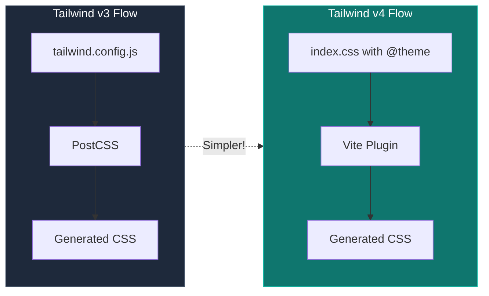

**Key Insight:** The CSS-first approach reduces cognitive overhead. You no longer need to context-switch between JavaScript and CSS — everything lives in one place.

---

## 2. Setup: v3 vs v4 Comparison

### Tailwind v3 Setup (The Old Way)

Setting up Tailwind v3 required multiple steps and config files:

```bash
# Step 1: Create Vite + React Project
npm create vite@latest my-app -- --template react
cd my-app

# Step 2: Install Tailwind and its Dependencies
npm install -D tailwindcss postcss autoprefixer

# Step 3: Initialize Tailwind Config
npx tailwindcss init -p
```

This creates **TWO** config files:
- `tailwind.config.js` — Tailwind configuration
- `postcss.config.js` — PostCSS configuration

```javascript
// tailwind.config.js (v3)
/** @type {import('tailwindcss').Config} */
export default {
  content: ["./index.html", "./src/**/*.{js,ts,jsx,tsx}"],
  theme: {
    extend: {},
  },
  plugins: [],
};
```

```css
/* src/index.css (v3) - Three separate directives */
@tailwind base;
@tailwind components;
@tailwind utilities;
```

### Tailwind v4 Setup (The New Way) ✨

Tailwind v4 is **MUCH simpler** — no config files needed!

```bash
# Step 1: Create Vite + React Project
npm create vite@latest my-app -- --template react
cd my-app

# Step 2: Install Tailwind v4 (Single Package!)
npm install tailwindcss @tailwindcss/vite
```

That's it! No `postcss`, no `autoprefixer` needed separately.

```javascript
// vite.config.js - Just add the plugin
import { defineConfig } from 'vite'
import tailwindcss from '@tailwindcss/vite'
import react from '@vitejs/plugin-react'

export default defineConfig({
  plugins: [react(), tailwindcss()],
})
```

```css
/* src/index.css (v4) - Just ONE line! */
@import "tailwindcss";
```

### Setup Comparison Visual

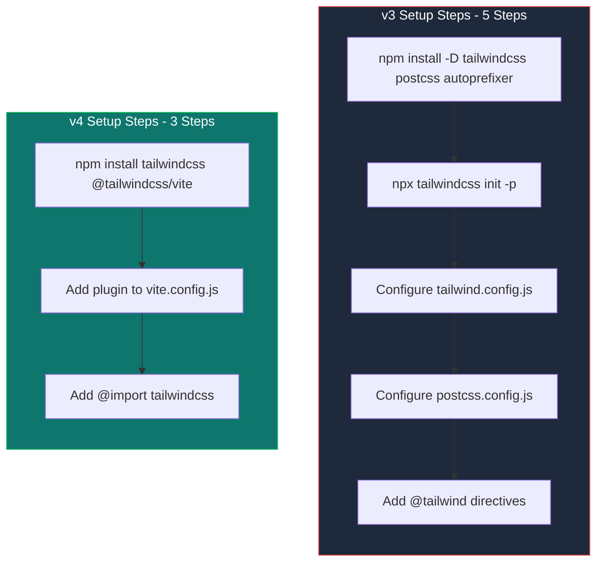

### Quick Comparison Table

| Step | Tailwind v3 | Tailwind v4 |
|------|-------------|-------------|
| **Install** | `npm i -D tailwindcss postcss autoprefixer` | `npm i tailwindcss @tailwindcss/vite` |
| **Config Files** | `tailwind.config.js` + `postcss.config.js` | None needed! |
| **Initialize** | `npx tailwindcss init -p` | Not needed |
| **CSS Import** | `@tailwind base; @tailwind components; @tailwind utilities;` | `@import "tailwindcss";` |
| **Customization Location** | JavaScript file | CSS with `@theme` |

---

## 3. The Three Layers: Base, Components, Utilities

Tailwind organizes CSS into three **cascade layers** with strict specificity:

```
utilities > components > base
```

Styles in the `utilities` layer will **always** override styles in the `components` layer, which in turn override the `base` layer.

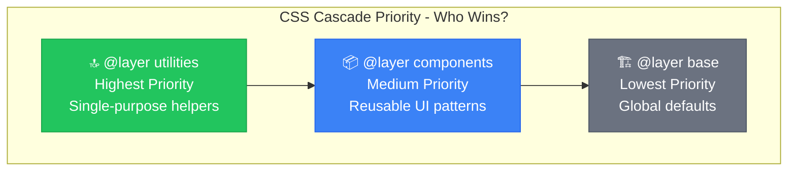

### 3.1 `@layer base` — The Foundation

**Purpose:** Global resets and raw HTML element defaults. If you want every `<h1>` to be bold by default or set a specific background color on the `<body>`, it goes here.

```css
@layer base {
  body {
    @apply bg-slate-50 text-slate-900;
  }
  
  h1 {
    @apply text-3xl font-bold;
  }
  
  a {
    @apply text-blue-500 hover:underline;
  }
}
```

**Key Insight:** Styles in `base` can be overridden by any component or utility class. Use this for site-wide defaults you want as a starting point.

### 3.2 `@layer components` — Reusable UI Patterns

**Purpose:** Bundle repeated utility combinations into semantic class names. When you have a complex set of utilities that you find yourself repeating everywhere, you bundle them into a component class.

```css
@layer components {
  .btn {
    @apply px-4 py-2 rounded font-medium transition-colors;
  }
  
  .btn-primary {
    @apply btn bg-blue-500 text-white hover:bg-blue-600;
  }
  
  .card {
    @apply p-6 bg-white rounded-lg shadow-md;
  }
  
  .image-gallery {
    @apply w-80 rounded border-2 transition-all;
  }
}
```

**Key Insight:** Component classes are still *overridable* by utility classes. This lets you create a `.card` component but still tweak it inline:

```html
<!-- The utility p-8 overrides the p-6 from .card because utilities > components -->
<div class="card p-8">Custom padding card</div>

<!-- The border-red-500 utility wins over .image-gallery's border -->

```

### 3.3 `@layer utilities` — Custom Helpers

**Purpose:** Single-purpose utilities Tailwind doesn't provide by default.

```css
@layer utilities {
  .text-neon {
    text-shadow: 0 0 5px #fff, 0 0 10px #fff, 0 0 20px #ff00de;
  }
  
  .clip-diagonal {
    clip-path: polygon(0 0, 100% 0, 100% 90%, 0% 100%);
  }
  
  .scrollbar-hide {
    -ms-overflow-style: none;
    scrollbar-width: none;
  }
  
  .scrollbar-hide::-webkit-scrollbar {
    display: none;
  }
}
```

**Key Insight:** Utilities have the highest specificity, so they always win. They also automatically work with Tailwind's variant system (`hover:`, `md:`, etc.).

---

## 4. The @theme Directive

The `@theme` directive defines **design tokens** (variables) that Tailwind uses to **auto-generate utility classes**.

### @theme vs @layer — Understanding the Difference

| Directive | Purpose | What It Does |
|-----------|---------|--------------|
| `@theme` | Define **values** (tokens) | Auto-generates utility classes from tokens |
| `@layer` | Write **CSS rules** | Custom styles using those tokens |

### Real Example from This Project

```css
/* src/index.css */
@import "tailwindcss";

@theme {
  /* Your custom colors - auto-generates bg-blue-200, text-blue-200, etc. */
  --color-blue-200: #8094ad;
  --color-blue-500: #19406a;
  --color-blue-700: #002b5b;
  --color-green-400: #36c6c0;

  /* Brand colors - auto-generates bg-primary, text-primary-dark, etc. */
  --color-primary: #19406a;
  --color-primary-dark: #002b5b;
}
```

**Now these work automatically:**
```jsx
<div className="bg-primary-dark">Uses #002b5b</div>
<div className="text-green-400">Uses #36c6c0</div>
<div className="bg-blue-500">Uses #19406a</div>
```

### Token Naming Convention

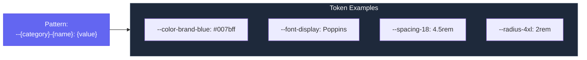

| What You Want | CSS Variable Pattern | Generated Classes |
|---------------|---------------------|-------------------|
| Colors | `--color-{name}` | `bg-{name}`, `text-{name}`, `border-{name}` |
| Fonts | `--font-{name}` | `font-{name}` |
| Spacing | `--spacing-{size}` | `p-{size}`, `m-{size}`, `w-{size}`, `h-{size}` |
| Border Radius | `--radius-{size}` | `rounded-{size}` |
| Shadows | `--shadow-{name}` | `shadow-{name}` |
| Animations | `--animate-{name}` | `animate-{name}` |
| Breakpoints | `--breakpoint-{name}` | `{name}:` prefix |

---

## 5. Common Customization Patterns

### 5.1 Custom Colors with Shades

**v3 Way (tailwind.config.js):**
```javascript
module.exports = {
  theme: {
    extend: {
      colors: {
        blue: {
          200: "#8094ad",
          500: "#19406a",
          700: "#002b5b",
        },
        green: {
          400: "#36c6c0",
        },
      },
    },
  },
};
```

**v4 Way (index.css):**
```css
@theme {
  --color-blue-200: #8094ad;
  --color-blue-500: #19406a;
  --color-blue-700: #002b5b;
  --color-green-400: #36c6c0;
}
```

### 5.2 Custom Fonts

**v3 Way:**
```javascript
fontFamily: {
  sans: ["Inter", "system-ui", "sans-serif"],
  display: ["Poppins", "Georgia", "serif"],
}
```

**v4 Way:**
```css
@theme {
  --font-sans: "Inter", system-ui, sans-serif;
  --font-display: "Poppins", Georgia, serif;
}
```

### 5.3 Custom Animations

```css
@theme {
  --animate-wiggle: wiggle 1s ease-in-out infinite;
  --animate-fade-in: fadeIn 0.5s ease-out;
}

/* Keyframes are still regular CSS */
@keyframes wiggle {
  0%, 100% { transform: rotate(-3deg); }
  50% { transform: rotate(3deg); }
}

@keyframes fadeIn {
  from { opacity: 0; transform: translateY(-10px); }
  to { opacity: 1; transform: translateY(0); }
}
```

**Usage:**
```jsx
<div className="animate-wiggle">I'm wiggling!</div>
<div className="animate-fade-in">I fade in!</div>
```

### 5.4 Custom Spacing, Radius, and Shadows

```css
@theme {
  /* Spacing - generates p-18, m-18, w-18, etc. */
  --spacing-18: 4.5rem;
  --spacing-88: 22rem;
  --spacing-128: 32rem;
  
  /* Border Radius - generates rounded-4xl */
  --radius-4xl: 2rem;
  --radius-5xl: 2.5rem;
  
  /* Shadows - generates shadow-glow */
  --shadow-glow: 0 0 20px rgba(54, 198, 192, 0.5);
  --shadow-inner-lg: inset 0 4px 6px rgba(0, 0, 0, 0.1);
}
```

### 5.5 Custom Breakpoints

```css
@theme {
  --breakpoint-xs: 475px;
  --breakpoint-3xl: 1920px;
}
```

**Usage:**
```jsx
<div className="hidden xs:block 3xl:text-4xl">Responsive content</div>
```

---

## 6. Responsive Design Patterns

Tailwind uses a **mobile-first** approach. Breakpoint prefixes apply styles *at that size and above*.

### Breakpoint Reference

| Prefix | Min Width | Description |
|--------|-----------|-------------|
| (none) | 0px | Mobile default |
| `sm:` | 640px | Small devices |
| `md:` | 768px | Tablets |
| `lg:` | 1024px | Laptops |
| `xl:` | 1280px | Desktops |
| `2xl:` | 1536px | Large screens |

### Pattern 1: Responsive Flexbox Layout

```jsx
{/* Mobile: column, Tablet+: row with increasing gaps */}
<div className='flex flex-col md:flex-row gap-2 md:gap-4 lg:gap-6'>
  <div>Item 1</div>
  <div>Item 2</div>
  <div>Item 3</div>
</div>
```

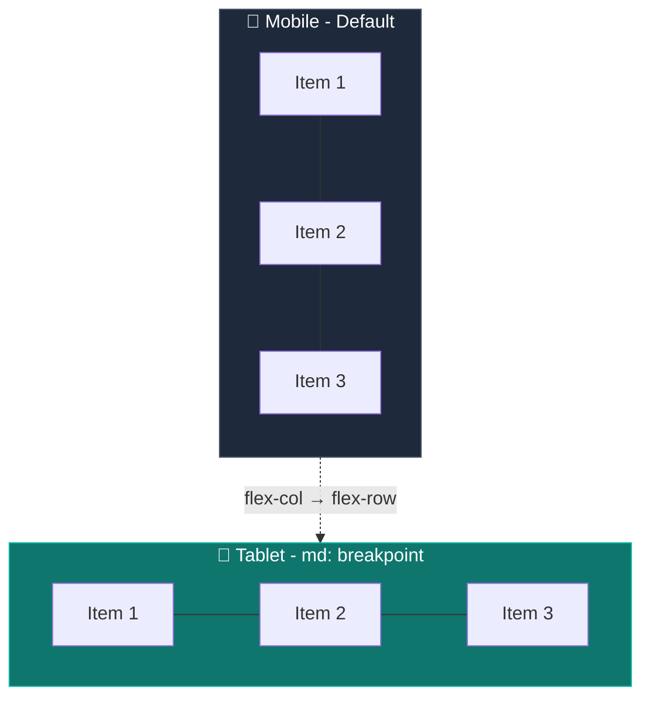

**Key Insight:** `flex-col md:flex-row` means stack vertically by default, switch to horizontal at 768px+.

### Pattern 2: Responsive Grid Layout

```jsx
{/* 1 col → 2 cols → 3 cols → 4 cols as screen grows */}
<div className='grid grid-cols-1 sm:grid-cols-2 md:grid-cols-3 lg:grid-cols-4 gap-2'>
  <div className='col-span-1 sm:col-span-2'>Spans 2 cols on sm+</div>
  <div>Item 2</div>
  <div>Item 3</div>
</div>
```

**Key Insight:** Use `col-span-*` with responsive prefixes to create items that span multiple columns at certain breakpoints.

### Pattern 3: Responsive Typography & Spacing

```jsx
{/* Text grows larger on bigger screens */}
<p className='text-sm md:text-base lg:text-lg xl:text-xl'>
  Responsive text
</p>

{/* Padding increases with screen size */}
<div className='p-2 md:p-4 lg:p-6'>
  Responsive padding
</div>
```

### Pattern 4: Visibility Controls

```jsx
{/* Hidden on mobile, visible from md (tablet) onwards */}
<p className='hidden md:block'>
  Only visible on tablet and larger
</p>

{/* Visible on mobile/tablet, hidden from lg (desktop) onwards */}
<p className='block lg:hidden'>
  Only visible on mobile and tablet
</p>
```

**Visual Decision Tree:**

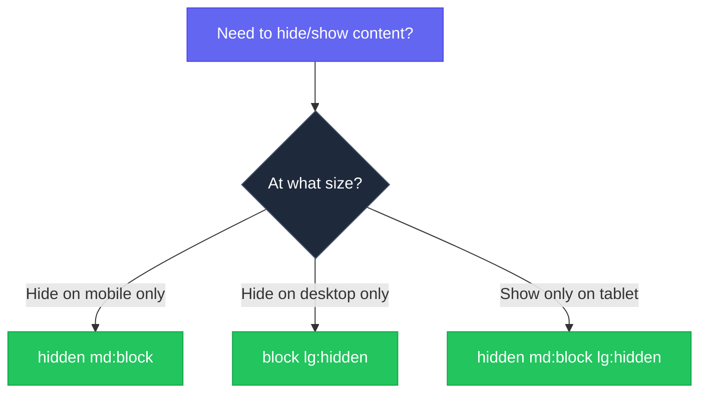

---

## 7. Component Patterns: Conditional Styling

### Pattern 1: Basic Conditional with Template Literals

The fundamental pattern for state-based UI using template literals and ternary operators.

```jsx
export default function Button({ disabled, children, onClick }) {
  return (
    <button
      className={`inline-block text-white cursor-pointer px-8 py-2 m-2 rounded-md ${
        disabled ? "bg-blue-200" : "bg-green-400"
      }`}
      disabled={disabled}
      onClick={onClick}
    >
      {children}
    </button>
  )
}
```

**Key Insight:** Use template literals with ternary operators to apply different classes based on props/state.

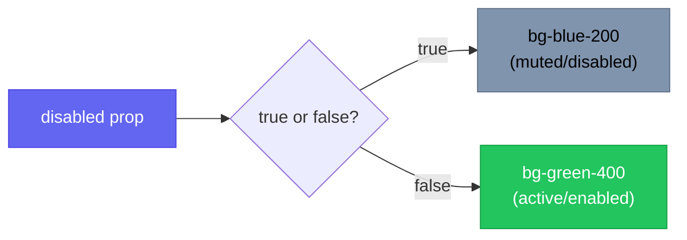

### Pattern 2: Complex Multi-State Button

For buttons that need multiple states with hover effects:

```jsx
<button
  disabled={!isFilled}
  className={`w-full py-4 rounded-lg font-medium text-white transition-all cursor-pointer ${
    isFilled 
      ? 'bg-green-400 hover:bg-green-500' 
      : 'bg-[#6b7a99] cursor-not-allowed'
  }`}
>
  Continue
</button>
```

**Key Insights:**
1. **Common classes stay outside the ternary**: `w-full py-4 rounded-lg font-medium text-white transition-all cursor-pointer`
2. **Variable classes go inside the ternary**: The background color and hover state
3. **Use `cursor-not-allowed`** paired with `disabled` attribute for proper UX
4. **Arbitrary values with brackets**: `bg-[#6b7a99]` for one-off hex colors

### Pattern 3: Arbitrary Values with Brackets

When you need one-off values not in Tailwind's default scale:

```jsx
{/* Custom hex color */}
<div className="bg-[#2a3a5a]">Custom background</div>

{/* Custom height */}
<div className="h-[20rem]">Specific height</div>

{/* Custom color for disabled state */}
<button className="bg-[#6b7a99]">Disabled look</button>
```

**Key Insight:** Square brackets `[]` let you use any CSS value as a one-off utility. Use sparingly — prefer `@theme` tokens for reusable values.

---

## 8. OTP Verification: Complete Deep Dive

This is the **most complex and important pattern** in this project. Let's break down every aspect of building a production-ready OTP input component.

### The Challenge

Creating 6 separate input boxes for OTP digits with:
- Auto-focus to next box on input
- Backspace navigation to previous box
- Validation (only digits allowed)
- Visual feedback when all digits are filled

### The Strategy: Array of Refs

Instead of creating 6 individual refs (`ref1`, `ref2`, etc.), we use an **array of refs**. This is cleaner and scales to any number of OTP digits.

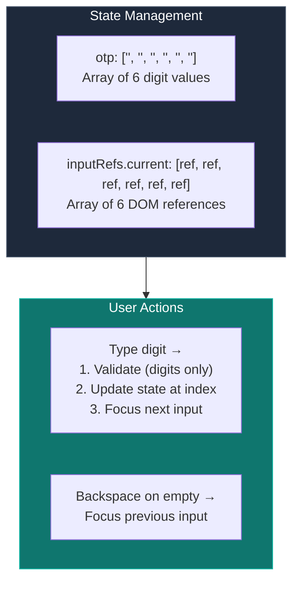

### Complete OTP Component Code

```jsx
import { useState, useRef, useEffect } from 'react';

export default function OTPVerification({ email, onResend }) {
    // ========================================================================
    // STATE: Single array to store all 6 OTP digits
    // ========================================================================
    const [otp, setOtp] = useState(['', '', '', '', '', '']);
    const [timer, setTimer] = useState(572);

    // ========================================================================
    // REFS: Array of refs - one for each input box
    // 
    // We use useRef([]) and populate it once. Each inputRefs.current[i] 
    // will hold the reference to the i-th input element.
    // ========================================================================
    const inputRefs = useRef([]);

    // Check if all 6 digits are filled
    const isFilled = otp.every(digit => digit !== '');

    // Auto-focus first input on mount
    useEffect(() => {
        inputRefs.current[0]?.focus();
    }, []);

    // Countdown timer
    useEffect(() => {
        if (timer > 0) {
            const interval = setInterval(() => setTimer(prev => prev - 1), 1000);
            return () => clearInterval(interval);
        }
    }, [timer]);

    // Format timer as MM:SS
    const formatTime = (seconds) => {
        const mins = Math.floor(seconds / 60);
        const secs = seconds % 60;
        return `${mins.toString().padStart(2, '0')}:${secs.toString().padStart(2, '0')}`;
    };

    // ========================================================================
    // handleChange: Called when user types in any box
    // 
    // 1. Validate input (only digits)
    // 2. Update the otp array at this index
    // 3. If digit entered & not last box → focus next box
    // ========================================================================
    const handleChange = (index, value) => {
        // Only allow single digit - if user pastes multiple, take the last one
        if (value.length > 1) value = value.slice(-1);

        // Only allow numbers - reject non-digit input
        if (value && !/^\d$/.test(value)) return;

        // Update otp array immutably
        const newOtp = [...otp];
        newOtp[index] = value;
        setOtp(newOtp);

        // Auto-focus next input if digit entered and not last box
        if (value && index < 5) {
            inputRefs.current[index + 1]?.focus();
        }
    };

    // ========================================================================
    // handleKeyDown: Handle Backspace navigation
    // 
    // If Backspace pressed on empty box → focus previous box
    // ========================================================================
    const handleKeyDown = (index, e) => {
        if (e.key === 'Backspace' && !otp[index] && index > 0) {
            inputRefs.current[index - 1]?.focus();
        }
    };

    const handleResend = () => {
        if (timer === 0 && onResend) {
            onResend();
            setTimer(572);
        }
    };

    return (
        <div className="flex justify-center gap-2">
            {otp.map((digit, index) => (
                <input
                    key={index}
                    ref={(el) => (inputRefs.current[index] = el)}  // Store ref in array
                    type="text"
                    inputMode="numeric"
                    maxLength={1}
                    value={digit}
                    onChange={(e) => handleChange(index, e.target.value)}
                    onKeyDown={(e) => handleKeyDown(index, e)}
                    className="w-12 h-14 bg-[#2a3a5a] text-white text-center text-xl 
                               font-bold rounded-lg outline-none focus:ring-2 
                               focus:ring-cyan-400 transition-all"
                />
            ))}
        </div>
    );
}
```

### Key Concepts Breakdown

#### 1. Array State for OTP Digits

```jsx
const [otp, setOtp] = useState(['', '', '', '', '', '']);
```

**Why an array?**
- Each index corresponds to one input box
- Easy to update a specific index: `newOtp[index] = value`
- Easy to check if all filled: `otp.every(digit => digit !== '')`

#### 2. Array of Refs

```jsx
const inputRefs = useRef([]);
```

**The callback ref pattern:**
```jsx
ref={(el) => (inputRefs.current[index] = el)}
```

This is crucial! When React renders each input:
1. It calls this function with the DOM element (`el`)
2. We store that element at the correct index in our refs array
3. Now `inputRefs.current[0]` points to the first input, `inputRefs.current[1]` to the second, etc.

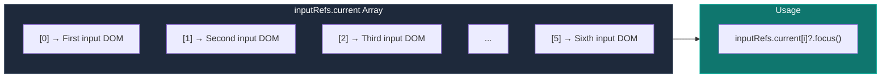

#### 3. handleChange Logic Flow

```jsx
const handleChange = (index, value) => {
    // Step 1: Handle multi-character input (paste scenario)
    if (value.length > 1) value = value.slice(-1);

    // Step 2: Validate - only digits allowed
    if (value && !/^\d$/.test(value)) return;

    // Step 3: Update state immutably
    const newOtp = [...otp];       // Create copy
    newOtp[index] = value;          // Update specific index
    setOtp(newOtp);                 // Set new state

    // Step 4: Auto-focus next input
    if (value && index < 5) {
        inputRefs.current[index + 1]?.focus();
    }
};
```

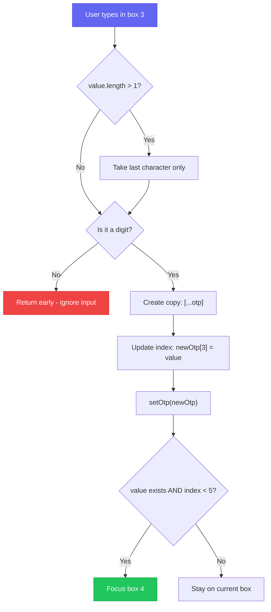

#### 4. Backspace Navigation Logic

```jsx
const handleKeyDown = (index, e) => {
    // Three conditions must ALL be true:
    // 1. Key pressed is Backspace
    // 2. Current box is empty (!otp[index])
    // 3. We're not on the first box (index > 0)
    if (e.key === 'Backspace' && !otp[index] && index > 0) {
        inputRefs.current[index - 1]?.focus();
    }
};
```

**Why check if box is empty?**
- If box has a digit, normal backspace should delete it
- Only when box is empty should we jump to previous box

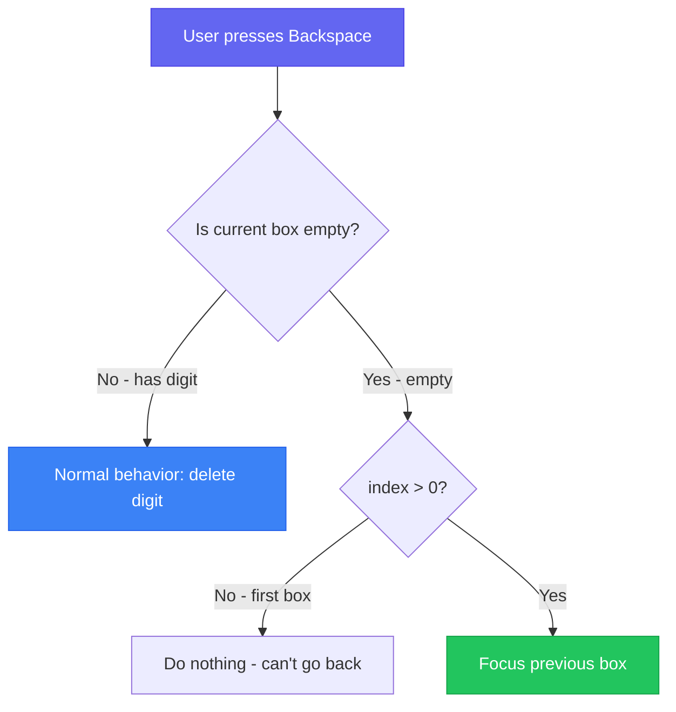

#### 5. Input Attributes Deep Dive

```jsx
<input
    type="text"           // Not "number" - gives more control
    inputMode="numeric"   // Shows numeric keyboard on mobile
    maxLength={1}         // Browser-level single character limit
    value={digit}         // Controlled input
    // ... handlers
/>
```

**Why `type="text"` instead of `type="number"`?**
- `type="number"` shows spinner controls
- `type="number"` has inconsistent behavior across browsers
- `type="text"` + `inputMode="numeric"` = best of both worlds

#### 6. Styling Pattern

```jsx
className="w-12 h-14 bg-[#2a3a5a] text-white text-center text-xl 
           font-bold rounded-lg outline-none focus:ring-2 
           focus:ring-cyan-400 transition-all"
```

| Class | Purpose |
|-------|---------|
| `w-12 h-14` | Fixed dimensions for square-ish box |
| `bg-[#2a3a5a]` | Custom dark background (arbitrary value) |
| `text-center` | Center the digit in the box |
| `text-xl font-bold` | Large, readable digit |
| `rounded-lg` | Rounded corners |
| `outline-none` | Remove default focus outline |
| `focus:ring-2 focus:ring-cyan-400` | Custom focus indicator |
| `transition-all` | Smooth state changes |

#### 7. Timer Logic

```jsx
const [timer, setTimer] = useState(572); // 9 minutes 32 seconds

useEffect(() => {
    if (timer > 0) {
        const interval = setInterval(() => setTimer(prev => prev - 1), 1000);
        return () => clearInterval(interval);  // Cleanup on unmount
    }
}, [timer]);

const formatTime = (seconds) => {
    const mins = Math.floor(seconds / 60);
    const secs = seconds % 60;
    return `${mins.toString().padStart(2, '0')}:${secs.toString().padStart(2, '0')}`;
};
```

**Key Insights:**
- `padStart(2, '0')` ensures "5" becomes "05"
- Cleanup function prevents memory leaks
- Timer stops at 0 (no negative values)

---

## 9. Email & Age Verification Patterns

### Email Verification Component

A simpler form that demonstrates the same conditional styling pattern:

```jsx
import { useState } from 'react';

export default function EmailVerification({ onContinue }) {
    const [email, setEmail] = useState('');

    // Simple validation - any non-empty input is "filled"
    const isFilled = email.trim().length > 0;

    const handleContinue = () => {
        if (isFilled && onContinue) {
            onContinue(email);
        }
    };

    return (
        <div className="min-h-screen bg-primary-dark flex flex-col items-center justify-center px-4">
            {/* Input with focus ring */}
            <input
                type="email"
                placeholder="Your Email Address"
                value={email}
                onChange={(e) => setEmail(e.target.value)}
                className="w-full px-4 py-4 bg-[#2a3a5a] text-white placeholder-gray-500 
                           rounded-lg mb-4 outline-none focus:ring-2 focus:ring-cyan-400 
                           transition-all"
            />

            {/* Button - changes color when input is filled */}
            <button
                disabled={!isFilled}
                onClick={handleContinue}
                className={`w-full py-4 rounded-lg font-medium text-white transition-all 
                           cursor-pointer ${
                    isFilled 
                        ? 'bg-green-400 hover:bg-green-500' 
                        : 'bg-[#6b7a99] cursor-not-allowed'
                }`}
            >
                Continue
            </button>
        </div>
    );
}
```

**Key Patterns:**
1. **Controlled input**: `value={email}` + `onChange`
2. **Simple validation**: `email.trim().length > 0`
3. **Conditional button styling**: Same pattern as before
4. **Callback prop**: `onContinue(email)` passes data to parent

### Age Verification Component

Nearly identical pattern, just different field:

```jsx
export default function AgeVerification() {
    const [birthYear, setBirthYear] = useState('');
    const isFilled = birthYear.trim().length > 0;

    return (
        <div className="min-h-screen bg-primary-dark flex flex-col items-center justify-center px-4">
            <input
                type="text"
                placeholder="Your Birth Year"
                value={birthYear}
                onChange={(e) => setBirthYear(e.target.value)}
                className="w-full px-4 py-4 bg-[#2a3a5a] text-white placeholder-gray-500 
                           rounded-lg mb-4 outline-none focus:ring-2 focus:ring-cyan-400 
                           transition-all"
            />

            <button
                disabled={!isFilled}
                className={`w-full py-4 rounded-lg font-medium text-white transition-all 
                           cursor-pointer ${
                    isFilled 
                        ? 'bg-green-400 hover:bg-green-500' 
                        : 'bg-[#6b7a99] cursor-not-allowed'
                }`}
            >
                Continue
            </button>
        </div>
    );
}
```

**Reusable Pattern:** Notice how both components share the same:
- Layout structure (`min-h-screen`, centering)
- Input styling
- Button conditional pattern

This could be refactored into a shared component, but for learning purposes, seeing the pattern repeated is valuable.

---

## 10. App State Management Flow

The main App component orchestrates the flow between screens:

```jsx
import { useState } from 'react'
import EmailVerification from './components/EmailVerification'
import OTPVerification from './components/OTPVerification'

function App() {
  // Screen state: 'email' or 'otp'
  const [screen, setScreen] = useState('email');
  // Store email to pass to OTP component
  const [email, setEmail] = useState('');

  const handleEmailContinue = (emailValue) => {
    setEmail(emailValue);      // Save email
    setScreen('otp');          // Switch to OTP screen
  };

  const handleResend = () => {
    console.log('Resending OTP to:', email);
  };

  return (
    <>
      {screen === 'email' && (
        <EmailVerification onContinue={handleEmailContinue} />
      )}
      {screen === 'otp' && (
        <OTPVerification email={email} onResend={handleResend} />
      )}
    </>
  );
}
```

### Flow Diagram

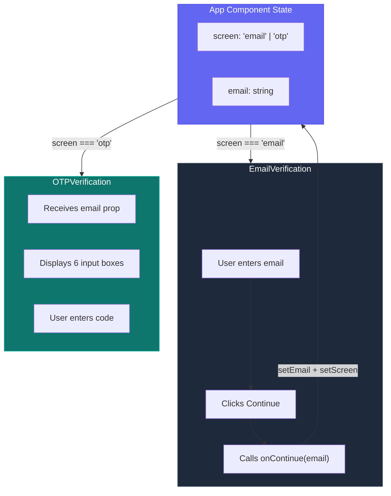

**Key Pattern: Lifting State Up**
- The App component owns the `screen` and `email` state
- Child components receive data via props
- Child components send data back via callback props
- This is React's unidirectional data flow in action

---

## 11. Pro Tips & Best Practices

### Tip 1: Use @layer for Variant Support

When you define classes in `@layer components` or `@layer utilities`, Tailwind's variants automatically work:

```html
<div class="hover:btn-primary md:btn-primary">Variants work!</div>
```

### Tip 2: Override Component Classes with Utilities

Because `utilities > components` in specificity:

```html
<div class="card p-8">
  <!-- utility p-8 overrides .card's p-6 -->
</div>
```

### Tip 3: Reference Theme Tokens Anywhere

Use `var()` to reference your tokens in custom CSS:

```css
@layer components {
  .image-gallery {
    @apply w-80 rounded border-2 transition-all;
    border-color: var(--color-brand-blue);
  }
}
```

### Tip 4: Specificity Order to Remember

```
base    → Lowest  (gets overridden easily)
components → Medium  (can be overridden by utilities)
utilities  → Highest (wins in conflicts)
```

### Tip 5: Complete Design System Structure

```css
@import "tailwindcss";

/* 1. TOKENS FIRST */
@theme {
  --color-primary: #19406a;
  --color-primary-dark: #002b5b;
  --font-display: "Poppins", sans-serif;
  --shadow-glow: 0 0 20px rgba(54, 198, 192, 0.5);
  --animate-fade-in: fadeIn 0.5s ease-out;
}

@keyframes fadeIn {
  from { opacity: 0; }
  to { opacity: 1; }
}

/* 2. BASE DEFAULTS */
@layer base {
  body { @apply font-sans bg-slate-50; }
  h1, h2, h3 { @apply font-display; }
}

/* 3. COMPONENT CLASSES */
@layer components {
  .btn { @apply px-4 py-2 rounded-lg font-medium transition-all; }
  .btn-primary { @apply btn bg-primary text-white shadow-glow; }
  .card { @apply p-6 bg-white rounded-lg shadow-lg animate-fade-in; }
}

/* 4. CUSTOM UTILITIES */
@layer utilities {
  .text-neon { text-shadow: 0 0 10px #ff00de; }
  .scrollbar-hide { scrollbar-width: none; }
}
```

---

## 12. Quick Reference

### CSS Structure Template

```css
@import "tailwindcss";

@theme {
  /* Design tokens go here - auto-generates utility classes */
}

@layer base {
  /* Global HTML element styles */
}

@layer components {
  /* Reusable component classes */
}

@layer utilities {
  /* Custom utility classes */
}
```

### v3 to v4 Migration Cheatsheet

| v3 Config Key | v4 CSS Variable |
|---------------|-----------------|
| `colors.blue.500` | `--color-blue-500` |
| `fontFamily.sans` | `--font-sans` |
| `spacing.18` | `--spacing-18` |
| `borderRadius.4xl` | `--radius-4xl` |
| `boxShadow.glow` | `--shadow-glow` |
| `animation.wiggle` | `--animate-wiggle` |
| `screens.xs` | `--breakpoint-xs` |

### Responsive Breakpoints

| Prefix | Min-Width | Target |
|--------|-----------|--------|
| (none) | 0px | Mobile |
| `sm:` | 640px | Small tablets |
| `md:` | 768px | Tablets |
| `lg:` | 1024px | Laptops |
| `xl:` | 1280px | Desktops |
| `2xl:` | 1536px | Large screens |

### OTP Pattern Quick Reference

```jsx
// 1. Array state for digits
const [otp, setOtp] = useState(['', '', '', '', '', '']);

// 2. Array of refs
const inputRefs = useRef([]);

// 3. Callback ref pattern
ref={(el) => (inputRefs.current[index] = el)}

// 4. Auto-focus next
if (value && index < 5) inputRefs.current[index + 1]?.focus();

// 5. Backspace to previous
if (e.key === 'Backspace' && !otp[index] && index > 0)
    inputRefs.current[index - 1]?.focus();
```

---

## 13. Summary & Key Takeaways

### 🎯 Core Tailwind v4 Concepts

1. **CSS-First Configuration:** v4 replaces `tailwind.config.js` with CSS-native `@theme` directive
2. **Three Layers:** `base` < `components` < `utilities` (by specificity)
3. **@theme for Tokens:** Define colors, fonts, spacing → auto-generates utility classes
4. **@layer for Rules:** Write actual CSS using those tokens

### 🔧 Setup Simplified

```bash
# v4 is just 2 commands!
npm install tailwindcss @tailwindcss/vite
# Configure vite.config.js + add @import "tailwindcss" to CSS
```

### 📱 Responsive Design

- Mobile-first: Base styles for mobile, add prefixes for larger screens
- Common patterns: `flex-col md:flex-row`, `hidden md:block`, `grid-cols-1 sm:grid-cols-2`

### 🎮 OTP Pattern (Most Important!)

| Concept | Implementation |
|---------|----------------|
| Store digits | `useState(['', '', '', '', '', ''])` |
| Store refs | `useRef([])` + callback ref |
| Type → Next | `inputRefs.current[index + 1]?.focus()` |
| Backspace → Previous | Check empty + `inputRefs.current[index - 1]?.focus()` |
| Validate | `!/^\d$/.test(value)` for digits only |

### 💡 Key Patterns

| Pattern | Usage |
|---------|-------|
| Conditional Classes | `${condition ? 'class-a' : 'class-b'}` |
| Arbitrary Values | `bg-[#2a3a5a]`, `h-[20rem]` |
| Theme Variables | `var(--color-brand-blue)` |
| Array of Refs | `ref={(el) => (refs.current[i] = el)}` |
| Immutable State Update | `const newArr = [...arr]; newArr[i] = val; setState(newArr)` |

### ⚡ Remember

> **Utilities always win.** You can define a component, but utility classes applied in HTML will override it. This is by design!

---

*Happy styling with Tailwind v4!* 🎨
