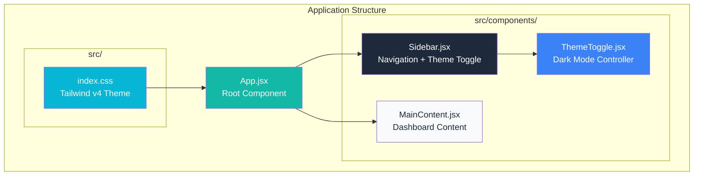
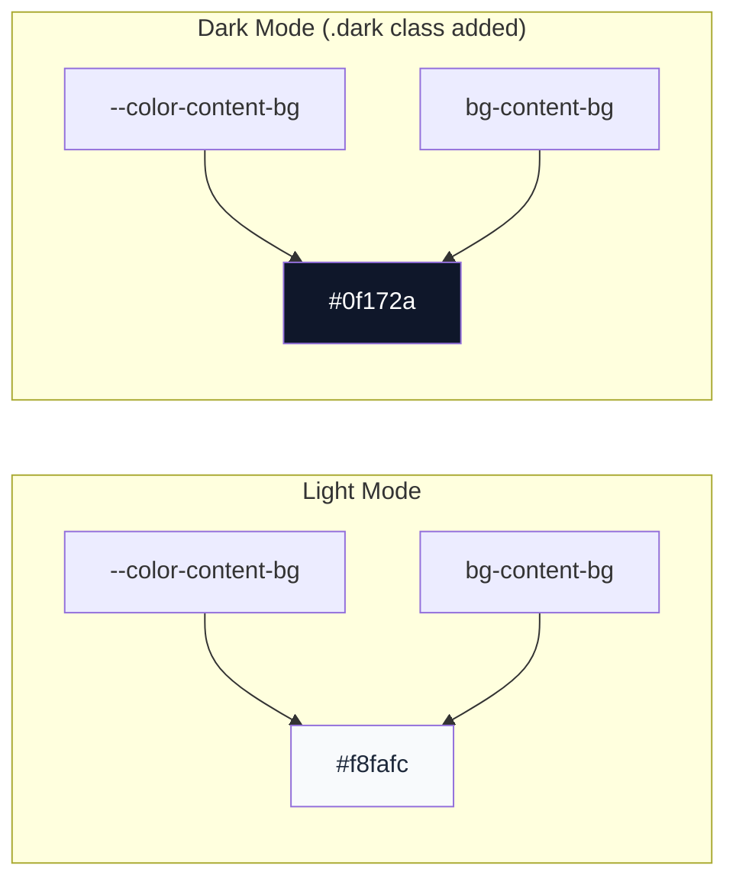
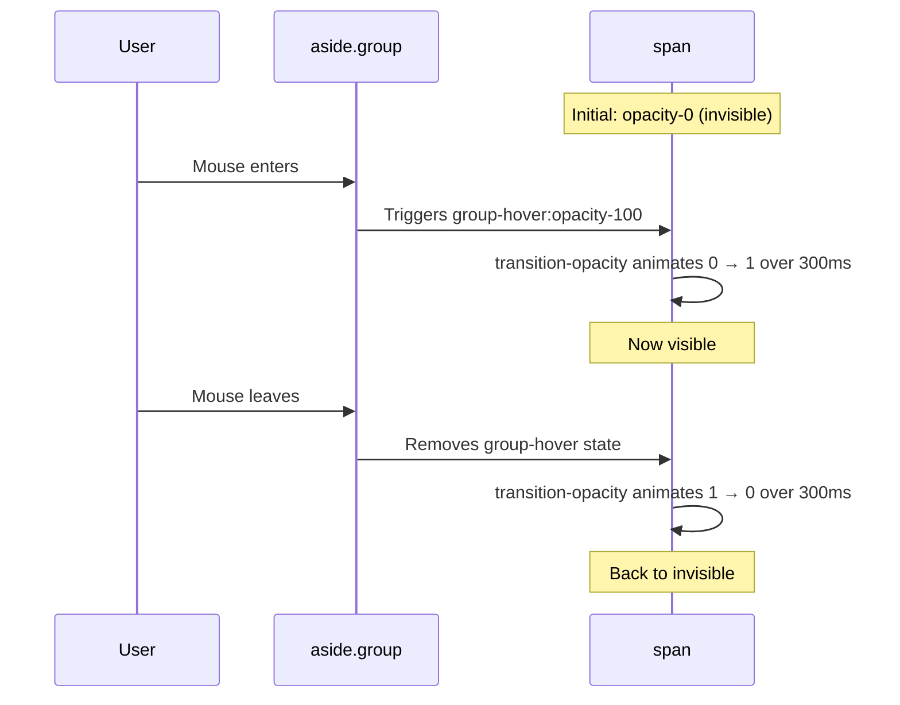
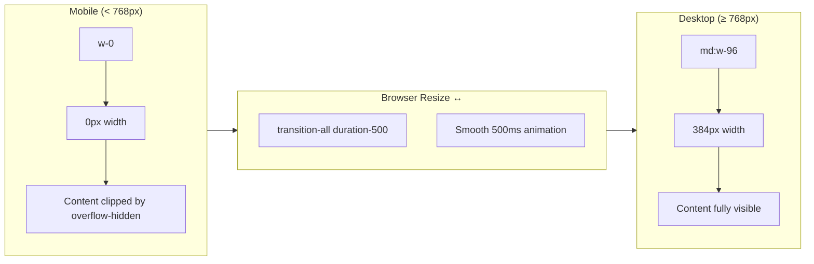
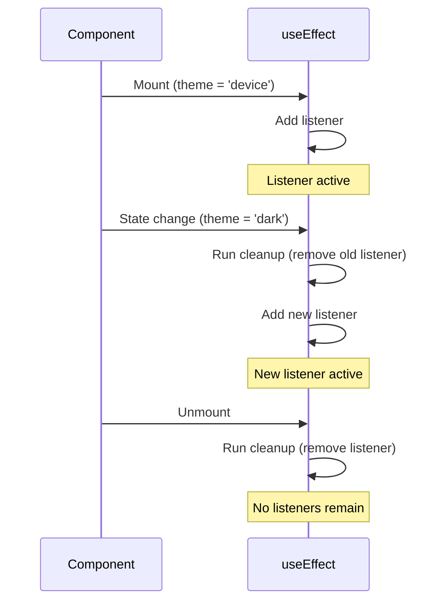
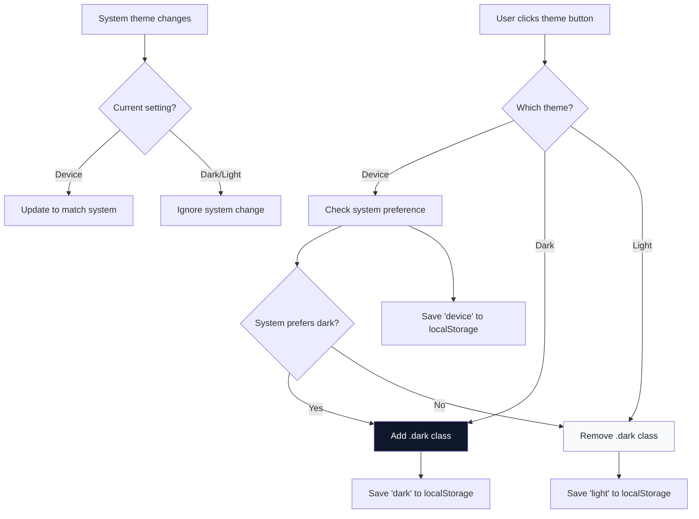

# Tailwind CSS v4 Sidebar Dashboard - Complete Revision Guide

A comprehensive, in-depth guide covering **Tailwind CSS v4 theming**, **responsive sidebars**, **dark mode implementation**, and **React state management patterns**. This README is designed to be a standalone learning resource.

---

## Table of Contents

1. [Project Overview](#project-overview)
2. [Tailwind CSS v4 Fundamentals](#tailwind-css-v4-fundamentals)
   - [The @import Directive](#the-import-directive)
   - [The @theme Directive](#the-theme-directive)
   - [Color Token Naming Convention](#color-token-naming-convention)
   - [Width and Spacing Tokens](#width-and-spacing-tokens)
3. [Dark Mode Implementation](#dark-mode-implementation)
   - [CSS Variable Override Strategy](#css-variable-override-strategy)
   - [Why CSS Variables Work for Theming](#why-css-variables-work-for-theming)
   - [The .dark Class Approach](#the-dark-class-approach)
4. [The group/group-hover Pattern](#the-groupgroup-hover-pattern)
   - [Understanding Parent-Child Hover](#understanding-parent-child-hover)
   - [Multiple Children Reacting to One Parent](#multiple-children-reacting-to-one-parent)
   - [Combining with Opacity Transitions](#combining-with-opacity-transitions)
5. [Responsive Sidebar Transitions](#responsive-sidebar-transitions)
   - [The overflow-hidden Trick](#the-overflow-hidden-trick)
   - [Why display: none Cannot Be Animated](#why-display-none-cannot-be-animated)
   - [Width-Based Visibility Pattern](#width-based-visibility-pattern)
   - [The whitespace-nowrap Requirement](#the-whitespace-nowrap-requirement)
6. [React State Management](#react-state-management)
   - [useState Hook In-Depth](#usestate-hook-in-depth)
   - [Lazy Initializers](#lazy-initializers)
   - [useEffect Hook In-Depth](#useeffect-hook-in-depth)
   - [Dependency Arrays Explained](#dependency-arrays-explained)
   - [Cleanup Functions](#cleanup-functions)
7. [localStorage API](#localstorage-api)
   - [Persisting User Preferences](#persisting-user-preferences)
   - [Reading on Component Mount](#reading-on-component-mount)
8. [System Preference Detection](#system-preference-detection)
   - [window.matchMedia API](#windowmatchmedia-api)
   - [Listening for System Changes](#listening-for-system-changes)
9. [CSS Positioning & Floating Elements](#css-positioning--floating-elements)
   - [Absolute vs Relative Positioning](#absolute-vs-relative-positioning)
   - [z-index and Stacking Context](#z-index-and-stacking-context)
10. [Flexbox Layout Patterns](#flexbox-layout-patterns)
    - [Sidebar + Main Content Layout](#sidebar--main-content-layout)
    - [flex-1 for Remaining Space](#flex-1-for-remaining-space)
    - [flex-shrink-0 for Fixed Elements](#flex-shrink-0-for-fixed-elements)
11. [Transition & Animation Classes](#transition--animation-classes)
    - [transition-all vs Specific Transitions](#transition-all-vs-specific-transitions)
    - [Duration and Easing](#duration-and-easing)
12. [Component Architecture](#component-architecture)
13. [Complete Code Walkthrough](#complete-code-walkthrough)
14. [Summary & Key Takeaways](#summary--key-takeaways)

---

## Project Overview

This project builds a **professional dashboard application** demonstrating modern React and Tailwind CSS patterns.

### Features Built:
- **Collapsible sidebar** that shows only icons by default and expands on hover to reveal text labels
- **3-way dark mode toggle**: Device (follows OS setting), Dark (forced), Light (forced)
- **Floating profile card** positioned absolutely over content (like Twitter/LinkedIn popups)
- **Persistent theme preference** using localStorage
- **System preference detection** using window.matchMedia
- **Smooth CSS transitions** throughout the UI

### Tech Stack:
- React 19
- Tailwind CSS v4
- Vite



---

## Tailwind CSS v4 Fundamentals

### The @import Directive

In Tailwind CSS v4, we no longer use the old `@tailwind base/components/utilities` directives. Instead, we use a single import:

```css
/* OLD way (Tailwind v3) - DO NOT USE */
@tailwind base;
@tailwind components;
@tailwind utilities;

/* NEW way (Tailwind v4) - USE THIS */
@import "tailwindcss";
```

**Why the change?** Tailwind v4 treats the entire library as a single CSS module, which allows for:
- Better tree-shaking
- Faster build times
- Cleaner syntax

---

### The @theme Directive

The `@theme` directive is where you define your **design tokens**. These are the building blocks of your design system.

```css
@import "tailwindcss";

@theme {
  /* Every variable here becomes a utility class */
  
  /* Colors */
  --color-primary: #19406a;
  --color-primary-dark: #002b5b;
  --color-secondary: #36c6c0;
  
  /* Sidebar specific */
  --color-sidebar: #1e293b;
  --color-sidebar-hover: #334155;
  --color-sidebar-active: #0f172a;
  
  /* Content area */
  --color-content-bg: #f8fafc;
  --color-card-bg: #ffffff;
  
  /* Text hierarchy */
  --color-text-primary: #1e293b;    /* Main headings */
  --color-text-secondary: #64748b;  /* Subtext */
  --color-text-muted: #94a3b8;      /* Hints, placeholders */
  
  /* Borders */
  --color-border: #e2e8f0;
  
  /* Semantic colors */
  --color-success: #10b981;
  --color-warning: #f59e0b;
  --color-danger: #ef4444;
  --color-info: #3b82f6;
  
  /* Action buttons */
  --color-action-btn: #14b8a6;
  --color-action-btn-hover: #0d9488;
}
```

---

### Color Token Naming Convention

The magic of `@theme` is in the naming convention. Tailwind automatically generates utility classes based on the variable prefix.

| Variable Pattern | Generated Utilities |
|------------------|---------------------|
| `--color-primary` | `bg-primary`, `text-primary`, `border-primary`, `ring-primary` |
| `--color-sidebar` | `bg-sidebar`, `text-sidebar`, `border-sidebar` |
| `--spacing-lg` | `p-lg`, `m-lg`, `gap-lg` |
| `--width-sidebar` | `w-sidebar` |

**Example in practice:**

```css
/* In index.css */
@theme {
  --color-primary: #19406a;
}
```

```jsx
/* In any component - these classes now work! */
<button className="bg-primary text-white">
  Click me
</button>

<div className="border-primary border-2">
  Bordered box
</div>
```

---

### Width and Spacing Tokens

You can define custom widths and spacing:

```css
@theme {
  /* These become w-sidebar-collapsed and w-sidebar-expanded */
  --width-sidebar-collapsed: 5rem;   /* 80px */
  --width-sidebar-expanded: 16rem;   /* 256px */
  
  /* Custom spacing */
  --spacing-sidebar-padding: 1rem;
}
```

```jsx
<aside className="w-sidebar-collapsed hover:w-sidebar-expanded">
  {/* Sidebar content */}
</aside>
```

---

## Dark Mode Implementation

### CSS Variable Override Strategy

The most elegant approach to dark mode is **overriding CSS variables**. This way, all components automatically update without changing their class names.

```css
/* Light mode (default) */
@theme {
  --color-content-bg: #f8fafc;  /* Light gray */
  --color-card-bg: #ffffff;      /* White */
  --color-text-primary: #1e293b; /* Dark text */
  --color-text-secondary: #64748b;
  --color-text-muted: #94a3b8;
  --color-border: #e2e8f0;       /* Light border */
}

/* Dark mode overrides */
.dark {
  --color-content-bg: #0f172a;   /* Very dark blue */
  --color-card-bg: #1e293b;      /* Dark slate */
  --color-text-primary: #f1f5f9; /* Light text */
  --color-text-secondary: #94a3b8;
  --color-text-muted: #64748b;
  --color-border: #334155;       /* Dark border */
}
```

---

### Why CSS Variables Work for Theming

CSS variables (custom properties) are **live** - they update in real-time when their values change.



**The component code stays the same:**

```jsx
// This component works in BOTH light and dark mode
// No conditional logic needed!
<main className="bg-content-bg text-text-primary">
  <div className="bg-card-bg border border-border">
    Content here
  </div>
</main>
```

---

### The .dark Class Approach

Tailwind's dark mode works by looking for a `.dark` class on the `<html>` element:

```html
<!-- Light mode -->
<html>
  <body>...</body>
</html>

<!-- Dark mode -->
<html class="dark">
  <body>...</body>
</html>
```

**JavaScript to toggle:**

```javascript
// Add dark mode
document.documentElement.classList.add('dark');

// Remove dark mode
document.documentElement.classList.remove('dark');

// Toggle dark mode
document.documentElement.classList.toggle('dark');
```

---

## The group/group-hover Pattern

### Understanding Parent-Child Hover

The `group` pattern allows **children to react to their parent's hover state**. This is essential for complex interactive components.

**The Problem:**
```jsx
// ❌ This only works when hovering directly on the span
<aside>
  <span className="hover:opacity-100">Text</span>
</aside>
```

**The Solution:**
```jsx
// ✅ Text becomes visible when hovering ANYWHERE on the aside
<aside className="group">
  <span className="group-hover:opacity-100">Text</span>
</aside>
```

---

### Multiple Children Reacting to One Parent

Multiple children can all react to the same parent's hover:

```jsx
<aside className="group w-20 hover:w-64">
  {/* ALL of these react when the sidebar is hovered */}
  
  <span className="group-hover:opacity-100">Logo Text</span>
  
  <nav>
    {items.map(item => (
      <span className="group-hover:opacity-100">{item.name}</span>
    ))}
  </nav>
  
  <div className="group-hover:opacity-100">
    <ThemeToggle />
  </div>
</aside>
```

---

### Combining with Opacity Transitions

For smooth fade effects, combine `group-hover:` with transitions:

```jsx
<aside className="group">
  <span className="
    opacity-0                    /* Hidden by default */
    group-hover:opacity-100      /* Visible when parent hovered */
    transition-opacity           /* Animate opacity changes */
    duration-300                 /* 300ms animation */
  ">
    WebinarGo
  </span>
</aside>
```

**Animation breakdown:**



---

## Responsive Sidebar Transitions

### The overflow-hidden Trick

When a container shrinks, its content doesn't shrink with it. Without `overflow-hidden`, content spills out:

```jsx
/* ❌ WITHOUT overflow-hidden */
<div className="w-20">  {/* Container is 80px wide */}
  <span>WebinarGo Platform</span>  {/* Text is ~150px wide */}
</div>
// Result: Text spills out beyond the container!

/* ✅ WITH overflow-hidden */
<div className="w-20 overflow-hidden">
  <span>WebinarGo Platform</span>
</div>
// Result: Text is clipped at 80px boundary
```

**Visual representation:**

```
Without overflow-hidden:
┌──────────┐
│ WebinarGo Platform <-- Text overflows!
└──────────┘

With overflow-hidden:
┌──────────┐
│ WebinarG │ <-- Text is clipped
└──────────┘
```

---

### Why display: none Cannot Be Animated

CSS transitions can only animate properties that have **numeric intermediate values**.

| Property | Can Animate? | Why |
|----------|--------------|-----|
| `width: 0` → `width: 100px` | ✅ Yes | Can be 50px (midpoint) |
| `opacity: 0` → `opacity: 1` | ✅ Yes | Can be 0.5 (midpoint) |
| `display: none` → `display: block` | ❌ No | No intermediate value! |
| `visibility: hidden` → `visibility: visible` | ❌ No | No intermediate value! |

**The hidden class in Tailwind:**
```css
.hidden {
  display: none;  /* Cannot be transitioned! */
}
```

---

### Width-Based Visibility Pattern

Instead of `hidden`/`block`, use width or opacity:

```jsx
/* ❌ WRONG - Cannot animate */
<div className="hidden md:block transition-all duration-500">
  Sidebar
</div>

/* ✅ CORRECT - Width can animate */
<div className="
  w-0 md:w-96          /* 0px on mobile, 384px on desktop */
  overflow-hidden       /* Hide content when narrow */
  transition-all        /* Animate the width change */
  duration-500          /* 500ms transition */
  ease-in-out          /* Smooth easing */
">
  Sidebar
</div>
```

**How the animation works:**



---

### The whitespace-nowrap Requirement

When animating width, text might wrap to fit the narrowing container. This breaks the animation:

```jsx
/* ❌ Text wraps as container shrinks */
<div className="w-20 hover:w-64">
  <span>User Management</span>  {/* Wraps to multiple lines! */}
</div>

/* ✅ Text stays on one line, gets clipped */
<div className="w-20 hover:w-64 overflow-hidden">
  <span className="whitespace-nowrap">User Management</span>
</div>
```

| Class | CSS | Effect |
|-------|-----|--------|
| `whitespace-nowrap` | `white-space: nowrap` | Text stays on single line |
| `whitespace-normal` | `white-space: normal` | Text wraps normally (default) |

---

## React State Management

### useState Hook In-Depth

`useState` is React's primary way to add state to functional components.

**Syntax:**
```jsx
const [stateValue, setStateFunction] = useState(initialValue);
```

**Example from ThemeToggle.jsx:**
```jsx
const [theme, setTheme] = useState('device');

// theme = current value ('device', 'dark', or 'light')
// setTheme = function to update the value
```

**Updating state:**
```jsx
// Direct value
setTheme('dark');

// Based on previous value
setTheme(prevTheme => prevTheme === 'dark' ? 'light' : 'dark');
```

---

### Lazy Initializers

When the initial state requires computation (like reading from localStorage), use a **lazy initializer**:

```jsx
/* ❌ INEFFICIENT - Runs on EVERY render */
const [theme, setTheme] = useState(localStorage.getItem('theme') || 'device');

/* ✅ EFFICIENT - Runs only on FIRST render */
const [theme, setTheme] = useState(() => {
  const savedTheme = localStorage.getItem('theme');
  return savedTheme || 'device';
});
```

**Why it matters:**
- Without lazy initializer: `localStorage.getItem()` runs on every render
- With lazy initializer: The function only runs once during component initialization

---

### useEffect Hook In-Depth

`useEffect` handles **side effects** - operations that affect things outside the component:

- DOM manipulation
- Data fetching
- Subscriptions
- Timers
- localStorage

**Basic syntax:**
```jsx
useEffect(() => {
  // Side effect code here
  
  return () => {
    // Optional cleanup function
  };
}, [dependencies]);
```

**Complete example from ThemeToggle.jsx:**

```jsx
useEffect(() => {
  // SIDE EFFECT 1: Save to localStorage
  localStorage.setItem('theme', theme);

  // SIDE EFFECT 2: Apply dark class
  const root = document.documentElement;
  
  // SIDE EFFECT 3: Check system preference
  const systemPrefersDark = window.matchMedia('(prefers-color-scheme: dark)');

  // Logic to apply theme
  const applyTheme = () => {
    let shouldBeDark = false;
    
    if (theme === 'dark') {
      shouldBeDark = true;
    } else if (theme === 'light') {
      shouldBeDark = false;
    } else if (theme === 'device') {
      shouldBeDark = systemPrefersDark.matches;
    }
    
    if (shouldBeDark) {
      root.classList.add('dark');
    } else {
      root.classList.remove('dark');
    }
  };

  applyTheme();

  // SIDE EFFECT 4: Listen for system changes
  const handleSystemChange = (event) => {
    if (theme === 'device') {
      if (event.matches) {
        root.classList.add('dark');
      } else {
        root.classList.remove('dark');
      }
    }
  };

  systemPrefersDark.addEventListener('change', handleSystemChange);

  // CLEANUP: Remove listener
  return () => {
    systemPrefersDark.removeEventListener('change', handleSystemChange);
  };
}, [theme]); // Re-run when theme changes
```

---

### Dependency Arrays Explained

The dependency array controls **when** the effect runs:

| Dependency Array | When Effect Runs |
|------------------|-----------------|
| `[]` (empty) | Only on mount (once) |
| `[theme]` | On mount + whenever `theme` changes |
| `[a, b]` | On mount + whenever `a` OR `b` changes |
| No array | On EVERY render (usually a mistake) |

```jsx
// Runs once on mount
useEffect(() => {
  console.log('Mounted!');
}, []);

// Runs when theme changes
useEffect(() => {
  console.log('Theme is now:', theme);
}, [theme]);

// Runs on every render - AVOID THIS
useEffect(() => {
  console.log('Rendered!');
});
```

---

### Cleanup Functions

The cleanup function runs:
1. **Before** the effect runs again (when dependencies change)
2. **When** the component unmounts

**Why cleanup is critical:**

```jsx
/* ❌ MEMORY LEAK - Listeners accumulate */
useEffect(() => {
  const handler = () => console.log('Changed!');
  mediaQuery.addEventListener('change', handler);
  // No cleanup! Handler is never removed!
}, [theme]);

/* ✅ CORRECT - Cleanup removes listener */
useEffect(() => {
  const handler = () => console.log('Changed!');
  mediaQuery.addEventListener('change', handler);
  
  return () => {
    mediaQuery.removeEventListener('change', handler);
  };
}, [theme]);
```

**Cleanup timeline:**



---

## localStorage API

### Persisting User Preferences

`localStorage` is a browser API that stores key-value pairs **persistently** (survives page refresh and browser close).

| Method | Description | Returns |
|--------|-------------|---------|
| `localStorage.setItem(key, value)` | Save a value | `undefined` |
| `localStorage.getItem(key)` | Retrieve a value | `string` or `null` |
| `localStorage.removeItem(key)` | Delete a value | `undefined` |
| `localStorage.clear()` | Delete ALL values | `undefined` |

**Important:** Values are stored as **strings**. For objects, use JSON:

```jsx
// Storing an object
const user = { name: 'John', theme: 'dark' };
localStorage.setItem('user', JSON.stringify(user));

// Retrieving an object
const stored = localStorage.getItem('user');
const user = stored ? JSON.parse(stored) : null;
```

---

### Reading on Component Mount

Pattern for initializing state from localStorage:

```jsx
const [theme, setTheme] = useState(() => {
  // Check if we're in a browser (for SSR safety)
  if (typeof window === 'undefined') return 'device';
  
  // Try to get saved value
  const saved = localStorage.getItem('theme');
  
  // Return saved value or default
  return saved || 'device';
});

// Save whenever theme changes
useEffect(() => {
  localStorage.setItem('theme', theme);
}, [theme]);
```

---

## System Preference Detection

### window.matchMedia API

`window.matchMedia()` creates a **MediaQueryList** object that can:
1. Check if a media query currently matches
2. Listen for changes to the match

```jsx
// Create MediaQueryList for dark mode preference
const darkModeQuery = window.matchMedia('(prefers-color-scheme: dark)');

// Check current value
console.log(darkModeQuery.matches); // true if system is dark

// Get the query string
console.log(darkModeQuery.media); // '(prefers-color-scheme: dark)'
```

---

### Listening for System Changes

Users can change their OS theme while your app is open. Handle this:

```jsx
useEffect(() => {
  const darkModeQuery = window.matchMedia('(prefers-color-scheme: dark)');
  
  const handleChange = (event) => {
    console.log('System preference changed!');
    console.log('Now prefers dark:', event.matches);
    
    if (theme === 'device') {
      // Only react if user chose "device" mode
      if (event.matches) {
        document.documentElement.classList.add('dark');
      } else {
        document.documentElement.classList.remove('dark');
      }
    }
  };
  
  // Add listener
  darkModeQuery.addEventListener('change', handleChange);
  
  // Cleanup
  return () => {
    darkModeQuery.removeEventListener('change', handleChange);
  };
}, [theme]);
```

**Complete theme logic flowchart:**



---

## CSS Positioning & Floating Elements

### Absolute vs Relative Positioning

**relative**: Element stays in document flow but creates a **positioning context** for children.

**absolute**: Element is **removed from flow** and positioned relative to nearest positioned ancestor.

```jsx
/* Parent must be positioned for absolute child to work */
<main className="relative">  {/* Creates positioning context */}
  
  <div className="absolute top-4 left-4">
    {/* Positioned 16px from top and left of <main> */}
    I'm floating!
  </div>
  
  <div>
    {/* This won't be pushed down by the absolute div */}
    Normal content
  </div>
</main>
```

---

### z-index and Stacking Context

`z-index` controls which elements appear **on top** of others:

```jsx
<div className="relative">
  <div className="z-10">Behind</div>   {/* z-index: 10 */}
  <div className="z-20">In front</div> {/* z-index: 20 - appears on top */}
</div>
```

| Tailwind Class | z-index Value |
|----------------|---------------|
| `z-0` | 0 |
| `z-10` | 10 |
| `z-20` | 20 |
| `z-30` | 30 |
| `z-40` | 40 |
| `z-50` | 50 |

**Profile card example:**

```jsx
<main className="relative">
  {/* Card floats above content */}
  <div className="
    absolute        /* Remove from flow */
    top-8 left-8    /* Position from top-left */
    z-20            /* Above main content */
    bg-card-bg
    shadow-xl       /* Floating shadow effect */
    rounded-xl
  ">
    
    <h3>User Name</h3>
  </div>
  
  {/* Main content - z-index default (0) */}
  <div className="p-8">
    Dashboard content here
  </div>
</main>
```

---

## Flexbox Layout Patterns

### Sidebar + Main Content Layout

The classic sidebar layout uses flexbox:

```jsx
<div className="flex min-h-screen">
  {/* Sidebar - fixed width */}
  <aside className="w-64">
    Navigation
  </aside>
  
  {/* Main content - takes remaining space */}
  <main className="flex-1">
    Content
  </main>
</div>
```

---

### flex-1 for Remaining Space

`flex-1` is shorthand for `flex: 1 1 0%`, meaning:
- `flex-grow: 1` - Take up available space
- `flex-shrink: 1` - Shrink if needed
- `flex-basis: 0%` - Start from zero width

```jsx
<div className="flex">
  <div className="w-64">Fixed 256px</div>
  <div className="flex-1">Takes all remaining space</div>
</div>
```

---

### flex-shrink-0 for Fixed Elements

Icons and logos shouldn't shrink when space is tight:

```jsx
<button className="flex items-center gap-3">
  {/* Icon should never shrink */}
  <svg className="w-5 h-5 flex-shrink-0">...</svg>
  
  {/* Text can be clipped */}
  <span className="truncate">Very Long Menu Item Name</span>
</button>
```

---

## Transition & Animation Classes

### transition-all vs Specific Transitions

| Class | Transitions | Use Case |
|-------|-------------|----------|
| `transition-all` | All animatable properties | Simple, catches everything |
| `transition-colors` | Only color properties | Performance optimized |
| `transition-opacity` | Only opacity | Fade effects |
| `transition-transform` | Only transform | Scale/rotate effects |

```jsx
/* Animate everything that changes */
<div className="transition-all hover:w-64 hover:bg-blue-500">

/* Only animate colors for performance */
<button className="transition-colors hover:bg-primary">
```

---

### Duration and Easing

| Duration | Milliseconds | Feel |
|----------|--------------|------|
| `duration-75` | 75ms | Snappy |
| `duration-150` | 150ms | Quick |
| `duration-300` | 300ms | Standard |
| `duration-500` | 500ms | Deliberate |
| `duration-1000` | 1000ms | Slow |

| Easing | Curve | Best For |
|--------|-------|----------|
| `ease-linear` | Constant speed | Progress bars |
| `ease-in` | Slow start | Elements leaving |
| `ease-out` | Slow end | Elements entering |
| `ease-in-out` | Slow both ends | Most UI transitions |

```jsx
<aside className="
  transition-all      /* Animate width */
  duration-300        /* 300ms */
  ease-in-out         /* Smooth both ends */
  w-20 hover:w-64
">
```

---

## Component Architecture

```mermaid
graph TD
    subgraph App["App.jsx"]
        Layout["flex min-h-screen"]
    end
    
    subgraph Sidebar["Sidebar.jsx"]
        SB_Container["group w-20 hover:w-64"]
        SB_Logo["Logo + Text"]
        SB_Nav["Nav Items (mapped)"]
        SB_Theme["ThemeToggle"]
    end
    
    subgraph MainContent["MainContent.jsx"]
        MC_Container["relative flex-1"]
        MC_Profile["Floating Profile Card"]
        MC_Greeting["Greeting Section"]
        MC_Grid["Content Grid"]
        MC_Schedule["Schedule Card"]
        MC_Actions["Action Buttons"]
    end
    
    subgraph ThemeToggle["ThemeToggle.jsx"]
        TT_State["useState(theme)"]
        TT_Effect["useEffect(applyTheme)"]
        TT_Buttons["3 Theme Buttons"]
    end
    
    App --> Sidebar
    App --> MainContent
    
    Sidebar --> SB_Container
    SB_Container --> SB_Logo
    SB_Container --> SB_Nav
    SB_Container --> SB_Theme
    
    MainContent --> MC_Container
    MC_Container --> MC_Profile
    MC_Container --> MC_Greeting
    MC_Container --> MC_Grid
    MC_Grid --> MC_Schedule
    MC_Grid --> MC_Actions
    
    SB_Theme --> ThemeToggle
    ThemeToggle --> TT_State
    TT_State --> TT_Effect
    ThemeToggle --> TT_Buttons
```



---

## Complete Code Walkthrough

### Core Pattern: Sidebar Expand on Hover

```jsx
// Sidebar.jsx - Key patterns annotated
export function Sidebar() {
  return (
    <aside className="
      group              // 1. Mark as hover target for children
      h-screen           // 2. Full viewport height
      bg-sidebar         // 3. Custom color from @theme
      w-20 hover:w-64    // 4. Expand from 80px to 256px on hover
      transition-all     // 5. Animate the width change
      duration-300       // 6. 300ms animation
      overflow-hidden    // 7. Clip content when narrow
      flex flex-col      // 8. Stack children vertically
    ">
      {/* Logo section */}
      <div className="p-4 flex items-center gap-3">
        <div className="w-10 h-10 flex-shrink-0">
          {/* Icon - always visible */}
        </div>
        <span className="
          opacity-0              // Hidden by default
          group-hover:opacity-100 // Visible when sidebar hovered
          transition-opacity      // Smooth fade
          whitespace-nowrap       // Don't wrap text
        ">
          WebinarGo
        </span>
      </div>
      
      {/* Navigation */}
      <nav className="flex-1">
        {navItems.map(item => (
          <button className="flex items-center gap-3">
            {item.icon}
            <span className="
              opacity-0
              group-hover:opacity-100
              transition-opacity
              whitespace-nowrap
            ">
              {item.name}
            </span>
          </button>
        ))}
      </nav>
    </aside>
  );
}
```

### Core Pattern: Theme Toggle

```jsx
// ThemeToggle.jsx - Complete logic
export function ThemeToggle() {
  // STATE: Initialize from localStorage with lazy initializer
  const [theme, setTheme] = useState(() => {
    return localStorage.getItem('theme') || 'device';
  });

  // EFFECT: Apply theme changes
  useEffect(() => {
    // Save preference
    localStorage.setItem('theme', theme);
    
    // Get DOM elements
    const root = document.documentElement;
    const systemPrefersDark = window.matchMedia('(prefers-color-scheme: dark)');
    
    // Determine if dark mode should be active
    const applyTheme = () => {
      const shouldBeDark = 
        theme === 'dark' || 
        (theme === 'device' && systemPrefersDark.matches);
      
      root.classList.toggle('dark', shouldBeDark);
    };
    
    applyTheme();
    
    // Listen for system changes
    const handleSystemChange = () => {
      if (theme === 'device') applyTheme();
    };
    
    systemPrefersDark.addEventListener('change', handleSystemChange);
    
    // CLEANUP
    return () => {
      systemPrefersDark.removeEventListener('change', handleSystemChange);
    };
  }, [theme]);

  // RENDER
  return (
    <div className="flex">
      {['device', 'dark', 'light'].map(t => (
        <button
          key={t}
          onClick={() => setTheme(t)}
          className={theme === t ? 'bg-primary' : 'bg-card-bg'}
        >
          {t}
        </button>
      ))}
    </div>
  );
}
```

---

## Summary & Key Takeaways

### Tailwind CSS v4 Essentials

| Concept | Syntax | Example |
|---------|--------|---------|
| Import Tailwind | `@import "tailwindcss";` | Top of index.css |
| Define tokens | `@theme { --color-name: #hex; }` | Creates `bg-name`, `text-name` |
| Dark mode | `.dark { --color-name: #hex; }` | Overrides tokens |

### Sidebar Patterns

| Goal | Classes |
|------|---------|
| Expand on hover | `group` + `hover:w-64` |
| Child reacts to parent | `group-hover:opacity-100` |
| Clip content | `overflow-hidden` |
| Prevent text wrap | `whitespace-nowrap` |
| Smooth animation | `transition-all duration-300` |

### React Hooks Summary

| Hook | Purpose | Key Points |
|------|---------|------------|
| `useState` | Manage state | Use lazy initializer for computed values |
| `useEffect` | Side effects | Always include cleanup for listeners |

### localStorage Pattern

```jsx
// Read on mount
useState(() => localStorage.getItem('key') || 'default')

// Write on change
useEffect(() => localStorage.setItem('key', value), [value])
```

### System Preference Detection

```jsx
// Check preference
window.matchMedia('(prefers-color-scheme: dark)').matches

// Listen for changes
mediaQuery.addEventListener('change', handler)
```

---

### Quick Reference: Class Combinations

**Expandable Sidebar:**
```
group w-20 hover:w-64 overflow-hidden transition-all duration-300
```

**Fade-in Text (inside group):**
```
opacity-0 group-hover:opacity-100 transition-opacity duration-300 whitespace-nowrap
```

**Floating Card:**
```
absolute top-8 left-8 z-20 bg-card-bg shadow-xl rounded-xl
```

**Theme-aware Background:**
```
bg-content-bg transition-colors duration-300
```

---

> **Remember:** The key to smooth animations is using **numeric** CSS properties (width, opacity) instead of **discrete** ones (display, visibility). When in doubt, use `opacity-0` instead of `hidden`!
