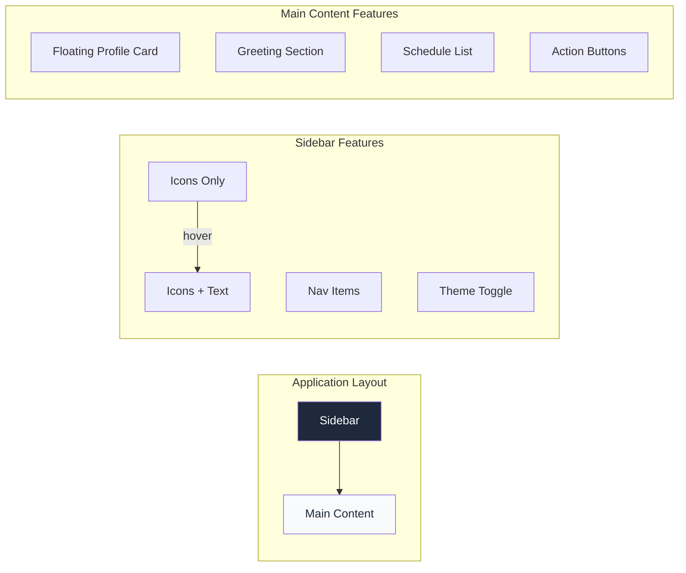
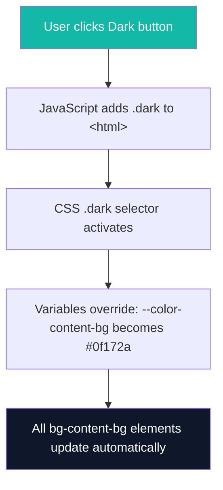
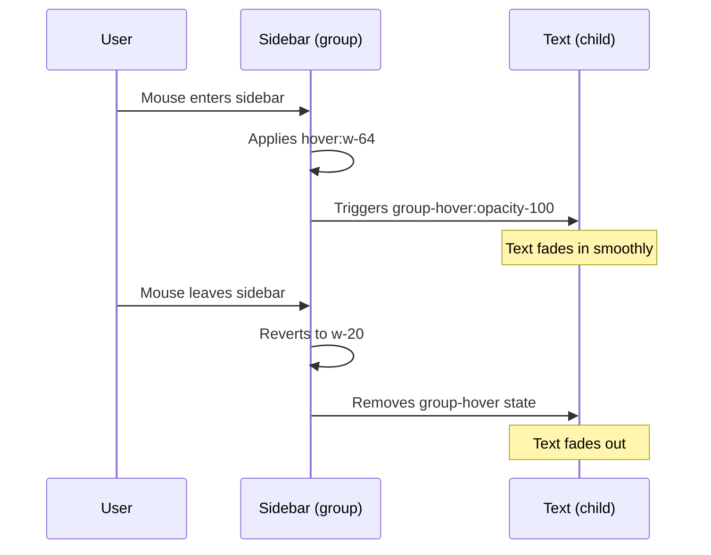
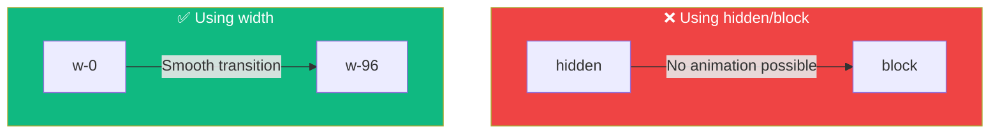
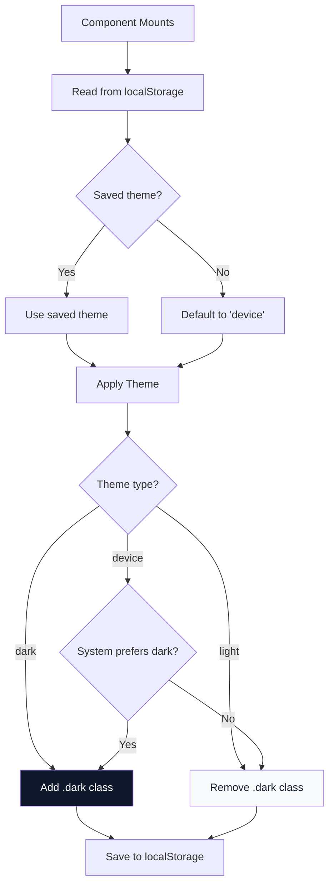
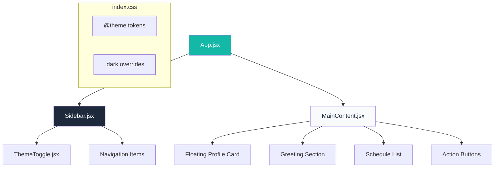

# Tailwind CSS v4 Sidebar Dashboard - Complete Revision Guide

A comprehensive guide covering **Tailwind CSS v4 theming**, **responsive sidebars**, **dark mode implementation**, and **React state management patterns**.

---

## Table of Contents

1. [Project Overview](#project-overview)
2. [Tailwind CSS v4 Theming](#tailwind-css-v4-theming)
   - [@theme Directive](#theme-directive)
   - [Dark Mode with CSS Variables](#dark-mode-with-css-variables)
3. [Sidebar Expand on Hover](#sidebar-expand-on-hover)
   - [The group/group-hover Pattern](#the-groupgroup-hover-pattern)
   - [overflow-hidden Trick](#overflow-hidden-trick)
4. [Responsive Sidebar Transitions](#responsive-sidebar-transitions)
   - [Why hidden Doesn't Work](#why-hidden-doesnt-work)
5. [Dark Mode Toggle Implementation](#dark-mode-toggle-implementation)
   - [localStorage Persistence](#localstorage-persistence)
   - [System Preference Detection](#system-preference-detection)
6. [Floating Profile Card](#floating-profile-card)
7. [Component Architecture](#component-architecture)
8. [Summary & Key Takeaways](#summary--key-takeaways)

---

## Project Overview

This project builds a **dashboard application** with:
- A **collapsible sidebar** that expands on hover
- **3-way dark mode toggle**: Device (system), Dark, Light
- **Floating profile card** like Twitter/LinkedIn
- **React + Tailwind CSS v4** stack



---

## Tailwind CSS v4 Theming

### @theme Directive

In Tailwind v4, custom design tokens are defined using the `@theme` directive. These tokens automatically become utility classes.

```css
@import "tailwindcss";

@theme {
  /* These become utility classes automatically! */
  --color-primary: #19406a;      /* → bg-primary, text-primary */
  --color-sidebar: #1e293b;      /* → bg-sidebar */
  --color-content-bg: #f8fafc;   /* → bg-content-bg */
  
  /* Width tokens */
  --width-sidebar-collapsed: 5rem;   /* → w-sidebar-collapsed */
  --width-sidebar-expanded: 16rem;   /* → w-sidebar-expanded */
}
```

**Key Insight:** The naming convention `--color-[name]` creates color utilities. `--width-[name]` creates width utilities. This is automatic in Tailwind v4!

### Dark Mode with CSS Variables

Dark mode is implemented by **overriding CSS variables** when the `.dark` class is present on `<html>`.

```css
/* Light mode (default) */
@theme {
  --color-content-bg: #f8fafc;
  --color-text-primary: #1e293b;
}

/* Dark mode override */
.dark {
  --color-content-bg: #0f172a;
  --color-text-primary: #f1f5f9;
}
```

**Why this works:** 
- When JavaScript adds `class="dark"` to `<html>`, the `.dark` selector activates
- CSS variables are overridden
- All components using `bg-content-bg` or `text-text-primary` automatically update



---

## Sidebar Expand on Hover

### The group/group-hover Pattern

This is the **most important pattern** for parent-child hover relationships in Tailwind.

```jsx
<aside className="group w-20 hover:w-64">
  {/* Parent has "group" class */}
  
  <span className="opacity-0 group-hover:opacity-100">
    {/* Child reacts when parent is hovered */}
    WebinarGo
  </span>
</aside>
```

**How it works:**
1. Parent element gets the `group` class
2. Children use `group-hover:` prefix to style themselves when parent is hovered
3. The hover doesn't need to be directly on the child!



### overflow-hidden Trick

When the sidebar collapses to `w-20`, the text is still there but **clipped**.

```jsx
<aside className="w-20 hover:w-64 overflow-hidden">
  <span className="whitespace-nowrap">WebinarGo</span>
</aside>
```

| Class | Purpose |
|-------|---------|
| `overflow-hidden` | Clips any content that exceeds the container's width |
| `whitespace-nowrap` | Prevents text from wrapping to the next line |

**Key Insight:** The text is always rendered; it's just invisible when the sidebar is narrow. This enables smooth transitions because CSS can only animate **existing** elements.

---

## Responsive Sidebar Transitions

### Why hidden Doesn't Work

A common mistake is using `hidden md:block` for responsive visibility. **This breaks transitions!**

```jsx
/* ❌ WRONG - Cannot animate display: none */
<div className="hidden md:block transition-all">
  Sidebar
</div>

/* ✅ CORRECT - Animate width instead */
<div className="w-0 md:w-96 overflow-hidden transition-all duration-500">
  Sidebar
</div>
```

**The Rule:** CSS transitions cannot animate `display: none` ↔ `display: block`. Use width-based or opacity-based visibility instead.



**Code Pattern:**

```jsx
<div className="
  h-screen
  w-0 md:w-96           /* Width: 0 on mobile, 384px on desktop */
  overflow-hidden        /* Hide content when width is 0 */
  transition-all         /* Animate all properties */
  duration-500           /* 500ms animation */
  ease-in-out           /* Smooth acceleration */
">
  Sidebar Content
</div>
```

---

## Dark Mode Toggle Implementation

The `ThemeToggle` component demonstrates key React patterns.

### useState with Lazy Initializer

```jsx
const [theme, setTheme] = useState(() => {
  // Lazy initializer - runs only once on first render
  const savedTheme = localStorage.getItem('theme');
  return savedTheme || 'device';
});
```

**Why lazy initializer?** Reading from `localStorage` is synchronous but relatively slow. The arrow function ensures it only runs once, not on every re-render.

### localStorage Persistence

```jsx
useEffect(() => {
  // Save to localStorage whenever theme changes
  localStorage.setItem('theme', theme);
}, [theme]);
```

| localStorage Method | Description |
|---------------------|-------------|
| `localStorage.setItem(key, value)` | Save a value |
| `localStorage.getItem(key)` | Retrieve a value (returns `null` if not found) |
| `localStorage.removeItem(key)` | Delete a value |

### System Preference Detection

```jsx
// Create a MediaQueryList for system dark mode preference
const systemPrefersDark = window.matchMedia('(prefers-color-scheme: dark)');

// Check current value
if (systemPrefersDark.matches) {
  console.log('System is in dark mode');
}

// Listen for changes
systemPrefersDark.addEventListener('change', (event) => {
  if (event.matches) {
    document.documentElement.classList.add('dark');
  } else {
    document.documentElement.classList.remove('dark');
  }
});
```

**Complete Theme Application Flow:**



### useEffect Cleanup Function

```jsx
useEffect(() => {
  const handler = (event) => { /* ... */ };
  
  // Add listener
  systemPrefersDark.addEventListener('change', handler);
  
  // Cleanup: Remove listener when component unmounts or effect re-runs
  return () => {
    systemPrefersDark.removeEventListener('change', handler);
  };
}, [theme]);
```

**Why cleanup?** Without it, we'd add a new listener every time `theme` changes, causing memory leaks and duplicate handlers.

---

## Floating Profile Card

The profile card uses **absolute positioning** to float above the content.

```jsx
<main className="relative">  {/* Positioned ancestor */}
  <div className="
    absolute      /* Remove from document flow */
    top-8 left-8  /* Position from top-left of parent */
    z-20          /* Stack above other content */
    bg-card-bg
    rounded-xl
    shadow-xl
  ">
    {/* Card content */}
  </div>
</main>
```

**Positioning Key Concepts:**

| Class | CSS Property | Behavior |
|-------|--------------|----------|
| `relative` | `position: relative` | Creates positioning context, stays in flow |
| `absolute` | `position: absolute` | Removed from flow, positioned relative to nearest positioned ancestor |
| `z-20` | `z-index: 20` | Controls stacking order (higher = on top) |

---

## Component Architecture



**Data Flow:**

```jsx
// Sidebar.jsx - Navigation items as data
const navItems = [
  { name: 'Home', icon: <svg>...</svg>, active: true },
  { name: 'Webinars', icon: <svg>...</svg>, active: false },
  // ...
];

// Render by mapping over data
{navItems.map((item) => (
  <li key={item.name}>
    <button className={item.active ? 'bg-active' : ''}>
      {item.icon}
      <span>{item.name}</span>
    </button>
  </li>
))}
```

---

## Summary & Key Takeaways

### Tailwind CSS v4

| Concept | Pattern |
|---------|---------|
| Custom colors | `@theme { --color-name: #hex; }` → `bg-name` |
| Dark mode | `.dark { --color-name: #hex; }` overrides |
| No vanilla CSS needed | Use `@theme` for all tokens |

### Responsive & Animated Sidebars

| Goal | Pattern |
|------|---------|
| Expand on hover | `group` + `group-hover:` |
| Smooth transitions | `transition-all duration-300` |
| Hide without `display: none` | `w-0 overflow-hidden` |
| Responsive visibility | `w-0 md:w-64` (not `hidden md:block`) |

### Dark Mode Implementation

| Step | Code |
|------|------|
| Store preference | `localStorage.setItem('theme', theme)` |
| Apply dark class | `document.documentElement.classList.add('dark')` |
| Detect system | `window.matchMedia('(prefers-color-scheme: dark)')` |
| Listen for changes | `.addEventListener('change', handler)` |
| Cleanup | Return `() => removeEventListener()` from `useEffect` |

### React Patterns Used

- **useState** with lazy initializer for localStorage
- **useEffect** for side effects (theme application)
- **Cleanup functions** to prevent memory leaks
- **Conditional rendering** (`{showProfile && <Card />}`)
- **Array.map()** for rendering lists
- **Template literals** for conditional classes

### CSS Positioning

```
relative → Creates positioning context
absolute → Positions relative to nearest positioned ancestor
z-index  → Controls stacking order
```

---

> **Pro Tip:** Always test dark mode by toggling between all three modes (Device, Dark, Light) and changing your system preference to ensure the "Device" mode responds correctly.
