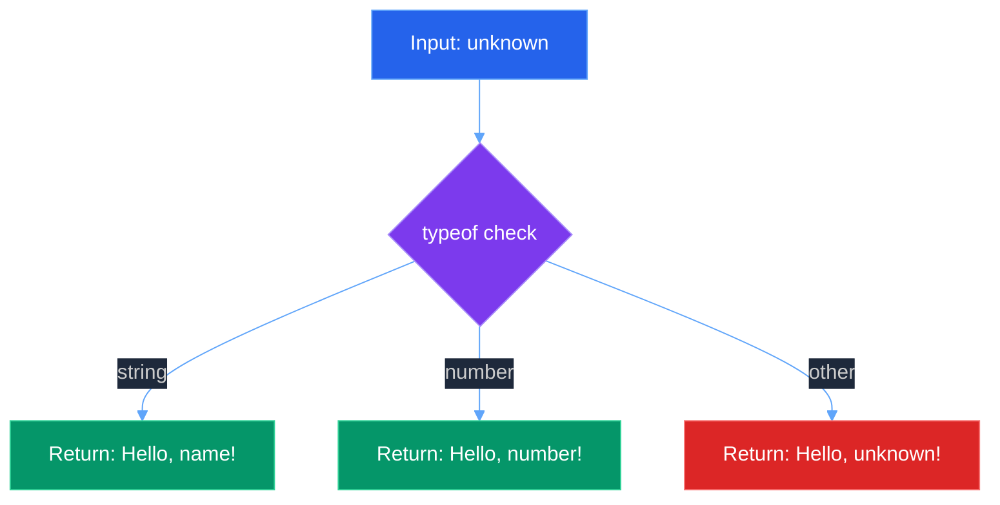
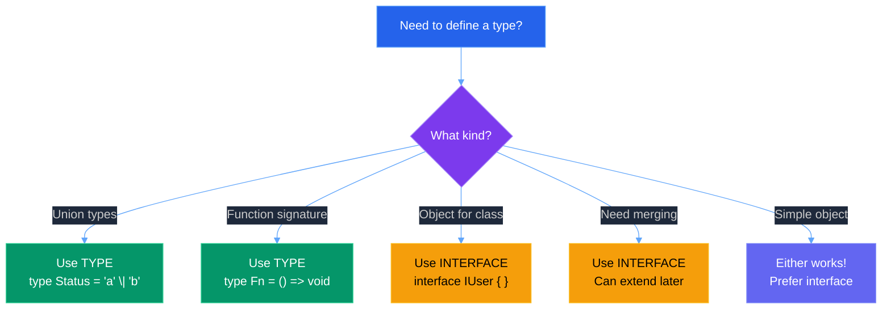
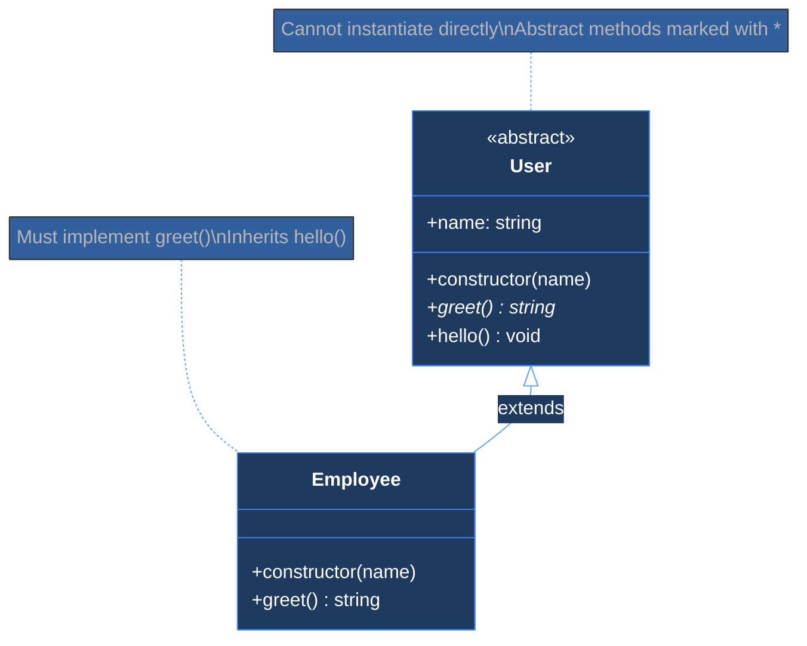
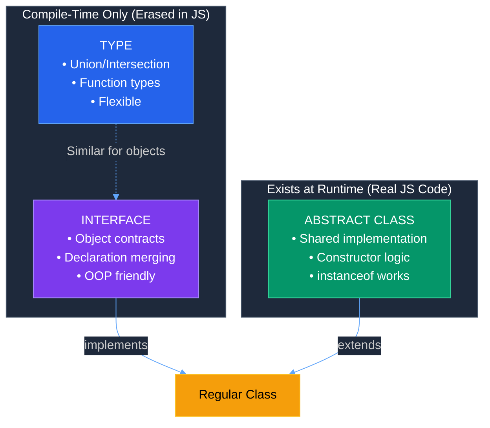
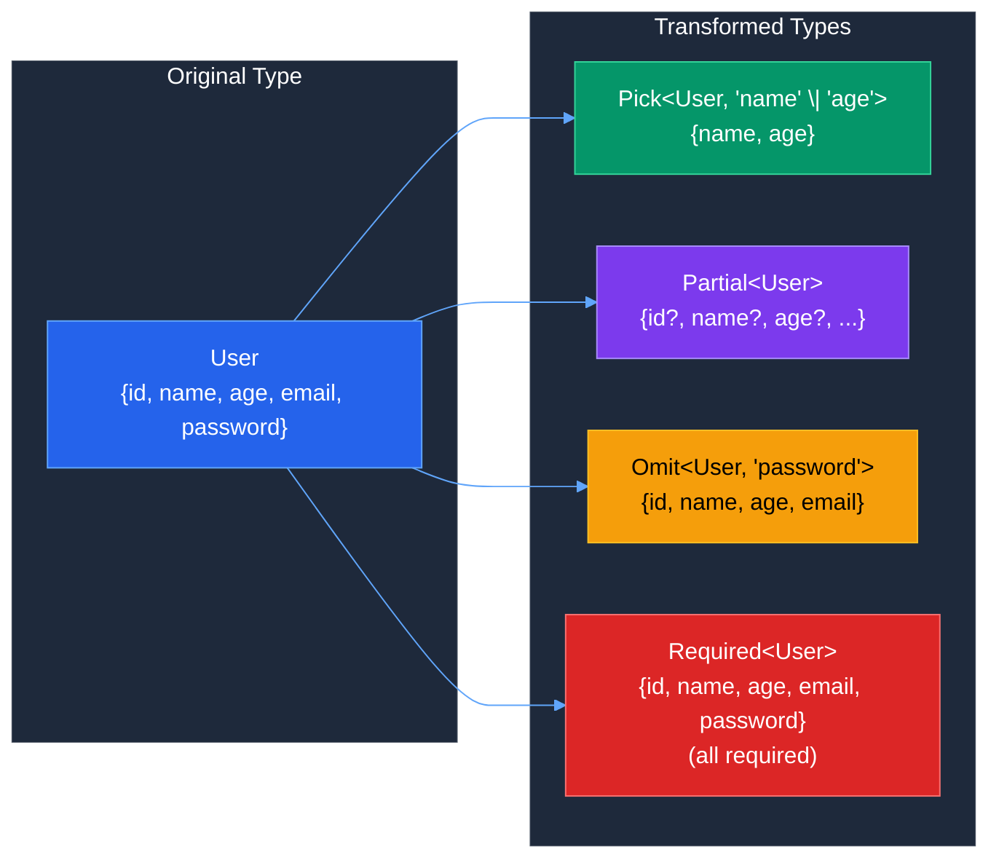
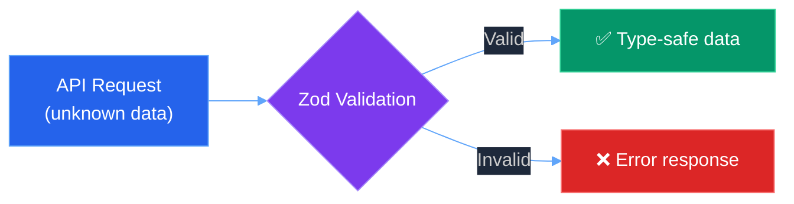

# 📘 Week 14: TypeScript Fundamentals - Complete Revision Guide

> **A standalone guide to master TypeScript concepts, patterns, and best practices.**  
> No need to open individual source files - everything you need is here!

---

## 📑 Table of Contents

1. [What is TypeScript?](#1-what-is-typescript)
2. [Basic Type Annotations](#2-basic-type-annotations)
3. [Functions in TypeScript](#3-functions-in-typescript)
4. [Type Aliases](#4-type-aliases)
5. [Interfaces](#5-interfaces)
6. [Type vs Interface - Deep Dive](#6-type-vs-interface---deep-dive)
7. [Classes & Implementing Interfaces](#7-classes--implementing-interfaces)
8. [Abstract Classes](#8-abstract-classes)
9. [🎯 Interview: Type vs Interface vs Abstract Class](#9--interview-type-vs-interface-vs-abstract-class)
10. [Advanced TypeScript APIs (Utility Types)](#10-advanced-typescript-apis-utility-types)
11. [Zod - Runtime Validation](#11-zod---runtime-validation)
12. [TypeScript Configuration (tsconfig.json)](#12-typescript-configuration-tsconfigjson)
13. [Summary & Key Takeaways](#13-summary--key-takeaways)

---

## 1. What is TypeScript?

TypeScript is a **superset of JavaScript** that adds **static typing** to the language. This means:

- ✅ Every valid JavaScript code is valid TypeScript code
- ✅ TypeScript adds type annotations that are checked at **compile-time**
- ✅ Types are **erased** during compilation - the output is plain JavaScript
- ✅ Catches bugs **before runtime**, improving code quality

### Installation

```bash
npm install -g typescript   # Install globally
tsc filename.ts             # Compile TypeScript to JavaScript
```

### The TypeScript Compilation Flow


---

## 2. Basic Type Annotations

Type annotations tell TypeScript what type a variable should hold.

### Primitive Types

```typescript
let name: string = "John";        // String
let age: number = 25;             // Number
let isActive: boolean = true;     // Boolean
let data: null = null;            // Null
let value: undefined = undefined; // Undefined
```

### Key Insight 💡
> Type annotations use a **colon (`:`)** after the variable name. TypeScript will throw an error if you try to assign a value of a different type.

### Special Types

| Type | Description | When to Use |
|------|-------------|-------------|
| `any` | Disables type checking | Avoid! Only for migration |
| `unknown` | Type-safe version of `any` | When type is truly unknown |
| `void` | No return value | Functions that don't return |
| `never` | Function never returns | Errors, infinite loops |

---

## 3. Functions in TypeScript

### Basic Function with Type Annotations

```typescript
// Regular function
function greet(name: string): string {
  return `Hello, ${name}!`;
}

// Arrow function
const greet2 = (name: string): string => `Hello, ${name}!`;
```

### Handling Unknown Types Safely

```typescript
function greet(name: unknown): string {
  // Type narrowing with typeof
  if (typeof name === "string") {
    return `Hello, ${name}!`;
  }
  if (typeof name === "number") {
    return `Hello, ${name}!`;
  }
  return "Hello, unknown!";
}

console.log(greet("John"));  // "Hello, John!"
console.log(greet(4));       // "Hello, 4!"
console.log(greet(true));    // "Hello, unknown!"
```

### Key Insight 💡
> Using `unknown` instead of `any` forces you to **narrow the type** before using it. This is safer because TypeScript ensures you handle all cases.

### Function Type Flow



---

## 4. Type Aliases

Type aliases create **custom type names** for complex types using the `type` keyword.

### Basic Type Alias

```typescript
// Function type alias
type fn = () => string;

const fun: fn = () => "Hello, world!";
console.log(fun()); // "Hello, world!"

// Passing function as parameter
function funinfun(callback: fn) {
  setTimeout(callback, 1000);
}
funinfun(fun);
```

### Object Type Alias

```typescript
type User = {
  name: string;
  age: number;
  email: string;
  run: () => void;
};

const user: User = {
  name: "John",
  age: 30,
  email: "john@example.com",
  run: () => console.log("running"),
};
```

### Intersection Types (Combining Types)

```typescript
interface Student {
  name: string;
  roll: number;
}

interface Teacher {
  name: string;
  age: number;
  email: string;
  teach: () => void;
}

// Intersection: Student AND Teacher properties
type TeachingAssistant = Student & Teacher;

const ta: TeachingAssistant = {
  name: "Aniket",
  age: 30,
  email: "aniket@example.com",
  roll: 5,
  teach: () => console.log("teaching"),
};
```

### Key Insight 💡
> The `&` operator creates an **intersection type** - the resulting type has ALL properties from BOTH types. This is unique to `type` aliases!

### Union Types (Either/Or)

```typescript
type PaymentStatus = "pending" | "completed" | "failed";
type PaymentMethod = "card" | "upi" | "netbanking";

let status: PaymentStatus = "pending"; // ✅ OK
let status2: PaymentStatus = "unknown"; // ❌ Error!
```

---

## 5. Interfaces

Interfaces define the **shape/contract** of an object. They're ideal for OOP patterns.

### Basic Interface

```typescript
interface User {
  name: string;
  age: number;
  email: string;
  run: () => void;
}

const user: User = {
  name: "John",
  age: 30,
  email: "john@example.com",
  run: () => console.log("running"),
};
```

### Three Ways to Define Object Types

```typescript
// Option 1: Inline (anonymous type)
const student1: { name: string; roll: number } = {
  name: "Aniket",
  roll: 5,
};

// Option 2: Interface
interface Student {
  name: string;
  roll: number;
}
const student2: Student = { name: "Aniket", roll: 5 };

// Option 3: Type alias
type StudentType = {
  name: string;
  roll: number;
};
const student3: StudentType = { name: "Aniket", roll: 5 };
```

### Declaration Merging (Interface Only!)

```typescript
interface Window {
  myCustomProperty: string;
}

interface Window {
  anotherProperty: number;
}

// Window now has BOTH properties!
// This is called "declaration merging" - only interfaces can do this
```

---

## 6. Type vs Interface - Deep Dive

Both can define object shapes, but they have key differences:

### Comparison Table

| Feature | Type | Interface |
|---------|------|-----------|
| Object shapes | ✅ Yes | ✅ Yes |
| Union types | ✅ Yes (`\|`) | ❌ No |
| Intersection | ✅ Yes (`&`) | ✅ Yes (`extends`) |
| Declaration merging | ❌ No | ✅ Yes |
| Computed properties | ✅ Yes | ❌ No |
| Extends classes | ❌ No | ✅ Yes |

### When to Use What



---

## 7. Classes & Implementing Interfaces

Classes can **implement** interfaces, ensuring they follow a contract.

### Interface for a Calculator

```typescript
interface ICalculator {
  version: string;
  add(a: number, b: number): number;
  subtract(a: number, b: number): number;
  multiply(a: number, b: number): number;
  divide: (a: number, b: number) => number; // Arrow syntax also works!
}
```

### Class Implementing the Interface

```typescript
class Calculator implements ICalculator {
  // Using 'public' in constructor auto-creates and assigns the property
  constructor(public version: string = "1.0.0") {}
  
  add(a: number, b: number): number {
    return a + b;
  }
  
  subtract(a: number, b: number): number {
    return a - b;
  }
  
  multiply(a: number, b: number): number {
    return a * b;
  }
  
  divide(a: number, b: number): number {
    return a / b;
  }
}

const calc = new Calculator("2.0.0");
console.log(calc.add(1, 2));      // 3
console.log(calc.version);        // "2.0.0"
```

### Key Insight 💡
> The `public` keyword in constructor parameters is a **shorthand** that:
> 1. Declares the property
> 2. Assigns the parameter value to it
> 
> `constructor(public version: string)` is equivalent to:
> ```typescript
> version: string;
> constructor(version: string) {
>   this.version = version;
> }
> ```

### Syntax Trick 🔧
> Interface methods can be defined two ways:
> - Method syntax: `add(a: number, b: number): number`
> - Arrow syntax: `divide: (a: number, b: number) => number`
> 
> Both work the same way when implementing!

---

## 8. Abstract Classes

Abstract classes are **blueprints** that:
- ❌ Cannot be instantiated directly
- ✅ Can have abstract methods (must be implemented by child)
- ✅ Can have concrete methods (shared implementation)

### Abstract Class Example

```typescript
abstract class User {
  name: string;
  
  constructor(name: string) {
    this.name = name;
  }

  // Abstract method - MUST be implemented by child class
  abstract greet(): string;

  // Concrete method - shared implementation, inherited by all children
  hello() {
    console.log("hi there");
  }
}

class Employee extends User {
  constructor(name: string) {
    super(name); // Must call parent constructor
  }

  // Must implement abstract method
  greet() {
    return "hi " + this.name;
  }
}

const employee = new Employee("John");
console.log(employee.greet()); // "hi John"
employee.hello();              // "hi there" (inherited)

// const user = new User("Test"); // ❌ Error: Cannot instantiate abstract class
```

### Abstract Class Structure



### Practical Example: Payment Processor

```typescript
abstract class PaymentProcessor {
  // Abstract - each payment type implements differently
  abstract processPayment(amount: number): boolean;

  // Concrete - shared by all payment types
  formatAmount(amount: number): string {
    return `₹${amount.toFixed(2)}`;
  }

  validateAmount(amount: number): boolean {
    return amount > 0;
  }
}

class UPIPayment extends PaymentProcessor {
  processPayment(amount: number): boolean {
    if (!this.validateAmount(amount)) return false;
    console.log(`Processing UPI payment of ${this.formatAmount(amount)}`);
    return true;
  }
}

class CardPayment extends PaymentProcessor {
  processPayment(amount: number): boolean {
    if (!this.validateAmount(amount)) return false;
    console.log(`Processing Card payment of ${this.formatAmount(amount)}`);
    return true;
  }
}
```

### Key Insight 💡
> Abstract classes are perfect when you want to:
> - **Share common code** between related classes
> - **Enforce a contract** (abstract methods)
> - **Prevent direct instantiation** of the base class

---

## 9. 🎯 Interview: Type vs Interface vs Abstract Class

This is a **common interview question**. Here's the complete comparison:

### The Big Picture



### Comparison Table

| Feature | Type | Interface | Abstract Class |
|---------|------|-----------|----------------|
| **Purpose** | Define data shapes | Define contracts | Blueprint + shared code |
| **Instantiable?** | No (type only) | No (type only) | No (must extend) |
| **Runtime existence?** | ❌ No | ❌ No | ✅ Yes (JS class) |
| **Can have implementation?** | ❌ No | ❌ No | ✅ Yes |
| **Union types?** | ✅ Yes | ❌ No | ❌ No |
| **Declaration merging?** | ❌ No | ✅ Yes | ❌ No |
| **Constructor?** | ❌ No | ❌ No | ✅ Yes |
| **Access modifiers?** | ❌ No | ❌ No | ✅ Yes |
| **`instanceof` check?** | ❌ No | ❌ No | ✅ Yes |

### Quick Decision Tree

```
Need union/intersection types? → TYPE
Need declaration merging? → INTERFACE
Need shared implementation? → ABSTRACT CLASS
Defining object shape? → INTERFACE (or TYPE)
Creating class hierarchy? → ABSTRACT CLASS
Defining function type? → TYPE
Need constructor logic? → ABSTRACT CLASS
Need runtime type check? → ABSTRACT CLASS
```

### Code Examples for Each

```typescript
// TYPE - Compile-time only, most flexible
type Status = "active" | "inactive";           // Union - only TYPE can do!
type Callback = (data: string) => void;        // Function signature
type Combined = User & { role: string };       // Intersection

// INTERFACE - Compile-time only, OOP-friendly
interface IUser {
  name: string;
  age: number;
}
interface IUser {
  email: string; // Declaration merging - adds to existing!
}
// IUser now has: name, age, email

// ABSTRACT CLASS - Exists at runtime, has implementation
abstract class BaseUser {
  constructor(public name: string) {} // Has constructor!
  
  abstract validate(): boolean;       // Must implement
  
  getInfo(): string {                 // Shared implementation
    return `User: ${this.name}`;
  }
}
```

---

## 10. Advanced TypeScript APIs (Utility Types)

TypeScript provides built-in **utility types** to transform existing types.

### Pick<T, K> - Select Specific Properties

```typescript
interface User {
  id?: string;
  name: string;
  age: number;
  email?: string;
  password?: string;
}

// Pick only name, age, email from User
type UpdateProps = Pick<User, "name" | "age" | "email">;

function updateUser(user: UpdateProps) {
  console.log(user.name); // Has name, age, email only
}
```

### Partial<T> - Make All Properties Optional

```typescript
type OptionalProps = Partial<UpdateProps>;
// { name?: string; age?: number; email?: string }

function updateUser2(user: OptionalProps) {
  console.log(user.name); // All properties are optional now
}

updateUser2({ name: "Aniket" }); // ✅ OK - only name provided
```

### Record<K, V> - Create Object Types

```typescript
// Record creates an object type with specific key and value types
type Users = Record<string, { age: number; name: string }>;

const users: Users = {
  user1: { age: 3, name: "Alice" },
  user2: { age: 4, name: "Bob" },
};
```

### Index Signatures vs Record

```typescript
// Index signature approach
type Users1 = {
  [key: string]: string | number;
};

// Record approach (cleaner)
type Users2 = Record<string, string | number>;

// Both allow:
const data: Users1 = { id: "123", count: 5 };
```

### Map<K, V> - Runtime Data Structure

```typescript
// Map is a runtime JavaScript data structure (not just a type)
const users = new Map<string, User>();

users.set("user1", { name: "Alice", age: 25 });
users.get("user1"); // { name: "Alice", age: 25 }
```

### Exclude<T, U> - Remove Types from Union

```typescript
type EventType = "click" | "scroll" | "mousemove";
type ExcludeEvent = Exclude<EventType, "scroll">;
// Result: "click" | "mousemove"
```

### Utility Types Diagram



---

## 11. Zod - Runtime Validation

TypeScript types are **erased at runtime**. For actual runtime validation (like API inputs), use **Zod**.

### Why Zod?



### Zod Schema Definition

```typescript
import { z } from "zod";

const userProfileSchema = z.object({
  name: z.string().min(1, { message: "Name cannot be empty" }),
  email: z.string().email({ message: "Invalid email format" }),
  age: z.number().min(18, { message: "Must be 18 years old" }).optional(),
});

// Infer TypeScript type from Zod schema!
type UserProfile = z.infer<typeof userProfileSchema>;
// { name: string; email: string; age?: number }
```

### Using Zod in Express

```typescript
import express from "express";

const app = express();

app.put("/user", (req, res) => {
  // Runtime validation
  const result = userProfileSchema.safeParse(req.body);
  
  if (!result.success) {
    res.status(411).json({ errors: result.error.errors });
    return;
  }
  
  // result.data is now type-safe!
  const user: UserProfile = result.data;
  
  res.json({ message: "User updated" });
});
```

### Key Insight 💡
> `z.infer<typeof schema>` extracts the TypeScript type from a Zod schema. This means you:
> - Define validation **once** (Zod schema)
> - Get both **runtime validation** AND **compile-time types**
> - No need to maintain separate type definitions!

---

## 12. TypeScript Configuration (tsconfig.json)

The `tsconfig.json` file controls how TypeScript compiles your code.

### Essential Options

| Option | Value | Purpose |
|--------|-------|---------|
| `target` | `"esnext"` | Output JS version (latest) |
| `module` | `"nodenext"` | Module system (modern Node.js) |
| `strict` | `true` | Enable all strict checks |
| `outDir` | `"./dist"` | Output directory |
| `skipLibCheck` | `true` | Skip checking .d.ts files (faster) |

### Recommended Configuration

```json
{
  "compilerOptions": {
    // Output Settings
    "target": "esnext",
    "module": "nodenext",
    "outDir": "./dist",
    
    // Strict Type Checking (ALWAYS enable these!)
    "strict": true,
    "noUncheckedIndexedAccess": true,
    "exactOptionalPropertyTypes": true,
    
    // Modern Tooling Support
    "isolatedModules": true,
    "verbatimModuleSyntax": true,
    "moduleDetection": "force",
    
    // Performance
    "skipLibCheck": true,
    
    // React (if using)
    "jsx": "react-jsx"
  }
}
```

### Common Issues & Solutions

| Issue | Solution |
|-------|----------|
| `Cannot use import statement outside a module` | Set `"module": "nodenext"` + `"type": "module"` in package.json |
| `Cannot find name 'process'` | Add `"types": ["node"]` + install `@types/node` |
| `Cannot re-export a type` | Use `export type { MyType }` |
| Slow compilation | Enable `skipLibCheck: true` |

---

## 13. Summary & Key Takeaways

### 🎯 Quick Reference Card

```
┌─────────────────────────────────────────────────────────────┐
│                    TYPESCRIPT CHEAT SHEET                   │
├─────────────────────────────────────────────────────────────┤
│ TYPES                                                       │
│   • Union: type A = "x" | "y"                              │
│   • Intersection: type B = X & Y                           │
│   • Function: type Fn = (x: string) => void                │
├─────────────────────────────────────────────────────────────┤
│ INTERFACES                                                  │
│   • Object contracts: interface IUser { name: string }     │
│   • Declaration merging: interface IUser { age: number }   │
│   • Implementing: class User implements IUser { }          │
├─────────────────────────────────────────────────────────────┤
│ ABSTRACT CLASSES                                            │
│   • Blueprint: abstract class Base { }                     │
│   • Abstract method: abstract greet(): string              │
│   • Concrete method: hello() { console.log("hi") }         │
│   • Extending: class Child extends Base { }                │
├─────────────────────────────────────────────────────────────┤
│ UTILITY TYPES                                               │
│   • Pick<T, K>: Select properties                          │
│   • Partial<T>: Make all optional                          │
│   • Record<K, V>: Object with key/value types              │
│   • Exclude<T, U>: Remove from union                       │
├─────────────────────────────────────────────────────────────┤
│ ZOD (Runtime Validation)                                    │
│   • Schema: z.object({ name: z.string() })                 │
│   • Validate: schema.safeParse(data)                       │
│   • Infer type: z.infer<typeof schema>                     │
└─────────────────────────────────────────────────────────────┘
```

### 🧠 Mental Model

1. **Types & Interfaces** = Compile-time contracts (erased in JS)
2. **Abstract Classes** = Runtime blueprints with shared code
3. **Zod** = Runtime validation that generates types

### ✅ Best Practices

- Always enable `strict: true` in tsconfig
- Prefer `unknown` over `any` for type safety
- Use `interface` for objects that classes implement
- Use `type` for unions, intersections, and function signatures
- Use abstract classes when you need shared implementation
- Use Zod for runtime validation of external data (APIs, user input)

### 🚫 Common Mistakes to Avoid

- Using `any` everywhere (defeats the purpose of TypeScript)
- Forgetting to handle `undefined` with optional properties
- Not using `strictNullChecks` (part of `strict: true`)
- Confusing compile-time types with runtime validation

---

> **📚 This guide covers Week 14 of the cohort curriculum.**  
> **Last updated:** December 2024

