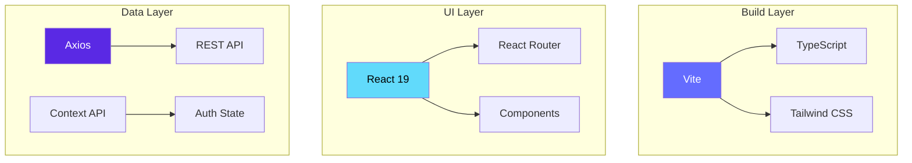
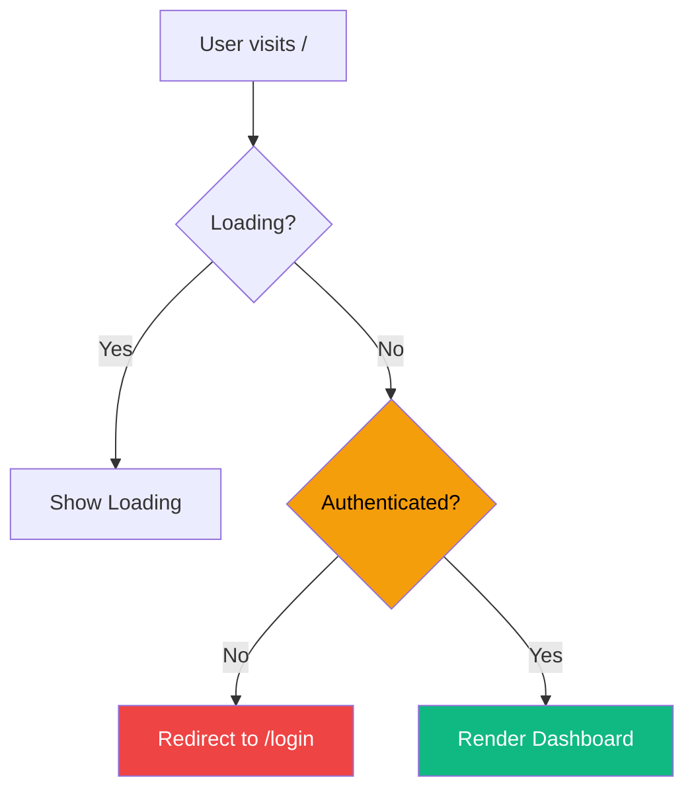
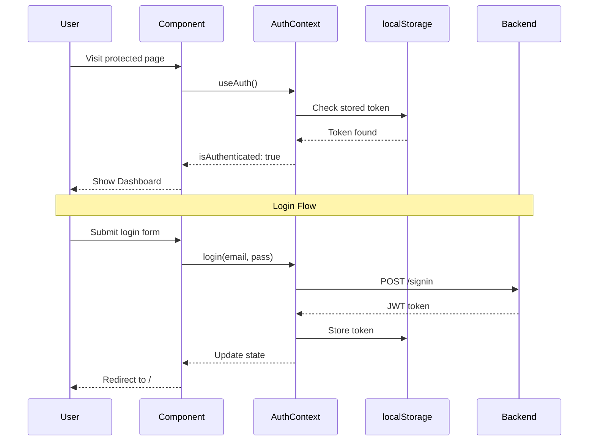
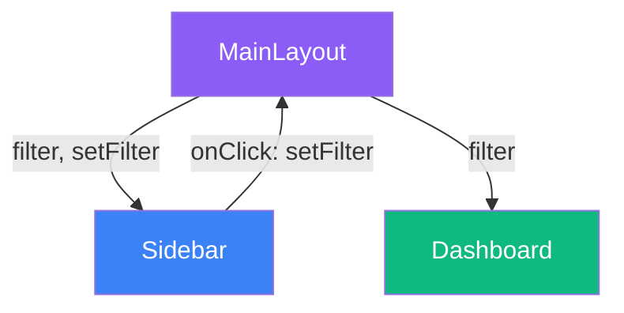

# Brainly Frontend - Complete Revision Guide

A comprehensive learning resource for the React frontend of the Second Brain application.

---

## Table of Contents

1. [Tech Stack Overview](#tech-stack-overview)
2. [Application Architecture](#application-architecture)
3. [Routing & Protected Routes](#routing--protected-routes)
4. [Authentication with Context API](#authentication-with-context-api)
5. [API Layer with Axios](#api-layer-with-axios)
6. [TypeScript Type System](#typescript-type-system)
7. [Component Patterns](#component-patterns)
8. [Media Embedding Patterns](#media-embedding-patterns)
9. [State Management Patterns](#state-management-patterns)
10. [Styling with Tailwind CSS](#styling-with-tailwind-css)
11. [Summary & Key Takeaways](#summary--key-takeaways)

---

## Tech Stack Overview

| Technology | Version | Purpose |
|------------|---------|---------|
| React | 19.x | UI framework with functional components |
| Vite | 7.x | Build tool & dev server |
| TypeScript | 5.9.x | Type safety |
| Tailwind CSS | 4.x | Utility-first styling |
| React Router | 7.x | Client-side routing |
| Axios | 1.13.x | HTTP client |
| react-tweet | 3.x | Twitter/X embed |



---

## Application Architecture

The app follows a modular structure with clear separation of concerns:

```
src/
├── api/           # HTTP client & API functions
├── components/    # Reusable UI components
├── context/       # React Context providers
├── icons/         # SVG icon components
├── pages/         # Full page components
├── types/         # TypeScript interfaces
├── App.tsx        # Root component with routing
└── main.tsx       # Entry point
```

### Key Insight
Each directory has a single responsibility. This makes the codebase predictable—if you need to modify an API call, you look in `api/`. If you need a new type, go to `types/`.

---

## Routing & Protected Routes

### Core Concept
React Router v7 provides declarative routing. The app uses **nested routes** and a **ProtectedRoute wrapper** to guard authenticated pages.

```tsx
// App.tsx - Route Configuration
function AppRoutes() {
  const { isAuthenticated } = useAuth();

  return (
    <Routes>
      {/* Public routes - redirect to home if already logged in */}
      <Route
        path="/login"
        element={isAuthenticated ? <Navigate to="/" replace /> : <LoginPage />}
      />
      
      {/* Protected route - requires auth */}
      <Route
        path="/"
        element={
          <ProtectedRoute>
            <MainLayout />
          </ProtectedRoute>
        }
      />
      
      {/* Dynamic route with parameter */}
      <Route path="/shared/:shareLink" element={<SharedBrainPage />} />
    </Routes>
  );
}
```

### ProtectedRoute Pattern

```tsx
function ProtectedRoute({ children }: { children: React.ReactNode }) {
  const { isAuthenticated, loading } = useAuth();

  // Show loading state while checking auth
  if (loading) {
    return <div>Loading...</div>;
  }

  // Redirect to login if not authenticated
  if (!isAuthenticated) {
    return <Navigate to="/login" replace />;
  }

  // Render protected content
  return <>{children}</>;
}
```

### Key Insight
- `replace` prop prevents the redirect from being added to browser history
- Check `loading` state to avoid flashing unauthorized content
- Use fragments `<>` when you don't need a wrapper element



---

## Authentication with Context API

### Core Concept
Context API allows sharing state across the component tree without prop drilling. The `AuthContext` manages JWT tokens and auth state.

### The Provider Pattern

```tsx
// context/AuthContext.tsx
interface AuthContextType {
  token: string | null;
  isAuthenticated: boolean;
  login: (email: string, password: string) => Promise<void>;
  signup: (email: string, password: string) => Promise<void>;
  logout: () => void;
  loading: boolean;
  error: string | null;
}

const AuthContext = createContext<AuthContextType | null>(null);

export function AuthProvider({ children }: { children: ReactNode }) {
  const [token, setToken] = useState<string | null>(null);
  const [loading, setLoading] = useState(true);

  // Check localStorage on mount
  useEffect(() => {
    const storedToken = localStorage.getItem("token");
    if (storedToken) {
      setToken(storedToken);
    }
    setLoading(false);
  }, []);

  const login = async (email: string, password: string) => {
    const response = await authApi.signin(email, password);
    localStorage.setItem("token", response.token);
    setToken(response.token);
  };

  const logout = () => {
    localStorage.removeItem("token");
    setToken(null);
  };

  return (
    <AuthContext.Provider value={{
      token,
      isAuthenticated: !!token,  // Convert to boolean
      login,
      signup,
      logout,
      loading,
      error,
    }}>
      {children}
    </AuthContext.Provider>
  );
}
```

### Custom Hook Pattern

```tsx
export function useAuth() {
  const context = useContext(AuthContext);
  if (!context) {
    throw new Error("useAuth must be used within an AuthProvider");
  }
  return context;
}
```

### Key Insight
- **Double negation `!!token`** converts any value to a boolean
- **Error boundary in hook** ensures the hook is used correctly
- **Initial loading state** prevents flash of unauthenticated content



---

## API Layer with Axios

### Core Concept
Axios provides a clean HTTP client with **interceptors** that automatically attach auth headers to every request.

### Centralized API Configuration

```tsx
// api/index.ts
const API_BASE_URL = import.meta.env.VITE_API_BASE_URL || "http://localhost:3000/api/v1";

const api = axios.create({
  baseURL: API_BASE_URL,
});

// Request Interceptor - runs before every request
api.interceptors.request.use((config) => {
  const token = localStorage.getItem("token");
  if (token) {
    config.headers.Authorization = `Bearer ${token}`;
  }
  return config;
});
```

### Key Insight
- **Environment variables** with `VITE_` prefix are exposed to client
- **Interceptors** eliminate repetitive auth header code
- **Bearer token format** is the standard for JWT authentication

### API Grouping Pattern

```tsx
// Group related endpoints into objects
export const contentApi = {
  getAll: async (typeFilter?: ContentType): Promise<ContentResponse> => {
    const params = typeFilter ? { type: typeFilter } : {};
    const response = await api.get<ContentResponse>("/content", { params });
    return response.data;
  },

  create: async (data: {
    title: string;
    type?: ContentType;
    link?: string;
    content?: string;
    tags?: string[];
  }): Promise<MessageResponse> => {
    const response = await api.post<MessageResponse>("/content", data);
    return response.data;
  },

  delete: async (id: string): Promise<MessageResponse> => {
    const response = await api.delete<MessageResponse>(`/content/${id}`);
    return response.data;
  },
};
```

### Key Insight
- **Generic types** on Axios methods (`api.get<ContentResponse>`) provide type safety
- **Optional parameters** use the conditional object pattern
- **Grouping by domain** makes API usage intuitive: `contentApi.create()`, `authApi.login()`

---

## TypeScript Type System

### Core Concept
TypeScript interfaces define the shape of data, providing autocomplete and compile-time error checking.

### Entity Types

```tsx
// types/index.ts
export interface User {
  _id: string;
  email: string;
}

export interface Tag {
  _id: string;
  title: string;
  userId: string;
  createdAt: string;
  updatedAt: string;
}

export interface Content {
  _id: string;
  title: string;
  type: ContentType;
  link?: string;        // Optional for notes
  content?: string;     // For notes only
  tags: Tag[];
  userId: User | string;  // Populated or just ID
  createdAt: string;
  updatedAt: string;
}

// Union type for content categories
export type ContentType = "note" | "video" | "tweet" | "link";
```

### API Response Types

```tsx
export interface ContentResponse {
  content: Content[];
}

export interface AuthResponse {
  token: string;
}

export interface MessageResponse {
  message: string;
}
```

### Key Insight
- **Union types** (`ContentType`) restrict values to specific strings
- **Optional properties** (`?:`) handle fields that may not exist
- **Union of types** (`User | string`) handles MongoDB populate

---

## Component Patterns

### 1. Variant-Based Components

```tsx
// components/Button.tsx
type ButtonVariant = "primary" | "secondary";

interface ButtonProps {
  variant: ButtonVariant;
  children: ReactNode;
  startIcon?: ReactNode;
  onClick?: () => void;
}

const variantStyles = {
  primary: "bg-purple-600 text-white hover:bg-purple-700",
  secondary: "bg-white text-purple-600 border border-purple-300",
};

export function Button({ variant, children, startIcon, onClick }: ButtonProps) {
  return (
    <button
      onClick={onClick}
      className={`flex items-center gap-2 px-4 py-2 rounded-lg ${variantStyles[variant]}`}
    >
      {startIcon && <span>{startIcon}</span>}
      {children}
    </button>
  );
}
```

**Key Insight**: Use object lookup for style variants instead of conditionals.

---

### 2. Conditional Rendering Pattern

```tsx
// Dashboard.tsx - Multiple render states
{loading ? (
  <div>Loading...</div>
) : contents.length === 0 ? (
  <div>No content yet</div>
) : (
  <div className="grid grid-cols-3 gap-6">
    {contents.map((item) => (
      <Card key={item._id} {...item} />
    ))}
  </div>
)}
```

**Key Insight**: Ternary chains handle multiple states cleanly.

---

### 3. Modal Pattern

```tsx
// AddContentModal.tsx
interface AddContentModalProps {
  isOpen: boolean;
  onClose: () => void;
  onContentAdded: () => void;
}

export function AddContentModal({ isOpen, onClose, onContentAdded }: AddContentModalProps) {
  // Early return if not open
  if (!isOpen) return null;

  return (
    <div className="fixed inset-0 bg-black/50 flex items-center justify-center z-50">
      <div className="bg-white rounded-xl p-6 w-full max-w-md">
        {/* Modal content */}
      </div>
    </div>
  );
}
```

**Key Insight**: 
- Early return prevents rendering when closed
- Backdrop uses `bg-black/50` for 50% opacity
- `fixed inset-0` creates full-screen overlay

---

### 4. Controlled Form Pattern

```tsx
const [type, setType] = useState<ContentType>("link");

// Conditional field rendering
{type === "note" ? (
  <textarea
    value={noteContent}
    onChange={(e) => setNoteContent(e.target.value)}
    placeholder="Write your note..."
  />
) : (
  <input
    type="url"
    value={link}
    onChange={(e) => setLink(e.target.value)}
    placeholder={type === "video" ? "YouTube URL" : "Link"}
  />
)}
```

**Key Insight**: Form fields change dynamically based on selected type.

---

### 5. Tag Input Pattern

```tsx
const handleAddTag = (e: React.KeyboardEvent<HTMLInputElement>) => {
  if (e.key === "Enter" || e.key === ",") {
    e.preventDefault();
    const tag = tagInput.trim().toLowerCase();
    if (tag && !tags.includes(tag)) {
      setTags([...tags, tag]);
    }
    setTagInput("");
  }
};

const handleRemoveTag = (tagToRemove: string) => {
  setTags(tags.filter((tag) => tag !== tagToRemove));
};
```

**Key Insight**: 
- `e.preventDefault()` stops form submission on Enter
- Spread operator `[...tags, tag]` creates new array (immutable update)
- `filter` removes item without mutating state

---

## Media Embedding Patterns

### YouTube Embed

```tsx
function getYouTubeVideoId(url: string): string | null {
  const regex = /(?:youtube\.com\/(?:watch\?v=|embed\/)|youtu\.be\/)([a-zA-Z0-9_-]{11})/;
  const match = url.match(regex);
  return match ? match[1] : null;
}

// Usage
{videoId && (
  <div className="aspect-video rounded-lg overflow-hidden">
    <iframe
      src={`https://www.youtube.com/embed/${videoId}`}
      className="w-full h-full"
      allowFullScreen
    />
  </div>
)}
```

**Key Insight**: 
- `aspect-video` maintains 16:9 ratio
- Regex extracts 11-char video ID from various YouTube URL formats

### Twitter/X Embed with react-tweet

```tsx
import { Tweet } from "react-tweet";

function getTweetId(url: string): string | null {
  const regex = /(?:twitter\.com|x\.com)\/\w+\/status\/(\d+)/;
  const match = url.match(regex);
  return match ? match[1] : null;
}

// Usage - much simpler than native widgets
{tweetId && (
  <div className="max-h-80 overflow-y-auto">
    <Tweet id={tweetId} />
  </div>
)}
```

**Key Insight**: `react-tweet` uses 35x less JavaScript than Twitter's native embed.

---

## State Management Patterns

### useCallback for Stable References

```tsx
const fetchContents = useCallback(async () => {
  setLoading(true);
  const response = await contentApi.getAll(activeFilter || undefined);
  setContents(response.content);
  setLoading(false);
}, [activeFilter]);  // Re-create only when filter changes

useEffect(() => {
  fetchContents();
}, [fetchContents]);  // Safe to include in deps
```

**Key Insight**: `useCallback` memoizes the function, preventing infinite re-renders when used in `useEffect` dependencies.

---

### Lifting State Up for Sibling Communication

```tsx
// App.tsx - State lives in parent
function MainLayout() {
  const [filter, setFilter] = useState<ContentType | null>(null);

  return (
    <div className="flex">
      <Sidebar activeFilter={filter} onFilterChange={setFilter} />
      <Dashboard activeFilter={filter} />
    </div>
  );
}
```



---

## Styling with Tailwind CSS

### Common Patterns Used

| Pattern | Classes | Purpose |
|---------|---------|---------|
| Flexbox centering | `flex items-center justify-center` | Center content |
| Grid layout | `grid grid-cols-3 gap-6` | Card grid |
| Responsive grid | `grid-cols-1 md:grid-cols-2 lg:grid-cols-3` | Breakpoint-based |
| Card styling | `bg-white rounded-xl border shadow-sm` | Card container |
| Focus states | `focus:ring-2 focus:ring-purple-500` | Input focus |
| Transitions | `transition-colors hover:bg-gray-100` | Smooth hover |
| Truncate text | `truncate` | Ellipsis for overflow |
| Fixed overlay | `fixed inset-0 z-50` | Modal backdrop |

### Icon Sizing Pattern

```tsx
const sizeMap = {
  sm: "w-4 h-4",
  md: "w-5 h-5",
  lg: "w-6 h-6",
};

export function TwitterIcon({ size = "md" }: { size?: "sm" | "md" | "lg" }) {
  return <svg className={sizeMap[size]}>...</svg>;
}
```

---

## Summary & Key Takeaways

### Architecture Principles
1. **Single Responsibility** - Each file/folder has one purpose
2. **Composition over Inheritance** - Small, composable components
3. **Centralized State** - Context for auth, prop drilling for local state
4. **Type Safety** - TypeScript interfaces for all data structures

### React Patterns Used
- ✅ **Protected Routes** with redirect
- ✅ **Context API** for global state
- ✅ **Custom Hooks** for encapsulation
- ✅ **Controlled Forms** with state
- ✅ **Conditional Rendering** with ternaries
- ✅ **useCallback** for stable references
- ✅ **Lifting State Up** for sibling communication

### API Patterns
- ✅ **Axios Interceptors** for auth headers
- ✅ **Grouped API Objects** by domain
- ✅ **Environment Variables** for configuration
- ✅ **TypeScript Generics** for response types

### Component Patterns
- ✅ **Variant Props** for style variations
- ✅ **Early Returns** for conditional rendering
- ✅ **Modal Pattern** with overlay and z-index
- ✅ **Tag Input** with keyboard handling

### Quick Command Reference

```bash
# Development
npm run dev       # Start dev server at localhost:5173

# Build
npm run build     # TypeScript check + Vite build

# Preview production build
npm run preview
```

---

> **Remember**: The best code is code that's easy to understand and modify. When in doubt, favor clarity over cleverness.
