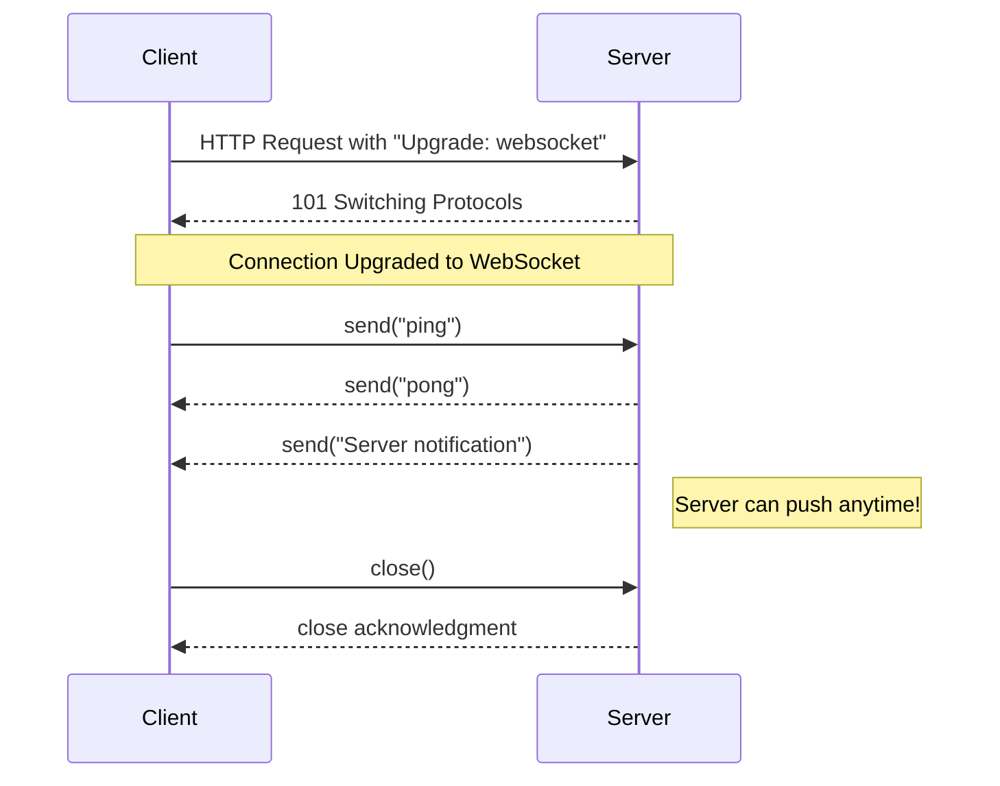
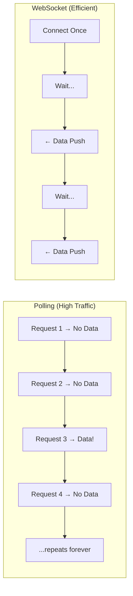
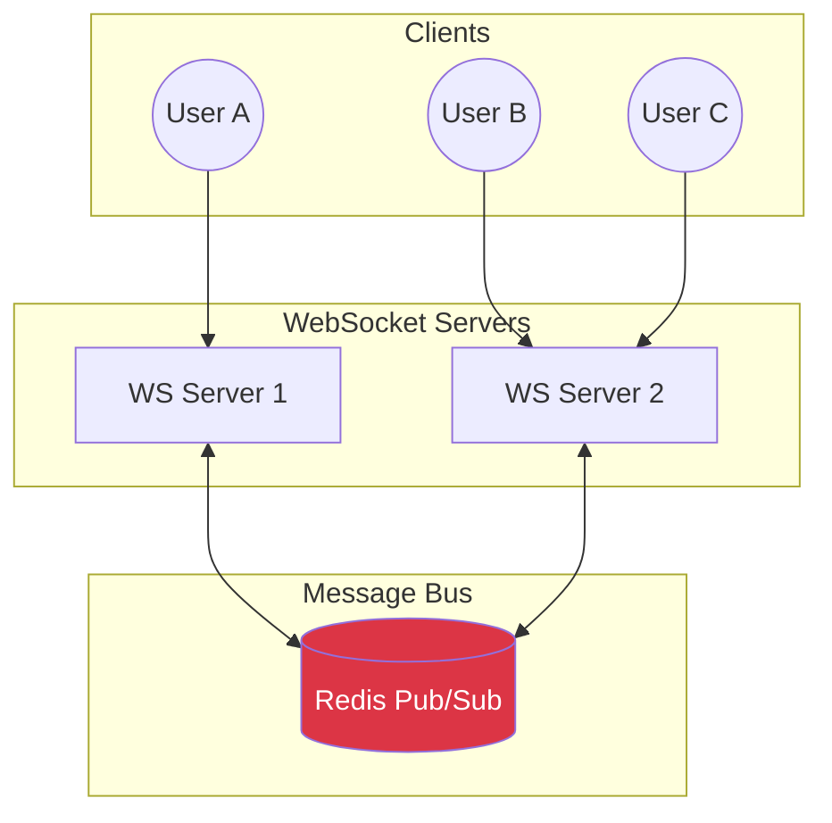
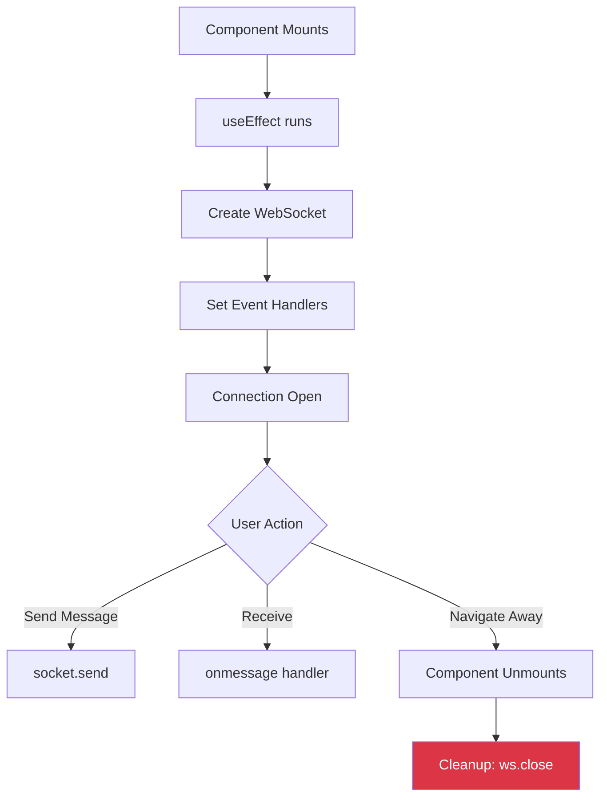

# WebSockets - Complete Revision Guide

> **Week 16 | Real-Time Communication with WebSockets**

---

## 📑 Table of Contents

1. [Theoretical Concepts](#1-theoretical-concepts)
   - [What is Polling?](#11-what-is-polling)
   - [What is WebSocket?](#12-what-is-websocket)
   - [Polling vs WebSocket Comparison](#13-polling-vs-websocket-comparison)
   - [Interview Question: Why WebSockets?](#14-interview-question-why-websockets-over-polling)
   - [WebSocket Connection States](#15-websocket-connection-states)
   - [Socket.IO vs Native WebSocket](#16-socketio-vs-native-websocket)
   - [Scaling WebSockets with Pub/Sub](#17-scaling-websockets-horizontal-scaling)
2. [Code & Patterns](#2-code--patterns)
   - [Backend: WebSocket Server (Node.js + ws)](#21-backend-websocket-server-nodejs--ws)
   - [Frontend: React WebSocket Client](#22-frontend-react-websocket-client)
   - [Project Setup & Configuration](#23-project-setup--configuration)
3. [Visual Aids (Mermaid Diagrams)](#3-visual-aids)
4. [Summary & Key Takeaways](#4-summary--key-takeaways)

---

## 1. Theoretical Concepts

### 1.1 What is Polling?

**Polling** is a technique where the client repeatedly asks the server for new data at regular intervals (e.g., every 1-5 seconds).

```javascript
// Short Polling Example
setInterval(async () => {
    const response = await fetch('/api/messages');
    const data = await response.json();
    updateUI(data);
}, 3000); // Poll every 3 seconds
```

**Types of Polling:**

| Type | Description |
|------|-------------|
| **Short Polling** | Client sends requests at fixed intervals regardless of whether data exists |
| **Long Polling** | Server holds the request open until new data is available, then responds |

> [!WARNING]
> Polling is **resource-intensive**. 90% of requests might return "no new data" — wasted bandwidth and server resources!

---

### 1.2 What is WebSocket?

**WebSocket** is a protocol providing **full-duplex (two-way) communication** over a single TCP connection. Once established, both client and server can send messages at any time without the overhead of HTTP requests.

**WebSocket Connection Lifecycle:**

1. Client initiates HTTP handshake with `Upgrade: websocket` header
2. Server responds with `101 Switching Protocols`
3. Connection is now upgraded to WebSocket
4. Both parties can send/receive messages freely
5. Either party can close the connection

**Key Characteristics:**
- **Persistent connection** — no repeated handshakes
- **Low latency** — sub-millisecond message delivery
- **Bidirectional** — server can push data without client asking
- **Minimal overhead** — 2-6 bytes per frame vs 800+ bytes for HTTP headers

---

### 1.3 Polling vs WebSocket Comparison

| Aspect | Polling | WebSocket |
|--------|---------|-----------|
| **Connection** | New connection per request | Single persistent connection |
| **Latency** | High (interval-based delay) | Low (real-time) |
| **Server Load** | High (constant requests) | Low (event-based) |
| **Bandwidth** | Wasteful (empty responses) | Efficient (only actual data) |
| **Complexity** | Simple to implement | More complex setup |
| **Scalability** | Poor for real-time apps | Excellent for real-time |
| **Direction** | Client → Server only | Bidirectional |
| **Overhead** | HTTP headers every request (~800 bytes) | Minimal after handshake (~2-6 bytes) |

---

### 1.4 Interview Question: Why WebSockets Over Polling?

> **Question:** *"Why don't you use polling instead of WebSockets?"*

**Answer (structured for interviews):**

1. **Real-time Requirements**
   - WebSockets: Sub-millisecond latency
   - Polling: Inherent delay based on interval
   - For chat apps, gaming, stock tickers — **milliseconds matter!**

2. **Resource Efficiency**
   - Polling: 1000 users × 1 request/sec = **1000 HTTP requests/sec**
   - WebSocket: 1000 persistent connections, messages **only when needed**

3. **Server Load**
   - Polling hammers the server even with no new data
   - WebSockets: Server pushes **only when there's actual data**

4. **Bandwidth Savings**
   - Polling: ~800 bytes HTTP overhead per request
   - WebSocket: ~2-10 bytes frame overhead

5. **Bidirectional Communication**
   - Polling: Unidirectional (client must ask)
   - WebSocket: Server can push updates **instantly**

6. **Battery & Mobile**
   - Constant polling drains mobile battery
   - WebSockets are more battery-friendly

> [!TIP]
> **When to use Polling instead:**
> - Simple use cases with infrequent updates (checking email every 5 min)
> - When WebSocket support is unavailable (old browsers, restrictive firewalls)
> - Very simple applications where real-time isn't critical

---

### 1.5 WebSocket Connection States

```javascript
ws.readyState // Check current state
```

| State | Value | Description |
|-------|-------|-------------|
| `CONNECTING` | 0 | Connection not yet open |
| `OPEN` | 1 | Connection is open and ready |
| `CLOSING` | 2 | Connection is closing |
| `CLOSED` | 3 | Connection is closed |

**Frame Types:**
- **Text frames** — UTF-8 encoded strings
- **Binary frames** — Raw binary data
- **Ping/Pong frames** — Heartbeat mechanism
- **Close frames** — Graceful connection termination

---

### 1.6 Socket.IO vs Native WebSocket

| Feature | Native WebSocket | Socket.IO |
|---------|-----------------|-----------|
| Automatic reconnection | ❌ Manual | ✅ Built-in |
| Room/namespace support | ❌ No | ✅ Yes |
| Fallback to polling | ❌ No | ✅ Yes |
| Built-in acknowledgments | ❌ No | ✅ Yes |
| Broadcast capabilities | ❌ Manual | ✅ Built-in |

**Use Native WebSocket when:**
- You need a lightweight solution
- Full control over the protocol
- No need for fallbacks

**Use Socket.IO when:**
- Building complex real-time apps
- Need rooms/namespaces
- Want automatic reconnection
- Need fallback support for older clients

---

### 1.7 Scaling WebSockets (Horizontal Scaling)

> [!IMPORTANT]
> **The Problem:** WebSocket connections are **stateful**. If User A connects to Server 1 and User B connects to Server 2, Server 1 doesn't know about User B's connection!

**Solution: Pub/Sub Architecture** (Redis, Kafka, NATS)

All WebSocket servers subscribe to a central message bus:

1. Server 1 receives a message from User A
2. Server 1 **publishes** the message to the Pub/Sub bus
3. Pub/Sub **broadcasts** to ALL subscribed servers
4. Server 2 receives the event, finds User B, and forwards the message

This enables horizontal scaling where servers don't need to know about each other's connections directly.

---

## 2. Code & Patterns

### 2.1 Backend: WebSocket Server (Node.js + `ws`)

```typescript
// 16.1-websockets.ts
import { WebSocketServer } from "ws";

const wss = new WebSocketServer({ port: 8080 });

wss.on("connection", (socket) => {
    console.log("New client connected");
    
    // Send welcome message immediately on connection
    socket.send('Hello, You are connected');
    
    // Handle incoming messages
    socket.on("message", (data) => {
        if (data.toString() === "ping") {
            socket.send("pong");
            console.log("pong sent");
        }
    });
    
    // Handle disconnection
    socket.on("close", () => {
        console.log("Client disconnected");
    });
});
```

**Key Insights:**

| Pattern | Purpose |
|---------|---------|
| `wss.on("connection", callback)` | Event-driven architecture — code runs when clients connect |
| `socket.send(message)` | Push data to client without them asking |
| `socket.on("message", ...)` | Listen for client messages |
| `data.toString()` | WebSocket data comes as Buffer — convert to string |

> [!NOTE]
> **Broadcasting to all clients:**
> ```typescript
> wss.clients.forEach((client) => {
>     if (client.readyState === WebSocket.OPEN) {
>         client.send(message);
>     }
> });
> ```

---

### 2.2 Frontend: React WebSocket Client

```tsx
// App.tsx
import { useState, useEffect, useRef } from 'react'

function App() {
  // useState for socket — can trigger re-renders if needed for UI state
  const [socket, setSocket] = useState<WebSocket | null>(null);
  
  // useRef for input — uncontrolled input, no unnecessary re-renders
  const inputRef = useRef<HTMLInputElement>(null);

  function sendMessage() {
    // Guard: Check socket exists, is open, and input has value
    if (socket && socket.readyState === WebSocket.OPEN && inputRef.current) {
      socket.send(inputRef.current.value);
      inputRef.current.value = ''; // Clear after sending
    }
  }

  useEffect(() => {
    // Create WebSocket connection on mount
    const ws = new WebSocket('ws://localhost:8080');
    setSocket(ws);

    ws.onerror = () => console.log('WebSocket error');
    ws.onopen = () => console.log('WebSocket open');
    ws.onmessage = (event) => alert(event.data);

    // Cleanup: Close connection on unmount
    return () => {
      ws.close();
    };
  }, []); // Empty dependency array = run once on mount

  return (
    <>
      <input ref={inputRef} type='text' placeholder='Message...' />
      <button onClick={sendMessage}>Send</button>
    </>
  );
}

export default App
```

**Key Insights:**

| Hook | Use Case |
|------|----------|
| `useState` for socket | Store the WebSocket instance; can trigger UI updates on state change |
| `useRef` for input | Direct DOM access without re-renders; **uncontrolled component** |
| `useEffect` with cleanup | Create connection on mount, **close on unmount** to prevent memory leaks |

**Critical Pattern — Cleanup Function:**
```tsx
return () => {
  ws.close(); // Always close WebSocket when component unmounts!
};
```

> [!CAUTION]
> **Common Port Mismatch Bug:** Ensure frontend connects to the **same port** as backend!
> - Backend: `new WebSocketServer({ port: 8080 })`
> - Frontend: `new WebSocket('ws://localhost:8080')` ✅

---

### 2.3 Project Setup & Configuration

**Backend `package.json`:**
```json
{
  "type": "module",
  "scripts": {
    "dev": "concurrently \"tsc -w\" \"nodemon ./dist/16.1-websockets.js\""
  },
  "devDependencies": {
    "concurrently": "^9.2.1",
    "typescript": "^5.9.3"
  },
  "dependencies": {
    "@types/ws": "^8.18.1",
    "ws": "^8.19.0"
  }
}
```

**Key Setup Patterns:**

| Setting | Purpose |
|---------|---------|
| `"type": "module"` | Enable ES Modules (`import`/`export`) |
| `concurrently "tsc -w" "nodemon ..."` | Run TypeScript compiler AND nodemon in parallel |
| `tsc -w` | Watch mode — recompile on file changes |
| `nodemon ./dist/...` | Auto-restart server when compiled JS changes |

**Backend `tsconfig.json`:**
```json
{
  "compilerOptions": {
    "rootDir": "src",      // Source files location
    "outDir": "dist",       // Compiled JS output
    "module": "nodenext",   // Node.js ES Module resolution
    "target": "esnext",     // Latest JavaScript features
    "strict": true          // Enable all strict type checks
  }
}
```

> [!WARNING]
> **Path Configuration Pitfall:** Paths in `tsconfig.json` are **relative to the config file location**, not the project root!

---

## 3. Visual Aids

### WebSocket Connection Lifecycle



### Polling vs WebSocket Traffic Comparison



### Horizontal Scaling with Pub/Sub



### React Component Lifecycle with WebSocket



---

## 4. Summary & Key Takeaways

### Quick Reference Card

| Concept | Key Point |
|---------|-----------|
| **Polling** | Repeated HTTP requests at intervals; simple but wasteful |
| **WebSocket** | Persistent bidirectional connection; efficient for real-time |
| **Connection States** | `CONNECTING` → `OPEN` → `CLOSING` → `CLOSED` |
| **Backend Setup** | Use `ws` library with `WebSocketServer` |
| **Frontend Setup** | Native `WebSocket` API + React hooks |
| **Cleanup** | **Always** close WebSocket in `useEffect` cleanup |
| **Scaling** | Use Pub/Sub (Redis) to sync multiple WS servers |

### Interview-Ready Points

1. **WebSockets provide true real-time** with sub-millisecond latency
2. **Single persistent connection** vs new connection per request
3. **Server can push data** without client asking (bidirectional)
4. **2-6 bytes overhead** per message vs 800+ bytes for HTTP
5. **Scale horizontally** with Pub/Sub architecture

### Common Gotchas

> [!CAUTION]
> - **Port mismatch** — ensure frontend connects to the correct backend port
> - **Missing cleanup** — always `ws.close()` on component unmount
> - **Forgetting `data.toString()`** — WebSocket data is a Buffer
> - **tsconfig paths** — relative to config file location, not project root
> - **Stateful connections** — can't simply load-balance without Pub/Sub

---

> **Created:** January 2026 | **Topic:** Week 16 - WebSockets
