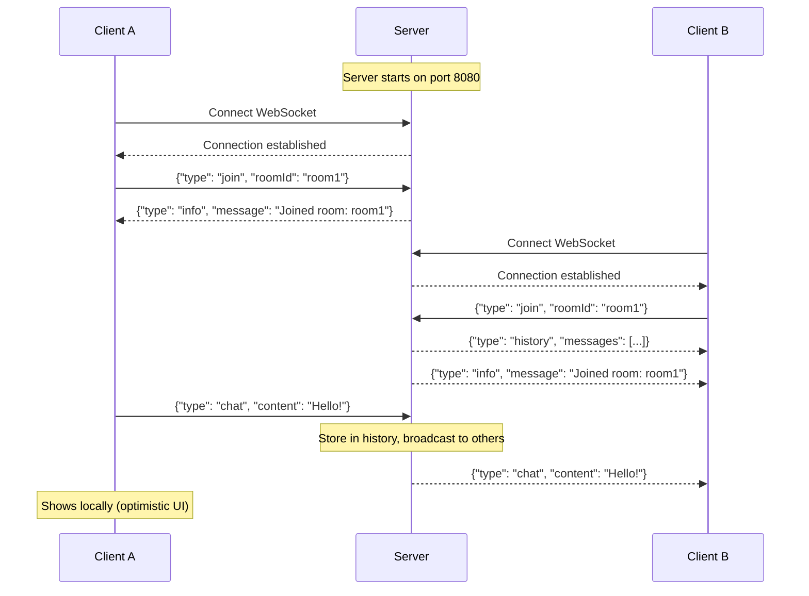
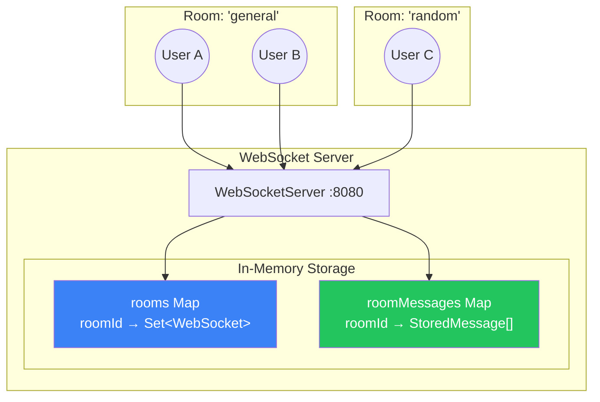
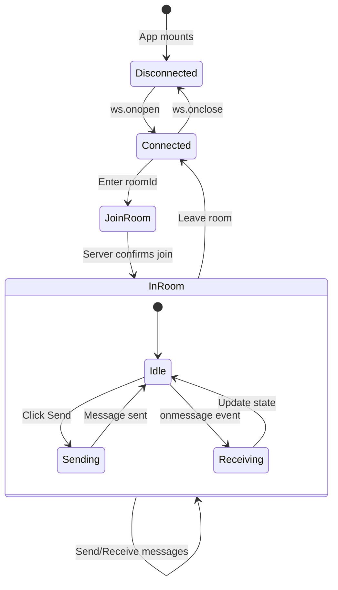
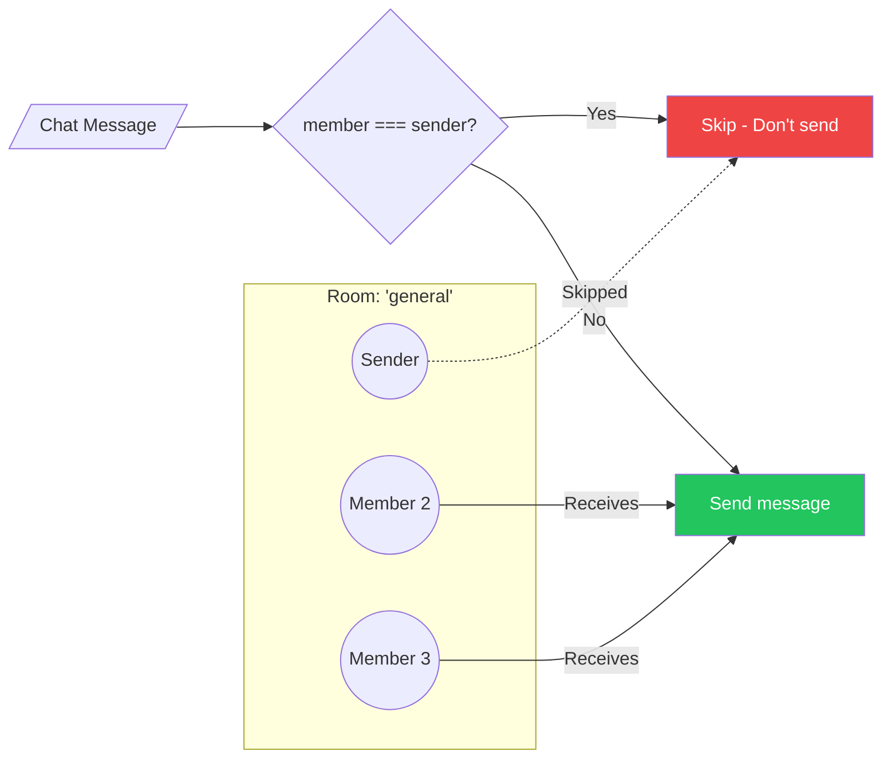

# Real-Time Chat Application - Complete Revision Guide

> **Week 16 | Building a Full-Stack Chat App with WebSockets, React & TypeScript**

---

## Table of Contents

1. [Theoretical Concepts](#1-theoretical-concepts)
   - [WebSocket Protocol Recap](#11-websocket-protocol-recap)
   - [Chat Application Architecture](#12-chat-application-architecture)
   - [Room-Based Messaging Pattern](#13-room-based-messaging-pattern)
   - [Message Types & Protocol Design](#14-message-types--protocol-design)
   - [Connection State Management](#15-connection-state-management)
   - [Message History & Persistence](#16-message-history--persistence)
2. [Code & Patterns](#2-code--patterns)
   - [Backend: Room-Based WebSocket Server](#21-backend-room-based-websocket-server)
   - [Frontend: React Chat Client](#22-frontend-react-chat-client)
   - [TypeScript Type Definitions](#23-typescript-type-definitions)
   - [Project Configuration](#24-project-configuration)
3. [Visual Aids](#3-visual-aids)
4. [Summary & Key Takeaways](#4-summary--key-takeaways)

---

## 1. Theoretical Concepts

### 1.1 WebSocket Protocol Recap

WebSocket is a protocol enabling **full-duplex communication** over a single TCP connection. Unlike HTTP's request-response model, WebSocket allows both client and server to send messages at any time.

**Key Characteristics:**
- **Persistent connection** — established once, stays open
- **Low latency** — messages delivered in milliseconds
- **Bidirectional** — server can push without client asking
- **Minimal overhead** — 2-6 bytes per frame (vs ~800 bytes HTTP headers)

**Connection Lifecycle:**

| Phase | Description |
|-------|-------------|
| **Handshake** | HTTP request with `Upgrade: websocket` header |
| **Open** | Server responds `101 Switching Protocols` |
| **Communication** | Both parties send/receive freely |
| **Close** | Either party initiates graceful termination |

---

### 1.2 Chat Application Architecture

Our chat application follows a **client-server architecture** with the following components:

| Component | Technology | Responsibility |
|-----------|------------|----------------|
| **Backend** | Node.js + `ws` library | WebSocket server, room management, message broadcasting |
| **Frontend** | React + TypeScript | UI, WebSocket client, state management |
| **Styling** | Tailwind CSS 4 | Modern, responsive UI |
| **Build Tool** | Vite | Fast development server, HMR |

**Data Flow:**
1. Client connects to WebSocket server
2. Client sends `join` message with room ID
3. Server adds client to room, sends message history
4. Client sends `chat` message with content
5. Server broadcasts to all room members (except sender)
6. On disconnect, server removes client from room

---

### 1.3 Room-Based Messaging Pattern

**Why Rooms?**

In a chat application, we don't want to broadcast every message to every connected user. Rooms allow us to:
- **Isolate conversations** — messages stay within their room
- **Scale efficiently** — only notify relevant users
- **Organize users** — group by topic, team, or purpose

**Room Data Structures:**

```typescript
// Map: roomId -> Set of WebSocket connections
const rooms: Map<string, Set<WebSocket>> = new Map();

// Map: roomId -> Array of stored messages
const roomMessages: Map<string, StoredMessage[]> = new Map();
```

**Key Insight:** Using a `Set` for room members ensures:
- O(1) add/remove operations
- No duplicate connections
- Easy membership checks with `set.has(socket)`

---

### 1.4 Message Types & Protocol Design

Our chat protocol uses JSON messages with a `type` discriminator field. This pattern is called a **Discriminated Union** in TypeScript.

**Message Types:**

| Type | Direction | Purpose | Payload |
|------|-----------|---------|---------|
| `join` | Client → Server | Join a room | `{ roomId: string }` |
| `chat` | Client → Server | Send message | `{ content: string }` |
| `chat` | Server → Client | Receive message | `{ content: string }` |
| `history` | Server → Client | Past messages | `{ messages: StoredMessage[] }` |
| `info` | Server → Client | System message | `{ message: string }` |
| `error` | Server → Client | Error message | `{ message: string }` |

**Key Insight:** Using a `type` field allows the receiver to handle each message type differently:

```typescript
if (data.type === "join") { /* handle join */ }
else if (data.type === "chat") { /* handle chat */ }
else if (data.type === "history") { /* handle history */ }
```

---

### 1.5 Connection State Management

WebSocket connections have 4 possible states:

| State | Value | Description |
|-------|-------|-------------|
| `CONNECTING` | 0 | Connection not yet established |
| `OPEN` | 1 | Ready to send/receive |
| `CLOSING` | 2 | Close initiated |
| `CLOSED` | 3 | Connection terminated |

**Critical Check Before Sending:**

```typescript
if (member.readyState === WebSocket.OPEN) {
    member.send(JSON.stringify({ type: "chat", content }));
}
```

**Why This Matters:** Without this check, sending to a closing/closed connection throws an error and can crash your server.

---

### 1.6 Message History & Persistence

**The Problem:** When a new user joins a room, they miss all previous messages.

**The Solution:** Store messages in memory and send history on join.

```typescript
interface StoredMessage {
    content: string;
    timestamp: number;
}
```

**Trade-offs:**

| Approach | Pros | Cons |
|----------|------|------|
| **In-memory** (our approach) | Fast, simple | Lost on server restart |
| **Database** (MongoDB, Redis) | Persistent, scalable | More complexity, latency |
| **Hybrid** | Best of both | Most complex |

**Key Insight:** For learning purposes, in-memory storage is sufficient. Production apps should use a database.

---

## 2. Code & Patterns

### 2.1 Backend: Room-Based WebSocket Server

```typescript
// chat-backend/src/index.ts
import { WebSocketServer, WebSocket } from "ws";

const wss = new WebSocketServer({ port: 8080 });

// Data structures for room management
const rooms: Map<string, Set<WebSocket>> = new Map();
const roomMessages: Map<string, StoredMessage[]> = new Map();

// Type definitions for message protocol
interface StoredMessage {
    content: string;
    timestamp: number;
}

interface JoinMessage {
    type: "join";
    roomId: string;
}

interface ChatMessageContent {
    type: "chat";
    content: string;
}

type ChatMessage = JoinMessage | ChatMessageContent;

wss.on("connection", (socket) => {
    console.log("New client connected");

    socket.on("message", (message: Buffer) => {
        try {
            const parsedMessage: ChatMessage = JSON.parse(message.toString());

            if (parsedMessage.type === "join") {
                handleJoin(socket, parsedMessage.roomId);
            } else if (parsedMessage.type === "chat") {
                handleChat(socket, parsedMessage.content);
            }
        } catch (error) {
            socket.send(JSON.stringify({
                type: "error",
                message: "Invalid message format. Use JSON."
            }));
        }
    });

    socket.on("close", () => handleDisconnect(socket));
});
```

**Key Patterns Explained:**

| Pattern | Code | Purpose |
|---------|------|---------|
| **Event-driven** | `wss.on("connection", ...)` | React to connections, not poll |
| **Message parsing** | `JSON.parse(message.toString())` | Convert Buffer to object |
| **Type narrowing** | `if (parsedMessage.type === "join")` | TypeScript knows exact type |
| **Error handling** | `try/catch` around parse | Graceful handling of bad JSON |

**Handling Join:**

```typescript
function handleJoin(socket: WebSocket, roomId: string) {
    // Create room if it doesn't exist
    if (!rooms.has(roomId)) {
        rooms.set(roomId, new Set());
        roomMessages.set(roomId, []);
    }

    // Add socket to room
    rooms.get(roomId)!.add(socket);

    // Send message history to new member
    const history = roomMessages.get(roomId) || [];
    if (history.length > 0) {
        socket.send(JSON.stringify({
            type: "history",
            messages: history,
        }));
    }

    // Confirm join
    socket.send(JSON.stringify({ 
        type: "info", 
        message: `Joined room: ${roomId}` 
    }));
}
```

**Key Insight:** The `!` after `rooms.get(roomId)` is the non-null assertion operator. We know the room exists because we just created it.

**Handling Chat (Broadcast to Others):**

```typescript
function handleChat(socket: WebSocket, content: string) {
    // Find which room this socket is in
    const roomEntry = Array.from(rooms.entries()).find(([_, members]) =>
        members.has(socket)
    );

    if (!roomEntry) {
        socket.send(JSON.stringify({
            type: "error",
            message: "You must join a room first"
        }));
        return;
    }

    const [roomId, members] = roomEntry;

    // Store message in history
    roomMessages.get(roomId)!.push({
        content,
        timestamp: Date.now(),
    });

    // Broadcast to all members EXCEPT sender
    members.forEach((member: WebSocket) => {
        if (member === socket) return; // Skip sender!
        
        if (member.readyState === WebSocket.OPEN) {
            member.send(JSON.stringify({ type: "chat", content }));
        }
    });
}
```

**Key Insight:** `if (member === socket) return;` prevents the sender from receiving their own message. The frontend already displays sent messages locally.

**Handling Disconnect:**

```typescript
socket.on("close", () => {
    rooms.forEach((members, roomId) => {
        if (members.has(socket)) {
            members.delete(socket);
            // Clean up empty rooms (but keep messages)
            if (members.size === 0) {
                rooms.delete(roomId);
            }
        }
    });
});
```

---

### 2.2 Frontend: React Chat Client

**State Management:**

```tsx
// chat-frontend/src/App.tsx
const [messages, setMessages] = useState<Message[]>([]);
const [inputMessage, setInputMessage] = useState("");
const [roomId, setRoomId] = useState("");
const [joined, setJoined] = useState(false);
const [connected, setConnected] = useState(false);

// useRef for WebSocket - doesn't need re-renders
const wsRef = useRef<WebSocket | null>(null);
```

**Key Insight:** Using `useRef` for the WebSocket instance because:
- We don't need re-renders when the socket changes
- We need a stable reference across renders
- Prevents recreation on every render

**WebSocket Connection with Cleanup:**

```tsx
useEffect(() => {
    const ws = new WebSocket("ws://localhost:8080");

    ws.onopen = () => {
        console.log("Connected to server");
        setConnected(true);
    };

    ws.onmessage = (event) => {
        const data = JSON.parse(event.data);
        
        if (data.type === "history") {
            // Replace messages with history
            const historyMessages = data.messages.map((msg: StoredMessage) => ({
                type: "history",
                content: msg.content,
            }));
            setMessages(historyMessages);
        } else if (data.type === "chat") {
            // Append new message
            setMessages(prev => [...prev, { 
                type: "received", 
                content: data.content 
            }]);
        }
    };

    ws.onclose = () => {
        setConnected(false);
        setJoined(false);
    };

    wsRef.current = ws;

    // CRITICAL: Cleanup on unmount
    return () => {
        ws.close();
    };
}, []);
```

**Key Insight:** The cleanup function `return () => { ws.close(); }` is **essential**. Without it:
- Connections stay open when navigating away
- Memory leaks accumulate
- Server resources are wasted

**Sending Messages (Optimistic UI):**

```tsx
const sendMessage = () => {
    if (!inputMessage.trim() || !wsRef.current || !joined) return;

    const message = inputMessage.trim();
    
    // Send to server
    wsRef.current.send(JSON.stringify({ type: "chat", content: message }));

    // Immediately show in UI (optimistic update)
    setMessages(prev => [...prev, { type: "sent", content: message }]);
    
    setInputMessage("");
};
```

**Key Insight:** We add the message to local state **immediately** without waiting for server confirmation. This is called an **optimistic UI update** — it makes the app feel instant.

**Message Display with Conditional Styling:**

```tsx
{messages.map((msg, idx) => (
    <div
        key={idx}
        className={`flex ${
            msg.type === "sent" ? "justify-end" : "justify-start"
        }`}
    >
        <div
            className={`px-4 py-2 rounded-2xl ${
                msg.type === "sent"
                    ? "bg-blue-600 text-white"      // Sent: blue, right
                    : msg.type === "history"
                    ? "bg-slate-600/50 text-slate-300"  // History: faded
                    : "bg-slate-700 text-slate-100"     // Received: gray, left
            }`}
        >
            {msg.content}
        </div>
    </div>
))}
```

---

### 2.3 TypeScript Type Definitions

**Backend Types:**

```typescript
// Stored message structure
interface StoredMessage {
    content: string;
    timestamp: number;
}

// Discriminated union for incoming messages
interface JoinMessage {
    type: "join";
    roomId: string;
}

interface ChatMessageContent {
    type: "chat";
    content: string;
}

type ChatMessage = JoinMessage | ChatMessageContent;
```

**Frontend Types:**

```typescript
// UI message with display type
interface Message {
    type: "sent" | "received" | "history";
    content: string;
}

// Matches backend StoredMessage
interface StoredMessage {
    content: string;
    timestamp: number;
}
```

**Key Insight:** The `type` field in `Message` controls display:
- `"sent"` → Blue bubble, right-aligned (your messages)
- `"received"` → Gray bubble, left-aligned (others' messages)
- `"history"` → Faded style, left-aligned (past messages)

---

### 2.4 Project Configuration

**Backend `package.json`:**

```json
{
    "type": "module",
    "scripts": {
        "dev": "concurrently \"tsc -w\" \"nodemon --delay 1 --watch dist ./dist/index.js\""
    },
    "dependencies": {
        "ws": "^8.19.0"
    },
    "devDependencies": {
        "typescript": "^5.9.3",
        "@types/ws": "^8.18.1",
        "concurrently": "^9.2.1",
        "nodemon": "^3.1.9"
    }
}
```

**Key Pattern:** `concurrently` runs TypeScript compiler and nodemon in parallel:
1. `tsc -w` watches for changes, compiles to `/dist`
2. `nodemon --watch dist` restarts server when compiled JS changes
3. `--delay 1` prevents race condition (waits for compilation)

**Frontend `vite.config.ts` (Tailwind CSS 4):**

```typescript
import { defineConfig } from "vite";
import react from "@vitejs/plugin-react";
import tailwindcss from "@tailwindcss/vite";

export default defineConfig({
    plugins: [react(), tailwindcss()],
});
```

**Frontend `src/index.css`:**

```css
@import "tailwindcss";
```

**Key Insight:** Tailwind CSS 4 uses the Vite plugin approach. No `tailwind.config.js` needed — it auto-detects your content files.

---

## 3. Visual Aids

### Chat Application Data Flow



### Room Management Architecture



### Frontend Component State Flow



### Message Type Decision Tree

```mermaid
flowchart TD
    A[Receive Message] --> B{Parse JSON}
    B -->|Success| C{Check type}
    B -->|Fail| D[Log error]
    
    C -->|"join"| E[Add to room<br/>Send history<br/>Confirm join]
    C -->|"chat"| F{In a room?}
    C -->|"history"| G[Replace messages<br/>with history]
    C -->|"info"| H[Log to console]
    C -->|"error"| I[Show error]
    
    F -->|Yes| J[Store message<br/>Broadcast to others]
    F -->|No| K[Send error:<br/>"Join room first"]
    
    style E fill:#22c55e,color:#fff
    style J fill:#3b82f6,color:#fff
    style K fill:#ef4444,color:#fff
```

### Broadcast Logic (Skip Sender)



---

## 4. Summary & Key Takeaways

### Quick Reference Card

| Concept | Implementation | Purpose |
|---------|----------------|---------|
| **Room Storage** | `Map<string, Set<WebSocket>>` | Track which sockets are in which room |
| **Message History** | `Map<string, StoredMessage[]>` | Persist messages for new joiners |
| **Skip Sender** | `if (member === socket) return` | Don't echo back to sender |
| **Optimistic UI** | Add to state before server confirms | Instant feedback |
| **Cleanup** | `return () => ws.close()` | Prevent memory leaks |
| **Type Safety** | Discriminated unions | TypeScript knows exact message type |

### Architecture Decisions Explained

| Decision | Why? |
|----------|------|
| **`ws` library (not Socket.IO)** | Learning fundamentals, minimal abstraction |
| **In-memory storage** | Simplicity for learning; production needs DB |
| **JSON protocol** | Human-readable, easy to debug |
| **`useRef` for socket** | No re-renders needed, stable reference |
| **Tailwind CSS 4** | Modern utility-first, Vite plugin integration |

### Common Bugs & Fixes

| Bug | Cause | Fix |
|-----|-------|-----|
| "Joined room: undefined" | Wrong property name (`room` vs `roomId`) | Match client and server property names |
| Messages not received | Sender receives own message | Check `member === socket` before send |
| Connection errors | Wrong port | Ensure frontend connects to `ws://localhost:8080` |
| Memory leaks | Missing cleanup | Add `return () => ws.close()` in useEffect |
| "Cannot read property of undefined" | Room doesn't exist | Create room before adding members |

### Interview-Ready Points

1. **Why skip sending to sender?**
   - Avoids duplicate messages (UI already shows sent message)
   - Reduces bandwidth
   - Cleaner user experience

2. **Why use `Set` for room members?**
   - O(1) add/remove/check operations
   - Automatically prevents duplicates
   - Memory efficient

3. **Why optimistic UI updates?**
   - Instant feedback to user
   - App feels faster
   - Server confirmation is implicit (no error = success)

4. **Why discriminated unions for messages?**
   - TypeScript can narrow types based on `type` field
   - Compiler ensures all cases handled
   - Self-documenting protocol

### Running the Application

```bash
# Terminal 1: Start backend
cd chat-backend
npm install
npm run dev

# Terminal 2: Start frontend  
cd chat-frontend
npm install
npm run dev

# Open http://localhost:5173 in multiple tabs
# Join the same room to chat!
```

---

> **Created:** January 2026 | **Topic:** Week 16 - Real-Time Chat Application
