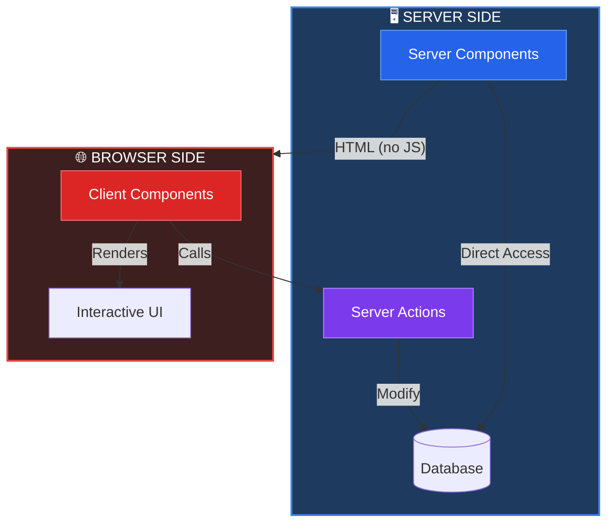
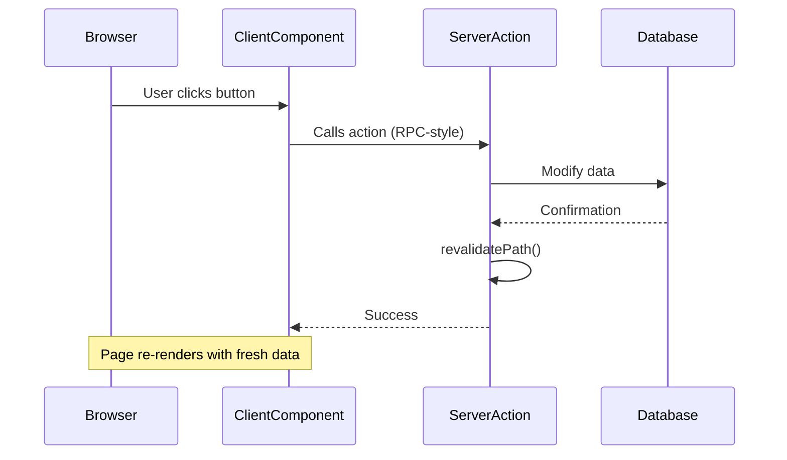
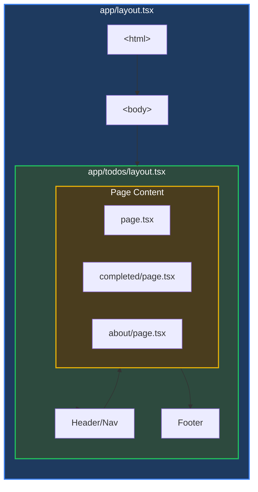
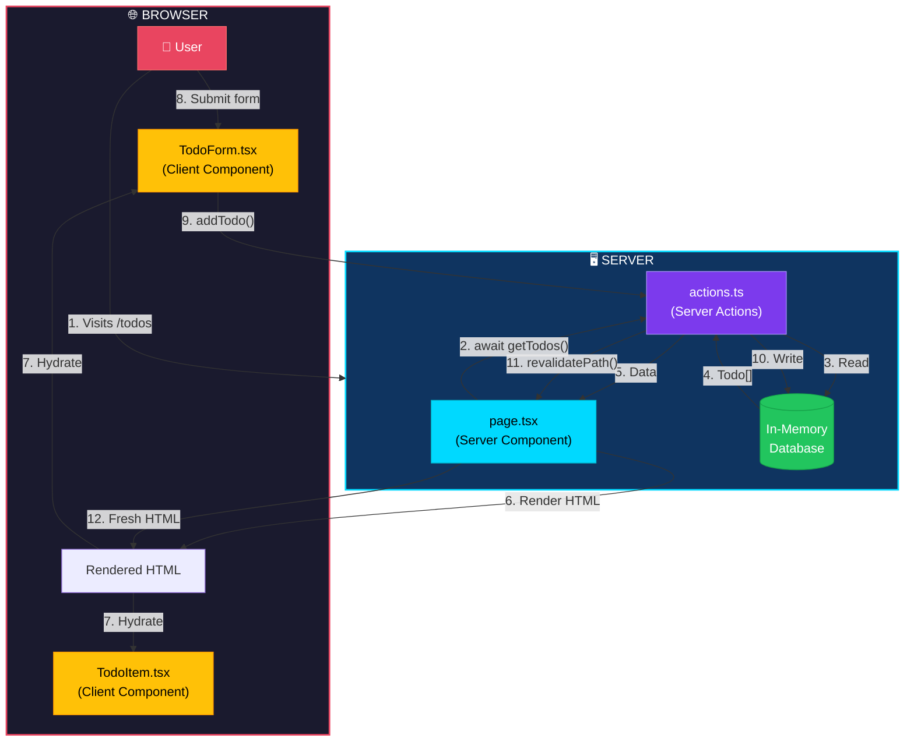
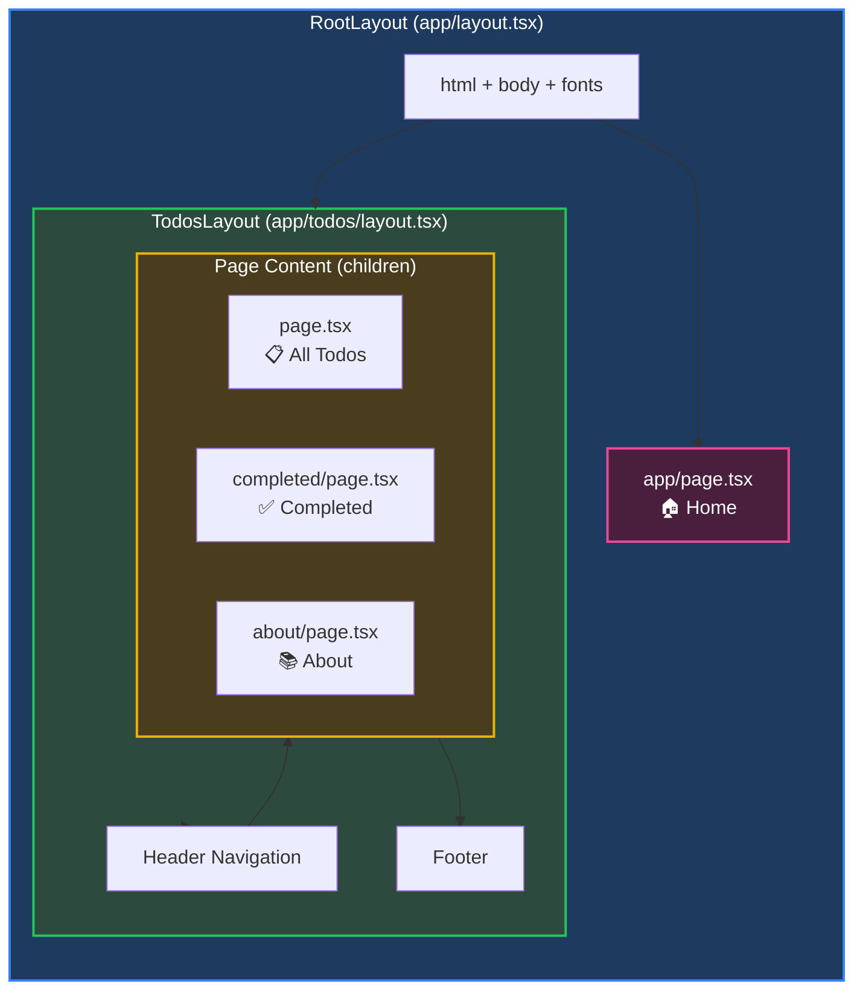
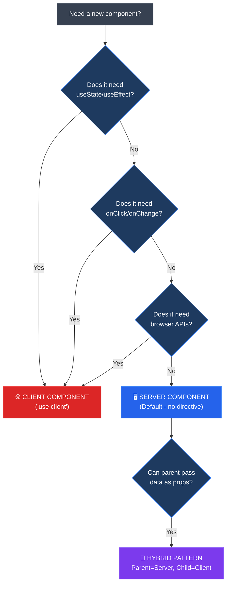
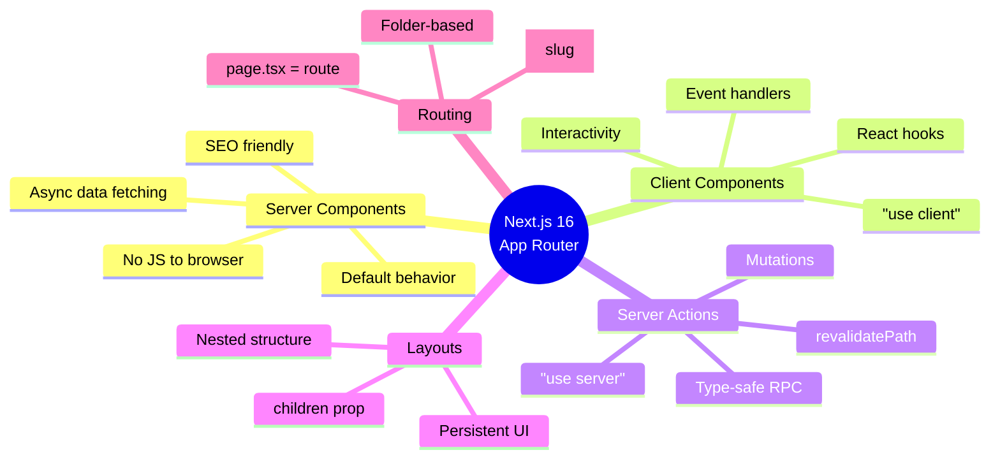

# 🚀 Next.js 16 App Router - Complete Revision Guide

> **Master Next.js App Router**: Server Components, Client Components, Server Actions, Layouts, and File-Based Routing — all in one comprehensive guide.

This document consolidates all concepts, theories, and code patterns from this Next.js learning project. Use it as a standalone revision guide without needing to open individual source files.

---

## 📑 Table of Contents

1. [Project Overview](#-project-overview)
2. [Key Theoretical Concepts](#-key-theoretical-concepts)
   - [App Router vs Pages Router](#app-router-vs-pages-router)
   - [Server vs Client Components](#server-vs-client-components)
   - [Server Actions](#server-actions)
   - [Layouts and Nesting](#layouts-and-nesting)
   - [File-Based Routing](#file-based-routing)
3. [Project Structure](#-project-structure)
4. [Code Patterns & Examples](#-code-patterns--examples)
   - [Root Layout Pattern](#1-root-layout-pattern)
   - [Nested Layout Pattern](#2-nested-layout-pattern)
   - [Server Component Pattern](#3-server-component-pattern)
   - [Client Component Pattern](#4-client-component-pattern)
   - [Server Actions Pattern](#5-server-actions-pattern)
   - [Form Handling with useTransition](#6-form-handling-with-usetransition)
5. [Visual Architecture Diagrams](#-visual-architecture-diagrams)
6. [Configuration Files Explained](#-configuration-files-explained)
7. [Tailwind CSS v4 Integration](#-tailwind-css-v4-integration)
8. [Common Patterns & Best Practices](#-common-patterns--best-practices)
9. [Summary & Key Takeaways](#-summary--key-takeaways)

---

## 🎯 Project Overview

This project is a **Next.js 16 App Router** learning example featuring a Todo application that demonstrates:

- ✅ Server Components (default) for data fetching
- ✅ Client Components for interactivity
- ✅ Server Actions for mutations
- ✅ Nested Layouts for shared UI
- ✅ TypeScript for type safety
- ✅ Tailwind CSS v4 for styling

```
Technology Stack:
├── Next.js 16.1.3
├── React 19.2.3
├── TypeScript 5.x
├── Tailwind CSS v4
└── ESLint 9.x
```

---

## 📚 Key Theoretical Concepts

### App Router vs Pages Router

Next.js transitioned from the **Pages Router** to the **App Router** in version 13. The App Router is now the recommended approach.

| Feature | Pages Router (Legacy) | App Router (Current) |
|---------|----------------------|---------------------|
| **Directory** | `pages/` | `app/` |
| **Page File** | `pages/about.tsx` | `app/about/page.tsx` |
| **Global Layout** | `pages/_app.tsx` | `app/layout.tsx` |
| **HTML Document** | `pages/_document.tsx` | Part of `layout.tsx` |
| **API Routes** | `pages/api/hello.ts` | `app/api/hello/route.ts` |
| **Data Fetching** | `getServerSideProps` | async components |
| **Default** | Client Components | **Server Components** |

> **Key Insight**: The App Router uses a folder-based structure where each folder represents a route segment, and special files like `page.tsx` and `layout.tsx` define the UI.

---

### Server vs Client Components



#### Server Components (Default)

**What they ARE:**
- Run **ONLY** on the server
- Can be `async` functions
- Can directly access databases, file systems, environment variables
- Output is pure HTML — no JavaScript sent to browser
- Used for data fetching and rendering static UI

**What they CANNOT do:**
- Use React hooks (`useState`, `useEffect`, `useRef`)
- Handle user events (`onClick`, `onChange`, `onSubmit`)
- Access browser APIs (`window`, `document`, `localStorage`)

```tsx
// ✅ SERVER COMPONENT (default - no directive needed)
export default async function TodosPage() {
  // Direct data fetching - no useEffect!
  const todos = await getTodos();
  
  return (
    <div>
      {todos.map(todo => <span key={todo.id}>{todo.text}</span>)}
    </div>
  );
}
```

#### Client Components

**What they ARE:**
- Run in the browser (also pre-render on server for initial HTML)
- Can use all React hooks
- Handle user interactions
- Shipped as JavaScript to the browser
- Marked with `"use client"` directive at the top

**When to use:**
- Forms with input state
- Click/hover/focus handlers
- Browser APIs needed
- Real-time updates

```tsx
// ✅ CLIENT COMPONENT
"use client";

import { useState } from "react";

export function Counter() {
  const [count, setCount] = useState(0);
  
  return (
    <button onClick={() => setCount(c => c + 1)}>
      Count: {count}
    </button>
  );
}
```

> **Key Insight**: Start with Server Components. Only add `"use client"` when you need interactivity. This minimizes JavaScript sent to the browser.

---

### Server Actions

Server Actions are functions that run **only on the server** but can be **called from client components**. They're like API endpoints, but simpler!



**Key Features:**
- Marked with `"use server"` directive
- Can be called from form `action` attribute or programmatically
- Type-safe (TypeScript works across client-server boundary)
- `revalidatePath()` refreshes the UI after mutations

```tsx
// actions.ts
"use server";

import { revalidatePath } from "next/cache";

export async function addTodo(formData: FormData) {
  const text = formData.get("text") as string;
  
  // Server-side logic (database, validation, etc.)
  todos.push({ id: Date.now().toString(), text, completed: false });
  
  // Tell Next.js to refresh the page data
  revalidatePath("/todos");
}
```

---

### Layouts and Nesting

Layouts are UI components that **wrap pages** and other layouts. They:
- Persist across page navigations (don't re-render)
- Share UI elements (headers, sidebars, footers)
- Can be nested based on folder structure



**Layout Nesting Order:**
1. **Root Layout** (`app/layout.tsx`) - Required, has `<html>` and `<body>`
2. **Nested Layout** (`app/todos/layout.tsx`) - Optional, wraps `/todos/*` routes
3. **Page** (`app/todos/page.tsx`) - The actual content

> **Key Insight**: When navigating between `/todos` and `/todos/completed`, only the page content changes. The layout (header, footer) stays mounted and doesn't re-render!

---

### File-Based Routing

| File Path | URL Route | Purpose |
|-----------|-----------|---------|
| `app/page.tsx` | `/` | Home page |
| `app/todos/page.tsx` | `/todos` | Todos page |
| `app/todos/completed/page.tsx` | `/todos/completed` | Completed todos |
| `app/todos/about/page.tsx` | `/todos/about` | About page |
| `app/blog/[slug]/page.tsx` | `/blog/hello-world` | Dynamic route |
| `app/(marketing)/pricing/page.tsx` | `/pricing` | Route group |

**Special Files in `app/`:**

| File | Purpose |
|------|---------|
| `page.tsx` | Page content (required for route) |
| `layout.tsx` | Shared layout wrapper |
| `loading.tsx` | Loading UI (Suspense fallback) |
| `error.tsx` | Error boundary UI |
| `not-found.tsx` | 404 page |
| `route.ts` | API endpoint |
| `template.tsx` | Re-renders on each navigation |

---

## 📁 Project Structure

```
my-app/
├── app/                          # App Router directory
│   ├── favicon.ico              # Browser tab icon
│   ├── globals.css              # Global styles (Tailwind v4)
│   ├── layout.tsx               # Root layout (html, body, fonts)
│   ├── page.tsx                 # Home page (/)
│   └── todos/                   # /todos route
│       ├── layout.tsx           # Nested layout (header, footer)
│       ├── page.tsx             # Main todos page
│       ├── actions.ts           # Server Actions
│       ├── TodoForm.tsx         # Client Component (form)
│       ├── TodoItem.tsx         # Client Component (list item)
│       ├── about/
│       │   └── page.tsx         # /todos/about
│       └── completed/
│           └── page.tsx         # /todos/completed
├── public/                       # Static assets
│   ├── next.svg
│   └── *.svg
├── next.config.ts               # Next.js configuration
├── tsconfig.json                # TypeScript configuration
├── postcss.config.mjs           # PostCSS (Tailwind v4)
├── eslint.config.mjs            # ESLint configuration
└── package.json                 # Dependencies & scripts
```

---

## 💻 Code Patterns & Examples

### 1. Root Layout Pattern

The root layout is **required** in App Router. It defines the HTML document structure.

```tsx
// app/layout.tsx
import type { Metadata } from "next";
import { Geist, Geist_Mono } from "next/font/google";
import "./globals.css";

// Font optimization - Next.js downloads at build time
const geistSans = Geist({
  variable: "--font-geist-sans",
  subsets: ["latin"],
});

// SEO metadata
export const metadata: Metadata = {
  title: "Create Next App",
  description: "Generated by create next app",
};

export default function RootLayout({
  children,
}: {
  children: React.ReactNode;
}) {
  return (
    <html lang="en">
      <body className={`${geistSans.variable} antialiased`}>
        {children}  {/* ← Page content injected here */}
      </body>
    </html>
  );
}
```

**Key Insights:**
- `next/font/google` downloads fonts at build time — no runtime requests to Google
- `metadata` export generates `<title>` and `<meta>` tags for SEO
- `{children}` is where page/nested layout content renders
- This layout persists across ALL navigations

---

### 2. Nested Layout Pattern

Nested layouts wrap only their segment's pages, preserving state on navigation.

```tsx
// app/todos/layout.tsx
import Link from "next/link";

export default function TodosLayout({
  children,
}: {
  children: React.ReactNode;
}) {
  return (
    <div className="min-h-screen bg-gradient-to-br from-slate-900 to-slate-800">
      {/* Header - Persists across /todos/* pages */}
      <header className="border-b border-slate-700">
        <nav className="flex items-center gap-4">
          <Link href="/todos">All Todos</Link>
          <Link href="/todos/completed">Completed</Link>
          <Link href="/todos/about">About</Link>
        </nav>
      </header>

      {/* Page content injected here */}
      <main>{children}</main>

      {/* Footer - Also persists */}
      <footer className="border-t border-slate-700">
        This layout wraps all /todos/* pages
      </footer>
    </div>
  );
}
```

**Key Insights:**
- Only appears on `/todos/*` routes
- Header and footer don't re-render when navigating between todo pages
- Great for dashboards, admin panels, or sections with shared navigation

---

### 3. Server Component Pattern

Server Components fetch data directly and render HTML on the server.

```tsx
// app/todos/page.tsx - SERVER COMPONENT
import { getTodos } from "./actions";
import { TodoForm } from "./TodoForm";
import { TodoItem } from "./TodoItem";

// Notice: async function! Only possible in Server Components
export default async function TodosPage() {
  // Direct data fetching - no useEffect needed!
  const todos = await getTodos();

  return (
    <div>
      {/* Client Components can be used inside Server Components */}
      <TodoForm />
      
      {todos.length === 0 ? (
        <p>No todos yet! Add one above.</p>
      ) : (
        todos.map((todo) => (
          <TodoItem key={todo.id} todo={todo} />
        ))
      )}
      
      {/* Stats rendered on server */}
      <footer>
        <span>{todos.filter(t => !t.completed).length} remaining</span>
        <span>{todos.filter(t => t.completed).length} completed</span>
      </footer>
    </div>
  );
}
```

**Key Insights:**
- No `"use client"` directive = Server Component
- Can be `async` and directly `await` data
- Compose Client Components inside Server Components
- Static parts (like stats) rendered on server = smaller JS bundle

---

### 4. Client Component Pattern

Client Components handle interactivity with hooks and event handlers.

```tsx
// app/todos/TodoItem.tsx - CLIENT COMPONENT
"use client";

import { useTransition } from "react";
import { toggleTodo, deleteTodo, type Todo } from "./actions";

type TodoItemProps = {
  todo: Todo;
};

export function TodoItem({ todo }: TodoItemProps) {
  // Separate transitions for independent loading states
  const [isToggling, startToggleTransition] = useTransition();
  const [isDeleting, startDeleteTransition] = useTransition();

  const isPending = isToggling || isDeleting;

  const handleToggle = () => {
    startToggleTransition(async () => {
      await toggleTodo(todo.id);  // Calls Server Action!
    });
  };

  const handleDelete = () => {
    startDeleteTransition(async () => {
      await deleteTodo(todo.id);  // Calls Server Action!
    });
  };

  return (
    <div className={isPending ? "opacity-50" : ""}>
      <button 
        onClick={handleToggle}
        disabled={isPending}
      >
        {todo.completed ? "✓" : "○"}
        {isToggling && "..."}
      </button>
      
      <span className={todo.completed ? "line-through" : ""}>
        {todo.text}
      </span>
      
      <button 
        onClick={handleDelete}
        disabled={isPending}
      >
        {isDeleting ? "Deleting..." : "Delete"}
      </button>
    </div>
  );
}
```

**Key Insights:**
- `"use client"` at top marks this as Client Component
- `useTransition` provides pending state during async operations
- Multiple transitions = independent loading states per action
- Server Actions (`toggleTodo`, `deleteTodo`) called from onClick handlers

---

### 5. Server Actions Pattern

Server Actions are the bridge between client and server, replacing API routes for mutations.

```tsx
// app/todos/actions.ts
"use server";  // ENTIRE file is server-only

import { revalidatePath } from "next/cache";

// Type definition
export type Todo = {
  id: string;
  text: string;
  completed: boolean;
  createdAt: Date;
};

// In-memory "database" (use Prisma/MongoDB in production)
let todos: Todo[] = [
  { id: "1", text: "Learn Next.js", completed: true, createdAt: new Date() },
  { id: "2", text: "Build something", completed: false, createdAt: new Date() },
];

// READ operation
export async function getTodos(): Promise<Todo[]> {
  await new Promise(r => setTimeout(r, 100)); // Simulate latency
  return [...todos].sort((a, b) => b.createdAt.getTime() - a.createdAt.getTime());
}

// CREATE operation
export async function addTodo(formData: FormData): Promise<void> {
  const text = formData.get("text") as string;
  
  if (!text?.trim()) {
    throw new Error("Todo text cannot be empty");
  }

  todos.push({
    id: Date.now().toString(),
    text: text.trim(),
    completed: false,
    createdAt: new Date(),
  });

  revalidatePath("/todos");  // ← Refresh the page!
}

// UPDATE operation
export async function toggleTodo(id: string): Promise<void> {
  const todo = todos.find(t => t.id === id);
  if (todo) todo.completed = !todo.completed;
  revalidatePath("/todos");
}

// DELETE operation
export async function deleteTodo(id: string): Promise<void> {
  todos = todos.filter(t => t.id !== id);
  revalidatePath("/todos");
}
```

**Key Insights:**
- `"use server"` marks the entire file as server-only
- These functions can access databases, file systems, secrets
- `revalidatePath("/todos")` tells Next.js to re-fetch and re-render
- Parameters are automatically serialized across client-server boundary
- Type safety works across the boundary with TypeScript

---

### 6. Form Handling with useTransition

Modern form handling in Next.js uses the `action` attribute and `useTransition`.

```tsx
// app/todos/TodoForm.tsx
"use client";

import { useRef, useState, useTransition } from "react";
import { addTodo } from "./actions";

export function TodoForm() {
  const formRef = useRef<HTMLFormElement>(null);
  const [isPending, startTransition] = useTransition();
  const [error, setError] = useState<string | null>(null);

  const handleSubmit = async (formData: FormData) => {
    setError(null);
    
    // Client-side validation
    const text = formData.get("text") as string;
    if (!text?.trim()) {
      setError("Please enter a todo item");
      return;
    }
    
    // Non-blocking transition
    startTransition(async () => {
      try {
        await addTodo(formData);  // Server Action
        formRef.current?.reset();
      } catch (err) {
        setError(err instanceof Error ? err.message : "Failed to add");
      }
    });
  };

  return (
    <form ref={formRef} action={handleSubmit}>
      <input
        type="text"
        name="text"
        placeholder="What needs to be done?"
        disabled={isPending}
        className={error ? "border-red-500" : ""}
        onChange={() => error && setError(null)}
      />
      <button type="submit" disabled={isPending}>
        {isPending ? "Adding..." : "Add"}
      </button>
      {error && <p className="text-red-500">{error}</p>}
    </form>
  );
}
```

**Key Insights:**
- `action={handleSubmit}` — new React 19 form action syntax
- `useTransition` marks updates as non-urgent = UI stays responsive
- `isPending` provides built-in loading state
- `useRef` to reset form after successful submission
- Client-side validation before sending to server

---

## 📊 Visual Architecture Diagrams

### Complete Data Flow



### Component Hierarchy



### Server vs Client Component Decision Tree



---

## ⚙️ Configuration Files Explained

### `next.config.ts`

```typescript
import type { NextConfig } from "next";

const nextConfig: NextConfig = {
  // Image optimization
  images: {
    domains: ['example.com'],  // Allow external images
  },
  
  // Strict mode for React
  reactStrictMode: true,
  
  // Redirects
  async redirects() {
    return [
      { source: '/old', destination: '/new', permanent: true },
    ];
  },
};

export default nextConfig;
```

### `tsconfig.json` Path Aliases

```json
{
  "compilerOptions": {
    "paths": {
      "@/*": ["./*"]  // @/components → ./components
    }
  }
}
```

This enables cleaner imports:
```tsx
// Instead of:
import Header from '../../../components/Header';

// You can write:
import Header from '@/components/Header';
```

---

## 🎨 Tailwind CSS v4 Integration

Tailwind v4 uses a new syntax with `@import`:

```css
/* app/globals.css */
@import "tailwindcss";  /* NEW in v4 (replaces @tailwind base/components/utilities) */

:root {
  --background: #ffffff;
  --foreground: #171717;
}

@theme inline {
  --color-background: var(--background);
  --color-foreground: var(--foreground);
  --font-sans: var(--font-geist-sans);
}

@media (prefers-color-scheme: dark) {
  :root {
    --background: #0a0a0a;
    --foreground: #ededed;
  }
}
```

**Key Changes from v3:**
- `@import "tailwindcss"` replaces `@tailwind base/components/utilities`
- `@theme inline` exposes CSS variables as Tailwind utilities
- Automatic dark mode with `prefers-color-scheme`

---

## 🔑 Common Patterns & Best Practices

### 1. Composing Server and Client Components

```tsx
// ✅ CORRECT: Server Component renders Client Component
// app/todos/page.tsx (Server)
import { TodoForm } from './TodoForm';  // Client

export default async function Page() {
  const data = await fetchData();
  return (
    <div>
      <TodoForm />  {/* Client Component inside Server Component */}
      <p>{data.title}</p>
    </div>
  );
}
```

### 2. Passing Server Data to Client Components

```tsx
// ✅ CORRECT: Fetch in Server, pass as props to Client
// Server Component
export default async function Page() {
  const todos = await getTodos();  // Server-side fetch
  return <TodoList todos={todos} />;  // Pass to Client
}

// Client Component
"use client";
export function TodoList({ todos }: { todos: Todo[] }) {
  // Now has access to server-fetched data
  return todos.map(t => <div key={t.id}>{t.text}</div>);
}
```

### 3. Multiple useTransition for Independent Loading

```tsx
"use client";

export function TodoItem({ todo }) {
  // Separate transitions = separate loading states
  const [isToggling, startToggle] = useTransition();
  const [isDeleting, startDelete] = useTransition();

  return (
    <div>
      <button disabled={isToggling} onClick={() => startToggle(() => toggleTodo(todo.id))}>
        {isToggling ? "..." : (todo.completed ? "✓" : "○")}
      </button>
      <button disabled={isDeleting} onClick={() => startDelete(() => deleteTodo(todo.id))}>
        {isDeleting ? "..." : "🗑️"}
      </button>
    </div>
  );
}
```

### 4. Route Groups for Organization

```
app/
├── (marketing)/           ← Parentheses = route group (no URL impact)
│   ├── layout.tsx         ← Marketing layout
│   ├── page.tsx           ← / (home)
│   └── pricing/page.tsx   ← /pricing
└── (app)/
    ├── layout.tsx         ← App layout
    └── dashboard/page.tsx ← /dashboard
```

Route groups organize files without affecting URLs.

---

## 📋 Summary & Key Takeaways

### The Big Picture



### Quick Reference Card

| Concept | Syntax | Purpose |
|---------|--------|---------|
| Server Component | No directive | Data fetching, SEO |
| Client Component | `"use client"` | Hooks, events |
| Server Action | `"use server"` | Mutations |
| Layout | `layout.tsx` | Shared UI |
| Page | `page.tsx` | Route content |
| Metadata | `export const metadata` | SEO tags |
| Revalidate | `revalidatePath()` | Refresh data |
| Transition | `useTransition()` | Loading states |

### Remember These Rules

1. **Components are Server by default** — only add `"use client"` when needed
2. **Layouts persist** — they don't re-render on navigation
3. **Server Actions replace API routes** — for mutations, use `"use server"`
4. **revalidatePath() is your friend** — call it after mutations to refresh
5. **useTransition for async UI** — provides loading states without blocking
6. **Compose, don't convert** — use Client Components inside Server Components

### Development Commands

```bash
npm run dev      # Start development server (localhost:3000)
npm run build    # Build for production
npm run start    # Run production build
npm run lint     # Check code quality
```

### Common Imports

```tsx
import Image from 'next/image';           // Optimized images
import Link from 'next/link';             // Client-side navigation
import { redirect } from 'next/navigation';  // Server-side redirect
import { notFound } from 'next/navigation';  // Trigger 404
import type { Metadata } from 'next';        // SEO metadata type
import { revalidatePath } from 'next/cache'; // Refresh data
```

---

## 🎓 What's Next?

Now that you understand the fundamentals:

1. **Add a real database** — Replace in-memory array with Prisma/MongoDB
2. **Add authentication** — Use NextAuth.js for login
3. **Add API routes** — Create `app/api/*/route.ts` for REST endpoints
4. **Add loading states** — Create `loading.tsx` for Suspense
5. **Add error handling** — Create `error.tsx` for error boundaries
6. **Deploy to Vercel** — One-click deployment for Next.js

---

> **Pro Tip**: Open Chrome DevTools → Network tab while navigating. Watch how only the page content loads, not the entire layout. That's the magic of App Router! 🪄
