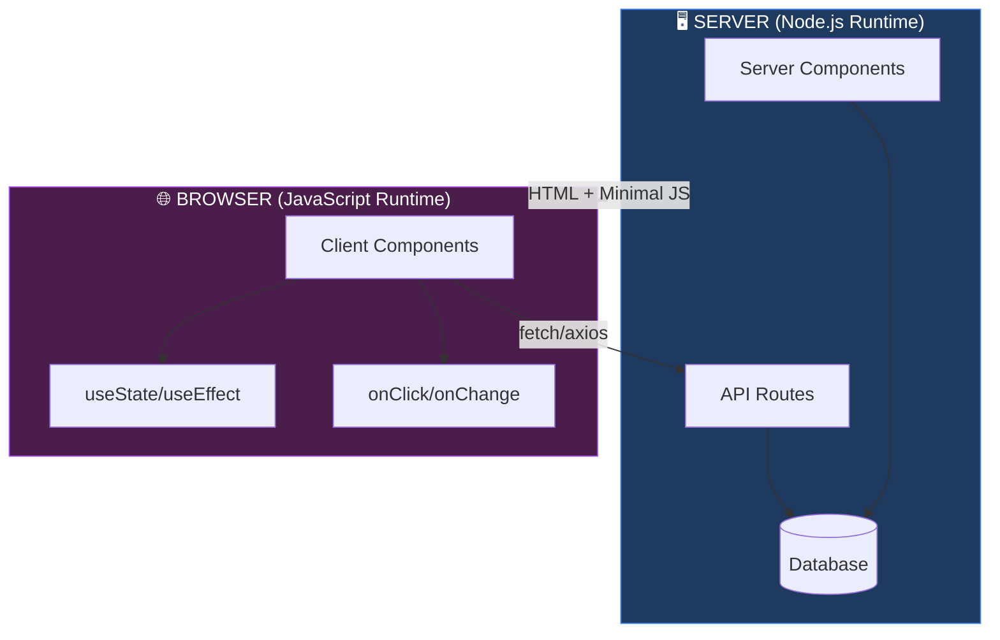
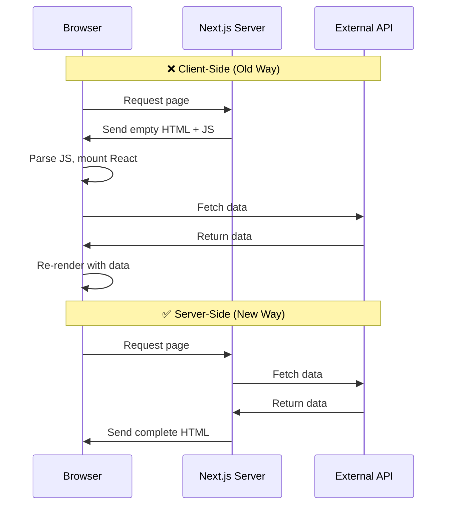
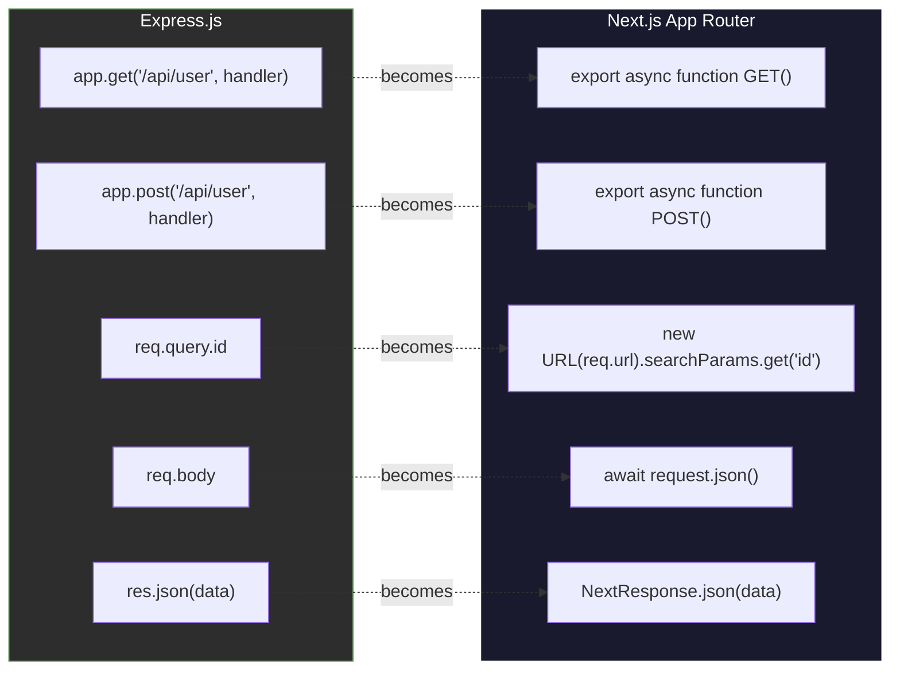
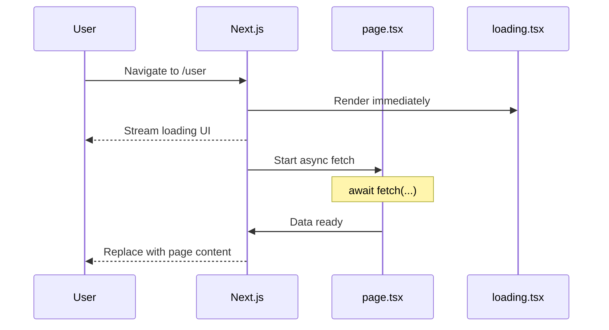
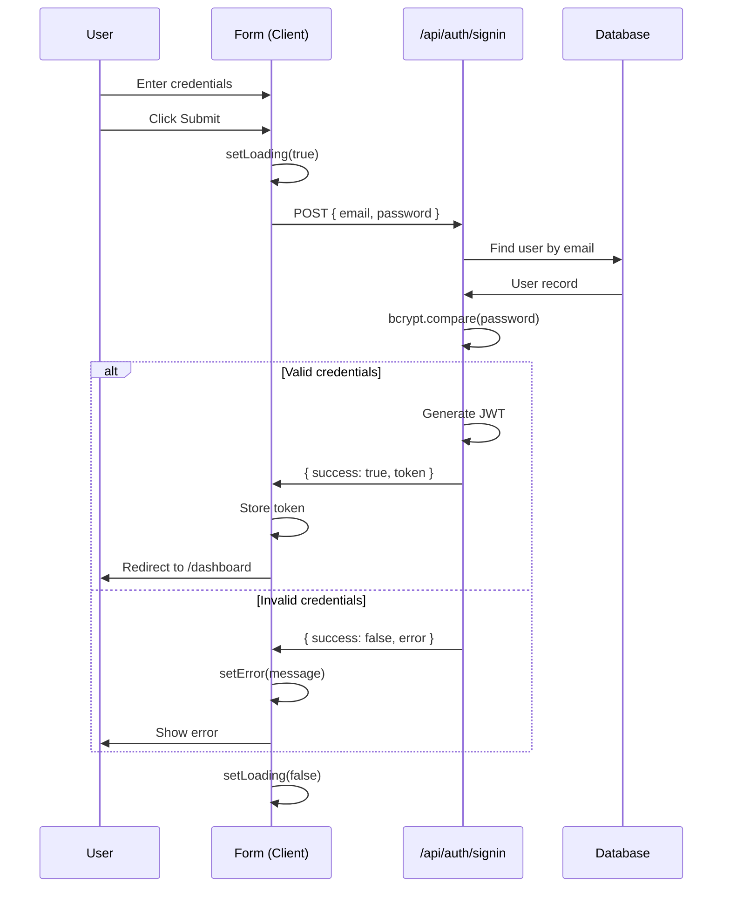
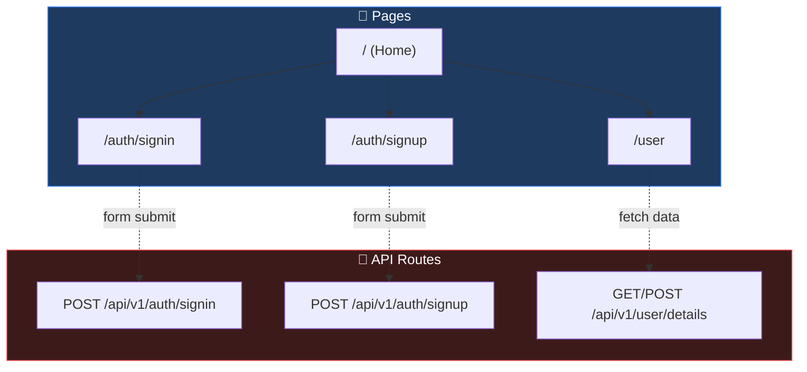
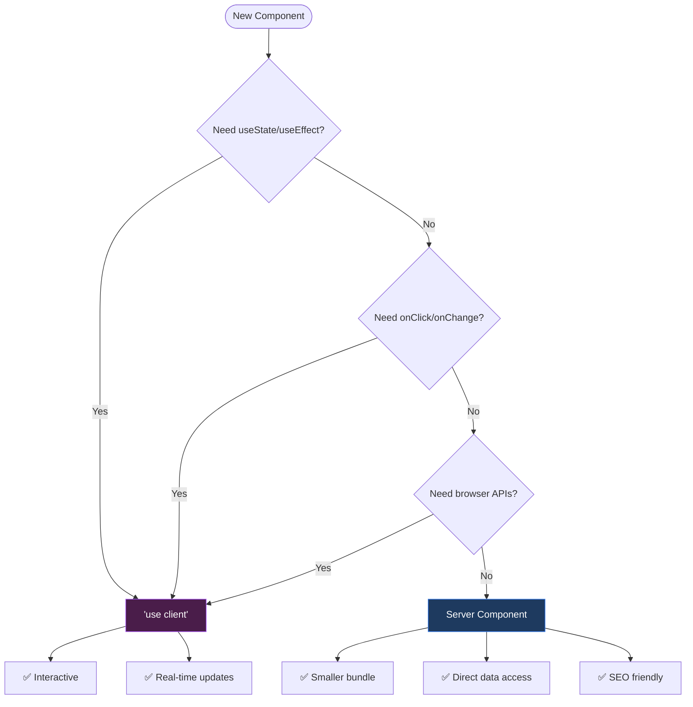

# Next.js App Router - Complete Revision Guide

> **Week 19.1**: Server Components, API Routes, Loading States & Authentication  
> **Stack**: Next.js 16+ | React 19 | TypeScript | Tailwind CSS 4

---

## Table of Contents

1. [Core Architecture: Server vs Client Components](#1-core-architecture-server-vs-client-components)
2. [Data Fetching Paradigm Shift](#2-data-fetching-paradigm-shift)
3. [API Routes in Next.js (vs Express)](#3-api-routes-in-nextjs-vs-express)
4. [Loading States & Suspense](#4-loading-states--suspense)
5. [Authentication Pattern: Forms & API Integration](#5-authentication-pattern-forms--api-integration)
6. [Project Structure & File Conventions](#6-project-structure--file-conventions)
7. [Key Takeaways](#7-key-takeaways)

---

## 1. Core Architecture: Server vs Client Components

### The Mental Model



### Server Components (Default)

Every component in `app/` is a **Server Component** by default:

```tsx
// app/user/page.tsx - This runs on the SERVER
export default async function User() {
    const res = await fetch('https://api.example.com/user');
    const user = await res.json();
    
    return <div>{user.name}</div>;
}
```

**Key Insight**: Notice the `async` keyword directly on the component. This is ONLY possible in Server Components. React components in the browser cannot be async.

### Client Components

Add `'use client'` directive when you need:
- `useState`, `useEffect`, `useReducer`
- Event handlers (`onClick`, `onChange`, `onSubmit`)
- Browser APIs (`localStorage`, `window`)

```tsx
'use client';  // ← This directive makes it a Client Component

import { useState } from 'react';

export default function Counter() {
    const [count, setCount] = useState(0);
    return <button onClick={() => setCount(c => c + 1)}>{count}</button>;
}
```

### Decision Matrix

| Need | Component Type | Why |
|------|---------------|-----|
| Fetch data | Server | Direct DB/API access, no waterfall |
| SEO critical content | Server | HTML sent to crawler |
| Forms with state | Client | Needs `useState` |
| Interactive UI | Client | Needs event handlers |
| Access cookies/headers | Server | Via `next/headers` |

---

## 2. Data Fetching Paradigm Shift

### ❌ OLD: Client-Side Fetching (Anti-Pattern in Next.js)

```tsx
'use client';
import { useEffect, useState } from "react";
import axios from "axios";

export default function User() {
    const [name, setName] = useState('');
    
    useEffect(() => {
        axios.get('https://api.example.com/users/1')
            .then(res => setName(res.data.name));
    }, []);
    
    return <p>{name}</p>;
}
```

**Problems**:
1. 🐌 Slower - Request happens AFTER page loads
2. 🔄 Waterfall - Component renders → fetch → re-render
3. 📉 Bad SEO - Search engines see empty content
4. 📦 Larger bundle - Ships axios + React hooks to browser
5. 🔓 Exposes API endpoints to client

### ✅ NEW: Server-Side Fetching (Recommended)

```tsx
// NO 'use client' - this is a Server Component
import axios from "axios";

export default async function User() {
    const res = await axios.get('https://api.example.com/users/1');
    const user = res.data;
    
    return <p>{user.name}</p>;
}
```

**Benefits**:
1. ⚡ Faster - Data fetched before HTML sent
2. 🔍 SEO Friendly - Content in initial HTML
3. 📦 Smaller bundle - Fetch logic stays on server
4. 🔐 Secure - API keys never reach browser
5. 💾 Automatic caching with revalidation

### Visual: Request Flow Comparison



---

## 3. API Routes in Next.js (vs Express)

### Syntax Translation Guide



### Complete API Route Example

**File**: `app/api/v1/user/details/route.ts`  
**Endpoint**: `/api/v1/user/details`

```typescript
import { NextRequest, NextResponse } from "next/server";

// GET /api/v1/user/details?id=123
export async function GET(request: NextRequest) {
    const { searchParams } = new URL(request.url);
    const id = searchParams.get('id');
    
    // Database query would go here
    const user = { id, name: "John Doe" };
    
    return NextResponse.json(user);
}

// POST /api/v1/user/details
export async function POST(request: NextRequest) {
    const { name, email } = await request.json();
    
    // Database insert would go here
    return NextResponse.json(
        { message: "User created", name },
        { status: 201 }
    );
}

// PUT - Full resource replacement
export async function PUT(request: NextRequest) {
    const { id, name } = await request.json();
    return NextResponse.json({ message: "User updated", id, name });
}

// PATCH - Partial update
export async function PATCH(request: NextRequest) {
    const { id, name } = await request.json();
    return NextResponse.json({ message: "User patched", id, name });
}

// DELETE
export async function DELETE(request: NextRequest) {
    const { id } = await request.json();
    return NextResponse.json({ message: "User deleted", id });
}
```

**Key Insight**: The file path IS the route. No manual routing configuration needed:
- `app/api/v1/auth/signup/route.ts` → `/api/v1/auth/signup`
- `app/api/users/[id]/route.ts` → `/api/users/123` (dynamic)

### HTTP Method Comparison

| Express | Next.js | Purpose |
|---------|---------|---------|
| `app.get()` | `export function GET()` | Read resource |
| `app.post()` | `export function POST()` | Create resource |
| `app.put()` | `export function PUT()` | Replace resource |
| `app.patch()` | `export function PATCH()` | Partial update |
| `app.delete()` | `export function DELETE()` | Remove resource |

---

## 4. Loading States & Suspense

### Automatic Loading UI

Next.js automatically wraps async pages in Suspense. Just create a `loading.tsx`:

```
app/
├── user/
│   ├── page.tsx      ← Async server component
│   └── loading.tsx   ← Shown while page.tsx fetches
```

**File**: `app/user/loading.tsx`
```tsx
export default function Loading() {
    return (
        <div className="flex items-center justify-center min-h-screen">
            <div className="animate-spin rounded-full h-12 w-12 
                          border-b-2 border-gray-900"></div>
            <p className="mt-4 text-gray-600">Loading...</p>
        </div>
    );
}
```

### How It Works Internally



### Manual Suspense (Granular Control)

For multiple independent data fetches, use explicit Suspense boundaries:

```tsx
import { Suspense } from 'react';

async function UserProfile() {
    const user = await fetchUser();
    return <h1>{user.name}</h1>;
}

async function UserPosts() {
    const posts = await fetchPosts();  // Slower API
    return <ul>{posts.map(p => <li key={p.id}>{p.title}</li>)}</ul>;
}

export default function UserPage() {
    return (
        <div>
            <Suspense fallback={<div>Loading profile...</div>}>
                <UserProfile />
            </Suspense>
            
            <Suspense fallback={<div>Loading posts...</div>}>
                <UserPosts />
            </Suspense>
        </div>
    );
}
```

**Key Insight**: Each Suspense boundary streams independently. The profile can appear while posts are still loading.

```mermaid
gantt
    title Streaming with Multiple Suspense
    dateFormat X
    axisFormat %s
    
    section Without Suspense
    Wait for all data    :0, 5
    Render page          :5, 6
    
    section With Suspense
    Profile loads        :0, 2
    Profile renders      :2, 3
    Posts loads          :0, 5
    Posts renders        :5, 6
```



---

## 5. Authentication Pattern: Forms & API Integration

### Client-Side Form (Sign In)

```tsx
'use client';

import { useState } from 'react';
import { useRouter } from 'next/navigation';
import axios from 'axios';

export default function SignIn() {
    const router = useRouter();
    const [formData, setFormData] = useState({ email: '', password: '' });
    const [error, setError] = useState('');
    const [loading, setLoading] = useState(false);

    const handleChange = (e: React.ChangeEvent<HTMLInputElement>) => {
        const { name, value } = e.target;
        setFormData(prev => ({ ...prev, [name]: value }));
    };

    const handleSubmit = async (e: React.FormEvent<HTMLFormElement>) => {
        e.preventDefault();
        setError('');
        setLoading(true);

        try {
            if (!formData.email || !formData.password) {
                throw new Error('All fields required');
            }

            const response = await axios.post('/api/v1/auth/signin', formData);

            if (response.data.success) {
                router.push('/dashboard');
            }
        } catch (err: unknown) {
            const message = err instanceof Error 
                ? err.message 
                : 'An error occurred';
            setError(message);
        } finally {
            setLoading(false);
        }
    };

    return (
        <form onSubmit={handleSubmit}>
            <input 
                name="email" 
                type="email"
                value={formData.email}
                onChange={handleChange}
                disabled={loading}
            />
            <input 
                name="password" 
                type="password"
                value={formData.password}
                onChange={handleChange}
                disabled={loading}
            />
            {error && <p className="text-red-500">{error}</p>}
            <button type="submit" disabled={loading}>
                {loading ? 'Signing In...' : 'Sign In'}
            </button>
        </form>
    );
}
```

### Server-Side API Route (Sign In Handler)

```typescript
// app/api/v1/auth/signin/route.ts
import { NextRequest, NextResponse } from 'next/server';

export async function POST(request: NextRequest) {
    try {
        const { email, password } = await request.json();

        if (!email || !password) {
            return NextResponse.json(
                { success: false, error: 'Email and password required' },
                { status: 400 }
            );
        }

        // Real implementation would:
        // 1. Query database for user
        // 2. Compare hashed password with bcrypt
        // 3. Generate JWT token
        
        return NextResponse.json({
            success: true,
            token: 'jwt-token-here',
            user: { email }
        });
    } catch (error) {
        return NextResponse.json(
            { success: false, error: 'Internal server error' },
            { status: 500 }
        );
    }
}
```

### Authentication Flow



---

## 6. Project Structure & File Conventions

### App Router File Conventions

| File | Purpose |
|------|---------|
| `page.tsx` | Route UI (required for route to exist) |
| `layout.tsx` | Shared UI wrapper (persists across navigation) |
| `loading.tsx` | Loading UI (automatic Suspense fallback) |
| `error.tsx` | Error UI (error boundary) |
| `not-found.tsx` | 404 UI |
| `route.ts` | API endpoint (no UI) |

### Project Structure

```
app/
├── layout.tsx              # Root layout (HTML, body, fonts)
├── page.tsx                # Home page (/)
├── globals.css             # Global styles
│
├── auth/
│   ├── signin/
│   │   └── page.tsx        # /auth/signin
│   └── signup/
│       └── page.tsx        # /auth/signup
│
├── user/
│   ├── page.tsx            # /user (async server component)
│   └── loading.tsx         # Loading state for /user
│
└── api/
    └── v1/
        ├── auth/
        │   ├── signin/
        │   │   └── route.ts    # POST /api/v1/auth/signin
        │   └── signup/
        │       └── route.ts    # POST /api/v1/auth/signup
        └── user/
            └── details/
                └── route.ts    # GET/POST /api/v1/user/details
```

### Route Visualization



---

## 7. Key Takeaways

### Quick Reference Card

| Concept | Remember |
|---------|----------|
| **Default is Server** | No `'use client'` = Server Component |
| **Client Trigger** | `'use client'` only for interactivity |
| **Async Components** | Server Components can be `async` |
| **API File** | `route.ts` not `page.tsx` for endpoints |
| **HTTP Methods** | Export named functions: `GET`, `POST`, etc. |
| **Loading UI** | `loading.tsx` in same folder = automatic |
| **Query Params** | `new URL(req.url).searchParams.get('key')` |
| **Request Body** | `await request.json()` |
| **Response** | `NextResponse.json(data, { status })` |

### Server vs Client Decision Tree



### The Golden Rules

1. **Start Server, Go Client When Needed**  
   Don't add `'use client'` by default. Only when you hit a wall.

2. **Fetch Data Where You Render**  
   Server Components can `await` data directly. No useEffect needed.

3. **API Routes = Backend**  
   `route.ts` files are your Express replacement. Full Node.js access.

4. **Loading States Are Free**  
   Just create `loading.tsx`. Next.js handles Suspense.

5. **File Path = Route Path**  
   `app/dashboard/settings/page.tsx` → `/dashboard/settings`

---

## Quick Commands

```bash
# Development
npm run dev

# Production build
npm run build

# Start production server
npm run start

# Lint
npm run lint
```

---

*Last Updated: Week 19 Cohort*
