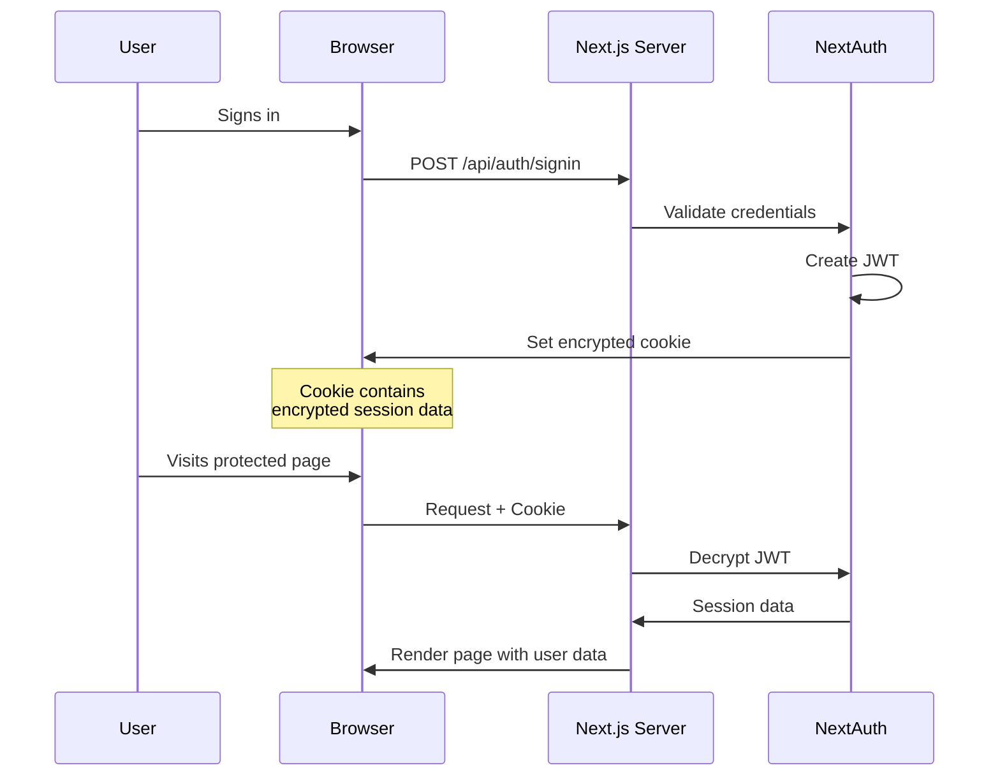
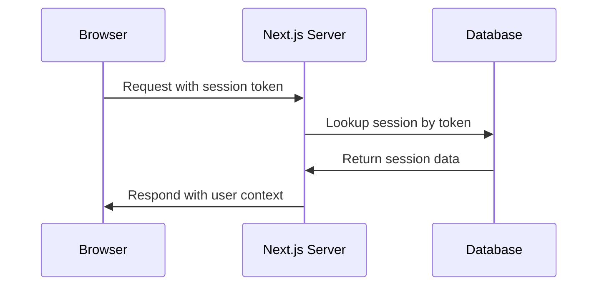
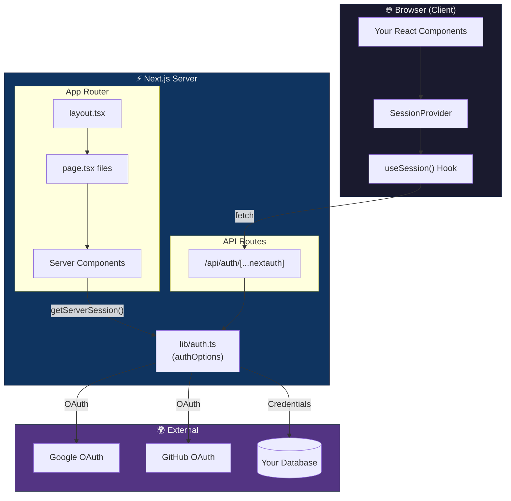
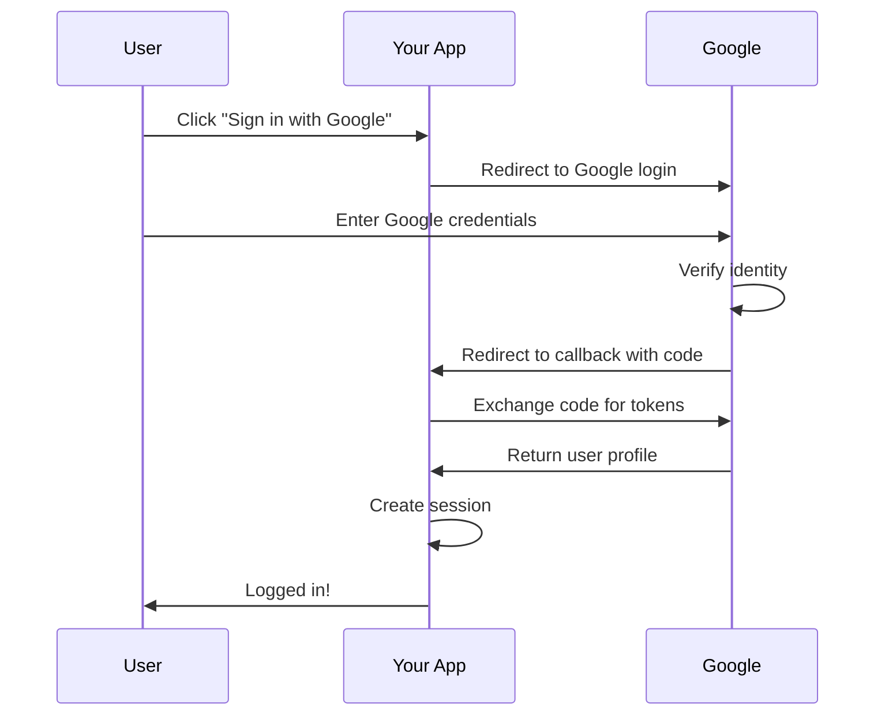
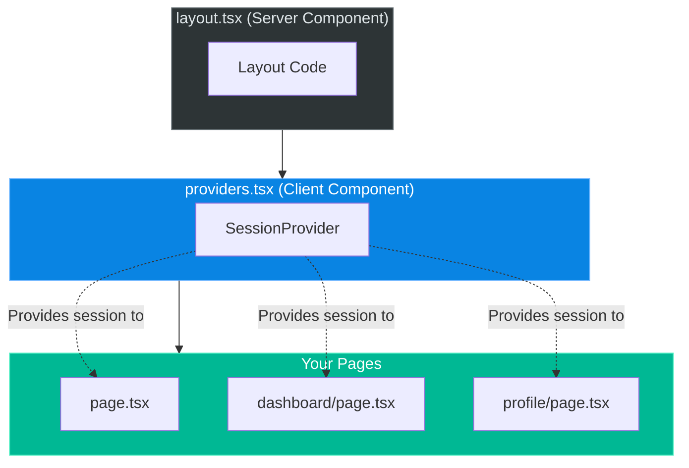
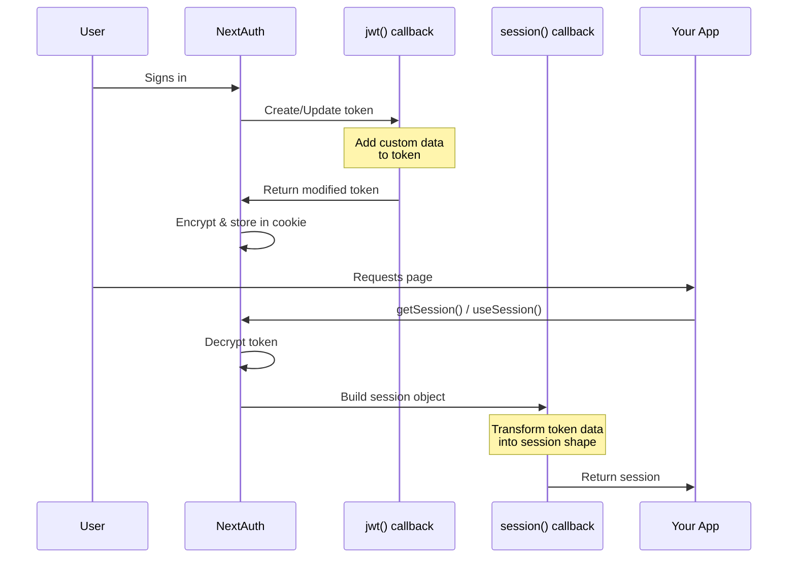
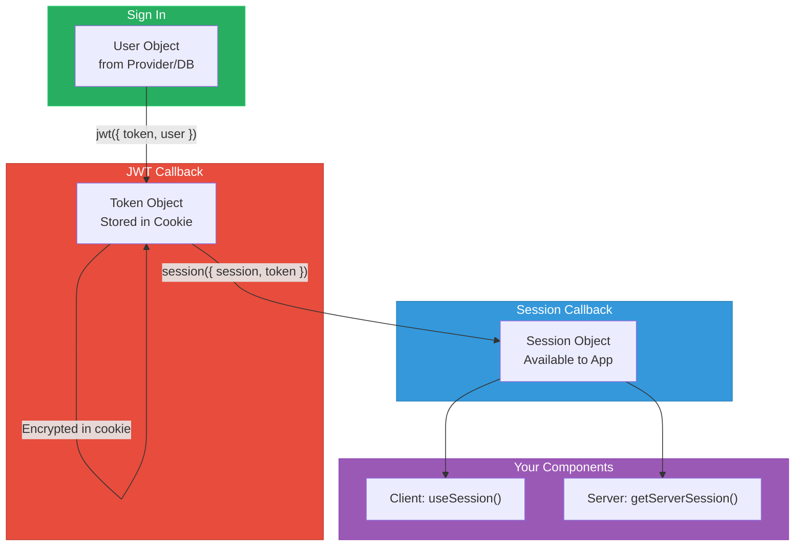

# 🔐 NextAuth.js with Next.js App Router - Complete Learning Guide

> **A comprehensive revision guide for mastering authentication in Next.js using NextAuth.js**

This document consolidates all concepts, patterns, and code examples from this learning module into a single reference. After reading this, you'll understand how to implement both client-side and server-side authentication in modern Next.js applications.

---

## 📑 Table of Contents

1. [Introduction](#1-introduction)
2. [Core Concepts](#2-core-concepts)
   - [What is NextAuth.js?](#21-what-is-nextauthjs)
   - [Client vs Server Components](#22-client-vs-server-components)
   - [Session Management Strategies](#23-session-management-strategies)
3. [Architecture Overview](#3-architecture-overview)
4. [Setting Up NextAuth](#4-setting-up-nextauth)
   - [Environment Variables](#41-environment-variables)
   - [Central Configuration](#42-central-configuration)
   - [API Route Handler](#43-api-route-handler)
5. [Authentication Providers](#5-authentication-providers)
   - [OAuth Providers (Google)](#51-oauth-providers-google)
   - [Credentials Provider](#52-credentials-provider)
6. [Session Access Patterns](#6-session-access-patterns)
   - [Client-Side: useSession()](#61-client-side-usesession)
   - [Server-Side: getServerSession()](#62-server-side-getserversession)
   - [Comparison Table](#63-comparison-table)
7. [React Context & Providers](#7-react-context--providers)
8. [Custom Sign-In Pages](#8-custom-sign-in-pages)
9. [TypeScript Integration](#9-typescript-integration)
10. [Callbacks Deep Dive](#10-callbacks-deep-dive)
11. [Visual Diagrams](#11-visual-diagrams)
12. [Common Patterns & Best Practices](#12-common-patterns--best-practices)
13. [Summary & Key Takeaways](#13-summary--key-takeaways)

---

## 1. Introduction

### What You'll Learn

- How authentication works in modern web applications
- The difference between OAuth and Credentials authentication
- When to use client-side vs server-side session access
- How to protect pages and API routes
- TypeScript patterns for extending NextAuth types

### Prerequisites

- Basic React and Next.js knowledge
- Understanding of HTTP cookies and sessions
- Familiarity with TypeScript (helpful but not required)

---

## 2. Core Concepts

### 2.1 What is NextAuth.js?

NextAuth.js is an **open-source authentication library** designed specifically for Next.js. It handles the complex parts of authentication so you don't have to.

**Key Features:**
- 🔑 Multiple authentication methods (OAuth, Email, Credentials)
- 🍪 Secure session management (JWT or Database)
- 📱 Works with 50+ OAuth providers out of the box
- 🔒 CSRF protection built-in
- 🎨 Customizable sign-in pages
- 📦 TypeScript support

**What NextAuth Handles For You:**

| Task | Without NextAuth | With NextAuth |
|------|------------------|---------------|
| OAuth Flow | 100+ lines of code | 1 provider config |
| Session Cookies | Manual encryption | Automatic |
| CSRF Protection | DIY implementation | Built-in |
| Token Refresh | Custom logic | Automatic |
| Multiple Providers | Separate implementations | Simple config array |

### 2.2 Client vs Server Components

Next.js App Router introduces a paradigm shift with Server Components as the default:

```
┌─────────────────────────────────────────────────────────────────┐
│                    COMPONENT TYPES IN NEXT.JS                    │
├─────────────────────────────────────────────────────────────────┤
│                                                                  │
│  SERVER COMPONENTS (Default)         CLIENT COMPONENTS           │
│  ─────────────────────────           ─────────────────           │
│  • Run on the server                 • Run in browser            │
│  • No "use client" needed            • Need "use client"         │
│  • Can be async functions            • Cannot be async           │
│  • Direct database access            • Need API routes           │
│  • No hooks (useState, etc)          • Can use all hooks         │
│  • No event handlers                 • onClick, onChange, etc    │
│  • Better for SEO                    • Better for interactivity  │
│  • Smaller JS bundle                 • Adds to bundle size       │
│                                                                  │
│  AUTH METHOD:                        AUTH METHOD:                │
│  getServerSession()                  useSession()                │
│                                                                  │
└─────────────────────────────────────────────────────────────────┘
```

**Rule of Thumb:**
- Default to Server Components
- Use Client Components only when you need:
  - React hooks (`useState`, `useEffect`, `useSession`)
  - Browser APIs (`window`, `document`, `localStorage`)
  - Event handlers (`onClick`, `onChange`)

### 2.3 Session Management Strategies

NextAuth supports two session strategies:

#### JWT Strategy (Recommended for Most Apps)



**Pros:**
- ✅ Stateless - no database needed for sessions
- ✅ Fast - no database lookup on each request
- ✅ Scalable - works great with serverless

**Cons:**
- ❌ Can't invalidate sessions instantly
- ❌ Token size limited by cookie size

#### Database Strategy



**Pros:**
- ✅ Can invalidate sessions immediately
- ✅ Store more session data
- ✅ Track active sessions

**Cons:**
- ❌ Database lookup every request
- ❌ Requires database adapter setup

---

## 3. Architecture Overview

Here's how all the pieces fit together:



### File Structure

```
app/
├── api/auth/[...nextauth]/
│   └── route.ts          # API handler - creates /api/auth/* endpoints
├── lib/
│   └── auth.ts           # Central config - providers, callbacks, options
├── signin/
│   └── page.tsx          # Custom sign-in page
├── server-example/
│   └── page.tsx          # Server component auth example
├── layout.tsx            # Root layout - wraps app with Providers
├── page.tsx              # Home page - client component auth example
├── providers.tsx         # SessionProvider wrapper
└── globals.css           # Global styles

types/
└── next-auth.d.ts        # TypeScript type extensions

.env                      # Environment variables (secrets)
```

---

## 4. Setting Up NextAuth

### 4.1 Environment Variables

Environment variables store sensitive configuration that shouldn't be in your code:

```bash
# .env or .env.local

# Base URL of your app (no trailing slash!)
NEXTAUTH_URL=http://localhost:3000

# Secret for encrypting JWTs (generate with: openssl rand -base64 32)
NEXTAUTH_SECRET=your-super-secret-key-here

# OAuth provider credentials
GOOGLE_CLIENT_ID=your-google-client-id
GOOGLE_CLIENT_SECRET=your-google-client-secret
```

**Key Insight:** In production (like Vercel), `NEXTAUTH_URL` is set automatically. Always generate a new `NEXTAUTH_SECRET` for production!

### 4.2 Central Configuration

The `authOptions` object is the heart of your NextAuth setup:

```typescript
// app/lib/auth.ts

import { NextAuthOptions } from "next-auth";
import GoogleProvider from "next-auth/providers/google";
import CredentialsProvider from "next-auth/providers/credentials";

export const authOptions: NextAuthOptions = {
  // 1. HOW can users authenticate?
  providers: [
    GoogleProvider({
      clientId: process.env.GOOGLE_CLIENT_ID!,
      clientSecret: process.env.GOOGLE_CLIENT_SECRET!,
    }),
    CredentialsProvider({
      // ... configuration
    }),
  ],

  // 2. WHERE to redirect for auth actions?
  pages: {
    signIn: "/signin",  // Custom sign-in page
  },

  // 3. HOW to manage sessions?
  session: {
    strategy: "jwt",    // or "database"
    maxAge: 30 * 24 * 60 * 60,  // 30 days
  },

  // 4. WHAT data to include in session?
  callbacks: {
    async jwt({ token, user }) { /* ... */ },
    async session({ session, token }) { /* ... */ },
  },

  // 5. SECRET for encryption
  secret: process.env.NEXTAUTH_SECRET,
};
```

**Why Centralize?**
- Reuse in API route AND Server Components
- Single source of truth
- Easier maintenance

### 4.3 API Route Handler

The API route creates all authentication endpoints:

```typescript
// app/api/auth/[...nextauth]/route.ts

import NextAuth from "next-auth";
import { authOptions } from "@/app/lib/auth";

const handler = NextAuth(authOptions);

export { handler as GET, handler as POST };
```

**The `[...nextauth]` Explained:**

The `[...]` syntax is a "catch-all" route segment. This single file handles:

| URL | Purpose |
|-----|---------|
| `/api/auth/signin` | Show sign-in options |
| `/api/auth/signout` | Handle sign-out |
| `/api/auth/session` | Get current session |
| `/api/auth/csrf` | Get CSRF token |
| `/api/auth/providers` | List available providers |
| `/api/auth/callback/google` | OAuth callback handler |

---

## 5. Authentication Providers

### 5.1 OAuth Providers (Google)

OAuth is the easiest way to add authentication:



**Configuration:**

```typescript
GoogleProvider({
  clientId: process.env.GOOGLE_CLIENT_ID!,
  clientSecret: process.env.GOOGLE_CLIENT_SECRET!,
  // Optional: Request additional permissions
  authorization: {
    params: {
      scope: "openid email profile",
    },
  },
})
```

**Setup Steps:**
1. Go to [Google Cloud Console](https://console.cloud.google.com)
2. Create/select a project
3. Enable Google+ API
4. Create OAuth 2.0 credentials
5. Add redirect URI: `http://localhost:3000/api/auth/callback/google`
6. Copy Client ID and Secret to `.env`

### 5.2 Credentials Provider

For custom email/password authentication:

```typescript
CredentialsProvider({
  name: "Email",
  credentials: {
    email: { label: "Email", type: "email" },
    password: { label: "Password", type: "password" },
  },
  
  async authorize(credentials) {
    // 1. Validate input
    if (!credentials?.email || !credentials?.password) {
      return null;
    }

    // 2. Find user in database
    const user = await db.user.findUnique({
      where: { email: credentials.email }
    });

    // 3. Verify password
    if (!user || !await bcrypt.compare(credentials.password, user.hashedPassword)) {
      return null;  // Invalid credentials
    }

    // 4. Return user object (goes to JWT)
    return {
      id: user.id,
      email: user.email,
      name: user.name,
    };
  },
})
```

**Key Insight:** The `authorize` function is where YOU implement the validation. Return a user object for success, `null` for failure.

⚠️ **Security Reminder:** Always hash passwords with bcrypt. Never store plain text!

---

## 6. Session Access Patterns

### 6.1 Client-Side: useSession()

For interactive components that need real-time session state:

```tsx
"use client";  // Required!

import { useSession, signIn, signOut } from "next-auth/react";

export default function UserMenu() {
  const { data: session, status } = useSession();

  // Handle loading state
  if (status === "loading") {
    return <div>Loading...</div>;
  }

  // Handle authenticated state
  if (session) {
    return (
      <div>
        <p>Welcome, {session.user?.name}!</p>
        <button onClick={() => signOut()}>Sign Out</button>
      </div>
    );
  }

  // Handle unauthenticated state
  return <button onClick={() => signIn()}>Sign In</button>;
}
```

**The `status` Values:**

```
┌─────────────────────────────────────────────────────────┐
│                    STATUS LIFECYCLE                      │
├─────────────────────────────────────────────────────────┤
│                                                          │
│   "loading"  ──────▶  "authenticated"                   │
│       │                     │                            │
│       │                     │ (signOut)                  │
│       │                     ▼                            │
│       └──────────▶  "unauthenticated"                   │
│                             │                            │
│                             │ (signIn)                   │
│                             ▼                            │
│                     "authenticated"                      │
│                                                          │
└─────────────────────────────────────────────────────────┘
```

**When to Use:**
- ✅ Navigation bars with user menu
- ✅ Interactive sign-in/sign-out buttons
- ✅ Real-time session updates
- ✅ Conditional UI rendering

### 6.2 Server-Side: getServerSession()

For Server Components and API routes:

```tsx
// No "use client" - this is a Server Component!

import { getServerSession } from "next-auth/next";
import { authOptions } from "@/app/lib/auth";
import { redirect } from "next/navigation";

export default async function ProtectedPage() {
  const session = await getServerSession(authOptions);

  // Redirect if not authenticated
  if (!session) {
    redirect("/signin");
  }

  // Fetch user's data from database
  const userData = await db.user.findUnique({
    where: { id: session.user.id }
  });

  return (
    <div>
      <h1>Welcome, {session.user.name}!</h1>
      <p>Your data: {JSON.stringify(userData)}</p>
    </div>
  );
}
```

**Key Insight:** `getServerSession()` returns the session immediately (no loading state) because it runs on the server where cookies are already available.

**When to Use:**
- ✅ Protected pages (redirect before render)
- ✅ Fetching user-specific data from database
- ✅ API route authorization
- ✅ SEO-critical pages

### 6.3 Comparison Table

| Feature | `useSession()` | `getServerSession()` |
|---------|---------------|---------------------|
| **Runs on** | Browser | Server |
| **Component type** | Client (`"use client"`) | Server (default) |
| **Returns loading?** | Yes (`status: "loading"`) | No (already resolved) |
| **Can use hooks?** | Yes | No |
| **Database access?** | Needs API route | Direct |
| **Bundle impact** | Adds to JS bundle | None |
| **Real-time updates?** | Yes | No (per-request) |
| **Best for** | Interactive UI | Protected routes |

---

## 7. React Context & Providers

### The Provider Pattern

To make `useSession()` work everywhere, we need to wrap our app with `SessionProvider`:



**Why a Separate File?**

```tsx
// ❌ This WON'T work in layout.tsx (Server Component)
import { SessionProvider } from "next-auth/react";
// Error: SessionProvider uses React Context, which needs "use client"

// ✅ Solution: Create a wrapper Client Component
// providers.tsx
"use client";
import { SessionProvider } from "next-auth/react";

export function Providers({ children }) {
  return <SessionProvider>{children}</SessionProvider>;
}

// layout.tsx (remains a Server Component)
import { Providers } from "./providers";

export default function Layout({ children }) {
  return (
    <html>
      <body>
        <Providers>{children}</Providers>
      </body>
    </html>
  );
}
```

**Key Insight:** This pattern keeps your layout as a Server Component (good for performance) while still providing client-side auth context.

---

## 8. Custom Sign-In Pages

### Building a Custom Sign-In Page

```tsx
"use client";

import { signIn } from "next-auth/react";
import { useState } from "react";

export default function SignInPage() {
  const [error, setError] = useState("");
  const [loading, setLoading] = useState(false);

  // OAuth Sign-In (simplest approach)
  const handleOAuthSignIn = (provider: string) => {
    signIn(provider, { callbackUrl: "/" });
  };

  // Credentials Sign-In (with error handling)
  const handleCredentialsSignIn = async (e: React.FormEvent) => {
    e.preventDefault();
    setLoading(true);
    setError("");

    const formData = new FormData(e.currentTarget);
    
    const result = await signIn("credentials", {
      email: formData.get("email"),
      password: formData.get("password"),
      redirect: false,  // Handle redirect manually
    });

    if (result?.error) {
      setError("Invalid credentials");
      setLoading(false);
    } else {
      window.location.href = "/";  // Success!
    }
  };

  return (
    <div>
      {/* OAuth Button */}
      <button onClick={() => handleOAuthSignIn("google")}>
        Sign in with Google
      </button>

      {/* Credentials Form */}
      <form onSubmit={handleCredentialsSignIn}>
        <input name="email" type="email" required />
        <input name="password" type="password" required />
        {error && <p className="error">{error}</p>}
        <button disabled={loading}>
          {loading ? "Signing in..." : "Sign In"}
        </button>
      </form>
    </div>
  );
}
```

**Key Insight:** Using `redirect: false` with credentials lets you handle errors gracefully instead of NextAuth redirecting with an error query param.

### signIn() Options

```typescript
// Show all providers
signIn();

// Go directly to a provider
signIn("google");
signIn("github");

// With credentials
signIn("credentials", {
  email: "user@example.com",
  password: "secret",
  callbackUrl: "/dashboard",  // Where to go after
  redirect: true,              // Auto-redirect (default)
});

// No redirect - get result object
const result = await signIn("credentials", {
  redirect: false,
});
// result = { error: null, ok: true, status: 200, url: "..." }
```

---

## 9. TypeScript Integration

### Extending Session Types

By default, `session.user` only has `name`, `email`, `image`. To add custom properties:

```typescript
// types/next-auth.d.ts

import { DefaultSession } from "next-auth";

declare module "next-auth" {
  interface Session {
    user: {
      id: string;        // Add custom property
      role?: string;     // Add optional property
    } & DefaultSession["user"];
  }

  interface User {
    id: string;
    role?: string;
  }
}

declare module "next-auth/jwt" {
  interface JWT {
    id: string;
    role?: string;
  }
}
```

**Then in callbacks:**

```typescript
callbacks: {
  async jwt({ token, user }) {
    if (user) {
      token.id = user.id;      // Now TypeScript knows this is valid!
      token.role = user.role;
    }
    return token;
  },
  
  async session({ session, token }) {
    session.user.id = token.id;    // No TypeScript error!
    session.user.role = token.role;
    return session;
  },
}
```

**Key Insight:** The `& DefaultSession["user"]` syntax merges your custom properties with the existing ones (name, email, image).

---

## 10. Callbacks Deep Dive

Callbacks customize the authentication flow:



### The JWT Callback

```typescript
async jwt({ token, user, account, profile, trigger }) {
  // 'user' is only available on initial sign-in
  if (user) {
    token.id = user.id;
    token.email = user.email;
    
    // Add data from OAuth profile
    if (account?.provider === "google") {
      token.googleId = profile?.sub;
    }
  }

  // 'trigger' tells you why callback was invoked
  if (trigger === "update") {
    // Session was updated with session.update()
  }

  return token;  // This gets encrypted and stored
}
```

### The Session Callback

```typescript
async session({ session, token }) {
  // Copy data from token to session
  // Only include what the client needs!
  session.user.id = token.id;
  session.user.email = token.email;
  
  // DON'T include sensitive data
  // session.user.passwordHash = token.passwordHash; // ❌ Never!

  return session;  // This is what useSession() returns
}
```

---

## 11. Visual Diagrams

### Authentication Flow Overview

```mermaid
flowchart LR
    subgraph Client["Browser"]
        A[User visits site]
        B[useSession checks auth]
        C{Authenticated?}
        D[Show protected content]
        E[Show login button]
        F[User clicks Sign In]
    end
    
    subgraph Server["Next.js Server"]
        G[/api/auth/signin]
        H[OAuth provider redirect]
        I[Validate credentials]
        J[Create JWT session]
        K[Set cookie]
    end
    
    A --> B
    B --> C
    C -->|Yes| D
    C -->|No| E
    E --> F
    F --> G
    G -->|OAuth| H
    G -->|Credentials| I
    H --> J
    I --> J
    J --> K
    K -->|Redirect| D

    style Client fill:#1e3a5f,stroke:#2980b9,color:#ecf0f1
    style Server fill:#2c3e50,stroke:#34495e,color:#ecf0f1
```

### Session Data Flow



---

## 12. Common Patterns & Best Practices

### Pattern 1: Protected Pages (Server-Side)

```tsx
// app/dashboard/page.tsx
import { getServerSession } from "next-auth/next";
import { authOptions } from "@/app/lib/auth";
import { redirect } from "next/navigation";

export default async function DashboardPage() {
  const session = await getServerSession(authOptions);
  
  if (!session) {
    redirect("/signin?callbackUrl=/dashboard");
  }

  // Safe to access session.user here
  return <Dashboard user={session.user} />;
}
```

### Pattern 2: Protected API Routes

```typescript
// app/api/user/route.ts
import { getServerSession } from "next-auth/next";
import { authOptions } from "@/app/lib/auth";
import { NextResponse } from "next/server";

export async function GET() {
  const session = await getServerSession(authOptions);
  
  if (!session) {
    return NextResponse.json(
      { error: "Unauthorized" },
      { status: 401 }
    );
  }

  const userData = await db.user.findUnique({
    where: { id: session.user.id }
  });

  return NextResponse.json(userData);
}
```

### Pattern 3: Conditional Navigation

```tsx
"use client";

import { useSession } from "next-auth/react";
import Link from "next/link";

export function Navbar() {
  const { data: session, status } = useSession();

  return (
    <nav>
      <Link href="/">Home</Link>
      
      {status === "loading" ? (
        <span>Loading...</span>
      ) : session ? (
        <>
          <Link href="/dashboard">Dashboard</Link>
          <span>{session.user?.name}</span>
          <SignOutButton />
        </>
      ) : (
        <Link href="/signin">Sign In</Link>
      )}
    </nav>
  );
}
```

### Pattern 4: Role-Based Access

```typescript
// In auth.ts callbacks
async session({ session, token }) {
  session.user.role = token.role;
  return session;
}

// In a protected page
export default async function AdminPage() {
  const session = await getServerSession(authOptions);
  
  if (!session) redirect("/signin");
  if (session.user.role !== "admin") redirect("/unauthorized");

  return <AdminDashboard />;
}
```

---

## 13. Summary & Key Takeaways

### Quick Reference Card

| Concept | What It Does | When To Use |
|---------|--------------|-------------|
| **NextAuth** | Authentication library | Any Next.js app needing auth |
| **authOptions** | Central config | Define providers, callbacks, session strategy |
| **useSession()** | Client-side hook | Interactive UI, real-time updates |
| **getServerSession()** | Server function | Protected routes, DB queries |
| **SessionProvider** | React context | Wrap app for useSession to work |
| **JWT callback** | Customize token | Add user ID, role to token |
| **Session callback** | Shape session | Control what client sees |
| **signIn()** | Trigger login | Login buttons, forms |
| **signOut()** | Clear session | Logout buttons |

### The Mental Model

```
User logs in
    ↓
Credentials validated (authorize/OAuth)
    ↓
jwt() callback adds custom data to token
    ↓
Token encrypted → stored in cookie
    ↓
On each request:
    ├─ Server Component → getServerSession() → session() callback → session object
    └─ Client Component → useSession() → session() callback → session object
```

### Checklist for Setting Up NextAuth

- [ ] Install: `npm install next-auth`
- [ ] Create `.env` with `NEXTAUTH_URL` and `NEXTAUTH_SECRET`
- [ ] Create `app/lib/auth.ts` with `authOptions`
- [ ] Create `app/api/auth/[...nextauth]/route.ts`
- [ ] Create `app/providers.tsx` with SessionProvider wrapper
- [ ] Update `app/layout.tsx` to use Providers
- [ ] (Optional) Create custom sign-in page
- [ ] (Optional) Add `types/next-auth.d.ts` for TypeScript

### Three Golden Rules

1. **Use Server Components by Default** - Only add `"use client"` when you need hooks or interactivity

2. **Centralize Your Config** - Keep `authOptions` in one file that both API route and Server Components can import

3. **Always Handle Loading States** - In Client Components, always check `status === "loading"` before rendering auth-dependent UI

---

> 📚 **Further Reading:**
> - [NextAuth.js Official Docs](https://next-auth.js.org/)
> - [Next.js App Router Docs](https://nextjs.org/docs/app)
> - [OAuth 2.0 Simplified](https://aaronparecki.com/oauth-2-simplified/)

---

*Generated as a comprehensive learning guide for NextAuth.js with Next.js App Router*
