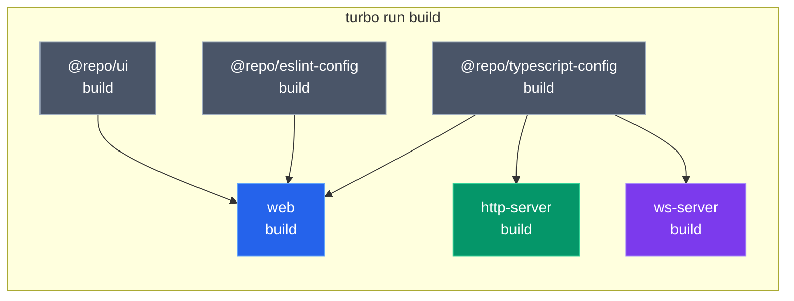
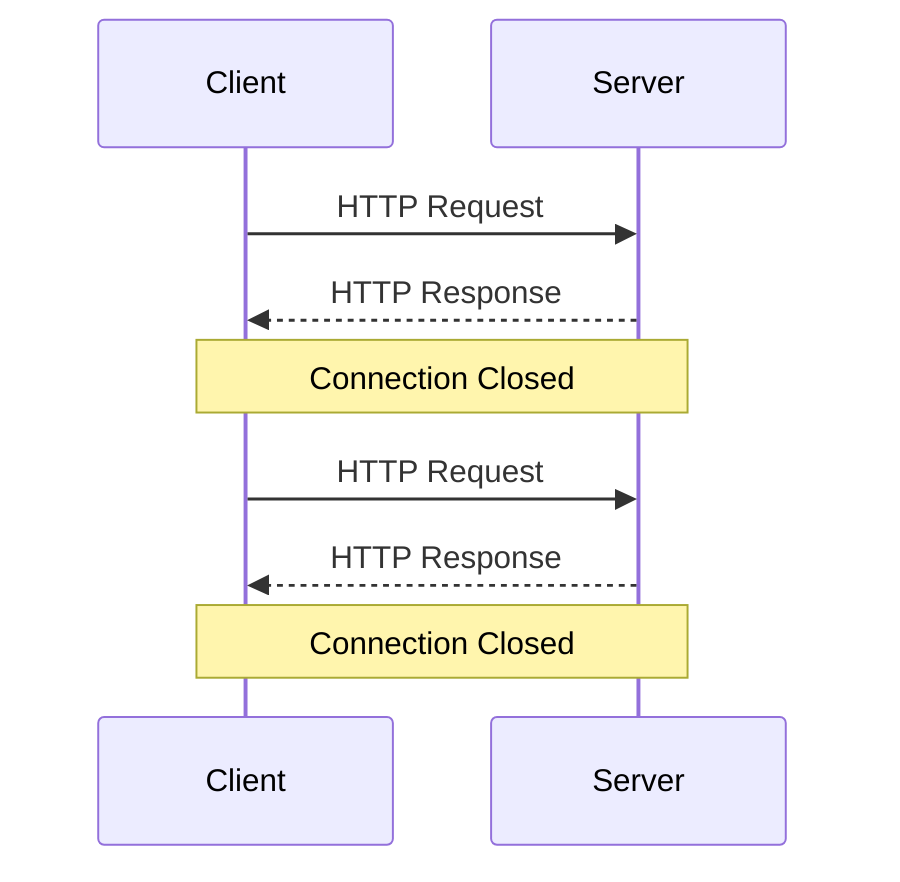
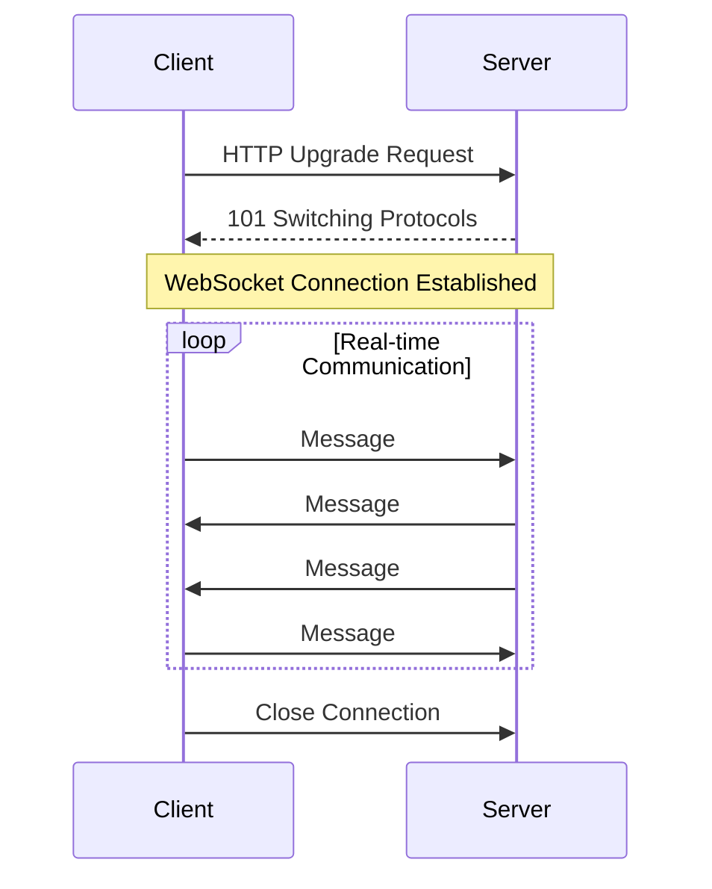
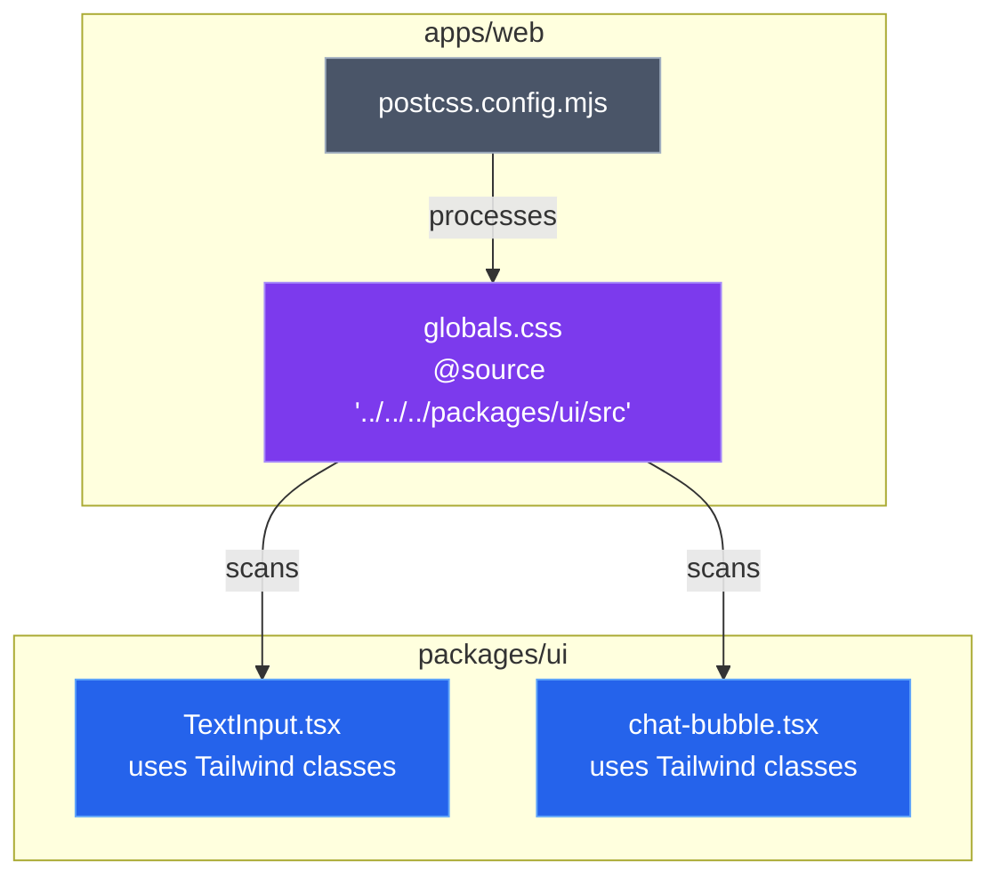
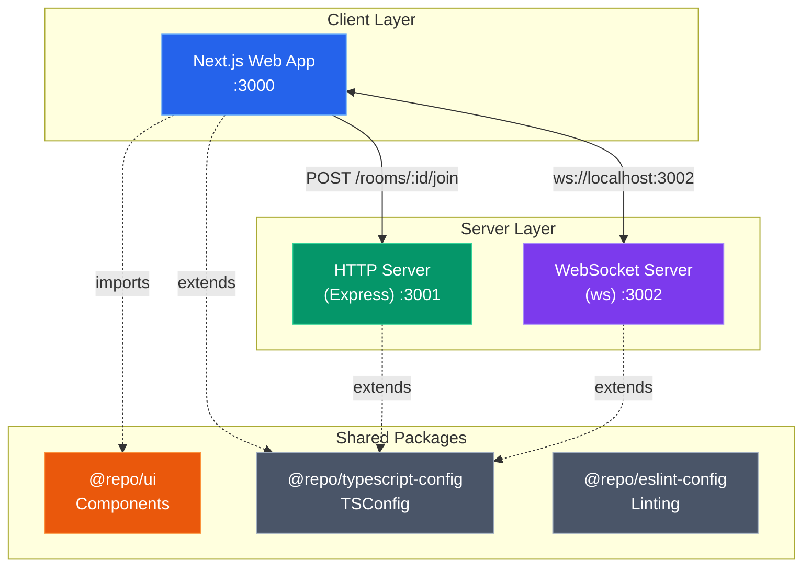
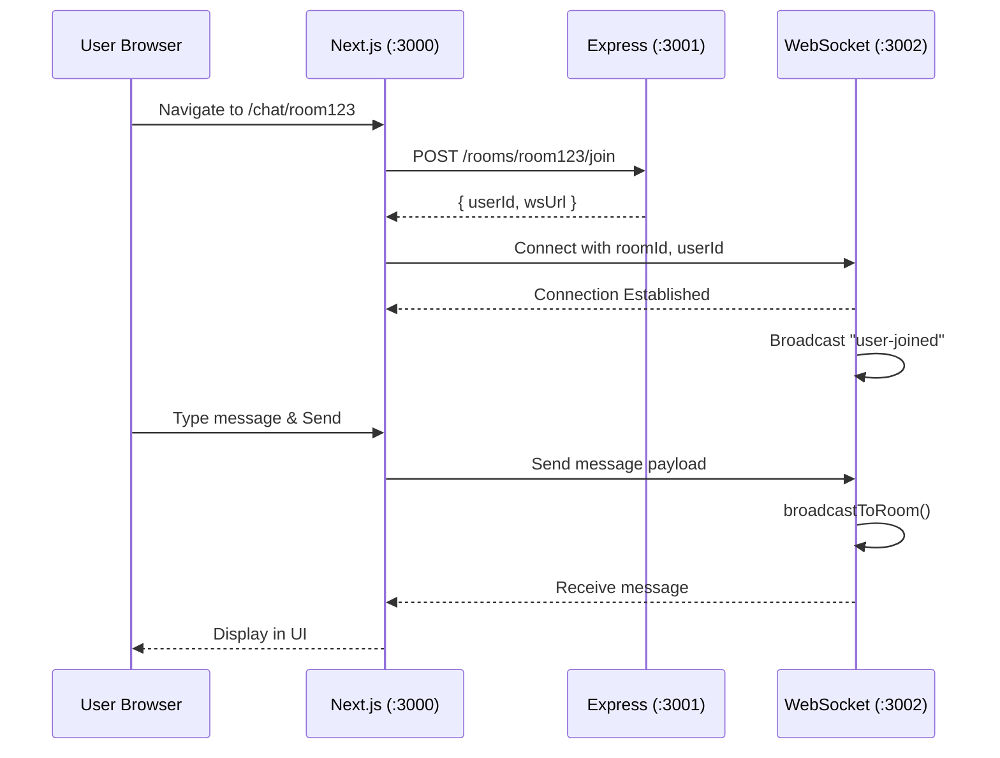
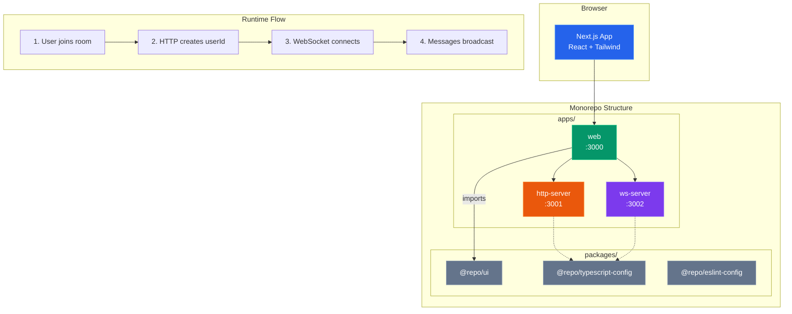
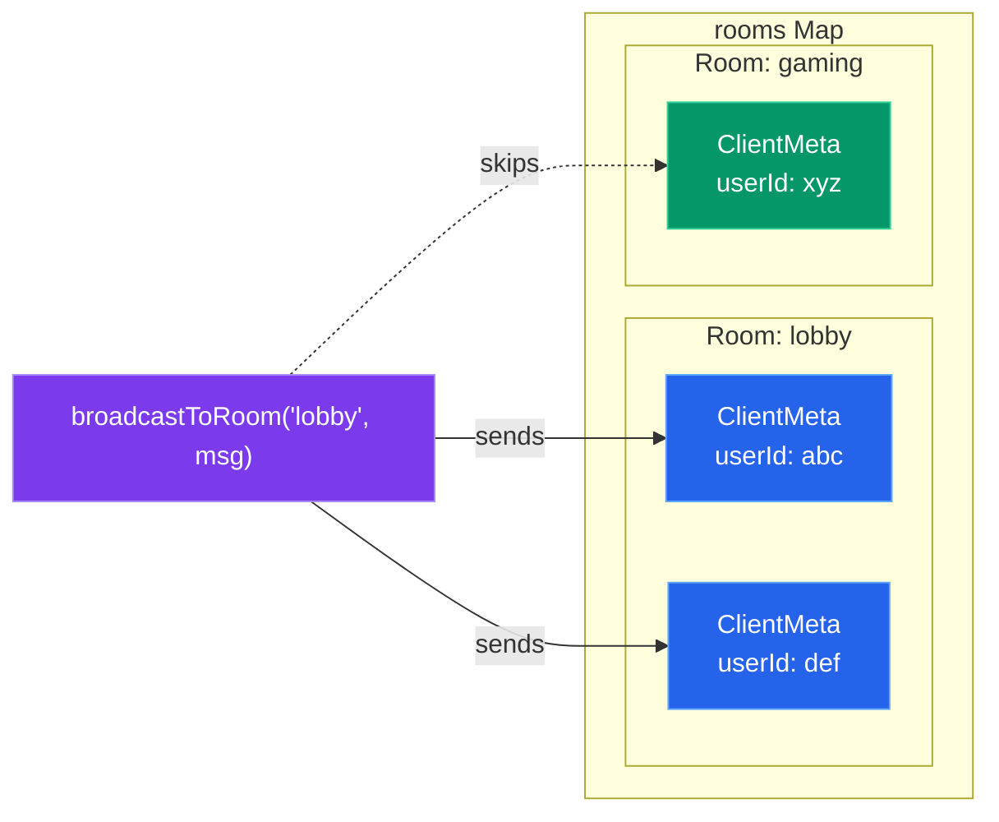
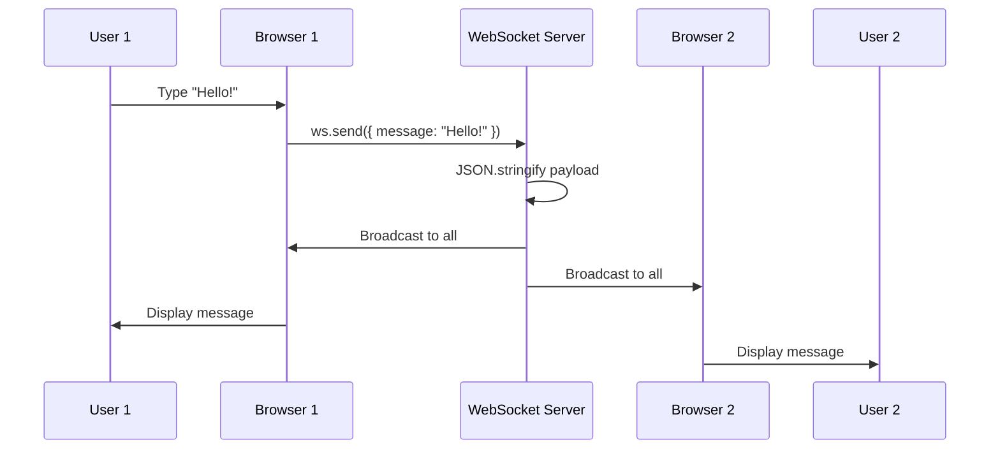

# 📦 Monorepo Chat Application - Complete Revision Guide

> A comprehensive guide to building a real-time chat application using **Turborepo**, **Next.js**, **Express**, and **WebSockets** in a monorepo architecture.

---

## 📑 Table of Contents

1. [Introduction](#1-introduction)
2. [Theoretical Concepts](#2-theoretical-concepts)
   - [What is a Monorepo?](#21-what-is-a-monorepo)
   - [Turborepo Fundamentals](#22-turborepo-fundamentals)
   - [Understanding `package.json` Exports](#23-understanding-packagejson-exports)
   - [WebSockets vs HTTP](#24-websockets-vs-http)
   - [Tailwind CSS v4 in Monorepos](#25-tailwind-css-v4-in-monorepos)
3. [Architecture Overview](#3-architecture-overview)
4. [Code & Patterns](#4-code--patterns)
   - [Monorepo Root Configuration](#41-monorepo-root-configuration)
   - [Shared TypeScript Configurations](#42-shared-typescript-configurations)
   - [HTTP Server (Express API)](#43-http-server-express-api)
   - [WebSocket Server](#44-websocket-server)
   - [Web Frontend (Next.js)](#45-web-frontend-nextjs)
   - [Shared UI Package](#46-shared-ui-package)
5. [Visual Aids & Diagrams](#5-visual-aids--diagrams)
6. [Summary & Key Takeaways](#6-summary--key-takeaways)

---

## 1. Introduction

This project demonstrates how to build a **real-time chat application** using modern web technologies organized in a **monorepo** structure. The key learning objectives are:

- Setting up a **Turborepo** monorepo from scratch
- Creating shared packages for **UI components** and **TypeScript configurations**
- Building an **Express HTTP server** for REST API endpoints
- Implementing a **WebSocket server** for real-time communication
- Connecting everything with a **Next.js 16** frontend

---

## 2. Theoretical Concepts

### 2.1 What is a Monorepo?

A **monorepo** (monolithic repository) is a software development strategy where code for multiple projects is stored in a single repository.

#### Why Use a Monorepo?

| Advantage | Explanation |
|-----------|-------------|
| **Code Sharing** | Share common utilities, types, and components across projects |
| **Atomic Changes** | Make cross-project changes in a single commit |
| **Consistent Tooling** | Use the same linting, testing, and build configurations |
| **Simplified Dependencies** | Manage dependencies from a single `package.json` |
| **Better Collaboration** | Teams can see and contribute to related codebases easily |

#### Monorepo Structure Pattern

```
project-root/
├── apps/           # Deployable applications
│   ├── web/        # Next.js frontend
│   ├── http-server/# Express REST API
│   └── ws-server/  # WebSocket server
├── packages/       # Shared libraries
│   ├── ui/         # Reusable React components
│   ├── typescript-config/  # Shared tsconfig files
│   └── eslint-config/      # Shared ESLint rules
├── package.json    # Root workspace configuration
└── turbo.json      # Turborepo task configuration
```

> [!TIP]
> The `apps/` folder contains deployable applications, while `packages/` contains shared libraries that are consumed by apps.

---

### 2.2 Turborepo Fundamentals

**Turborepo** is a high-performance build system for JavaScript/TypeScript monorepos. It provides:

1. **Incremental Builds** - Only rebuilds what changed
2. **Remote Caching** - Share build outputs across machines
3. **Parallel Execution** - Run independent tasks simultaneously
4. **Task Pipelines** - Define dependencies between tasks

#### The `turbo.json` Configuration

```json
{
  "$schema": "https://turborepo.dev/schema.json",
  "ui": "tui",           // Terminal UI mode
  "tasks": {
    "build": {
      "dependsOn": ["^build"],  // Build dependencies first
      "inputs": ["$TURBO_DEFAULT$", ".env*"],
      "outputs": [".next/**", "!.next/cache/**"]
    },
    "dev": {
      "cache": false,    // Don't cache dev mode
      "persistent": true // Keep running
    }
  }
}
```

> [!IMPORTANT]
> **Key Insight**: The `^` prefix in `"dependsOn": ["^build"]` means "run the build task of all workspace dependencies first." This ensures packages are built before apps that consume them.

#### Task Execution Flow



---

### 2.3 Understanding `package.json` Exports

The `exports` field in `package.json` defines the **public API** of your package. It controls what can be imported from your package.

```json
{
  "name": "@repo/ui",
  "exports": {
    "./*": "./src/*.tsx"
  }
}
```

**How This Works:**

| Import Statement | Resolves To |
|------------------|-------------|
| `@repo/ui/TextInput` | `./src/TextInput.tsx` |
| `@repo/ui/chat-bubble` | `./src/chat-bubble.tsx` |
| `@repo/ui/button` | `./src/button.tsx` |

> [!NOTE]
> The wildcard pattern `./*` allows importing any file from the package using the pattern `@repo/ui/<filename>` without the `.tsx` extension.

---

### 2.4 WebSockets vs HTTP

#### HTTP (Request-Response Model)



**Characteristics:**
- **Stateless** - Each request is independent
- **Unidirectional** - Client initiates, server responds
- **Overhead** - New connection for each request

#### WebSockets (Persistent Bidirectional)



**Characteristics:**
- **Persistent** - Single long-lived connection
- **Bidirectional** - Both parties can send messages anytime
- **Low Latency** - No connection overhead per message

#### When to Use Which?

| Use Case | Protocol | Why |
|----------|----------|-----|
| REST APIs | HTTP | Request-response pattern, stateless |
| Chat Applications | WebSocket | Real-time, bidirectional messaging |
| Live Updates | WebSocket | Server can push updates instantly |
| File Uploads | HTTP | One-time data transfer |
| Notifications | WebSocket | Instant delivery required |

---

### 2.5 Tailwind CSS v4 in Monorepos

Tailwind CSS v4 introduced the `@source` directive for scanning additional directories for utility classes.

```css
@import "tailwindcss";

/* Scan packages/ui for Tailwind classes */
@source "../../../packages/ui/src";
```

> [!IMPORTANT]
> **Key Insight**: Without `@source`, Tailwind won't generate CSS for classes used in shared UI packages. The path is relative from the CSS file to the source directory.

**Configuration Flow:**



---

## 3. Architecture Overview



### Data Flow for Chat



---

## 4. Code & Patterns

### 4.1 Monorepo Root Configuration

**Root `package.json`**

```json
{
  "name": "21.2-mono-turbo",
  "private": true,
  "scripts": {
    "build": "turbo run build",
    "dev": "turbo run dev",
    "lint": "turbo run lint"
  },
  "workspaces": [
    "apps/*",
    "packages/*"
  ],
  "packageManager": "bun@1.3.5",
  "devDependencies": {
    "turbo": "^2.8.0",
    "typescript": "5.9.2"
  }
}
```

> [!TIP]
> **Key Insight**: The `workspaces` array tells the package manager (bun/npm/yarn) to treat directories matching these patterns as separate packages. All packages share the same `node_modules` via hoisting.

---

### 4.2 Shared TypeScript Configurations

**`packages/typescript-config/backends.json`**

```json
{
  "compilerOptions": {
    "module": "nodenext",
    "target": "esnext",
    "strict": true,
    "esModuleInterop": true,
    "allowSyntheticDefaultImports": true,
    "verbatimModuleSyntax": true,
    "skipLibCheck": true,
    "noUnusedLocals": true,
    "noUnusedParameters": true
  }
}
```

**How Apps Extend It:**

```json
// apps/http-server/tsconfig.json
{
  "extends": "../../packages/typescript-config/backends.json",
  "compilerOptions": {
    "rootDir": "./src",
    "outDir": "./dist"
  }
}
```

> [!NOTE]
> **Key Insight**: By centralizing TypeScript configs, you ensure consistency across all backend services. Changes propagate automatically to all consumers.

---

### 4.3 HTTP Server (Express API)

**`apps/http-server/src/index.ts`** - Complete Implementation with Comments

```typescript
// ============================================================
// EXPRESS HTTP SERVER - Entry Point for Chat Room API
// ============================================================
// This server handles REST API requests for room management.
// It does NOT handle real-time messaging (that's WebSocket's job).
// ============================================================

// IMPORT: Express framework for building REST APIs
// Express provides routing, middleware support, and request/response handling
import express from "express";

// IMPORT: CORS middleware to allow cross-origin requests
// Without this, browser security would block frontend requests
import cors from "cors";

// IMPORT: UUID generator from Node.js built-in crypto module
// randomUUID() creates unique identifiers like "550e8400-e29b-41d4-a716-446655440000"
import { randomUUID } from "crypto";

// CREATE: Express application instance
// This object is the core of our server - we attach routes and middleware to it
const app = express();

// ============================================================
// MIDDLEWARE CONFIGURATION
// ============================================================
// Middleware runs on EVERY request before reaching route handlers.
// Order matters! CORS must come before routes.

// MIDDLEWARE 1: Enable CORS (Cross-Origin Resource Sharing)
// WHY: Frontend runs on :3000, backend on :3001 - different origins!
// Without CORS, browser blocks the request with "No 'Access-Control-Allow-Origin'"
app.use(
  cors({
    origin: "http://localhost:3000", // Only allow requests from frontend
    // You could also use: origin: "*" for any origin (less secure)
  })
);

// MIDDLEWARE 2: Parse JSON request bodies
// WHY: Converts request.body from raw text to JavaScript object
// Without this: req.body would be undefined for POST requests with JSON
app.use(express.json());

// ============================================================
// ROUTE: Health Check Endpoint
// ============================================================
// PURPOSE: Quick way to verify server is running
// USED BY: Frontend, monitoring systems, load balancers
// PATTERN: Very common in production systems for health monitoring

app.get("/health", (_req, res) => {
  // _req: Prefixed with _ because we don't use it (TypeScript convention)
  // res: Response object to send data back to client
  
  res.json({ status: "ok" }); // Send JSON response with 200 status (default)
});

// ============================================================
// ROUTE: Join a Chat Room
// ============================================================
// PURPOSE: Client calls this to get credentials for WebSocket connection
// FLOW: 
//   1. Client sends POST with room ID and optional name
//   2. Server generates unique userId
//   3. Server returns connection info for WebSocket
// WHY HTTP FIRST: WebSocket URLs don't support POST bodies, so we use
//                 HTTP to exchange initial data, then switch to WebSocket

app.post("/rooms/:roomId/join", (req, res) => {
  // DESTRUCTURE: Extract roomId from URL path parameter
  // Example: POST /rooms/lobby/join → roomId = "lobby"
  const { roomId } = req.params;
  
  // DESTRUCTURE: Extract name from request body (optional)
  // The || {} prevents crash if body is null/undefined
  const { name } = req.body || {};

  // GENERATE: Create unique user ID using cryptographic randomness
  // WHY randomUUID: Cryptographically secure, no collisions possible
  // ALTERNATIVE: Could use database auto-increment, but this is simpler
  const userId = randomUUID();

  // RESPOND: Send back all info needed to connect via WebSocket
  res.json({
    roomId,                        // Echo back for client confirmation
    userId,                        // Unique ID for this user session
    // TERNARY: Validate name - use it only if it's a non-empty string
    // typeof check: Prevents crashes if name is number/object/etc.
    // .trim(): Remove leading/trailing whitespace
    // .length > 0: Ensure something remains after trimming
    name: typeof name === "string" && name.trim().length > 0 
      ? name.trim() 
      : undefined,                 // undefined = no name provided
    wsUrl: "ws://localhost:3002",  // WebSocket server URL
  });
});

// ============================================================
// START SERVER
// ============================================================
// IMPORTANT: This must be at the end, after all routes are defined!

const PORT = 3001; // HTTP server port (different from frontend and WebSocket)

app.listen(PORT, () => {
  // Callback runs once server is ready to accept connections
  console.log(`HTTP server started on port ${PORT}`);
});
```

**`apps/http-server/package.json`** - Dependencies Explained

```json
{
  "name": "http-server",
  "version": "1.0.0",
  "main": "dist/index.js",       // Entry point after TypeScript compilation
  "type": "module",              // Use ES modules (import/export syntax)
  "scripts": {
    "build": "tsc",               // Compile TypeScript to JavaScript
    "start": "node dist/index.js", // Run compiled production code
    "dev": "bun --watch src/index.ts" // Dev mode: auto-restart on changes
  },
  "dependencies": {
    "cors": "^2.8.6",             // CORS middleware
    "express": "^5.2.1"           // Web framework (v5 for modern features)
  },
  "devDependencies": {
    "@types/cors": "^2.8.19",     // TypeScript types for cors
    "@types/express": "^5.0.6",   // TypeScript types for express
    "@types/node": "^25.1.0",     // TypeScript types for Node.js APIs
    "typescript": "^5.7.3"        // TypeScript compiler
  }
}
```

> [!IMPORTANT]
> **Key Insights:**
> 1. **CORS is mandatory** for frontend-backend communication on different ports
> 2. **`randomUUID()`** from Node's crypto module is cryptographically secure
> 3. **Stateless design** - no database needed; just handoff to WebSocket
> 4. **`bun --watch`** provides hot-reload during development

---

### 4.4 WebSocket Server

**`apps/ws-server/index.ts`** - Complete WebSocket Implementation with Comments

```typescript
// ============================================================
// WEBSOCKET SERVER - Real-Time Chat Communication
// ============================================================
// This server handles PERSISTENT bidirectional connections.
// Unlike HTTP (request-response), WebSocket keeps connection open.
// PERFECT FOR: Chat, live updates, gaming, collaborative editing.
// ============================================================

// IMPORT: WebSocketServer creates the server, WebSocket is the type for connections
// The 'ws' library is the most popular WebSocket implementation for Node.js
import { WebSocketServer, WebSocket } from "ws";

// IMPORT: URL class for parsing WebSocket connection URLs
// WebSocket connections include query params in the URL itself
import { URL } from "url";

// ============================================================
// TYPE DEFINITIONS
// ============================================================
// TypeScript interface for connected client metadata
// WHY: Type safety ensures we don't forget required fields

type ClientMeta = {
  ws: WebSocket;      // The actual WebSocket connection object
  userId: string;     // Unique identifier from HTTP join endpoint
  name?: string;      // Optional display name (? = optional)
  roomId: string;     // Which room this client belongs to
};

// ============================================================
// IN-MEMORY DATA STORE
// ============================================================
// STRUCTURE: Map<roomId, Set<ClientMeta>>
// WHY Map: O(1) lookup by roomId - millions of rooms? No problem!
// WHY Set: O(1) add/remove of clients, no duplicates possible
// TRADEOFF: Memory-only = lost on restart. For production, use Redis.

const rooms = new Map<string, Set<ClientMeta>>();

// ============================================================
// HELPER FUNCTION: Add Client to Room
// ============================================================
// Called when a new WebSocket connection is established.
// Creates the room if it doesn't exist.

function addClientToRoom(client: ClientMeta) {
  // NULLISH COALESCING (??): If rooms.get() returns undefined,
  // use a new empty Set instead. This creates room on first join.
  const existing = rooms.get(client.roomId) ?? new Set<ClientMeta>();
  
  // Add this client to the Set (no-op if already there)
  existing.add(client);
  
  // Store the updated Set back in the Map
  rooms.set(client.roomId, existing);
}

// ============================================================
// HELPER FUNCTION: Remove Client from Room
// ============================================================
// Called when WebSocket connection closes (disconnect, network error, etc.)
// Also cleans up empty rooms to prevent memory leaks.

function removeClientFromRoom(client: ClientMeta) {
  const existing = rooms.get(client.roomId);
  
  // GUARD CLAUSE: If room doesn't exist, nothing to remove
  if (!existing) return;
  
  // Remove this specific client from the Set
  existing.delete(client);
  
  // CLEANUP: If room is now empty, delete it entirely
  // WHY: Prevents memory leaks from abandoned rooms
  if (existing.size === 0) {
    rooms.delete(client.roomId);
  }
}

// ============================================================
// HELPER FUNCTION: Broadcast Message to All Room Members
// ============================================================
// Core of real-time chat: sends message to EVERYONE in a room.
// Called for chat messages AND system events (join/leave).

function broadcastToRoom(roomId: string, payload: unknown) {
  // Get all clients in this room
  const clients = rooms.get(roomId);
  
  // GUARD: If room doesn't exist or is empty, nothing to broadcast
  if (!clients) return;

  // PRE-SERIALIZE: Convert payload to JSON string ONCE
  // WHY: More efficient than calling JSON.stringify for each client
  const data = JSON.stringify(payload);
  
  // ITERATE: Send to each connected client
  clients.forEach((client) => {
    // CRITICAL CHECK: Only send to clients that are still connected
    // WebSocket.OPEN = 1 (connection is open and ready)
    // Other states: CONNECTING=0, CLOSING=2, CLOSED=3
    if (client.ws.readyState === WebSocket.OPEN) {
      client.ws.send(data);
    }
    // NOTE: We don't remove closed connections here; the 'close' event handles that
  });
}

// ============================================================
// CREATE WEBSOCKET SERVER
// ============================================================
// Unlike HTTP, WebSocket servers listen on a single port and
// upgrade HTTP connections to persistent WebSocket connections.

const wss = new WebSocketServer({ port: 3002 });

// ============================================================
// CONNECTION EVENT HANDLER
// ============================================================
// Fired when a client establishes a new WebSocket connection.
// ws = the new WebSocket connection object
// req = the original HTTP upgrade request (contains URL, headers, etc.)

wss.on("connection", (ws, req) => {
  // --------------------------------------------------------
  // STEP 1: Parse connection parameters from URL
  // --------------------------------------------------------
  // WebSocket URL looks like: ws://localhost:3002?roomId=lobby&userId=abc&name=John
  // We need to extract these query parameters.
  
  // SAFETY CHECK: req.url might be undefined in edge cases
  if (!req.url) {
    ws.close(1008, "Missing URL"); // 1008 = Policy Violation
    return;
  }
  
  // Parse the URL - second param is base URL for relative URLs
  const url = new URL(req.url, "ws://localhost:3002");
  
  // Extract query parameters with fallbacks
  const roomId = url.searchParams.get("roomId") ?? "";
  const userId = url.searchParams.get("userId") ?? "";
  const name = url.searchParams.get("name") ?? undefined; // undefined if not provided

  // --------------------------------------------------------
  // STEP 2: Validate required parameters
  // --------------------------------------------------------
  // SECURITY: Don't allow connections without proper identification
  if (!roomId || !userId) {
    ws.close(1008, "Missing roomId or userId");
    return; // IMPORTANT: Stop execution here
  }

  // --------------------------------------------------------
  // STEP 3: Create and register client
  // --------------------------------------------------------
  // Package all client info into a single object
  const client: ClientMeta = { ws, userId, name, roomId };
  
  // Add to room's client Set
  addClientToRoom(client);

  console.log(`Client ${userId} joined room ${roomId}`);

  // --------------------------------------------------------
  // STEP 4: Announce the join to everyone in the room
  // --------------------------------------------------------
  // System messages have type: "system" and an event field
  broadcastToRoom(roomId, {
    type: "system",           // Distinguishes from chat messages
    event: "user-joined",     // Specific event type
    roomId,                   // Shorthand for roomId: roomId
    userId,
    name,
    timestamp: new Date().toISOString(), // ISO 8601 format
  });

  // --------------------------------------------------------
  // MESSAGE EVENT: When client sends a message
  // --------------------------------------------------------
  // 'raw' is a Buffer - we convert to string for processing
  ws.on("message", (raw) => {
    // Convert Buffer to string (works for UTF-8 text)
    let message = raw.toString();
    
    // FLEXIBLE PARSING: Accept both plain text and JSON
    // This makes the API more forgiving for clients
    try {
      const parsed = JSON.parse(message);
      // If JSON has a 'message' field, use that as the actual message
      if (typeof parsed.message === "string") {
        message = parsed.message;
      }
    } catch {
      // JSON.parse failed = it's plain text, use as-is
      // Empty catch is intentional - we just use the raw message
    }

    // Broadcast the chat message to all room members
    broadcastToRoom(client.roomId, {
      type: "chat-message",       // Different from "system" type
      roomId: client.roomId,
      userId: client.userId,
      name: client.name,
      message,                    // The actual text content
      timestamp: new Date().toISOString(),
    });
  });

  // --------------------------------------------------------
  // CLOSE EVENT: When connection ends
  // --------------------------------------------------------
  // Triggered by: client disconnect, network failure, ws.close() call
  ws.on("close", () => {
    console.log(`Client ${userId} left room ${roomId}`);
    
    // Remove from room's client Set
    removeClientFromRoom(client);
    
    // Announce the departure to remaining room members
    broadcastToRoom(roomId, {
      type: "system",
      event: "user-left",
      roomId,
      userId,
      name,
      timestamp: new Date().toISOString(),
    });
  });
});

console.log("WebSocket server listening on ws://localhost:3002");
```

**`apps/ws-server/package.json`** - Dependencies Explained

```json
{
  "name": "ws-server",
  "module": "index.ts",          // Entry point for Bun
  "type": "module",              // ES modules syntax
  "private": true,               // Don't publish to npm
  "scripts": {
    "dev": "bun index.ts",        // Development mode
    "start": "bun index.ts"       // Production mode (same for now)
  },
  "dependencies": {
    "@types/ws": "^8.18.1",       // TypeScript types for ws library
    "ws": "^8.19.0"               // WebSocket implementation for Node.js
  },
  "peerDependencies": {
    "typescript": "^5"            // Expects TypeScript to be installed
  }
}
```

> [!IMPORTANT]
> **Key Insights:**
> 1. **`Map<string, Set<>>`** provides O(1) operations for room management
> 2. **Always check `readyState === WebSocket.OPEN`** before sending
> 3. **Empty rooms are deleted** to prevent memory leaks
> 4. **Close code 1008** = Policy Violation (missing required params)

---

### 4.5 Web Frontend (Next.js)

**`apps/web/app/page.tsx`** - Home Page with Comments

```tsx
// ============================================================
// HOME PAGE - Entry Point for Chat Application
// ============================================================
// This is the landing page where users enter a room ID to join.
// Simple form that navigates to the chat room on submit.
// ============================================================

// DIRECTIVE: "use client" marks this as a Client Component
// WHY: We need useState and event handlers, which only work client-side
// Server Components (default) can't use hooks or browser APIs
"use client";

// IMPORT: React's useState hook for managing local component state
import { useState } from "react";

// IMPORT: Shared TextInput component from our UI package
// NOTE: This import path @repo/ui/TextInput works because of
// the "exports" field in packages/ui/package.json
import { TextInput } from "@repo/ui/TextInput";

// IMPORT: Next.js router for programmatic navigation
// useRouter gives us push(), replace(), back() methods
import { useRouter } from "next/navigation";

// DEFAULT EXPORT: The main page component for / route
// In Next.js App Router, page.tsx files become route handlers
export default function Home() {
  // STATE: Store the room ID the user types
  // useState("") = initial value is empty string
  const [roomId, setRoomId] = useState("");
  
  // HOOK: Get Next.js router instance for navigation
  const router = useRouter();

  return (
    // CONTAINER: Full-screen centered layout
    // h-screen = 100vh (full viewport height)
    // flex + justify-center + items-center = center both axes
    <div className="h-screen flex flex-col justify-center items-center p-4">
      
      {/* FORM CONTAINER: Limit width for better UX on large screens */}
      {/* max-w-sm = 384px max width */}
      {/* gap-4 = 1rem (16px) spacing between children */}
      <div className="w-full max-w-sm flex flex-col gap-4">
        
        <h1 className="text-3xl font-bold text-center">Join Chat Room</h1>
        
        {/* SHARED COMPONENT: TextInput from @repo/ui */}
        {/* This demonstrates monorepo code sharing! */}
        <TextInput 
          placeholder="Enter Room ID" 
          value={roomId}                     // Controlled input
          onChange={(val) => setRoomId(val)} // Update state on change
        />
        
        {/* JOIN BUTTON: Navigate to chat room */}
        <button 
          onClick={() => {
            // VALIDATION: Only proceed if roomId has content
            // .trim() removes whitespace to catch "   " input
            if (roomId.trim()) {
              // NAVIGATE: Push new route to browser history
              // Dynamic route: /chat/[roomId]
              // Template literal creates path like /chat/lobby
              router.push(`/chat/${roomId}`);
            }
          }}
          className="w-full bg-blue-500 text-white px-6 py-2 rounded-lg hover:bg-blue-600 transition-colors font-semibold"
        >
          Join Room
        </button>
      </div>
    </div>
  );
}
```

> [!NOTE]
> **Key Insights:**
> 1. **`"use client"`** is required for components using React hooks or browser events
> 2. **`@repo/ui/TextInput`** demonstrates monorepo package sharing
> 3. **Controlled inputs** keep React state as the single source of truth

---

**`apps/web/app/chat/[roomId]/page.tsx`** - Complete Chat Room with Comments

```tsx
// ============================================================
// CHAT ROOM - Main Real-Time Chat Interface
// ============================================================
// This component handles the entire chat experience:
// 1. Joining a room via HTTP API
// 2. Establishing WebSocket connection
// 3. Sending and receiving messages
// 4. Displaying chat history with auto-scroll
// ============================================================

"use client"; // Required for all hooks and browser APIs

// IMPORTS: React hooks for different purposes
import { 
  use,         // New React 19 hook to unwrap Promises
  useEffect,   // Side effects (API calls, subscriptions)
  useMemo,     // Memoize computed values
  useRef,      // Persist values across renders without triggering re-render
  useState     // Local state management
} from "react";

// SHARED COMPONENT IMPORTS from our UI package
import { TextInput } from "@repo/ui/TextInput";
import { ChatBubble } from "@repo/ui/chat-bubble";

// ============================================================
// TYPE DEFINITIONS
// ============================================================

// TYPE: Next.js 15+ page props with async params
// In Next.js 15+, params are wrapped in a Promise for streaming support
type RouteParams = {
  params: Promise<{ roomId: string }>;
};

// TYPE: Message object received from WebSocket
// Using discriminated union for type-safe handling
type ChatMessage = {
  id: string;                              // Unique ID for React keys
  type: "chat-message" | "system";         // Discriminator field
  roomId: string;                          // Which room this belongs to
  userId?: string;                         // Who sent it (optional for system)
  name?: string;                           // Display name
  message?: string;                        // Actual text content
  event?: "user-joined" | "user-left";     // For system messages
  timestamp: string;                       // ISO 8601 format
};

// ============================================================
// MAIN COMPONENT
// ============================================================

export default function ChatRoom({ params }: RouteParams) {
  // UNWRAP PROMISE: use() is React 19's way to handle async data in components
  // This unwraps the Promise that Next.js 15+ wraps around params
  const { roomId } = use(params);

  // --------------------------------------------------------
  // STATE DECLARATIONS
  // --------------------------------------------------------
  
  // Current message being typed (controlled input)
  const [message, setMessage] = useState("");
  
  // All messages in the chat (append-only array)
  const [messages, setMessages] = useState<ChatMessage[]>([]);
  
  // Connection status for UI feedback
  // Union type restricts to exactly these three values
  const [status, setStatus] = useState<"connecting" | "connected" | "disconnected">("connecting");
  
  // Error message if something goes wrong
  const [error, setError] = useState<string | null>(null);
  
  // Current user's ID (received from server on join)
  const [userId, setUserId] = useState<string | null>(null);
  
  // Display name (fallback generated if not provided)
  const [name, setName] = useState<string>("");

  // --------------------------------------------------------
  // REF DECLARATIONS
  // --------------------------------------------------------
  // useRef persists values across re-renders WITHOUT triggering them
  // Perfect for WebSocket instance and DOM element references
  
  // Store WebSocket instance - useRef prevents re-creation on re-render
  const wsRef = useRef<WebSocket | null>(null);
  
  // Reference to scroll anchor element for auto-scroll
  const messagesEndRef = useRef<HTMLDivElement | null>(null);

  // --------------------------------------------------------
  // MEMOIZED VALUES
  // --------------------------------------------------------
  
  // Generate fallback name only once per component instance
  // useMemo ensures we don't get a new name on every render
  const fallbackName = useMemo(
    () => `Guest-${Math.floor(Math.random() * 10_000)}`,
    [] // Empty deps = compute only on mount
  );

  // --------------------------------------------------------
  // EFFECT: Initialize Connection
  // --------------------------------------------------------
  useEffect(() => {
    // CANCELLATION FLAG: Prevents state updates after unmount
    // Common pattern for async effects in React
    let cancelled = false;

    async function init() {
      try {
        setStatus("connecting");
        setError(null); // Clear any previous errors

        // Determine display name (user's or fallback)
        const displayName = name.trim() || fallbackName;

        // STEP 1: Call HTTP API to join room
        // This creates our userId and gives us WebSocket URL
        const res = await fetch(`http://localhost:3001/rooms/${roomId}/join`, {
          method: "POST",
          headers: { "Content-Type": "application/json" },
          body: JSON.stringify({ name: displayName }),
        });

        // Handle HTTP errors
        if (!res.ok) {
          throw new Error(`Failed to join room: ${res.statusText}`);
        }

        const data = await res.json();
        
        // CHECK CANCELLATION: Component might have unmounted during fetch
        if (cancelled) return;

        // Extract userId from response
        const joinedUserId = data.userId as string;
        const wsUrl = (data.wsUrl as string) ?? "ws://localhost:3002";

        // Store userId and name in state
        setUserId(joinedUserId);
        setName(displayName);

        // STEP 2: Build WebSocket URL with query parameters
        // WebSocket URLs pass auth info via query params (no POST body)
        const url = new URL(wsUrl);
        url.searchParams.set("roomId", roomId);
        url.searchParams.set("userId", joinedUserId);
        url.searchParams.set("name", displayName);

        // STEP 3: Create WebSocket connection
        const ws = new WebSocket(url.toString());
        wsRef.current = ws; // Store in ref for later access

        // EVENT: Connection opened successfully
        ws.onopen = () => {
          if (cancelled) return;
          setStatus("connected");
        };

        // EVENT: Message received from server
        ws.onmessage = (event) => {
          try {
            // Parse JSON message from server
            const parsed = JSON.parse(event.data as string);
            
            // Create ChatMessage object with unique ID
            const base: ChatMessage = {
              id: `${Date.now()}-${Math.random()}`, // Unique key for React
              roomId,
              timestamp: parsed.timestamp ?? new Date().toISOString(),
              type: parsed.type ?? "system",
              userId: parsed.userId,
              name: parsed.name,
              message: parsed.message,
              event: parsed.event,
            };

            // APPEND: Add new message to array
            // Using functional update to avoid stale state issues
            setMessages((prev) => [...prev, base]);
          } catch {
            // Silently ignore parse errors (malformed messages)
          }
        };

        // EVENT: Connection closed
        ws.onclose = () => {
          if (cancelled) return;
          setStatus("disconnected");
        };

        // EVENT: Connection error
        ws.onerror = () => {
          if (cancelled) return;
          setError("WebSocket error");
        };

      } catch (e: any) {
        if (cancelled) return;
        setError(e?.message ?? "Failed to connect");
        setStatus("disconnected");
      }
    }

    // Run initialization
    init();

    // CLEANUP FUNCTION: Runs when component unmounts or deps change
    return () => {
      cancelled = true; // Prevent state updates
      if (wsRef.current) {
        wsRef.current.close(); // Close WebSocket properly
        wsRef.current = null;
      }
    };
  }, [roomId, fallbackName, name]); // Re-run if these change

  // --------------------------------------------------------
  // EFFECT: Auto-scroll to newest message
  // --------------------------------------------------------
  useEffect(() => {
    // scrollIntoView brings the end element into viewport
    // behavior: "smooth" adds nice animation
    if (messagesEndRef.current) {
      messagesEndRef.current.scrollIntoView({ behavior: "smooth" });
    }
  }, [messages]); // Trigger when messages array changes

  // --------------------------------------------------------
  // HANDLER: Send Message
  // --------------------------------------------------------
  const handleSend = () => {
    // VALIDATION: Don't send empty messages
    if (!message.trim()) return;
    
    // VALIDATION: Only send if WebSocket is connected
    if (!wsRef.current || wsRef.current.readyState !== WebSocket.OPEN) return;

    // Send JSON payload to server
    wsRef.current.send(
      JSON.stringify({
        message: message.trim(),
      })
    );

    // Clear input after sending
    setMessage("");
  };

  // --------------------------------------------------------
  // RENDER: UI Layout
  // --------------------------------------------------------
  return (
    <div className="h-screen flex flex-col p-4 bg-gray-50">
      {/* Header with room name */}
      <h1 className="text-2xl font-bold text-center mb-2 py-2 border-b bg-white -mx-4 -mt-4 shadow-sm">
        Room: {roomId}
      </h1>

      {/* Connection status indicator */}
      <div className="text-center text-sm text-gray-500 mb-2">
        Status:{" "}
        <span
          className={
            status === "connected"
              ? "text-green-600"    // Green for connected
              : status === "connecting"
              ? "text-yellow-600"   // Yellow for connecting
              : "text-red-600"      // Red for disconnected
          }
        >
          {status}
        </span>
      </div>

      {/* Error display */}
      {error && (
        <div className="mb-2 text-center text-sm text-red-600">
          {error}
        </div>
      )}

      {/* Messages container with scroll */}
      <div className="flex-1 overflow-y-auto w-full max-w-3xl mx-auto py-4 px-2 space-y-2">
        {/* Welcome message when chat is empty */}
        {messages.length === 0 && (
          <ChatBubble
            message="Welcome! Start the conversation by sending a message."
            isMe={false}
            sender="System"
            timestamp={new Date().toLocaleTimeString()}
          />
        )}

        {/* Render all messages */}
        {messages.map((msg) => {
          // SYSTEM MESSAGES: Join/leave notifications
          if (msg.type === "system") {
            const text =
              msg.event === "user-joined"
                ? `${msg.name ?? "Someone"} joined the room`
                : msg.event === "user-left"
                ? `${msg.name ?? "Someone"} left the room`
                : msg.message ?? "";

            return (
              <div
                key={msg.id}
                className="text-center text-xs text-gray-400 italic"
              >
                {text} • {new Date(msg.timestamp).toLocaleTimeString()}
              </div>
            );
          }

          // CHAT MESSAGES: Actual user messages
          // Determine if this message is from current user
          const isMe = msg.userId && userId && msg.userId === userId;

          return (
            <ChatBubble
              key={msg.id}
              message={msg.message ?? ""}
              isMe={!!isMe}  // Convert to boolean
              sender={isMe ? "You" : msg.name ?? "Guest"}
              timestamp={new Date(msg.timestamp).toLocaleTimeString()}
            />
          );
        })}

        {/* Scroll anchor - always at bottom of messages */}
        <div ref={messagesEndRef} />
      </div>

      {/* Input area */}
      <div className="flex w-full max-w-3xl mx-auto gap-2">
        <TextInput
          className="flex-1"
          placeholder="Type a message..."
          value={message}
          onChange={(val: string) => setMessage(val)}
          // @ts-expect-error TextInput doesn't expose keyboard typings
          onKeyDown={(e) => {
            // Send on Enter (without Shift for new lines)
            if (e.key === "Enter" && !e.shiftKey) {
              e.preventDefault(); // Prevent default form submission
              handleSend();
            }
          }}
        />
        <button
          onClick={handleSend}
          disabled={status !== "connected"} // Disable when not connected
          className="bg-blue-500 disabled:bg-gray-400 text-white px-6 py-2 rounded hover:bg-blue-600 transition-colors"
        >
          Send
        </button>
      </div>
    </div>
  );
}
```

> [!IMPORTANT]
> **Key Insights:**
> 1. **`use(params)`** - React 19's hook for unwrapping Promises from Next.js 15+ async params
> 2. **Cancellation flag pattern** - Prevents state updates after component unmount
> 3. **`wsRef`** - useRef persists WebSocket without triggering re-renders
> 4. **Functional state updates** - `setMessages((prev) => [...prev, new])` avoids stale closures
> 5. **Cleanup function** - Properly closes WebSocket to prevent memory leaks

---

### 4.6 Shared UI Package

**`packages/ui/package.json`** - Package Configuration

```json
{
  "name": "@repo/ui",              // Scoped package name for internal use
  "version": "0.0.0",
  "private": true,                 // Never publish to npm
  "exports": {
    "./*": "./src/*.tsx"           // Wildcard export pattern!
    // This allows: @repo/ui/TextInput → ./src/TextInput.tsx
    // No build step needed - consumers import source directly
  },
  "peerDependencies": {
    "tailwindcss": "^4.0.0"        // Expects Tailwind from consuming app
  },
  "dependencies": {
    "react": "^19.2.0",
    "react-dom": "^19.2.0"
  }
}
```

> [!TIP]
> **Key Insight**: The `exports` field with wildcard pattern `"./*"` lets consumers import any component without listing each one individually.

---

**`packages/ui/src/TextInput.tsx`** - Reusable Input Component

```tsx
// ============================================================
// TEXT INPUT - Reusable Form Input Component  
// ============================================================
// Design Philosophy:
// 1. Controlled input (value comes from parent)
// 2. Simplified onChange API (passes string, not event)
// 3. Consistent styling with Tailwind classes
// ============================================================

// DIRECTIVE: Must be client component because we use event handlers
"use client";

// ============================================================
// TYPESCRIPT INTERFACE
// ============================================================
// Define the props this component accepts
// TypeScript ensures we never forget required props!

interface TextInputProps {
  placeholder: string;           // Placeholder text shown when empty
  value: string;                 // Current input value (controlled)
  onChange(value: string): void; // Callback when user types
  className?: string;            // Optional extra CSS classes
}

// ============================================================
// COMPONENT DEFINITION
// ============================================================
// Destructure props in the function signature for clean code

export function TextInput({ 
  placeholder, 
  value, 
  onChange, 
  className 
}: TextInputProps) {
  return (
    <input 
      // STANDARD HTML ATTRIBUTES
      type="text" 
      placeholder={placeholder} 
      value={value}  // CONTROLLED: React state drives the value
      
      // EVENT HANDLER: Simplify onChange by extracting value
      // Consumer receives string, not the full event object
      // This is a common pattern called "value abstraction"
      onChange={(e) => onChange(e.target.value)}
      
      // TAILWIND CLASSES: Combining base styles with user's classes
      // Template literal allows dynamic class composition
      className={`
        border border-gray-300    /* Gray border */
        rounded                   /* Slight border radius */
        p-2                       /* Padding for content */
        focus:outline-none        /* Remove default browser outline */
        focus:ring-2              /* Show ring on focus */
        focus:ring-blue-500       /* Blue ring color */
        ${className}              /* Merge user's custom classes */
      `} 
    />
  );
}
```

> [!NOTE]
> **Key Insights:**
> 1. **Value abstraction** - `onChange(e.target.value)` simplifies the consumer API
> 2. **Controlled component** - Parent state is the single source of truth
> 3. **Class composition** - `${className}` allows consumers to add extra styles

---

**`packages/ui/src/chat-bubble.tsx`** - Chat Message Component

```tsx
// ============================================================
// CHAT BUBBLE - Message Display Component
// ============================================================
// Design Features:
// 1. Different styles for sender vs receiver (isMe prop)
// 2. Sender name shown only for others' messages  
// 3. Timestamp support with conditional styling
// 4. Chat bubble "tail" effect using rounded corner removal
// ============================================================

"use client"; // Client component for React 19 compatibility

import { ReactNode } from "react";

// ============================================================
// TYPESCRIPT INTERFACE  
// ============================================================

interface ChatBubbleProps {
  message: string | ReactNode;  // Text or JSX content
  isMe: boolean;                // True if current user sent this
  sender?: string;              // Display name (optional)
  timestamp?: string;           // Time display (optional)
  className?: string;           // Additional CSS classes
}

// ============================================================
// COMPONENT DEFINITION
// ============================================================

export function ChatBubble({ 
  message, 
  isMe, 
  sender, 
  timestamp, 
  className 
}: ChatBubbleProps) {
  return (
    // CONTAINER: Flex column for vertical stacking
    // CONDITIONAL ALIGNMENT: Right-align for "me", left for others
    <div className={`
      flex flex-col 
      ${isMe ? "items-end" : "items-start"} 
      ${className}
    `}>
    
      {/* SENDER NAME: Only show for others' messages */}
      {/* Short-circuit evaluation: both conditions must be true */}
      {!isMe && sender && (
        <span className="text-xs font-medium text-gray-500 mb-1 ml-1">
          {sender}
        </span>
      )}
      
      {/* MESSAGE BUBBLE: The main styled content */}
      <div
        className={`
          max-w-[80%]             /* Don't span full width */
          px-4 py-2               /* Padding inside bubble */
          rounded-2xl             /* Large border radius */
          text-sm                 /* Font size */
          shadow-sm               /* Subtle shadow */
          transition-all duration-200  /* Smooth animations */
          hover:shadow-md         /* Shadow on hover */
          
          /* CONDITIONAL STYLING based on isMe */
          ${
            isMe
              ? `
                  bg-blue-600      /* Blue background for own messages */
                  text-white       /* White text for contrast */
                  rounded-tr-none  /* Remove top-right corner = tail effect! */
                `
              : `
                  bg-white         /* White background for others */
                  border border-gray-100  /* Subtle border */
                  text-gray-800    /* Dark text */
                  rounded-tl-none  /* Remove top-left corner = tail effect! */
                `
          }
        `}
      >
        {/* MESSAGE CONTENT */}
        <div className="leading-relaxed break-words">
          {message}
        </div>
        
        {/* TIMESTAMP: Optional, positioned bottom-right */}
        {timestamp && (
          <span className={`
            text-[10px]              /* Very small text */
            mt-1                     /* Margin top */
            block                    /* Block-level element */
            text-right               /* Right-aligned */
            ${isMe ? "text-blue-100" : "text-gray-400"}  /* Conditional color */
          `}>
            {timestamp}
          </span>
        )}
      </div>
    </div>
  );
}
```

> [!IMPORTANT]
> **Key Insights:**
> 1. **`rounded-tr-none` / `rounded-tl-none`** creates the chat bubble "tail" effect
> 2. **`max-w-[80%]`** prevents messages from spanning the full width
> 3. **Conditional styling** with ternary inside template literal
> 4. **`message: string | ReactNode`** allows both text and JSX content

---

**`packages/ui/src/button.tsx`** - Button Component

```tsx
// ============================================================
// BUTTON - Generic Button Component  
// ============================================================

"use client";

import { ReactNode } from "react";

interface ButtonProps {
  children: ReactNode;      // Button content (text, icons, etc.)
  className?: string;       // Custom CSS classes
  appName: string;          // App identifier for demo
}

// Named export for explicit importing
export const Button = ({ children, className, appName }: ButtonProps) => {
  return (
    <button
      className={className}  // All styling delegated to consumer
      onClick={() => alert(`Hello from your ${appName} app!`)}
    >
      {children}
    </button>
  );
};
```

---

**`packages/ui/src/card.tsx`** - Card Link Component

```tsx
// ============================================================
// CARD - Link Card Component
// ============================================================

import { type JSX } from "react";

// Props interface with explicit types
export function Card({
  className,
  title,
  children,
  href,
}: {
  className?: string;         // Optional container styling
  title: string;              // Card title text
  children: React.ReactNode;  // Card content
  href: string;               // Link destination
}): JSX.Element {
  return (
    <a
      className={className}
      // Template literal for building URL with tracking params
      href={`${href}?utm_source=create-turbo&utm_medium=basic&utm_campaign=create-turbo"`}
      rel="noopener noreferrer"  // Security: prevent reverse tabnapping
      target="_blank"            // Open in new tab
    >
      <h2>
        {title} <span>-&gt;</span>  {/* Arrow visual indicator */}
      </h2>
      <p>{children}</p>
    </a>
  );
}
```

> [!TIP]
> **Key Insights:**
> 1. **`rel="noopener noreferrer"`** is a security best practice for target="_blank"
> 2. **JSX return type** is explicitly typed as `JSX.Element`
> 3. Function parameter destructuring with inline type definition

---

## 5. Visual Aids & Diagrams

### Complete System Architecture



### WebSocket Room Model



### Message Flow Timeline



---

## 6. Summary & Key Takeaways

### 🎯 Core Concepts Learned

| Concept | Key Points |
|---------|------------|
| **Monorepo** | Single repo, multiple packages, shared dependencies via `workspaces` |
| **Turborepo** | `turbo.json` defines task dependencies, `^build` means "build deps first" |
| **Package Exports** | `"exports": { "./*": "./src/*.tsx" }` enables `@repo/ui/Button` imports |
| **WebSockets** | Persistent, bidirectional, use `Map<string, Set>` for room management |
| **Tailwind v4** | Use `@source` directive to scan shared packages for utility classes |

### 🔧 Commands Reference

```bash
# Start all services in development
turbo dev

# Build all packages
turbo build

# Run specific app
cd apps/web && bun dev
cd apps/http-server && bun dev
cd apps/ws-server && bun dev
```

### 📁 Files to Remember

| File | Purpose |
|------|---------|
| `turbo.json` | Task pipeline configuration |
| `package.json` (root) | Workspace definitions |
| `packages/ui/package.json` → `exports` | Public API of shared package |
| `apps/web/app/globals.css` → `@source` | Tailwind monorepo scanning |

### ⚡ Quick Patterns

```typescript
// WebSocket rooms storage
const rooms = new Map<string, Set<ClientMeta>>();

// Broadcast with safety check
clients.forEach((c) => {
  if (c.ws.readyState === WebSocket.OPEN) c.ws.send(data);
});

// React cleanup for WebSocket
useEffect(() => {
  const ws = new WebSocket(url);
  return () => ws.close();
}, []);

// Next.js 15+ async params
const { roomId } = use(params);
```

---

> **🚀 You're now equipped to build scalable real-time applications in a monorepo!**
