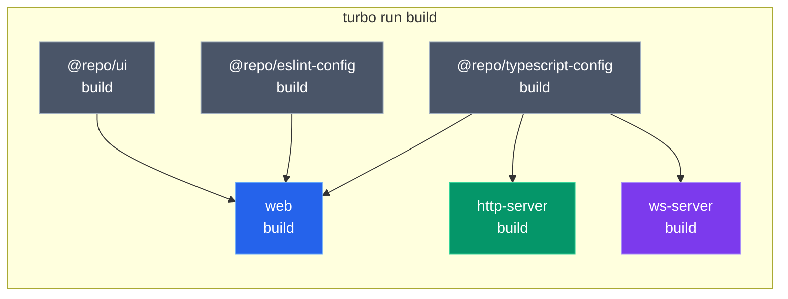
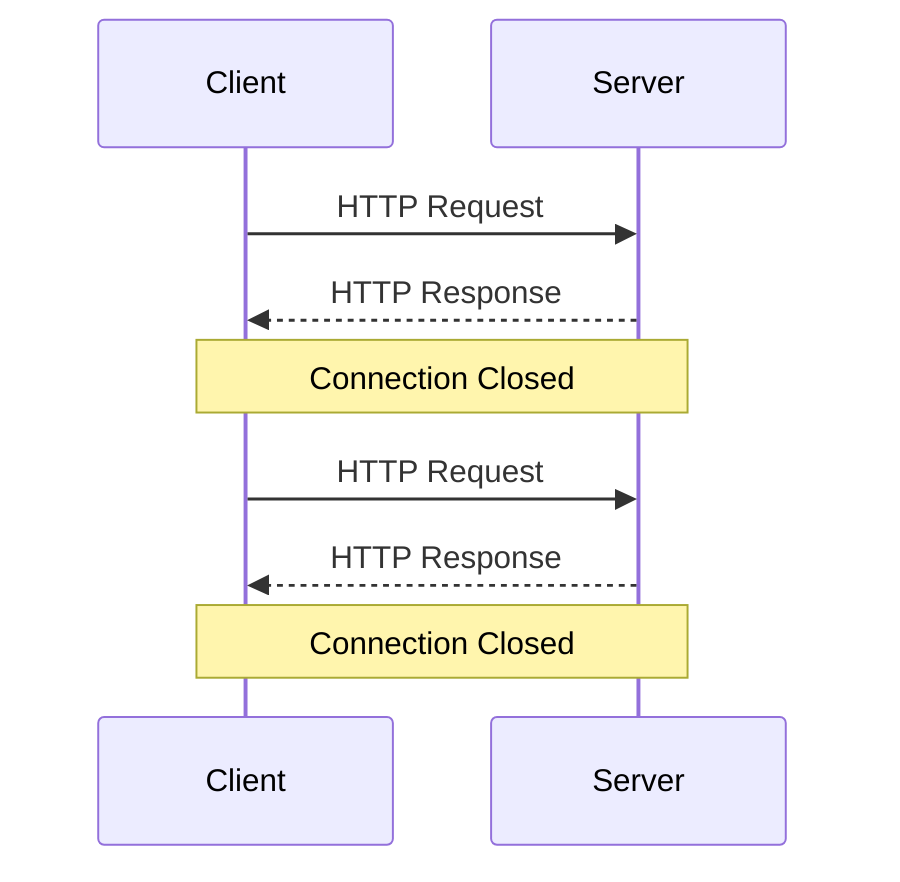
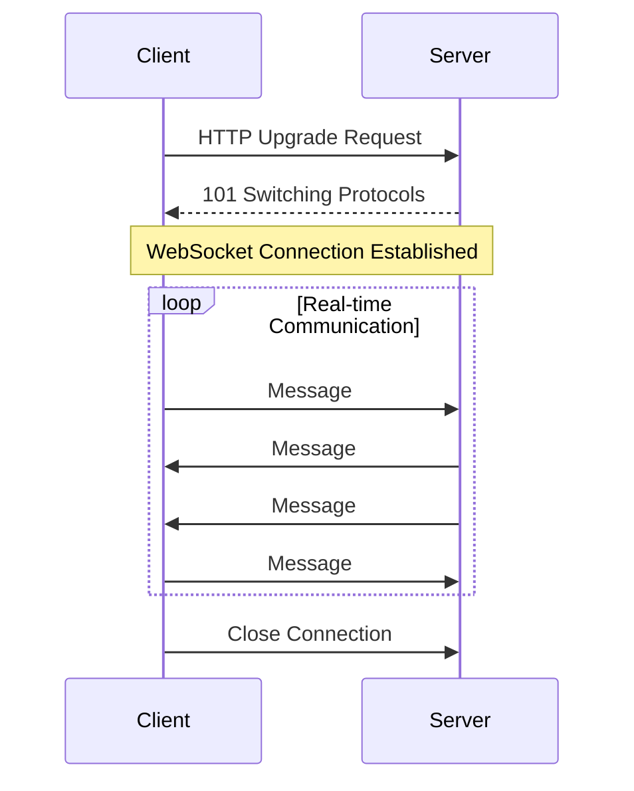
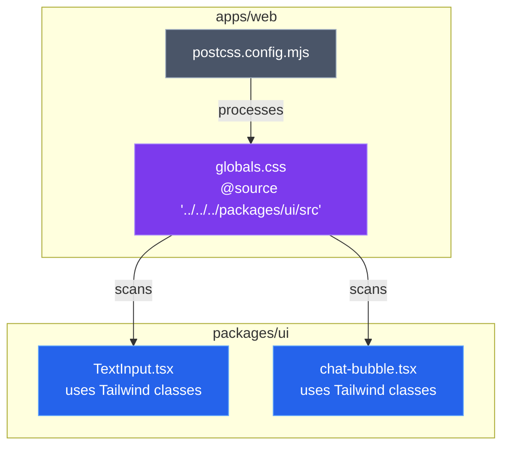
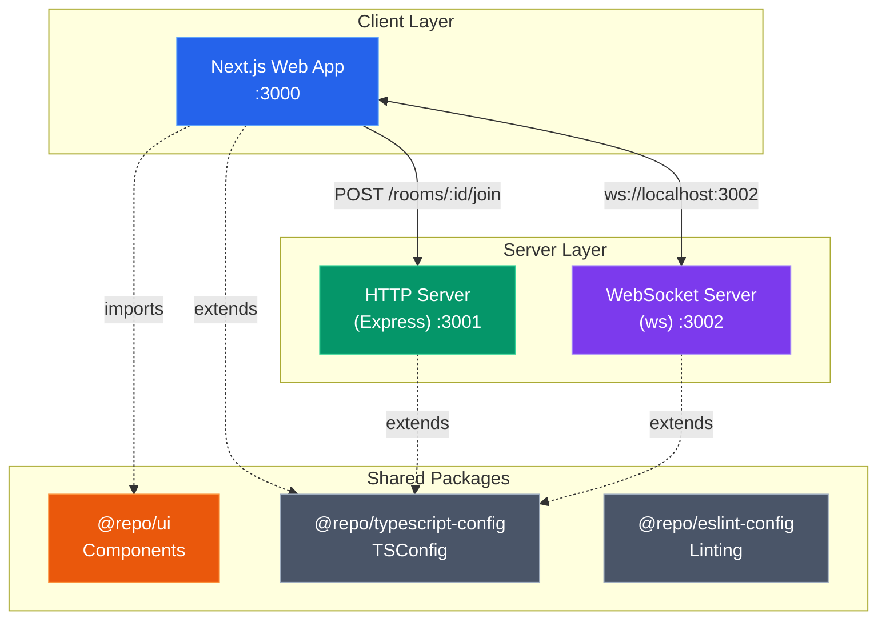
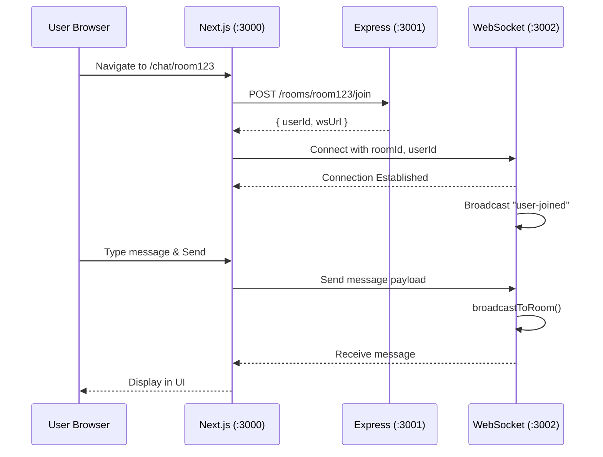
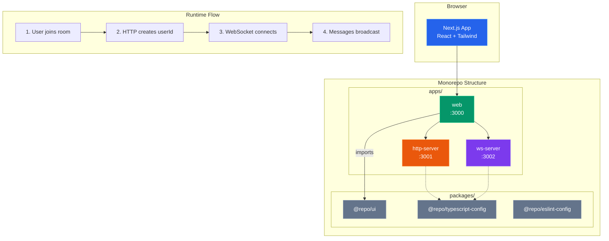
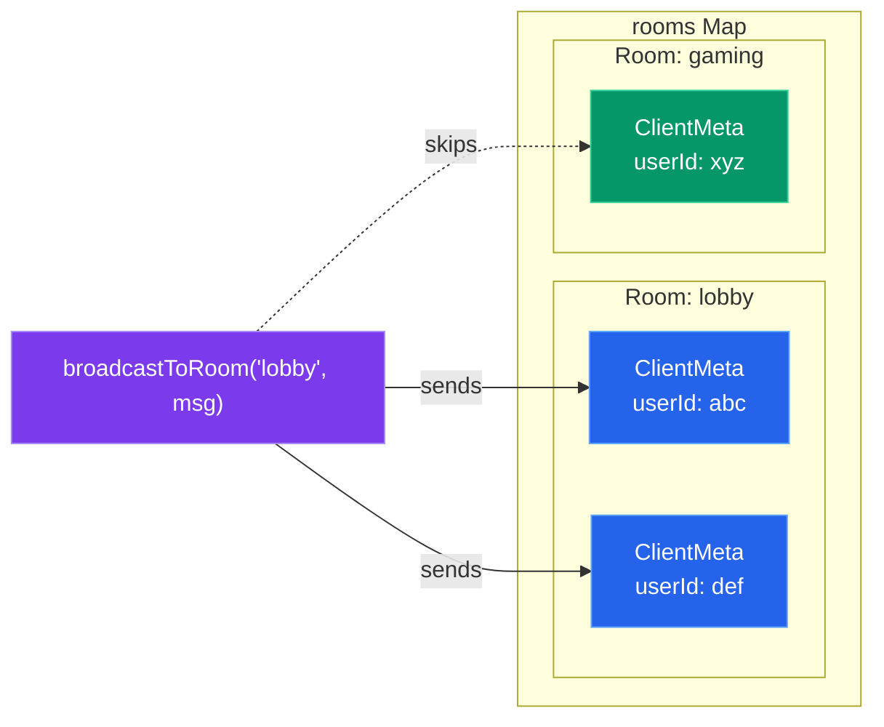
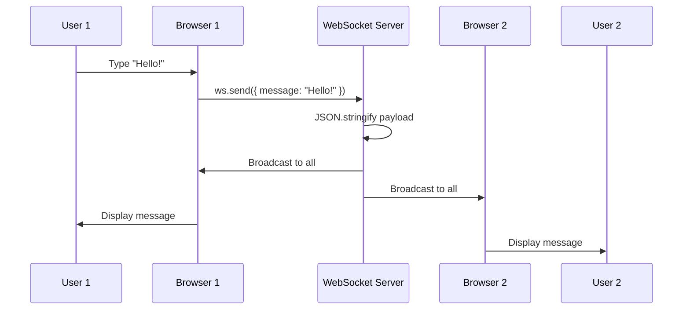

# 📦 Monorepo Chat Application - Complete Revision Guide

> A comprehensive guide to building a real-time chat application using **Turborepo**, **Next.js**, **Express**, and **WebSockets** in a monorepo architecture.

---

## 📑 Table of Contents

1. [Introduction](#1-introduction)
2. [Theoretical Concepts](#2-theoretical-concepts)
   - [What is a Monorepo?](#21-what-is-a-monorepo)
   - [Turborepo Fundamentals](#22-turborepo-fundamentals)
   - [Understanding `package.json` Exports](#23-understanding-packagejson-exports)
   - [WebSockets vs HTTP](#24-websockets-vs-http)
   - [Tailwind CSS v4 in Monorepos](#25-tailwind-css-v4-in-monorepos)
3. [Architecture Overview](#3-architecture-overview)
4. [Code & Patterns](#4-code--patterns)
   - [Monorepo Root Configuration](#41-monorepo-root-configuration)
   - [Shared TypeScript Configurations](#42-shared-typescript-configurations)
   - [HTTP Server (Express API)](#43-http-server-express-api)
   - [WebSocket Server](#44-websocket-server)
   - [Web Frontend (Next.js)](#45-web-frontend-nextjs)
   - [Shared UI Package](#46-shared-ui-package)
5. [Visual Aids & Diagrams](#5-visual-aids--diagrams)
6. [Summary & Key Takeaways](#6-summary--key-takeaways)

---

## 1. Introduction

This project demonstrates how to build a **real-time chat application** using modern web technologies organized in a **monorepo** structure. The key learning objectives are:

- Setting up a **Turborepo** monorepo from scratch
- Creating shared packages for **UI components** and **TypeScript configurations**
- Building an **Express HTTP server** for REST API endpoints
- Implementing a **WebSocket server** for real-time communication
- Connecting everything with a **Next.js 16** frontend

---

## 2. Theoretical Concepts

### 2.1 What is a Monorepo?

A **monorepo** (monolithic repository) is a software development strategy where code for multiple projects is stored in a single repository.

#### Why Use a Monorepo?

| Advantage | Explanation |
|-----------|-------------|
| **Code Sharing** | Share common utilities, types, and components across projects |
| **Atomic Changes** | Make cross-project changes in a single commit |
| **Consistent Tooling** | Use the same linting, testing, and build configurations |
| **Simplified Dependencies** | Manage dependencies from a single `package.json` |
| **Better Collaboration** | Teams can see and contribute to related codebases easily |

#### Monorepo Structure Pattern

```
project-root/
├── apps/           # Deployable applications
│   ├── web/        # Next.js frontend
│   ├── http-server/# Express REST API
│   └── ws-server/  # WebSocket server
├── packages/       # Shared libraries
│   ├── ui/         # Reusable React components
│   ├── typescript-config/  # Shared tsconfig files
│   └── eslint-config/      # Shared ESLint rules
├── package.json    # Root workspace configuration
└── turbo.json      # Turborepo task configuration
```

> [!TIP]
> The `apps/` folder contains deployable applications, while `packages/` contains shared libraries that are consumed by apps.

---

### 2.2 Turborepo Fundamentals

**Turborepo** is a high-performance build system for JavaScript/TypeScript monorepos. It provides:

1. **Incremental Builds** - Only rebuilds what changed
2. **Remote Caching** - Share build outputs across machines
3. **Parallel Execution** - Run independent tasks simultaneously
4. **Task Pipelines** - Define dependencies between tasks

#### The `turbo.json` Configuration

```json
{
  "$schema": "https://turborepo.dev/schema.json",
  "ui": "tui",           // Terminal UI mode
  "tasks": {
    "build": {
      "dependsOn": ["^build"],  // Build dependencies first
      "inputs": ["$TURBO_DEFAULT$", ".env*"],
      "outputs": [".next/**", "!.next/cache/**"]
    },
    "dev": {
      "cache": false,    // Don't cache dev mode
      "persistent": true // Keep running
    }
  }
}
```

> [!IMPORTANT]
> **Key Insight**: The `^` prefix in `"dependsOn": ["^build"]` means "run the build task of all workspace dependencies first." This ensures packages are built before apps that consume them.

#### Task Execution Flow



---

### 2.3 Understanding `package.json` Exports

The `exports` field in `package.json` defines the **public API** of your package. It controls what can be imported from your package.

```json
{
  "name": "@repo/ui",
  "exports": {
    "./*": "./src/*.tsx"
  }
}
```

**How This Works:**

| Import Statement | Resolves To |
|------------------|-------------|
| `@repo/ui/TextInput` | `./src/TextInput.tsx` |
| `@repo/ui/chat-bubble` | `./src/chat-bubble.tsx` |
| `@repo/ui/button` | `./src/button.tsx` |

> [!NOTE]
> The wildcard pattern `./*` allows importing any file from the package using the pattern `@repo/ui/<filename>` without the `.tsx` extension.

---

### 2.4 WebSockets vs HTTP

#### HTTP (Request-Response Model)



**Characteristics:**
- **Stateless** - Each request is independent
- **Unidirectional** - Client initiates, server responds
- **Overhead** - New connection for each request

#### WebSockets (Persistent Bidirectional)



**Characteristics:**
- **Persistent** - Single long-lived connection
- **Bidirectional** - Both parties can send messages anytime
- **Low Latency** - No connection overhead per message

#### When to Use Which?

| Use Case | Protocol | Why |
|----------|----------|-----|
| REST APIs | HTTP | Request-response pattern, stateless |
| Chat Applications | WebSocket | Real-time, bidirectional messaging |
| Live Updates | WebSocket | Server can push updates instantly |
| File Uploads | HTTP | One-time data transfer |
| Notifications | WebSocket | Instant delivery required |

---

### 2.5 Tailwind CSS v4 in Monorepos

Tailwind CSS v4 introduced the `@source` directive for scanning additional directories for utility classes.

```css
@import "tailwindcss";

/* Scan packages/ui for Tailwind classes */
@source "../../../packages/ui/src";
```

> [!IMPORTANT]
> **Key Insight**: Without `@source`, Tailwind won't generate CSS for classes used in shared UI packages. The path is relative from the CSS file to the source directory.

**Configuration Flow:**



---

## 3. Architecture Overview



### Data Flow for Chat



---

## 4. Code & Patterns

### 4.1 Monorepo Root Configuration

**Root `package.json`**

```json
{
  "name": "21.2-mono-turbo",
  "private": true,
  "scripts": {
    "build": "turbo run build",
    "dev": "turbo run dev",
    "lint": "turbo run lint"
  },
  "workspaces": [
    "apps/*",
    "packages/*"
  ],
  "packageManager": "bun@1.3.5",
  "devDependencies": {
    "turbo": "^2.8.0",
    "typescript": "5.9.2"
  }
}
```

> [!TIP]
> **Key Insight**: The `workspaces` array tells the package manager (bun/npm/yarn) to treat directories matching these patterns as separate packages. All packages share the same `node_modules` via hoisting.

---

### 4.2 Shared TypeScript Configurations

**`packages/typescript-config/backends.json`**

```json
{
  "compilerOptions": {
    "module": "nodenext",
    "target": "esnext",
    "strict": true,
    "esModuleInterop": true,
    "allowSyntheticDefaultImports": true,
    "verbatimModuleSyntax": true,
    "skipLibCheck": true,
    "noUnusedLocals": true,
    "noUnusedParameters": true
  }
}
```

**How Apps Extend It:**

```json
// apps/http-server/tsconfig.json
{
  "extends": "../../packages/typescript-config/backends.json",
  "compilerOptions": {
    "rootDir": "./src",
    "outDir": "./dist"
  }
}
```

> [!NOTE]
> **Key Insight**: By centralizing TypeScript configs, you ensure consistency across all backend services. Changes propagate automatically to all consumers.

---

### 4.3 HTTP Server (Express API)

**`apps/http-server/src/index.ts`**

```typescript
import express from "express";
import cors from "cors";
import { randomUUID } from "crypto";

const app = express();

// Enable CORS for frontend origin
app.use(cors({ origin: "http://localhost:3000" }));
app.use(express.json());

// Health check endpoint
app.get("/health", (_req, res) => {
  res.json({ status: "ok" });
});

// Join a room - returns userId and WebSocket URL
app.post("/rooms/:roomId/join", (req, res) => {
  const { roomId } = req.params;
  const { name } = req.body || {};

  const userId = randomUUID();

  res.json({
    roomId,
    userId,
    name: typeof name === "string" && name.trim().length > 0 
      ? name.trim() 
      : undefined,
    wsUrl: "ws://localhost:3002",
  });
});

app.listen(3001, () => {
  console.log(`HTTP server started on port 3001`);
});
```

> [!IMPORTANT]
> **Key Insights:**
> 1. **CORS Configuration** - Essential for frontend-backend communication on different ports
> 2. **UUID Generation** - `randomUUID()` from Node's `crypto` module provides unique user IDs
> 3. **Stateless Design** - No database; returns connection info for WebSocket

---

### 4.4 WebSocket Server

**`apps/ws-server/index.ts`** - The Heart of Real-Time Communication

#### Room Management Pattern

```typescript
import { WebSocketServer, WebSocket } from "ws";
import { URL } from "url";

type ClientMeta = {
  ws: WebSocket;
  userId: string;
  name?: string;
  roomId: string;
};

// In-memory room storage: roomId -> Set of clients
const rooms = new Map<string, Set<ClientMeta>>();
```

> [!NOTE]
> **Key Insight**: Using `Map<string, Set<ClientMeta>>` provides O(1) lookup for rooms and O(1) add/delete for clients within a room.

#### Adding/Removing Clients

```typescript
function addClientToRoom(client: ClientMeta) {
  const existing = rooms.get(client.roomId) ?? new Set<ClientMeta>();
  existing.add(client);
  rooms.set(client.roomId, existing);
}

function removeClientFromRoom(client: ClientMeta) {
  const existing = rooms.get(client.roomId);
  if (!existing) return;
  existing.delete(client);
  if (existing.size === 0) {
    rooms.delete(client.roomId);  // Clean up empty rooms
  }
}
```

> [!TIP]
> **Key Insight**: The nullish coalescing operator (`??`) creates a new Set if the room doesn't exist. Empty rooms are garbage collected to prevent memory leaks.

#### Broadcasting Messages

```typescript
function broadcastToRoom(roomId: string, payload: unknown) {
  const clients = rooms.get(roomId);
  if (!clients) return;

  const data = JSON.stringify(payload);
  
  clients.forEach((client) => {
    if (client.ws.readyState === WebSocket.OPEN) {
      client.ws.send(data);
    }
  });
}
```

> [!IMPORTANT]
> **Key Insight**: Always check `readyState === WebSocket.OPEN` before sending. Clients may disconnect between retrieving the set and sending the message.

#### Connection Handling

```typescript
const wss = new WebSocketServer({ port: 3002 });

wss.on("connection", (ws, req) => {
  // Parse connection parameters from URL
  const url = new URL(req.url, "ws://localhost:3002");
  const roomId = url.searchParams.get("roomId") ?? "";
  const userId = url.searchParams.get("userId") ?? "";
  const name = url.searchParams.get("name") ?? undefined;

  // Validate required parameters
  if (!roomId || !userId) {
    ws.close(1008, "Missing roomId or userId");
    return;
  }

  const client: ClientMeta = { ws, userId, name, roomId };
  addClientToRoom(client);

  // Notify everyone that someone joined
  broadcastToRoom(roomId, {
    type: "system",
    event: "user-joined",
    roomId,
    userId,
    name,
    timestamp: new Date().toISOString(),
  });

  // Handle incoming messages
  ws.on("message", (raw) => {
    let message = raw.toString();
    
    // Support both plain text and JSON payloads
    try {
      const parsed = JSON.parse(message);
      if (typeof parsed.message === "string") {
        message = parsed.message;
      }
    } catch {
      // Use raw text as message
    }

    broadcastToRoom(client.roomId, {
      type: "chat-message",
      roomId: client.roomId,
      userId: client.userId,
      name: client.name,
      message,
      timestamp: new Date().toISOString(),
    });
  });

  // Handle disconnection
  ws.on("close", () => {
    removeClientFromRoom(client);
    broadcastToRoom(roomId, {
      type: "system",
      event: "user-left",
      roomId,
      userId,
      name,
      timestamp: new Date().toISOString(),
    });
  });
});
```

---

### 4.5 Web Frontend (Next.js)

#### Home Page - Room Join

```tsx
"use client";

import { useState } from "react";
import { TextInput } from "@repo/ui/TextInput";
import { useRouter } from "next/navigation";

export default function Home() {
  const [roomId, setRoomId] = useState("");
  const router = useRouter();

  return (
    <div className="h-screen flex flex-col justify-center items-center p-4">
      <div className="w-full max-w-sm flex flex-col gap-4">
        <h1 className="text-3xl font-bold text-center">Join Chat Room</h1>
        <TextInput 
          placeholder="Enter Room ID" 
          value={roomId} 
          onChange={(val) => setRoomId(val)} 
        />
        <button 
          onClick={() => {
            if (roomId.trim()) {
              router.push(`/chat/${roomId}`);
            }
          }}
          className="w-full bg-blue-500 text-white px-6 py-2 rounded-lg"
        >
          Join Room
        </button>
      </div>
    </div>
  );
}
```

> [!NOTE]
> **Key Insight**: The `"use client"` directive marks this as a Client Component, enabling state and event handlers. The shared `TextInput` from `@repo/ui` demonstrates cross-package imports.

#### Chat Room - WebSocket Integration

```tsx
"use client";

import { use, useEffect, useMemo, useRef, useState } from "react";
import { TextInput } from "@repo/ui/TextInput";
import { ChatBubble } from "@repo/ui/chat-bubble";

type RouteParams = {
  params: Promise<{ roomId: string }>;
};

type ChatMessage = {
  id: string;
  type: "chat-message" | "system";
  roomId: string;
  userId?: string;
  name?: string;
  message?: string;
  event?: "user-joined" | "user-left";
  timestamp: string;
};

export default function ChatRoom({ params }: RouteParams) {
  const { roomId } = use(params);  // Next.js 15+ async params
  
  const [message, setMessage] = useState("");
  const [messages, setMessages] = useState<ChatMessage[]>([]);
  const [status, setStatus] = useState<"connecting" | "connected" | "disconnected">("connecting");
  const [userId, setUserId] = useState<string | null>(null);
  
  const wsRef = useRef<WebSocket | null>(null);
  const messagesEndRef = useRef<HTMLDivElement | null>(null);
```

> [!IMPORTANT]
> **Key Insights:**
> 1. **`use(params)`** - Next.js 15+ uses async params; `use()` unwraps the Promise
> 2. **`useRef` for WebSocket** - Persists the WebSocket across re-renders without causing them
> 3. **Message Types** - Discriminated union (`"chat-message" | "system"`) enables type-safe handling

#### Connection Setup with Cleanup

```tsx
useEffect(() => {
  let cancelled = false;

  async function init() {
    try {
      setStatus("connecting");
      
      // 1. Join room via HTTP API
      const res = await fetch(`http://localhost:3001/rooms/${roomId}/join`, {
        method: "POST",
        headers: { "Content-Type": "application/json" },
        body: JSON.stringify({ name: displayName }),
      });
      
      const data = await res.json();
      if (cancelled) return;  // Prevent state updates if unmounted
      
      // 2. Connect to WebSocket with params
      const url = new URL(data.wsUrl);
      url.searchParams.set("roomId", roomId);
      url.searchParams.set("userId", data.userId);
      url.searchParams.set("name", displayName);
      
      const ws = new WebSocket(url.toString());
      wsRef.current = ws;
      
      ws.onopen = () => setStatus("connected");
      
      ws.onmessage = (event) => {
        const parsed = JSON.parse(event.data);
        setMessages((prev) => [...prev, {
          id: `${Date.now()}-${Math.random()}`,
          ...parsed
        }]);
      };
      
      ws.onclose = () => setStatus("disconnected");
    } catch (e) {
      setStatus("disconnected");
    }
  }

  init();

  // Cleanup function
  return () => {
    cancelled = true;
    if (wsRef.current) {
      wsRef.current.close();
      wsRef.current = null;
    }
  };
}, [roomId]);
```

> [!IMPORTANT]
> **Key Insights:**
> 1. **Cancellation Flag** - Prevents state updates after component unmount
> 2. **Cleanup Function** - Properly closes WebSocket to prevent memory leaks
> 3. **Two-Step Connection** - HTTP for auth/setup, then WebSocket for real-time

#### Sending Messages

```tsx
const handleSend = () => {
  if (!message.trim()) return;
  if (!wsRef.current || wsRef.current.readyState !== WebSocket.OPEN) return;

  wsRef.current.send(JSON.stringify({
    message: message.trim(),
  }));

  setMessage("");
};
```

---

### 4.6 Shared UI Package

#### TextInput Component

```tsx
"use client";

interface TextInputProps {
  placeholder: string;
  value: string;
  onChange(value: string): void;
  className?: string;
}

export function TextInput({ placeholder, value, onChange, className }: TextInputProps) {
  return (
    <input 
      type="text" 
      placeholder={placeholder} 
      value={value}
      onChange={(e) => onChange(e.target.value)}
      className={`border border-gray-300 rounded p-2 focus:outline-none focus:ring-2 focus:ring-blue-500 ${className}`} 
    />
  );
}
```

> [!TIP]
> **Key Insight**: The `onChange` prop accepts a string value directly, abstracting away the event object. This provides a cleaner API for consumers.

#### ChatBubble Component

```tsx
"use client";

interface ChatBubbleProps {
  message: string | ReactNode;
  isMe: boolean;
  sender?: string;
  timestamp?: string;
  className?: string;
}

export function ChatBubble({ message, isMe, sender, timestamp, className }: ChatBubbleProps) {
  return (
    <div className={`flex flex-col ${isMe ? "items-end" : "items-start"} ${className}`}>
      {!isMe && sender && (
        <span className="text-xs font-medium text-gray-500 mb-1 ml-1">
          {sender}
        </span>
      )}
      <div
        className={`max-w-[80%] px-4 py-2 rounded-2xl text-sm shadow-sm ${
          isMe
            ? "bg-blue-600 text-white rounded-tr-none"
            : "bg-white border border-gray-100 text-gray-800 rounded-tl-none"
        }`}
      >
        <div className="leading-relaxed break-words">{message}</div>
        {timestamp && (
          <span className={`text-[10px] mt-1 block text-right ${
            isMe ? "text-blue-100" : "text-gray-400"
          }`}>
            {timestamp}
          </span>
        )}
      </div>
    </div>
  );
}
```

> [!NOTE]
> **Key Insights:**
> 1. **Conditional Styling** - `isMe` flag flips alignment and colors
> 2. **Tailwind Tricks** - `rounded-tr-none` / `rounded-tl-none` creates chat bubble tails
> 3. **Responsive Width** - `max-w-[80%]` prevents bubbles from spanning full width

---

## 5. Visual Aids & Diagrams

### Complete System Architecture



### WebSocket Room Model



### Message Flow Timeline



---

## 6. Summary & Key Takeaways

### 🎯 Core Concepts Learned

| Concept | Key Points |
|---------|------------|
| **Monorepo** | Single repo, multiple packages, shared dependencies via `workspaces` |
| **Turborepo** | `turbo.json` defines task dependencies, `^build` means "build deps first" |
| **Package Exports** | `"exports": { "./*": "./src/*.tsx" }` enables `@repo/ui/Button` imports |
| **WebSockets** | Persistent, bidirectional, use `Map<string, Set>` for room management |
| **Tailwind v4** | Use `@source` directive to scan shared packages for utility classes |

### 🔧 Commands Reference

```bash
# Start all services in development
turbo dev

# Build all packages
turbo build

# Run specific app
cd apps/web && bun dev
cd apps/http-server && bun dev
cd apps/ws-server && bun dev
```

### 📁 Files to Remember

| File | Purpose |
|------|---------|
| `turbo.json` | Task pipeline configuration |
| `package.json` (root) | Workspace definitions |
| `packages/ui/package.json` → `exports` | Public API of shared package |
| `apps/web/app/globals.css` → `@source` | Tailwind monorepo scanning |

### ⚡ Quick Patterns

```typescript
// WebSocket rooms storage
const rooms = new Map<string, Set<ClientMeta>>();

// Broadcast with safety check
clients.forEach((c) => {
  if (c.ws.readyState === WebSocket.OPEN) c.ws.send(data);
});

// React cleanup for WebSocket
useEffect(() => {
  const ws = new WebSocket(url);
  return () => ws.close();
}, []);

// Next.js 15+ async params
const { roomId } = use(params);
```

---

> **🚀 You're now equipped to build scalable real-time applications in a monorepo!**
