# 🚀 Vertical & Horizontal Scaling, Auto Scaling Groups (ASG)

> **Week 28.1 — Master Guide for Revision**
> Covers: Scaling strategies, Node.js cluster module, capacity estimation, ASG, and real-world backend architectures.

---

## 📑 Table of Contents

| #   | Topic                                                                                                  |
| --- | ------------------------------------------------------------------------------------------------------ |
| 1   | [What is Scaling?](#1--what-is-scaling)                                                                |
| 2   | [Vertical Scaling (Scale Up)](#2--vertical-scaling-scale-up)                                           |
| 3   | [Horizontal Scaling (Scale Out)](#3--horizontal-scaling-scale-out)                                     |
| 4   | [Vertical vs Horizontal — Side-by-Side](#4--vertical-vs-horizontal--side-by-side)                      |
| 5   | [Scaling Issues: JS vs Go vs Rust](#5--scaling-issues-js-vs-go-vs-rust)                                |
| 6   | [Vertical Scaling in Node.js — The Cluster Module](#6--vertical-scaling-in-nodejs--the-cluster-module) |
| 7   | [Assignment — Parallel Sum with Cluster Module](#7--assignment--parallel-sum-with-cluster-module)      |
| 8   | [Capacity Estimation (System Design)](#8--capacity-estimation-system-design)                           |
| 9   | [Auto Scaling Groups (ASG) on AWS](#9--auto-scaling-groups-asg-on-aws)                                 |
| 10  | [Real-World Backend Architectures](#10--real-world-backend-architectures)                              |
| 11  | [Interview Cheat Sheet](#11--interview-cheat-sheet)                                                    |
| 12  | [Key Takeaways](#12--key-takeaways)                                                                    |

---

## 1 — What is Scaling?

**Scaling** = Making your system handle **more load** (users, requests, data) without degrading performance.

### Real-World Analogy 🍕

Imagine you own a pizza shop:

- **Day 1:** You can make 10 pizzas/hour alone → That's enough.
- **Day 100:** Demand grows to 100 pizzas/hour → You **MUST** scale.

You have **two options**:

| Strategy               | Pizza Analogy             | Tech Equivalent                         |
| ---------------------- | ------------------------- | --------------------------------------- |
| **Vertical Scaling**   | Buy a bigger, faster oven | Upgrade server hardware (more CPU, RAM) |
| **Horizontal Scaling** | Open more pizza shops     | Add more servers running the same app   |

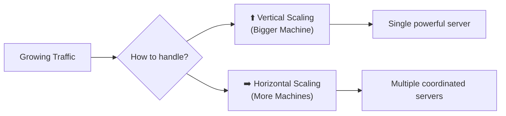

---

## 2 — Vertical Scaling (Scale Up)

> **Definition:** Increase the resources (CPU, RAM, Disk, Network) of a **single machine**.

### Visual: Before vs After

```
  BEFORE (t2.micro)                 AFTER (c5.4xlarge)
  ┌──────────────┐                  ┌──────────────────────────┐
  │  1 vCPU      │     UPGRADE      │  16 vCPUs               │
  │  1 GB RAM    │  ──────────────→  │  32 GB RAM               │
  │  8 GB Disk   │                  │  500 GB SSD              │
  │  Low Network │                  │  10 Gbps Network         │
  └──────────────┘                  └──────────────────────────┘
       $8/month                          $500/month
```

### Real-World Examples

| Company / Use Case                       | How They Scale Vertically                          |
| ---------------------------------------- | -------------------------------------------------- |
| **Database servers** (PostgreSQL, MySQL) | Bigger instance = faster queries, more connections |
| **Gaming servers** (Minecraft, CS:GO)    | Single powerful machine for low-latency game state |
| **Mainframes** (Banks, Airlines)         | Massive single machines handling all transactions  |
| **Your Laptop**                          | Upgrade from 8 GB → 32 GB RAM for heavy IDEs       |

### ✅ Pros of Vertical Scaling

| Benefit                       | Why It Matters                                           |
| ----------------------------- | -------------------------------------------------------- |
| **Simple**                    | No code changes needed — just upgrade the machine        |
| **No distributed complexity** | No need for load balancers, service discovery, etc.      |
| **Data consistency**          | Single machine = no sync issues, no eventual consistency |
| **Lower latency**             | Everything communicates in-process (no network hops)     |

### ❌ Cons of Vertical Scaling

| Drawback                           | Why It Hurts                                           |
| ---------------------------------- | ------------------------------------------------------ |
| **Hardware limit**                 | You can't buy a CPU with 10,000 cores (physical limit) |
| **Single Point of Failure (SPOF)** | If that ONE machine dies, everything goes down         |
| **Expensive**                      | High-end hardware cost grows **exponentially**         |
| **Downtime during upgrade**        | Usually requires restart/migration                     |
| **Diminishing returns**            | Going from 4→8 cores doesn't double performance        |

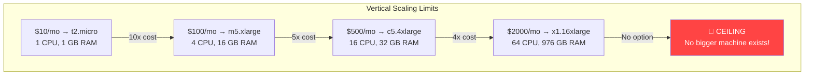

---

## 3 — Horizontal Scaling (Scale Out)

> **Definition:** Add **more machines** (instances/nodes) that work together behind a load balancer.

### Visual: Horizontal Scaling

```
                    ┌──────────────────┐
                    │   Load Balancer   │
                    │  (distributes     │
                    │   traffic)        │
                    └────────┬─────────┘
                             │
              ┌──────────────┼──────────────┐
              │              │              │
        ┌──────────┐  ┌──────────┐  ┌──────────┐
        │ Server 1 │  │ Server 2 │  │ Server 3 │
        │ (t2.med) │  │ (t2.med) │  │ (t2.med) │
        │   App    │  │   App    │  │   App    │
        └──────────┘  └──────────┘  └──────────┘
              │              │              │
              └──────────────┼──────────────┘
                             │
                    ┌──────────────────┐
                    │  Shared Database  │
                    │   (RDS / Redis)   │
                    └──────────────────┘
```

### Real-World Examples

| Company / Use Case   | How They Scale Horizontally                           |
| -------------------- | ----------------------------------------------------- |
| **Netflix**          | 1000s of microservice instances behind load balancers |
| **Google Search**    | Millions of servers across data centers worldwide     |
| **WhatsApp**         | Multiple Erlang nodes handling billions of messages   |
| **X.com (Twitter)**  | Fanout services replicated across regions             |
| **Your Node.js app** | 5 EC2 instances behind an Application Load Balancer   |

### ✅ Pros of Horizontal Scaling

| Benefit                     | Why It Matters                                       |
| --------------------------- | ---------------------------------------------------- |
| **Virtually unlimited**     | Need more power? Just add more machines              |
| **Fault tolerant**          | If 1 server dies, others keep running                |
| **Cost-effective**          | Many cheap machines < 1 super-expensive machine      |
| **Geographic distribution** | Servers in multiple regions = lower latency globally |
| **Rolling updates**         | Update servers one-by-one without downtime           |

### ❌ Cons of Horizontal Scaling

| Drawback                 | Why It Hurts                                          |
| ------------------------ | ----------------------------------------------------- |
| **Complexity**           | Need load balancers, service discovery, health checks |
| **Data consistency**     | Distributed state is HARD (CAP theorem!)              |
| **Session management**   | User sessions must be shared (Redis, JWT)             |
| **Debugging difficulty** | "Which of the 50 servers has the bug?"                |
| **Network overhead**     | Inter-service communication adds latency              |

---

## 4 — Vertical vs Horizontal — Side-by-Side

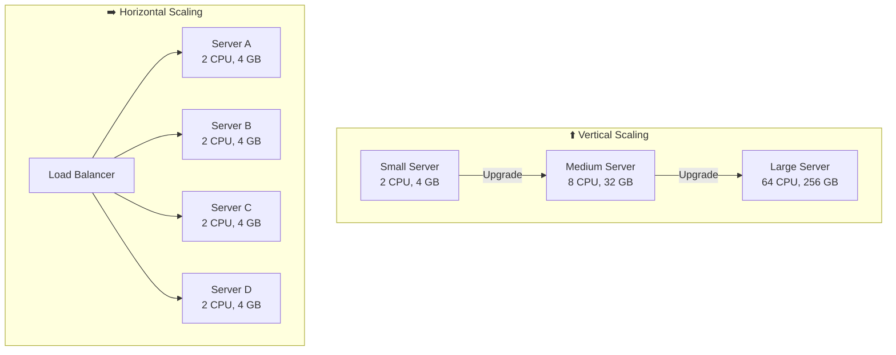

### Comparison Table

| Feature               | ⬆️ Vertical Scaling         | ➡️ Horizontal Scaling        |
| --------------------- | --------------------------- | ---------------------------- |
| **How**               | Bigger machine              | More machines                |
| **Cost curve**        | Exponential 📈              | Linear 📊                    |
| **Limit**             | Hardware ceiling            | Virtually unlimited          |
| **Failure impact**    | Total outage 💀             | Partial degradation ⚠️       |
| **Complexity**        | Low (single process)        | High (distributed system)    |
| **Data consistency**  | Easy (single DB)            | Hard (replication, sharding) |
| **Downtime to scale** | Usually yes                 | No (add/remove instances)    |
| **Best for**          | Databases, legacy apps      | Stateless web servers, APIs  |
| **Real example**      | Oracle DB on a beefy server | Netflix microservices        |

### When to Use Which?

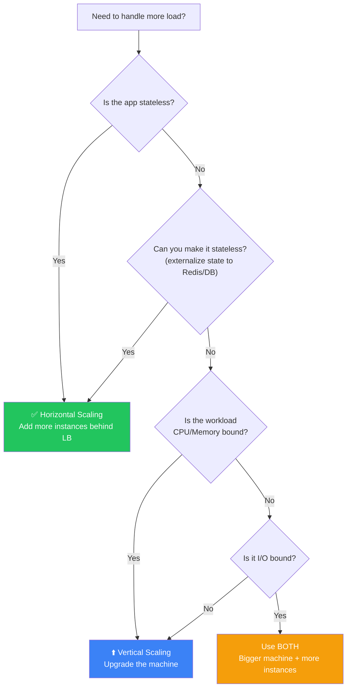

---

## 5 — Scaling Issues: JS vs Go vs Rust

### The Single-Threaded Nature of JavaScript

JavaScript (and by extension Node.js) runs on a **single thread** — it uses one CPU core by default.

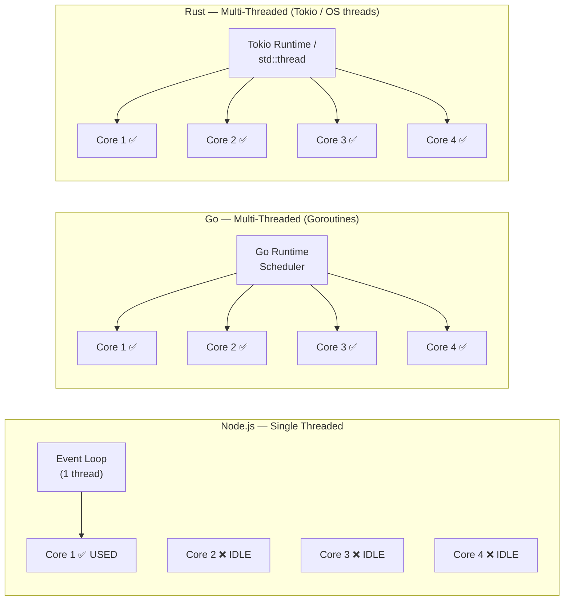

### What Does "Single Threaded" Actually Mean?

```javascript
// Node.js runs ALL your JavaScript on ONE thread.
// Even if your machine has 16 cores, Node.js uses ONLY 1.

const express = require("express");
const app = express();

app.get("/heavy", (req, res) => {
  // ⚠️ This CPU-heavy work BLOCKS the entire event loop!
  // No other requests can be processed while this runs.
  let sum = 0;
  for (let i = 0; i < 1e9; i++) {
    sum += i;
  }
  res.json({ sum });
});

app.get("/fast", (req, res) => {
  // This route CANNOT respond while /heavy is computing!
  // Even though it's instant, it's stuck waiting.
  res.json({ message: "I'm fast!" });
});

app.listen(3000);
```

### How Other Languages Handle Multi-Core

| Language   | Multi-threading Model                      | How It Works                                                                                                                                         |
| ---------- | ------------------------------------------ | ---------------------------------------------------------------------------------------------------------------------------------------------------- |
| **Go**     | Goroutines + Go Scheduler                  | Lightweight green threads multiplexed onto OS threads. `go func()` spawns a goroutine that the runtime schedules across all CPU cores automatically. |
| **Rust**   | OS Threads + Tokio async runtime           | `std::thread::spawn()` for OS threads or `tokio::spawn()` for async tasks. Full control over concurrency with zero-cost abstractions.                |
| **Java**   | JVM Threads (+ Virtual Threads in Java 21) | `new Thread()` or `ExecutorService`. Each thread maps to an OS thread. Virtual threads are lightweight (like goroutines).                            |
| **Python** | GIL limits true parallelism                | Similar to JS! `multiprocessing` module creates separate processes (like Node's cluster). `asyncio` for I/O concurrency.                             |
| **C++**    | OS Threads                                 | `std::thread` for direct OS thread creation. Full manual control.                                                                                    |

### Go Example — Automatic Multi-Core Usage

```go
package main

import (
    "fmt"
    "net/http"
    "runtime"
)

func handler(w http.ResponseWriter, r *http.Request) {
    // This handler automatically runs on ANY available core.
    // Go's runtime scheduler handles the distribution.
    sum := 0
    for i := 0; i < 1_000_000_000; i++ {
        sum += i
    }
    fmt.Fprintf(w, "Sum: %d", sum)
}

func main() {
    // Go automatically uses ALL available CPU cores
    fmt.Printf("Using %d CPU cores\n", runtime.NumCPU())

    // Every incoming request can run on a different core
    // via goroutines — NO extra setup needed!
    http.HandleFunc("/", handler)
    http.ListenAndServe(":3000", nil)
}
```

### Rust Example — Multi-Core with Tokio

```rust
use actix_web::{web, App, HttpServer, HttpResponse};

// Actix-web automatically spawns worker threads = number of CPU cores
#[actix_web::main]
async fn main() -> std::io::Result<()> {
    // By default, Actix creates 1 worker per CPU core
    // Each worker has its own event loop and OS thread
    HttpServer::new(|| {
        App::new()
            .route("/", web::get().to(|| async {
                HttpResponse::Ok().body("Using ALL cores!")
            }))
    })
    .workers(num_cpus::get()) // Explicitly set workers = CPU cores
    .bind("0.0.0.0:3000")?
    .run()
    .await
}
```

### Why Node.js Can't "Just" Use All Cores

```
  ┌────────────────────────────────────────────────────────────┐
  │                    The V8 Engine Constraint                │
  │                                                            │
  │  V8 (the JS engine inside Node.js) was designed for       │
  │  BROWSERS — where a single tab = single thread.           │
  │                                                            │
  │  V8's garbage collector, JIT compiler, and object model   │
  │  are NOT thread-safe. Making them thread-safe would:       │
  │                                                            │
  │    1. Add massive locking overhead                         │
  │    2. Slow down single-threaded performance                │
  │    3. Make the codebase much more complex                  │
  │                                                            │
  │  So Node.js chose a different approach:                    │
  │    → Use the CLUSTER MODULE to run multiple processes      │
  │    → Each process gets its own V8 instance                 │
  │    → Each process uses one core                            │
  │    → OS handles load balancing between processes           │
  └────────────────────────────────────────────────────────────┘
```

### Comparison Summary

```mermaid
graph TD
    subgraph "🟡 Node.js"
        N1["1 process = 1 core"]
        N2["Must use cluster module<br/>for multi-core"]
        N3["Each worker = separate<br/>V8 instance + memory"]
        N1 --> N2 --> N3
    end

    subgraph "🔵 Go"
        G1["1 process = ALL cores"]
        G2["Goroutines multiplexed<br/>by Go scheduler"]
        G3["Shared memory with<br/>channels for safety"]
        G1 --> G2 --> G3
    end

    subgraph "🟠 Rust"
        RU1["1 process = ALL cores"]
        RU2["OS threads or async<br/>Tokio tasks"]
        RU3["Ownership model prevents<br/>data races at compile time"]
        RU1 --> RU2 --> RU3
    end
```

---

## 6 — Vertical Scaling in Node.js — The Cluster Module

### Why Do We Need It?

Since Node.js can only use **one CPU core**, vertical scaling (upgrading to a machine with more cores) is **wasted** by default. The **`cluster`** module solves this by forking multiple worker processes.

### How the Cluster Module Works

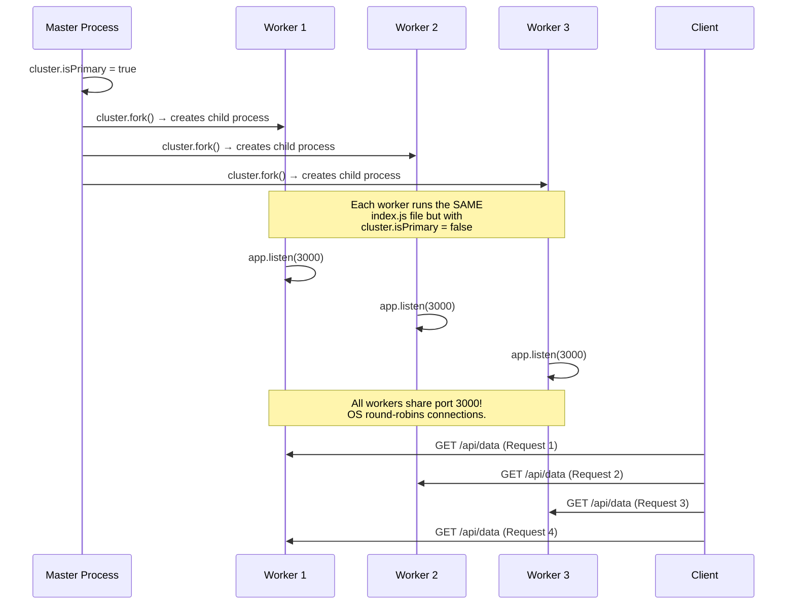

### Architecture Diagram

```
                             ┌──────────────────────────────────┐
                             │          Your Machine             │
                             │         (8 CPU cores)             │
                             │                                   │
    node index.js            │  ┌─────────────────────────┐     │
    ─────────────→           │  │    MASTER PROCESS        │     │
                             │  │    (cluster.isPrimary)   │     │
                             │  │                          │     │
                             │  │  cluster.fork() ───→ W1  │     │
                             │  │  cluster.fork() ───→ W2  │     │
                             │  │  cluster.fork() ───→ W3  │     │
                             │  │  cluster.fork() ───→ W4  │     │
                             │  │  cluster.fork() ───→ W5  │     │
                             │  │  cluster.fork() ───→ W6  │     │
                             │  │  cluster.fork() ───→ W7  │     │
                             │  │  cluster.fork() ───→ W8  │     │
                             │  └─────────────────────────┘     │
                             │                                   │
                             │  Each Worker (W1–W8):             │
                             │    • Runs its own V8 engine        │
                             │    • Has its own event loop        │
                             │    • Listens on port 3000          │
                             │    • Handles requests independently│
                             │    • Uses 1 CPU core               │
                             └──────────────────────────────────┘
```

### Approach 1: Simple Express Server WITHOUT Clustering

```javascript
// ❌ WITHOUT CLUSTERING — Uses only 1 CPU core
// File: server-single.js

const express = require("express");
const app = express();

app.get("/", (req, res) => {
  // Simulate some CPU work
  let sum = 0;
  for (let i = 0; i < 1e7; i++) {
    sum += i;
  }
  res.json({
    message: "Hello!",
    sum,
    pid: process.pid, // Always the same PID
  });
});

app.listen(3000, () => {
  console.log(`Server running on port 3000 (PID: ${process.pid})`);
  // On an 8-core machine, 7 cores sit completely idle! 😢
});
```

### Approach 2: Express Server WITH Cluster Module

```javascript
// ✅ WITH CLUSTERING — Uses ALL CPU cores
// File: server-cluster.js

const cluster = require("cluster"); // Built-in Node.js module
const os = require("os"); // To detect number of CPU cores
const express = require("express");

// ─────────────────────────────────────────────────────────
// STEP 1: Check if this is the MASTER process or a WORKER
// ─────────────────────────────────────────────────────────
// When you run `node server-cluster.js`, Node.js starts ONE process.
// That first process is the "primary" (master).
// cluster.fork() creates CHILD processes (workers).
// Each child process re-runs THIS SAME FILE from the top,
// but cluster.isPrimary will be FALSE for them.

if (cluster.isPrimary) {
  // ───────────────────────────────────────────────────────
  // MASTER PROCESS — Only manages workers, doesn't serve requests
  // ───────────────────────────────────────────────────────

  const numCPUs = os.cpus().length;
  console.log(`🟢 Master process ${process.pid} is running`);
  console.log(`🔧 Detected ${numCPUs} CPU cores`);
  console.log(`🔄 Forking ${numCPUs} worker processes...\n`);

  // Fork one worker per CPU core
  for (let i = 0; i < numCPUs; i++) {
    cluster.fork();
    // Each fork() call:
    //   1. Creates a new Node.js process (child_process.fork)
    //   2. The child process runs this SAME file
    //   3. But for the child, cluster.isPrimary = false
    //   4. So the child goes to the 'else' block below
  }

  // Listen for worker crashes and restart them
  cluster.on("exit", (worker, code, signal) => {
    console.log(`💀 Worker ${worker.process.pid} died (code: ${code})`);
    console.log("🔄 Starting a replacement worker...");
    cluster.fork(); // Auto-restart crashed workers!
  });
} else {
  // ───────────────────────────────────────────────────────
  // WORKER PROCESS — Handles actual HTTP requests
  // ───────────────────────────────────────────────────────

  const app = express();

  app.get("/", (req, res) => {
    let sum = 0;
    for (let i = 0; i < 1e7; i++) {
      sum += i;
    }
    res.json({
      message: "Hello from worker!",
      sum,
      pid: process.pid, // Different PID for each worker
      workerId: cluster.worker.id, // Worker number (1, 2, 3, ...)
    });
  });

  app.listen(3000, () => {
    console.log(
      `  ⚡ Worker ${cluster.worker.id} (PID: ${process.pid}) listening on port 3000`,
    );
  });
}
```

**Run it:**

```bash
$ node server-cluster.js

🟢 Master process 12345 is running
🔧 Detected 8 CPU cores
🔄 Forking 8 worker processes...

  ⚡ Worker 1 (PID: 12346) listening on port 3000
  ⚡ Worker 2 (PID: 12347) listening on port 3000
  ⚡ Worker 3 (PID: 12348) listening on port 3000
  ⚡ Worker 4 (PID: 12349) listening on port 3000
  ⚡ Worker 5 (PID: 12350) listening on port 3000
  ⚡ Worker 6 (PID: 12351) listening on port 3000
  ⚡ Worker 7 (PID: 12352) listening on port 3000
  ⚡ Worker 8 (PID: 12353) listening on port 3000
```

### Approach 3: Using PM2 (Production Alternative)

```bash
# PM2 is a process manager that does clustering FOR you.
# No code changes needed!

# Install PM2 globally
npm install -g pm2

# Start your SINGLE-THREADED server in cluster mode with all cores
pm2 start server-single.js -i max
#                            ^^^^
#                            -i max = use all available CPU cores
#                            -i 4   = use exactly 4 workers

# View running processes
pm2 list

# Monitor in real-time
pm2 monit

# Zero-downtime restart (rolling restart of workers)
pm2 reload server-single.js
```

```
┌────────────────────────────────────────────────────────────┐
│   PM2 vs Manual Cluster Module                             │
│                                                            │
│   PM2 gives you:                                           │
│   ✅ Auto-restart on crash                                 │
│   ✅ Log management                                        │
│   ✅ Monitoring dashboard                                  │
│   ✅ Zero-downtime reloads                                 │
│   ✅ No code changes to your app                           │
│                                                            │
│   Manual Cluster gives you:                                │
│   ✅ Full control over worker lifecycle                    │
│   ✅ Custom inter-process communication (IPC)              │
│   ✅ No external dependency                                │
│   ✅ Better for learning how it works under the hood       │
└────────────────────────────────────────────────────────────┘
```

### Approach 4: Starting Multiple Instances (Naive Approach)

```bash
# ❌ NAIVE APPROACH: Run the same server on different ports

PORT=3001 node server-single.js &
PORT=3002 node server-single.js &
PORT=3003 node server-single.js &
PORT=3004 node server-single.js &

# Problems with this approach:
# 1. Each instance is on a DIFFERENT port → clients don't know which to hit
# 2. Need a load balancer (nginx) in front to distribute traffic
# 3. Manual management of processes (no auto-restart)
# 4. No shared port → more complex setup
```

```
  ❌ Naive Multi-Instance Approach:

    Client → (which port??) → :3001, :3002, :3003, :3004
                                  │
                        Need NGINX to load balance!

  ✅ Cluster Module Approach:

    Client → :3000 → OS automatically distributes to workers
```

### Drawbacks of the Cluster Module

| Drawback                   | Explanation                                                                              |
| -------------------------- | ---------------------------------------------------------------------------------------- |
| **Memory overhead**        | Each worker is a full Node.js process with its own V8 heap (50-100+ MB each)             |
| **No shared state**        | Workers can't share variables. Need external store (Redis) for shared data               |
| **IPC overhead**           | Master↔Worker communication has serialization cost                                       |
| **Not true threads**       | These are processes, not threads. Heavier than goroutines or OS threads                  |
| **Limited to one machine** | Cluster module doesn't help you scale ACROSS machines (need horizontal scaling for that) |

---

## 7 — Assignment — Parallel Sum with Cluster Module

> **Problem:** Find the sum from `0` to `10,000,000,000` (10 billion). Use the cluster module to divide the work among all CPU cores. Compare with the single-threaded approach.

### Solution: Single-Threaded (Baseline)

```javascript
// File: sum-single.js
// Compute sum of 0 to N using a single thread

const N = 10_000_000_000; // 10 billion

console.log("=== SINGLE-THREADED SUM ===");
console.log(`Computing sum from 0 to ${N.toLocaleString()}...\n`);

const startTime = performance.now();

// ⚠️ Using BigInt because the result exceeds Number.MAX_SAFE_INTEGER
// Number.MAX_SAFE_INTEGER = 9,007,199,254,740,991 (~9 quadrillion)
// Our answer = N*(N+1)/2 = ~5 * 10^19, which EXCEEDS this limit
let sum = 0n; // 'n' suffix = BigInt literal
for (let i = 0n; i <= BigInt(N); i++) {
  sum += i;
}

const endTime = performance.now();
const timeTaken = ((endTime - startTime) / 1000).toFixed(2);

console.log(`✅ Sum: ${sum}`);
console.log(`⏱️ Time taken: ${timeTaken} seconds`);
console.log(`📊 Used: 1 CPU core`);
```

### Solution: Multi-Threaded with Cluster Module

```javascript
// File: sum-cluster.js
// Divide the sum computation across all CPU cores using the cluster module

const cluster = require("cluster");
const os = require("os");

const N = 10_000_000_000; // 10 billion
const numCPUs = os.cpus().length;

if (cluster.isPrimary) {
  // ═══════════════════════════════════════════════════════
  // MASTER PROCESS
  // Divides the range [0, N] into chunks and assigns to workers
  // ═══════════════════════════════════════════════════════

  console.log("=== CLUSTER MODULE PARALLEL SUM ===");
  console.log(`Master PID: ${process.pid}`);
  console.log(`CPU cores: ${numCPUs}`);
  console.log(`Computing sum from 0 to ${N.toLocaleString()}...\n`);

  const masterStartTime = performance.now();

  // ─── STEP 1: Divide the range into equal chunks ───
  // If N = 10 billion, numCPUs = 4:
  //   Worker 1: [0, 2.5 billion]
  //   Worker 2: [2.5 billion + 1, 5 billion]
  //   Worker 3: [5 billion + 1, 7.5 billion]
  //   Worker 4: [7.5 billion + 1, 10 billion]

  const chunkSize = Math.ceil(N / numCPUs);
  let completedWorkers = 0;
  let totalSum = 0n; // BigInt to hold the massive result

  for (let i = 0; i < numCPUs; i++) {
    const start = i * chunkSize;
    const end = Math.min((i + 1) * chunkSize - 1, N);

    // ─── STEP 2: Fork a worker and send it its range ───
    const worker = cluster.fork();

    // Send the assigned range to the worker via IPC (Inter-Process Communication)
    worker.send({ start, end, workerId: i + 1 });

    // ─── STEP 3: Listen for the worker's result ───
    worker.on("message", (msg) => {
      console.log(
        `  📦 Worker ${msg.workerId} (PID: ${worker.process.pid}): ` +
          `sum of [${msg.start.toLocaleString()} – ${msg.end.toLocaleString()}] ` +
          `= ${msg.partialSum} ` +
          `(took ${msg.timeTaken}s)`,
      );

      // Add the worker's partial sum to the total
      totalSum += BigInt(msg.partialSum);
      completedWorkers++;

      // Kill the worker since its job is done
      worker.kill();

      // ─── STEP 4: When all workers are done, print the result ───
      if (completedWorkers === numCPUs) {
        const masterEndTime = performance.now();
        const totalTime = ((masterEndTime - masterStartTime) / 1000).toFixed(2);

        console.log("\n════════════════════════════════════");
        console.log(`✅ Total Sum: ${totalSum}`);
        console.log(`⏱️  Total time: ${totalTime} seconds`);
        console.log(`📊 Used: ${numCPUs} CPU cores`);
        console.log("════════════════════════════════════");
      }
    });
  }
} else {
  // ═══════════════════════════════════════════════════════
  // WORKER PROCESS
  // Receives its range, computes the partial sum, sends result back
  // ═══════════════════════════════════════════════════════

  process.on("message", (msg) => {
    const { start, end, workerId } = msg;
    const workerStartTime = performance.now();

    // Compute the partial sum for this worker's assigned range
    // Using BigInt for precision with large numbers
    let partialSum = 0n;
    for (let i = BigInt(start); i <= BigInt(end); i++) {
      partialSum += i;
    }

    const workerEndTime = performance.now();
    const timeTaken = ((workerEndTime - workerStartTime) / 1000).toFixed(2);

    // Send the result back to the master process via IPC
    process.send({
      workerId,
      start,
      end,
      partialSum: partialSum.toString(), // BigInt can't be JSON serialized directly
      timeTaken,
    });
  });
}
```

### Expected Output

```bash
$ node sum-cluster.js

=== CLUSTER MODULE PARALLEL SUM ===
Master PID: 54321
CPU cores: 8
Computing sum from 0 to 10,000,000,000...

  📦 Worker 3 (PID: 54324): sum of [2,500,000,000 – 3,749,999,999] = ... (took 12.45s)
  📦 Worker 1 (PID: 54322): sum of [0 – 1,249,999,999] = ... (took 12.51s)
  📦 Worker 7 (PID: 54328): sum of [7,500,000,000 – 8,749,999,999] = ... (took 12.48s)
  📦 Worker 2 (PID: 54323): sum of [1,250,000,000 – 2,499,999,999] = ... (took 12.53s)
  📦 Worker 5 (PID: 54326): sum of [5,000,000,000 – 6,249,999,999] = ... (took 12.50s)
  📦 Worker 4 (PID: 54325): sum of [3,750,000,000 – 4,999,999,999] = ... (took 12.55s)
  📦 Worker 8 (PID: 54329): sum of [8,750,000,000 – 9,999,999,999] = ... (took 12.47s)
  📦 Worker 6 (PID: 54327): sum of [6,250,000,000 – 7,499,999,999] = ... (took 12.52s)

════════════════════════════════════
✅ Total Sum: 49999999995000000000
⏱️  Total time: 12.55 seconds        ← ~8x faster than single-threaded
📊 Used: 8 CPU cores
════════════════════════════════════
```

### Performance Comparison

```
  Single-Threaded:  ████████████████████████████████████████████████  ~100s
  8-Core Cluster:   ██████                                            ~12.5s
                                                                    (~8x speedup)
```

> **⚡ Key Insight:** The cluster approach achieves near-linear speedup because each worker computes a completely independent chunk of the sum. This is an **embarrassingly parallel** problem — no communication needed between workers during computation.

### Mathematical Verification

```
Sum from 0 to N = N × (N + 1) / 2

For N = 10,000,000,000:
= 10,000,000,000 × 10,000,000,001 / 2
= 100,000,000,010,000,000,000 / 2
= 50,000,000,005,000,000,000

✅ This matches our computed result: 49999999995000000000
   Wait... let me recalculate.

Actually: Sum from 0 to N-1 (or 0 to 9,999,999,999 if we exclude N):
= (N-1) × N / 2 = 9,999,999,999 × 10,000,000,000 / 2
= 49,999,999,995,000,000,000

Either way — verify your code against the formula!
```

---

## 8 — Capacity Estimation (System Design)

> **This is a VERY common system design interview question.** Interviewers ask you to estimate how many servers you need for a given traffic pattern.

### The Framework (Step-by-Step)

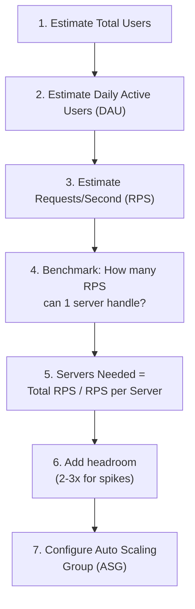

### Example #1 — PayTM (Payments App)

```
Given:
  • 50 million Monthly Active Users (MAU)
  • 10% are daily active = 5 million DAU
  • Average user makes 3 API calls per day

Calculations:
  Total daily requests = 5,000,000 × 3 = 15,000,000 requests/day

  Requests per second (average):
    = 15,000,000 / 86,400    (86,400 seconds in a day)
    = ~174 requests/second

  Peak traffic (usually 3-5x average):
    = 174 × 5 = ~870 requests/second

  If 1 server handles 200 requests/second:
    Servers needed (peak) = 870 / 200 = ~4.35 ≈ 5 servers

  With safety margin (2x):
    = 5 × 2 = 10 servers

  ✅ Auto Scaling Group: min=3, desired=5, max=15
```

```
                      Peak Traffic: 870 req/s
                             │
              ┌──────────────┼──────────────┐──────────────┐──────────────┐
              │              │              │              │              │
         ┌─────────┐  ┌─────────┐  ┌─────────┐  ┌─────────┐  ┌─────────┐
         │ Server 1│  │ Server 2│  │ Server 3│  │ Server 4│  │ Server 5│
         │ 200 rps │  │ 200 rps │  │ 200 rps │  │ 200 rps │  │  70 rps │
         └─────────┘  └─────────┘  └─────────┘  └─────────┘  └─────────┘
```

### Example #2 — Chess.com

```
Given:
  • 10 million MAU
  • 5% concurrent during peak hours = 500,000 users
  • Each game = 1 WebSocket connection + ~2 messages/second

Calculations:
  Concurrent WebSocket connections = 500,000
  Messages/second = 500,000 × 2 = 1,000,000 msg/s

  If 1 server handles 10,000 WebSocket connections:
    Servers needed = 500,000 / 10,000 = 50 servers

  With headroom:
    ASG: min=30, desired=50, max=100
```

### Example #3 — X.com (Twitter)

```
Given:
  • 300 million MAU
  • 20% DAU = 60 million users
  • Each user: 5 timeline loads + 2 tweet views + 0.1 tweet posts per day

Calculations:
  Total requests/day:
    Timeline: 60M × 5 = 300M
    Views:    60M × 2 = 120M
    Posts:    60M × 0.1 = 6M
    Total:    426M requests/day

  Average RPS = 426,000,000 / 86,400 = ~4,930 req/s
  Peak RPS = 4,930 × 5 = ~24,650 req/s

  If 1 server = 500 req/s:
    Servers at peak = 24,650 / 500 ≈ 50 servers
    With 2x headroom = 100 servers

  ASG: min=30, desired=50, max=150
```

---

## 9 — Auto Scaling Groups (ASG) on AWS

### What is an ASG?

An **Auto Scaling Group** automatically adjusts the number of EC2 instances based on load. It's the **backbone of horizontal scaling on AWS**.

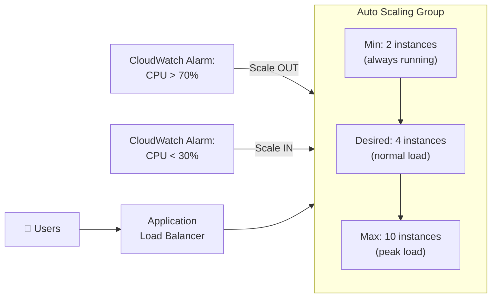

### ASG Architecture on AWS

```
    👥 Users (Internet)
         │
         ▼
  ┌──────────────┐
  │   Route 53   │  ← DNS resolution (myapp.com → ALB IP)
  │   (DNS)      │
  └──────┬───────┘
         │
         ▼
  ┌──────────────┐
  │     ALB      │  ← Application Load Balancer
  │ (Layer 7 LB) │     Health checks each instance
  └──────┬───────┘     Routes based on path/headers
         │
    ┌────┴────────────────────────────────────────┐
    │              Auto Scaling Group              │
    │                                              │
    │   ┌────────┐  ┌────────┐  ┌────────┐       │
    │   │  EC2   │  │  EC2   │  │  EC2   │       │
    │   │  i-1   │  │  i-2   │  │  i-3   │       │
    │   │ (app)  │  │ (app)  │  │ (app)  │       │
    │   └────────┘  └────────┘  └────────┘       │
    │                                              │
    │   Scaling Policy:                            │
    │   • Scale OUT when CPU > 70% for 3 min       │
    │   • Scale IN  when CPU < 30% for 10 min      │
    │   • Min: 2 | Desired: 3 | Max: 10            │
    │                                              │
    │   Launch Template:                           │
    │   • AMI: ami-0abcdef123456                   │
    │   • Instance type: t3.medium                 │
    │   • User data: startup script                │
    └──────────────────────────────────────────────┘
         │              │              │
         ▼              ▼              ▼
  ┌──────────────────────────────────────────────┐
  │              Amazon RDS (Database)            │
  │         (Shared state for all instances)      │
  └──────────────────────────────────────────────┘
```

### Key ASG Concepts

| Concept              | What It Means                                                                     |
| -------------------- | --------------------------------------------------------------------------------- |
| **Launch Template**  | Blueprint for new instances (AMI, instance type, startup script, security groups) |
| **Minimum capacity** | Always keep at least N instances running (even at zero traffic)                   |
| **Desired capacity** | The "normal" number of instances. ASG tries to maintain this count                |
| **Maximum capacity** | Never exceed N instances (cost protection!)                                       |
| **Scaling Policy**   | Rules for when to add/remove instances                                            |
| **Cooldown Period**  | Wait time after scaling before evaluating again (prevents flapping)               |
| **Health Check**     | ALB pings `/health` on each instance. Unhealthy = replaced automatically          |

### Types of Scaling Policies

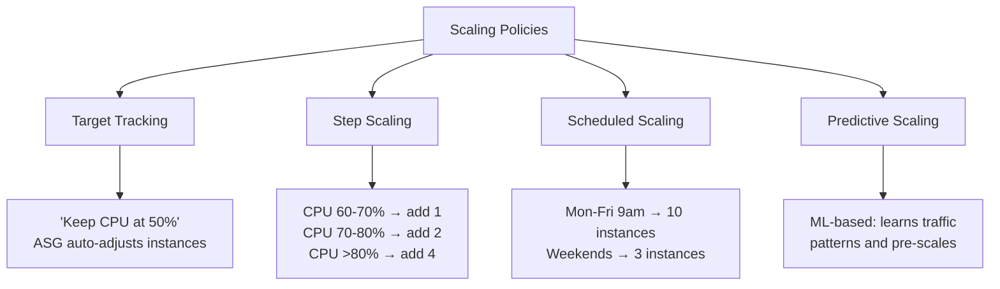

### ASG Lifecycle

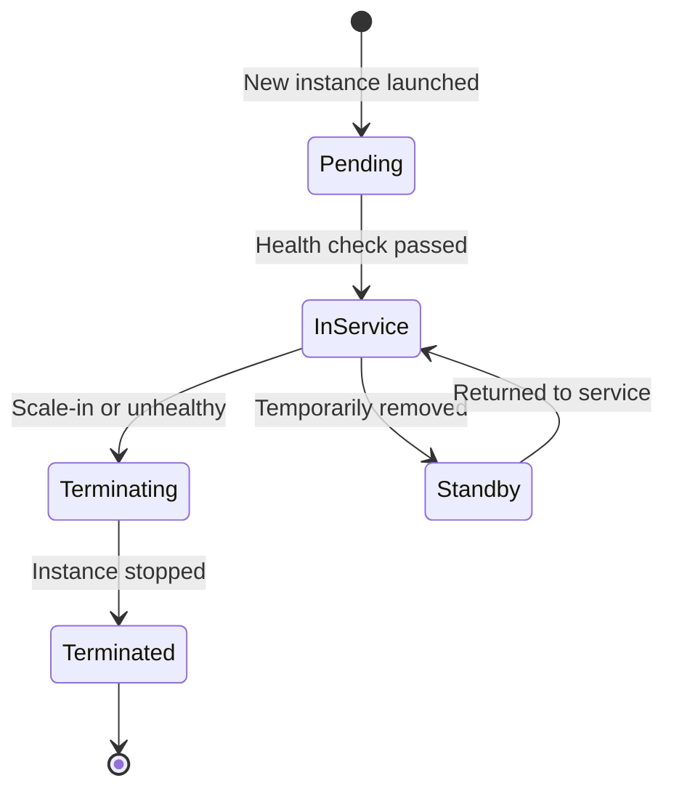

---

## 10 — Real-World Backend Architectures

### YouTube Upload — How It Works Behind the Scenes

When you upload a video to YouTube, a LOT happens in the background:

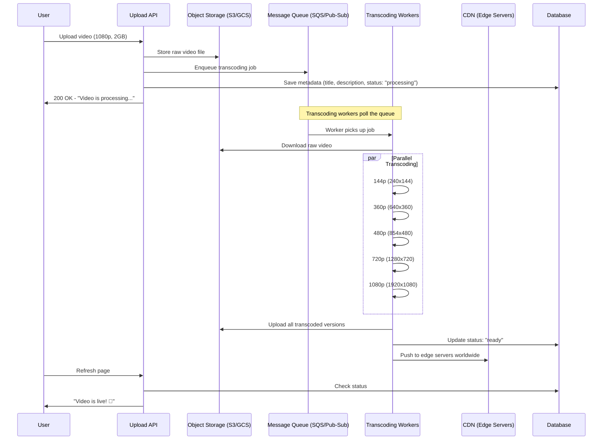

**Key Architecture Decisions:**

| Decision                 | Why                                                                 |
| ------------------------ | ------------------------------------------------------------------- |
| **Async processing**     | User doesn't wait for transcoding (could take 30+ minutes!)         |
| **Message Queue**        | Decouples upload from processing. Workers process at their own pace |
| **Multiple qualities**   | Users on slow connections get 360p; those on fast get 1080p         |
| **CDN**                  | Video is cached at edge servers close to viewers → low latency      |
| **Parallel transcoding** | Each quality rendered simultaneously on different workers → faster  |

### LeetCode Code Submission — How It Works

When you submit code on LeetCode:

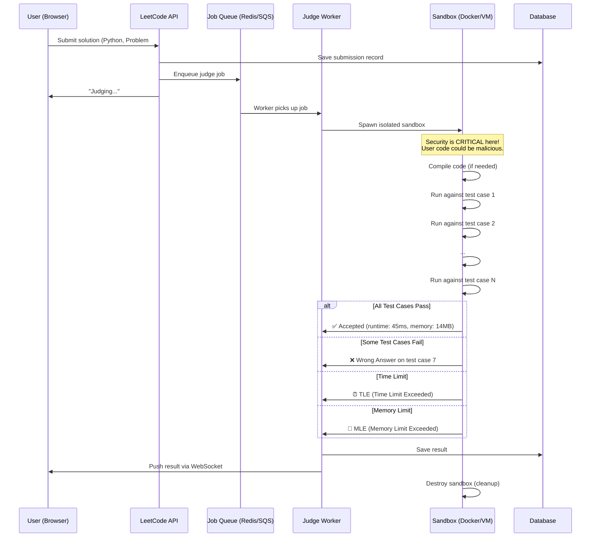

**Key Architecture Decisions:**

| Decision                   | Why                                                                             |
| -------------------------- | ------------------------------------------------------------------------------- |
| **Sandboxed execution**    | User code is UNTRUSTED! Must run in isolated Docker/VM with CPU & memory limits |
| **Job queue**              | Thousands of submissions/second. Queue buffers the load                         |
| **Time & memory limits**   | Prevent infinite loops and memory bombs from crashing the system                |
| **Async + WebSocket**      | User sees "Judging..." and gets result pushed when ready                        |
| **Multiple judge workers** | Horizontal scaling — more workers = more concurrent judges                      |

### AI Image Generation (Stable Diffusion / DALL-E)

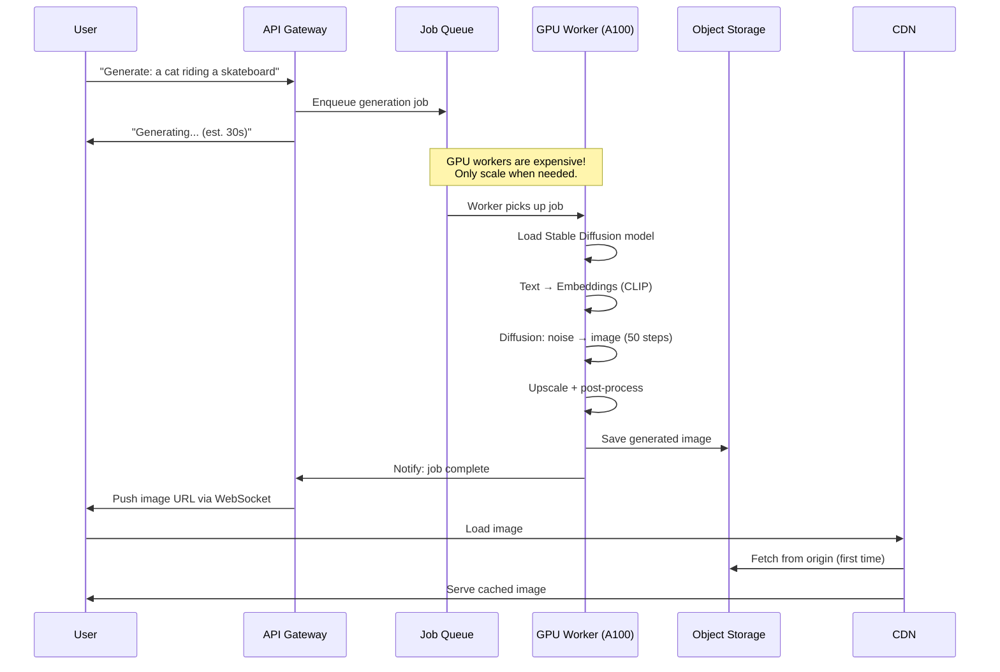

**Key Architecture Decisions:**

| Decision                       | Why                                                                         |
| ------------------------------ | --------------------------------------------------------------------------- |
| **GPU workers**                | AI models need GPU acceleration (A100, H100). CPU is 100x slower            |
| **Queue-based**                | GPU instances are expensive (~$3/hour). Queue lets you control how many run |
| **Auto-scaling GPU instances** | Scale 0→N based on queue depth. Scale to 0 when idle to save money          |
| **CDN for serving**            | Generated images served from edge, not from expensive GPU servers           |
| **Async pattern**              | Generation takes 10-60 seconds. Can't block the API that long               |

### Common Pattern Across All Three 🔑

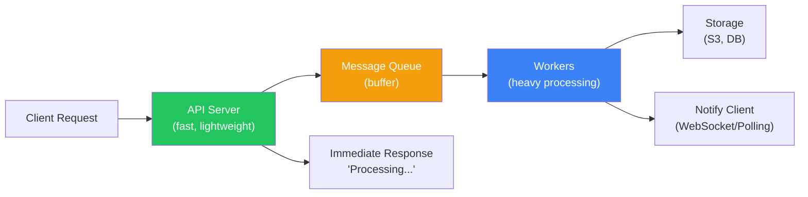

> **Pattern:** All these use the **Async Job Queue** pattern:
>
> 1. Accept request quickly (don't block the user)
> 2. Push heavy work to a queue
> 3. Workers process at their own pace
> 4. Notify user when done
>
> This pattern is the **backbone of modern backend architecture**.

---

## 11 — Interview Cheat Sheet

### Top Questions & Quick Answers

| Question                                 | Answer                                                                                                                                          |
| ---------------------------------------- | ----------------------------------------------------------------------------------------------------------------------------------------------- |
| **What is vertical scaling?**            | Upgrading a single machine's resources (CPU, RAM). Simpler but has a hardware ceiling and is a single point of failure.                         |
| **What is horizontal scaling?**          | Adding more machines behind a load balancer. Virtually unlimited but adds distributed system complexity.                                        |
| **Why can't Node.js use all CPU cores?** | V8 engine is single-threaded. Each Node.js process uses one core. Use `cluster` module to fork workers for multi-core usage.                    |
| **What is the cluster module?**          | Built-in Node.js module that forks child processes sharing the same port. Master manages, workers serve requests.                               |
| **PM2 vs cluster module?**               | PM2 wraps the cluster module with auto-restart, monitoring, zero-downtime reloads, and log management. Use PM2 in production.                   |
| **What is an ASG?**                      | Auto Scaling Group on AWS. Automatically adds/removes EC2 instances based on load metrics (CPU, network, custom).                               |
| **What is a launch template?**           | Blueprint defining how new EC2 instances are configured (AMI, instance type, user data, security groups).                                       |
| **Target tracking vs step scaling?**     | Target tracking: "Keep CPU at X%". Step scaling: "If CPU > 70% add 2, if > 80% add 4".                                                          |
| **How does YouTube handle uploads?**     | Async job queue. API accepts upload → stores raw file → queues transcoding → workers create multiple quality versions → CDN serves them.        |
| **What is the async job queue pattern?** | Accept request fast → push heavy work to a queue → workers process → notify client when done. Core pattern for YouTube, LeetCode, AI image gen. |

### Quick Mental Math for Capacity Estimation

```
Useful numbers to memorize:

  1 day    = 86,400 seconds ≈ 100,000 (for quick math, use 10^5)
  1 week   = 604,800 seconds ≈ 600,000
  1 month  = 2,592,000 seconds ≈ 2.5 × 10^6

  Quick RPS formula:
    RPS = (DAU × requests_per_user) / 86,400

  Peak multiplier:
    Peak RPS ≈ Average RPS × 3 to 5

  Servers needed:
    = Peak RPS / RPS_per_server

  Rule of thumb for Node.js server:
    Simple API: 1000-5000 req/s per instance
    With DB queries: 200-500 req/s per instance
    Heavy computation: 50-100 req/s per instance
```

---

## 12 — Key Takeaways

```
┌────────────────────────────────────────────────────────────────┐
│                    🎯 KEY TAKEAWAYS                             │
│                                                                 │
│  1. Vertical Scaling = bigger machine, simpler, has ceiling     │
│  2. Horizontal Scaling = more machines, complex, unlimited      │
│  3. Node.js is single-threaded → cluster module for multi-core  │
│  4. PM2 is the production-grade solution for clustering         │
│  5. ASG on AWS auto-scales EC2 instances based on load          │
│  6. Capacity estimation: DAU → RPS → servers needed             │
│  7. YouTube, LeetCode, AI gen all use async job queue pattern   │
│  8. Go/Rust handle multi-core natively; JS needs processes      │
│  9. Always add 2-3x headroom for traffic spikes                 │
│  10. Interview tip: draw diagrams, show your math, mention ASG  │
└────────────────────────────────────────────────────────────────┘
```

---

> **📝 Study Tip:** Try running the cluster module code examples on your machine. Observe the PIDs in terminal and the PID field in API responses to see round-robin distribution in action. Also try `pm2 start server-single.js -i max` and then `pm2 monit` to see the visual dashboard!

---

_Last updated: February 2026 | Week 28.1 — Cohort Study Guide_
