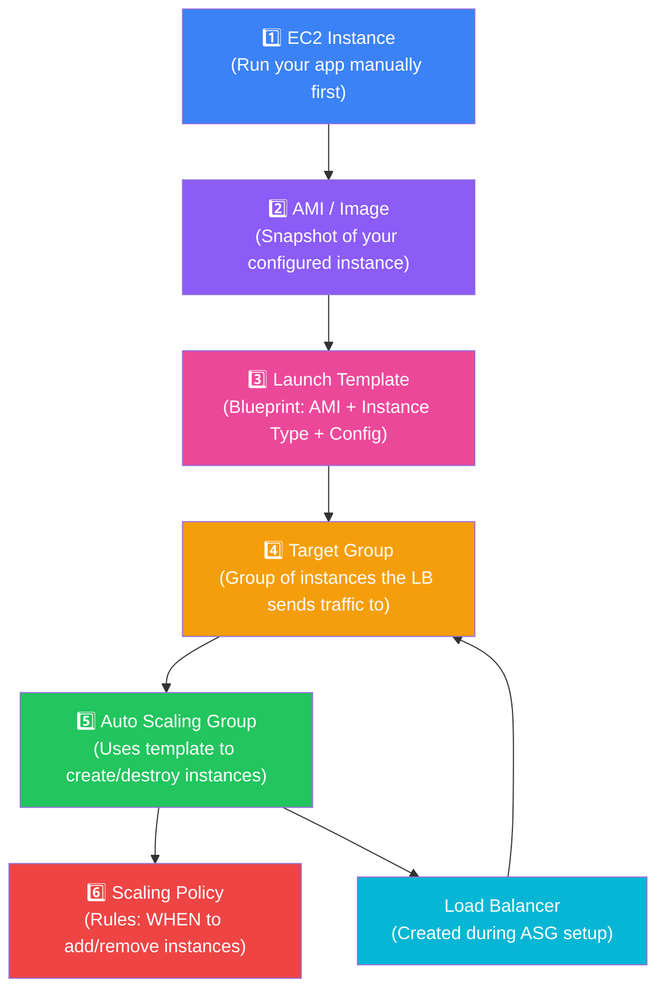
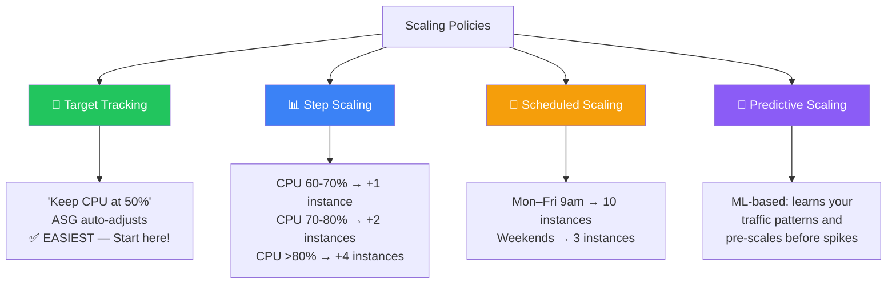
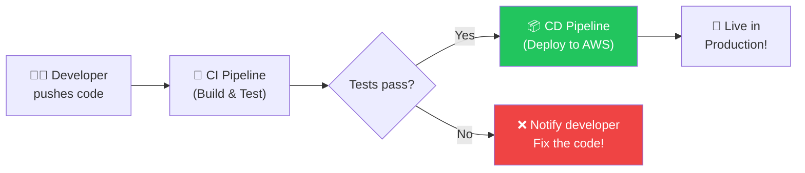
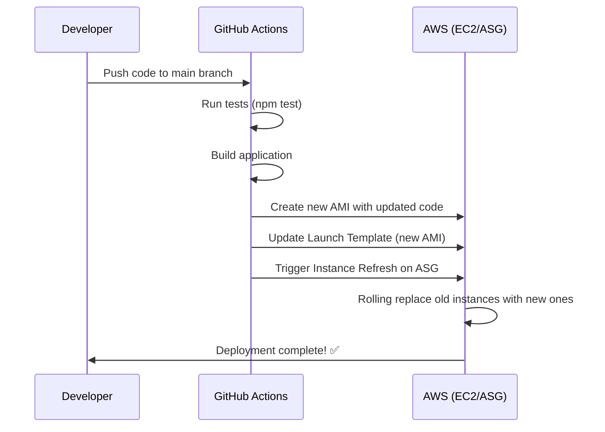
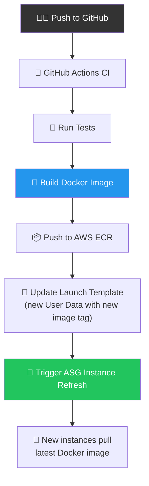

# 🚀 Auto Scaling Groups (ASG) — Complete Beginner Guide

> **Week 28.2 — Step-by-Step Guide for First-Time Learners**
> Covers: ASG on AWS (step-by-step), CI/CD Pipelines, Docker, and Production Deployment.

---

## 📑 Table of Contents

| #   | Topic                                                                                                          |
| --- | -------------------------------------------------------------------------------------------------------------- |
| 1   | [Context — Why Do We Need ASGs?](#1--context--why-do-we-need-asgs)                                             |
| 2   | [The Building Blocks (Overview)](#2--the-building-blocks-overview)                                             |
| 3   | [Step 1: Create an EC2 Instance & Run Your App](#3--step-1-create-an-ec2-instance--run-your-app)               |
| 4   | [Step 2: Creating an AMI (Amazon Machine Image)](#4--step-2-creating-an-ami-amazon-machine-image)              |
| 5   | [Step 3: Create a Launch Template](#5--step-3-create-a-launch-template)                                        |
| 6   | [Step 4: Create a Target Group](#6--step-4-create-a-target-group)                                              |
| 7   | [Step 5: Create an Auto Scaling Group + Load Balancer](#7--step-5-create-an-auto-scaling-group--load-balancer) |
| 8   | [Step 6: Create an Auto Scaling Policy](#8--step-6-create-an-auto-scaling-policy)                              |
| 9   | [User Data Script — Deep Dive](#9--user-data-script--deep-dive)                                                |
| 10  | [CI/CD Pipelines for ASG Deployments](#10--cicd-pipelines-for-asg-deployments)                                 |
| 11  | [Docker for ASG Deployments — In Depth](#11--docker-for-asg-deployments--in-depth)                             |
| 12  | [Putting It All Together — Docker + CI/CD + ASG](#12--putting-it-all-together--docker--cicd--asg)              |
| 13  | [Interview Cheat Sheet](#13--interview-cheat-sheet)                                                            |
| 14  | [Key Takeaways](#14--key-takeaways)                                                                            |

---

## 1 — Context — Why Do We Need ASGs?

### The Problem

Imagine your app is running on a **single EC2 instance**. What happens when:

- 📈 Traffic **spikes** during a sale or viral moment?
- 💀 Your server **crashes** at 3 AM?
- 💸 You're paying for **10 servers** at night when only 2 are needed?

```
  ❌ WITHOUT Auto Scaling:

  Traffic Spike → Single Server → 💀 CRASH → All Users Down!

       Users          Server               Result
    👥👥👥👥👥  ──→  ┌────────┐         ┌──────────┐
    👥👥👥👥👥  ──→  │  EC2   │  ──→    │  503 ❌  │
    👥👥👥👥👥  ──→  │ (1 box)│         │  ERRORS  │
                      └────────┘         └──────────┘

f  ✅ WITH Auto Scaling:

  Traffic Spike → ASG adds more servers automatically → Everyone Happy!

       Users           Load Balancer       Servers (auto-scaled)
    👥👥👥👥👥  ──→  ┌────────────┐  ──→  ┌────┐ ┌────┐ ┌────┐
    👥👥👥👥👥  ──→  │    ALB     │  ──→  │EC2 │ │EC2 │ │EC2 │
    👥👥👥👥👥  ──→  │            │  ──→  │ #1 │ │ #2 │ │ #3 │
                      └────────────┘       └────┘ └────┘ └────┘
                                           ↑ auto-created by ASG!
```

### The Solution: Auto Scaling Groups (ASG)

An **ASG** is an AWS service that:

1. **Automatically launches** new EC2 instances when load increases
2. **Automatically terminates** instances when load decreases
3. **Replaces unhealthy** instances (self-healing!)
4. **Distributes traffic** evenly via a Load Balancer

> **Think of ASG as a smart manager** that hires and fires servers based on how busy your restaurant is.

---

## 2 — The Building Blocks (Overview)

Before creating an ASG, you need to understand **6 key components** and the order in which you create them:



| Component           | Purpose                                       | Analogy                                    |
| ------------------- | --------------------------------------------- | ------------------------------------------ |
| **EC2 Instance**    | Your running server                           | A working pizza oven                       |
| **AMI (Image)**     | Snapshot/backup of a configured instance      | A recipe card for building identical ovens |
| **Launch Template** | Blueprint (AMI + size + startup script)       | Complete instruction manual for new ovens  |
| **Target Group**    | Group of instances that receive traffic       | List of active oven stations               |
| **ASG**             | Manages creating/destroying instances         | The shift manager                          |
| **Scaling Policy**  | Rules for when to scale                       | "If queue > 20 orders, open another oven"  |
| **Load Balancer**   | Distributes incoming traffic across instances | The maître d' seating customers evenly     |

---

## 3 — Step 1: Create an EC2 Instance & Run Your App

### 3.1 — What is EC2?

**EC2 (Elastic Compute Cloud)** = A virtual server in AWS. Think of it as renting a computer in the cloud.

### 3.2 — Launch an EC2 Instance (AWS Console)

1. Go to **AWS Console → EC2 → Launch Instance**
2. Configure:
   - **Name:** `my-app-server`
   - **OS:** Ubuntu 22.04 LTS (free tier eligible)
   - **Instance Type:** `t2.micro` (1 vCPU, 1 GB RAM — free tier)
   - **Key Pair:** Create new → Download `.pem` file (this is your SSH key)
   - **Security Group:** Allow SSH (22), HTTP (80), and your app port (3000)

### 3.3 — SSH Into Your Instance & Set Up

```bash
# Connect to your instance (replace with your public IP and key)
ssh -i "my-key.pem" ubuntu@<YOUR-EC2-PUBLIC-IP>

# Update the system packages
sudo apt update && sudo apt upgrade -y

# Install Node.js via NVM (Node Version Manager)
curl -o- https://raw.githubusercontent.com/nvm-sh/nvm/v0.39.7/install.sh | bash
source ~/.bashrc
nvm install 22          # Install Node.js 22
node -v                 # Verify → v22.x.x

# Install Bun (fast JS runtime, used in the course)
curl -fsSL https://bun.sh/install | bash
source ~/.bashrc
bun -v                  # Verify → 1.x.x

# Install PM2 (process manager for production)
npm install -g pm2
```

### 3.4 — Deploy Your App

```bash
# Clone your repo or copy your app code
git clone https://github.com/your-username/your-app.git ~/ASG
cd ~/ASG

# Install dependencies
npm install    # or: bun install

# Start with PM2 in cluster mode (uses ALL CPU cores)
pm2 start bin.ts --interpreter $(which bun) -i max --name my-app

# Verify it's running
pm2 list
# ┌────┬──────────┬─────────┬──────┬───────┐
# │ id │ name     │ mode    │ ↺    │ status│
# │ 0  │ my-app   │ cluster │ 0    │ online│
# │ 1  │ my-app   │ cluster │ 0    │ online│
# └────┴──────────┴─────────┴──────┴───────┘

# Test your app
curl http://localhost:3000
```

> **🔑 Key Point:** You set up ONCE manually. Then you take a snapshot (AMI) so every future instance is an identical copy — no manual setup needed!

---

## 4 — Step 2: Creating an AMI (Amazon Machine Image)

### What is an AMI?

An **AMI** is a **snapshot/photograph** of your EC2 instance at a specific moment. It captures:

- ✅ The operating system (Ubuntu)
- ✅ All installed software (Node.js, Bun, PM2)
- ✅ Your application code
- ✅ All configurations

```
  Your Configured EC2              AMI (Snapshot)
  ┌──────────────────┐   📸       ┌──────────────────┐
  │ Ubuntu 22.04     │ ────────→  │ Ubuntu 22.04     │
  │ Node.js v22      │ "Freeze    │ Node.js v22      │
  │ Bun, PM2         │  this      │ Bun, PM2         │
  │ Your App Code    │  state!"   │ Your App Code    │
  │ Configs          │            │ Configs          │
  └──────────────────┘            └──────────────────┘
                                    │
                        Can create UNLIMITED identical
                        copies from this snapshot!
                                    │
                        ┌───────────┼───────────┐
                        ▼           ▼           ▼
                    ┌────────┐  ┌────────┐  ┌────────┐
                    │ EC2 #1 │  │ EC2 #2 │  │ EC2 #3 │
                    │ (copy) │  │ (copy) │  │ (copy) │
                    └────────┘  └────────┘  └────────┘
```

### How to Create an AMI

1. Go to **AWS Console → EC2 → Instances**
2. **Select your running instance** → Right-click (or Actions menu)
3. Click **Images and Templates → Create Image**
4. Configure:
   - **Image Name:** `my-app-v1-2026-02-16`
   - **Description:** `App with Node.js 22, Bun, PM2 configured`
   - **No Reboot:** Check this if you don't want the instance to restart
5. Click **Create Image**
6. Wait 5-10 minutes for the AMI to become `available`

> **💡 Tip:** Name your AMIs with versions/dates so you can track which version of your app is in each image.

---

## 5 — Step 3: Create a Launch Template

### What is a Launch Template?

A **Launch Template** is a **blueprint** that tells AWS: _"When you need to create a new instance, use THESE settings."_

It combines:

- **Which AMI** to use (your snapshot)
- **What instance type** (t2.micro, t3.medium, etc.)
- **Security groups** (firewall rules)
- **Key pair** (SSH access)
- **User Data** (startup script)

### How to Create It

1. Go to **AWS Console → EC2 → Launch Templates → Create Launch Template**
2. Configure:

| Setting            | Value                         | Why                                                    |
| ------------------ | ----------------------------- | ------------------------------------------------------ |
| **Template Name**  | `my-app-template`             | Descriptive name                                       |
| **AMI**            | Select your AMI from Step 2   | New instances will be copies of your configured server |
| **Instance Type**  | `t3.medium` (2 vCPU, 4GB)     | Balance of performance and cost                        |
| **Key Pair**       | Select existing or create new | SSH access to instances                                |
| **Security Group** | Allow ports 22, 80, 3000      | SSH + HTTP + your app port                             |
| **User Data**      | Startup script (see below)    | Runs automatically when instance boots                 |

3. In **Advanced Details → User Data**, paste your startup script:

```bash
#!/bin/bash
# This script runs EVERY TIME a new instance starts from this template

cd ~/ASG

# Ensure PATH includes Node.js and Bun binaries
export PATH=$PATH:/home/ubuntu/.nvm/versions/node/v22.14.0/bin/

# Install PM2 if not already installed
npm install -g pm2

# Start the application with PM2 in cluster mode
pm2 start --interpreter /home/ubuntu/.nvm/versions/node/v22.14.0/bin/bun bin.ts -i max --name my-app
```

4. Click **Create Launch Template**

> **🔑 Why User Data matters:** When ASG creates a new instance from your AMI, the instance boots up but your app isn't running yet. User Data ensures the app **starts automatically** — no manual SSH needed!

---

## 6 — Step 4: Create a Target Group

### What is a Target Group?

A **Target Group** is a **list of EC2 instances** that a Load Balancer can send traffic to. The Load Balancer checks which instances are healthy and distributes requests among them.

```
                    Load Balancer
                         │
                         │  "Which servers are alive
                         │   and ready to receive traffic?"
                         │
                         ▼
              ┌─── Target Group ───┐
              │                    │
              │  ┌────┐  ┌────┐   │
              │  │EC2 │  │EC2 │   │    ← These instances are
              │  │ ✅  │  │ ✅  │   │      "registered targets"
              │  └────┘  └────┘   │
              │                    │
              │  ┌────┐            │
              │  │EC2 │ ← UNHEALTHY│   ← Load Balancer stops
              │  │ ❌  │  (removed)│      sending traffic here
              │  └────┘            │
              └────────────────────┘
```

### How to Create It

1. Go to **AWS Console → EC2 → Target Groups → Create Target Group**
2. Configure:

| Setting               | Value            | Why                                              |
| --------------------- | ---------------- | ------------------------------------------------ |
| **Target Type**       | Instances        | We're routing to EC2 instances                   |
| **Target Group Name** | `my-app-tg`      | Descriptive name                                 |
| **Protocol / Port**   | HTTP / 3000      | Your app listens on port 3000                    |
| **VPC**               | Your default VPC | Network where instances live                     |
| **Health Check Path** | `/health` or `/` | ALB pings this URL to check if instance is alive |

3. **Register Targets:** ⚠️ **Do NOT register any targets now!**
   - The ASG will automatically register new instances into this target group
   - If you register manually, the ASG might not manage them properly

4. Click **Create Target Group**

### What is a Health Check?

The Load Balancer periodically sends an HTTP request to each instance (e.g., `GET /health`). If the instance responds with `200 OK`, it's healthy. If it fails multiple times, the instance is **removed from rotation** and ASG replaces it.

```javascript
// Add this to your Express app for health checks
app.get("/health", (req, res) => {
  res.status(200).json({ status: "ok", uptime: process.uptime() });
});
```

---

## 7 — Step 5: Create an Auto Scaling Group + Load Balancer

### What is an ASG?

The **Auto Scaling Group** is the orchestrator. It uses your Launch Template to create/destroy instances and keeps the right number running.

### How to Create It

1. Go to **AWS Console → EC2 → Auto Scaling Groups → Create Auto Scaling Group**

#### Page 1: Choose Launch Template

| Setting             | Value             |
| ------------------- | ----------------- |
| **ASG Name**        | `my-app-asg`      |
| **Launch Template** | `my-app-template` |

#### Page 2: Choose Instance Launch Options

| Setting                          | Value                                                   |
| -------------------------------- | ------------------------------------------------------- |
| **Availability Zones & Subnets** | Select **at least 2 AZs** (e.g. us-east-1a, us-east-1b) |

> **Why multiple AZs?** If one data center goes down, your app survives in the other! This is fault tolerance.

#### Page 3: Configure Load Balancing

| Setting                  | Value                                     |
| ------------------------ | ----------------------------------------- |
| **Load Balancing**       | Attach to a **new** load balancer         |
| **Load Balancer Type**   | Application Load Balancer (HTTP/HTTPS)    |
| **Load Balancer Scheme** | Internet-facing                           |
| **Listener Port**        | 80 (HTTP) — this is what users connect to |
| **Target Group**         | Select `my-app-tg` from Step 4            |

```
  What you're building:

  Internet Users
       │
       ▼
  ┌──────────────┐
  │  ALB (:80)   │  ← Users connect here (port 80)
  └──────┬───────┘
         │
    Routes to Target Group (port 3000)
         │
    ┌────┴────────────────────────────────────┐
    │           Auto Scaling Group             │
    │                                          │
    │   ┌────────┐  ┌────────┐  ┌────────┐   │
    │   │  EC2   │  │  EC2   │  │  EC2   │   │  ← Each runs app on :3000
    │   │  :3000 │  │  :3000 │  │  :3000 │   │
    │   └────────┘  └────────┘  └────────┘   │
    └─────────────────────────────────────────┘
```

#### Page 4: Configure Group Size

| Setting     | Value | Meaning                                      |
| ----------- | ----- | -------------------------------------------- |
| **Minimum** | 2     | Never go below 2 instances (fault tolerance) |
| **Desired** | 3     | Normal operation = 3 instances               |
| **Maximum** | 10    | Never exceed 10 (cost protection!)           |

3. Click **Create Auto Scaling Group**

> **⚠️ Important:** After creating, make sure the Load Balancer's security group allows inbound traffic on port 80 from `0.0.0.0/0` (anywhere) and on port 3000 to the instance security group.

---

## 8 — Step 6: Create an Auto Scaling Policy

### What is a Scaling Policy?

A **Scaling Policy** tells the ASG: _"Here's WHEN to add or remove servers."_

### How to Create It

1. Go to **EC2 → Auto Scaling Groups → Select your ASG**
2. Click **Automatic Scaling → Create Dynamic Scaling Policy**
3. Configure:

| Setting          | Value                   |
| ---------------- | ----------------------- |
| **Policy Type**  | Target Tracking Scaling |
| **Metric**       | Average CPU Utilization |
| **Target Value** | 50%                     |

This means: **"Keep the average CPU usage of all instances around 50%."**

- If CPU goes **above 50%** → ASG launches more instances (scale OUT)
- If CPU drops **below 50%** → ASG terminates idle instances (scale IN)

### Types of Scaling Policies



---

## 9 — User Data Script — Deep Dive

The **User Data** script is a bash script that runs **once** when an EC2 instance **first starts**. It's how you automate the "last mile" setup.

### The Script Explained Line by Line

```bash
#!/bin/bash
# Shebang — tells OS to use bash to run this script

cd ~/ASG
# Navigate to the app directory (already present in the AMI)

npm install -g pm2
# Install PM2 globally — a production process manager
# PM2 keeps your app alive, restarts on crash, and enables cluster mode

export PATH=$PATH:/home/ubuntu/.nvm/versions/node/v22.14.0/bin/
# NVM installs Node.js in a non-standard location
# This line adds Node.js/npm/bun to the system PATH
# Without this, the script can't find the `node`, `npm`, or `bun` commands

pm2 start --interpreter /home/ubuntu/.nvm/versions/node/v22.14.0/bin/bun bin.ts
# Start the app using PM2 with Bun as the runtime
# --interpreter tells PM2 to use Bun instead of Node.js
# bin.ts is the entry point of the application
```

### Common User Data Pitfalls

| Pitfall                             | Fix                                              |
| ----------------------------------- | ------------------------------------------------ |
| Script runs as `root`, not `ubuntu` | Use `sudo -u ubuntu` or switch user              |
| NVM/Node not in PATH                | Explicitly export the PATH                       |
| App dependencies not installed      | Run `npm install` or `bun install`               |
| Script fails silently               | Check logs: `cat /var/log/cloud-init-output.log` |

---

## 10 — CI/CD Pipelines for ASG Deployments

### What is CI/CD?

| Term   | Full Form              | What It Does                                   |
| ------ | ---------------------- | ---------------------------------------------- |
| **CI** | Continuous Integration | Automatically test code when you push to Git   |
| **CD** | Continuous Deployment  | Automatically deploy tested code to production |



### Strategy: AMI-Based Deployment (Rolling Update)



### GitHub Actions Pipeline — AMI Strategy

```yaml
# .github/workflows/deploy.yml
name: Deploy to ASG

# Trigger: runs when code is pushed to the main branch
on:
  push:
    branches: [main]

env:
  AWS_REGION: us-east-1
  ASG_NAME: my-app-asg
  LAUNCH_TEMPLATE_NAME: my-app-template

jobs:
  # ──── JOB 1: Test ─────────────────────────────────────
  test:
    runs-on: ubuntu-latest
    steps:
      - name: Checkout code
        uses: actions/checkout@v4

      - name: Setup Node.js
        uses: actions/setup-node@v4
        with:
          node-version: 22

      - name: Install dependencies
        run: npm ci # 'ci' is faster than 'install' for CI

      - name: Run tests
        run: npm test

      - name: Run linter
        run: npm run lint

  # ──── JOB 2: Build AMI & Deploy ───────────────────────
  deploy:
    needs: test # Only runs after tests pass!
    runs-on: ubuntu-latest
    steps:
      - name: Checkout code
        uses: actions/checkout@v4

      - name: Configure AWS Credentials
        uses: aws-actions/configure-aws-credentials@v4
        with:
          aws-access-key-id: ${{ secrets.AWS_ACCESS_KEY_ID }}
          aws-secret-access-key: ${{ secrets.AWS_SECRET_ACCESS_KEY }}
          aws-region: ${{ env.AWS_REGION }}

      # Build new AMI using a temporary EC2 instance
      - name: Build New AMI
        id: build-ami
        run: |
          # Launch a temporary instance from the existing template
          INSTANCE_ID=$(aws ec2 run-instances \
            --launch-template LaunchTemplateName=${{ env.LAUNCH_TEMPLATE_NAME }} \
            --count 1 \
            --query 'Instances[0].InstanceId' \
            --output text)

          echo "Waiting for instance to be running..."
          aws ec2 wait instance-running --instance-ids $INSTANCE_ID

          # Get the public IP
          PUBLIC_IP=$(aws ec2 describe-instances \
            --instance-ids $INSTANCE_ID \
            --query 'Reservations[0].Instances[0].PublicIpAddress' \
            --output text)

          # Copy new code to the instance
          scp -o StrictHostKeyChecking=no -r ./* ubuntu@$PUBLIC_IP:~/ASG/

          # Create AMI from updated instance
          AMI_ID=$(aws ec2 create-image \
            --instance-id $INSTANCE_ID \
            --name "my-app-$(date +%Y%m%d-%H%M%S)" \
            --no-reboot \
            --query 'ImageId' \
            --output text)

          echo "ami_id=$AMI_ID" >> $GITHUB_OUTPUT

          # Cleanup: terminate temporary instance
          aws ec2 terminate-instances --instance-ids $INSTANCE_ID

      # Update launch template with the new AMI
      - name: Update Launch Template
        run: |
          aws ec2 create-launch-template-version \
            --launch-template-name ${{ env.LAUNCH_TEMPLATE_NAME }} \
            --source-version '$Latest' \
            --launch-template-data '{"ImageId":"${{ steps.build-ami.outputs.ami_id }}"}'

      # Tell the ASG to replace old instances with new ones
      - name: Trigger Instance Refresh
        run: |
          aws autoscaling start-instance-refresh \
            --auto-scaling-group-name ${{ env.ASG_NAME }} \
            --preferences '{"MinHealthyPercentage":50}'
          # MinHealthyPercentage=50 means: keep at least 50% of
          # instances running while replacing the rest (zero-downtime!)
```

### What Happens During Instance Refresh

```
  Before Refresh (v1):            During Refresh:              After Refresh (v2):
  ┌────┐ ┌────┐ ┌────┐     ┌────┐ ┌────┐ ┌────┐       ┌────┐ ┌────┐ ┌────┐
  │ v1 │ │ v1 │ │ v1 │     │ v2 │ │ v1 │ │ v1 │       │ v2 │ │ v2 │ │ v2 │
  │ ✅ │ │ ✅ │ │ ✅ │     │ ✅ │ │ ✅ │ │🔄 │       │ ✅ │ │ ✅ │ │ ✅ │
  └────┘ └────┘ └────┘     └────┘ └────┘ └────┘       └────┘ └────┘ └────┘
     All instances             Replace one            All instances
     running v1                at a time!             running v2
```

---

## 11 — Docker for ASG Deployments — In Depth

### What is Docker?

**Docker** packages your application + ALL its dependencies into a **container** — a lightweight, portable, isolated unit that runs the same everywhere.

```
  ❌ WITHOUT Docker:
  "It works on my machine!" → Doesn't work on the server.

  ✅ WITH Docker:
  "It works in my container!" → Works EVERYWHERE identically.
```

### Key Docker Concepts

| Concept        | What It Is                                 | Analogy                                |
| -------------- | ------------------------------------------ | -------------------------------------- |
| **Dockerfile** | Recipe for building an image               | A blueprint/recipe                     |
| **Image**      | Read-only template (built from Dockerfile) | A compiled recipe (frozen meal)        |
| **Container**  | A running instance of an image             | The meal you're actually eating        |
| **Registry**   | Store for images (Docker Hub, AWS ECR)     | The supermarket where you buy meals    |
| **Volume**     | Persistent storage attached to a container | A USB drive plugged into the container |
| **Network**    | Communication channel between containers   | Phone line between containers          |

### Dockerfile — Step by Step

```dockerfile
# ──────────────────────────────────────────────────────
# Dockerfile for a Node.js/Bun application
# ──────────────────────────────────────────────────────

# STAGE 1: Build Stage
# Use the official Node.js 22 image based on Alpine Linux (small!)
FROM node:22-alpine AS builder

# Set the working directory inside the container
WORKDIR /app

# Copy ONLY package files first (for better caching)
# Docker caches each layer — if package.json hasn't changed,
# npm install is SKIPPED (huge speed boost on rebuilds!)
COPY package.json package-lock.json ./

# Install dependencies
RUN npm ci --production

# Now copy the rest of the application code
COPY . .

# If you have a build step (TypeScript → JavaScript)
RUN npm run build

# ──────────────────────────────────────────────────────
# STAGE 2: Production Stage (multi-stage build)
# Start fresh from a clean, small image
FROM node:22-alpine AS production

# Install PM2 globally for process management
RUN npm install -g pm2

WORKDIR /app

# Copy only what we need from the build stage
COPY --from=builder /app/node_modules ./node_modules
COPY --from=builder /app/dist ./dist
COPY --from=builder /app/package.json ./

# Create a non-root user for security
RUN addgroup -S appgroup && adduser -S appuser -G appgroup
USER appuser

# Expose the port your app runs on
EXPOSE 3000

# Health check — Docker/ECS/ALB uses this to check if container is alive
HEALTHCHECK --interval=30s --timeout=5s --start-period=10s --retries=3 \
  CMD wget --no-verbose --tries=1 --spider http://localhost:3000/health || exit 1

# Start the application with PM2 (no daemon mode for Docker)
CMD ["pm2-runtime", "start", "dist/bin.js", "-i", "max"]
```

### Understanding Multi-Stage Builds

```
  Single Stage (❌ BAD — 1.2 GB image):
  ┌──────────────────────────────┐
  │ Node.js 22 (full)            │
  │ npm, npx, dev-tools          │
  │ TypeScript compiler          │
  │ Dev dependencies (jest, etc) │
  │ Source code (.ts files)      │
  │ Compiled code (.js files)    │
  │ node_modules (full)          │
  └──────────────────────────────┘

  Multi-Stage (✅ GOOD — 150 MB image):
  Builder Stage        Production Stage
  ┌────────────┐       ┌────────────────┐
  │ Full Node   │──────→│ Alpine Node    │
  │ typescript  │ copy  │ Only dist/     │
  │ All deps    │ only  │ Prod deps only │
  │ Source code │ what  │ PM2            │
  │ Build tools │ need  │ (~150 MB)      │
  └────────────┘       └────────────────┘
     (thrown away)        (final image!)
```

### Docker Commands Cheat Sheet

```bash
# Build an image from Dockerfile
docker build -t my-app:v1 .

# Run a container from the image
docker run -d -p 3000:3000 --name my-app my-app:v1
#   -d         = detached (background)
#   -p 3000:3000 = map host port 3000 → container port 3000
#   --name     = friendly name for the container

# View running containers
docker ps

# View logs
docker logs my-app

# Stop and remove container
docker stop my-app && docker rm my-app

# Push image to Docker Hub
docker tag my-app:v1 yourusername/my-app:v1
docker push yourusername/my-app:v1

# Push image to AWS ECR (Elastic Container Registry)
aws ecr get-login-password | docker login --username AWS --password-stdin <ACCOUNT>.dkr.ecr.us-east-1.amazonaws.com
docker tag my-app:v1 <ACCOUNT>.dkr.ecr.us-east-1.amazonaws.com/my-app:v1
docker push <ACCOUNT>.dkr.ecr.us-east-1.amazonaws.com/my-app:v1
```

### docker-compose.yml for Local Development

```yaml
# docker-compose.yml — run your app + dependencies locally
version: "3.8"

services:
  app:
    build: .
    ports:
      - "3000:3000"
    environment:
      - NODE_ENV=production
      - DATABASE_URL=postgresql://user:pass@db:5432/mydb
      - REDIS_URL=redis://cache:6379
    depends_on:
      - db
      - cache
    restart: unless-stopped
    healthcheck:
      test: ["CMD", "wget", "--spider", "http://localhost:3000/health"]
      interval: 30s
      timeout: 5s
      retries: 3

  db:
    image: postgres:16-alpine
    environment:
      POSTGRES_USER: user
      POSTGRES_PASSWORD: pass
      POSTGRES_DB: mydb
    volumes:
      - pgdata:/var/lib/postgresql/data
    ports:
      - "5432:5432"

  cache:
    image: redis:7-alpine
    ports:
      - "6379:6379"

volumes:
  pgdata: # Named volume — data persists even if container is removed
```

---

## 12 — Putting It All Together — Docker + CI/CD + ASG

### Architecture: Docker-Based ASG Deployment



### Docker-Based GitHub Actions Pipeline

```yaml
# .github/workflows/docker-deploy.yml
name: Docker Build & Deploy to ASG

on:
  push:
    branches: [main]

env:
  AWS_REGION: us-east-1
  ECR_REPOSITORY: my-app
  ASG_NAME: my-app-asg
  LAUNCH_TEMPLATE_NAME: my-app-template

jobs:
  test:
    runs-on: ubuntu-latest
    steps:
      - uses: actions/checkout@v4
      - uses: actions/setup-node@v4
        with:
          node-version: 22
      - run: npm ci
      - run: npm test

  build-and-push:
    needs: test
    runs-on: ubuntu-latest
    outputs:
      image-tag: ${{ steps.meta.outputs.tags }}
    steps:
      - uses: actions/checkout@v4

      - name: Configure AWS Credentials
        uses: aws-actions/configure-aws-credentials@v4
        with:
          aws-access-key-id: ${{ secrets.AWS_ACCESS_KEY_ID }}
          aws-secret-access-key: ${{ secrets.AWS_SECRET_ACCESS_KEY }}
          aws-region: ${{ env.AWS_REGION }}

      - name: Login to AWS ECR
        id: login-ecr
        uses: aws-actions/amazon-ecr-login@v2

      - name: Build, Tag, and Push Docker Image
        id: build
        env:
          REGISTRY: ${{ steps.login-ecr.outputs.registry }}
          IMAGE_TAG: ${{ github.sha }} # Use git commit SHA as tag
        run: |
          docker build -t $REGISTRY/$ECR_REPOSITORY:$IMAGE_TAG .
          docker build -t $REGISTRY/$ECR_REPOSITORY:latest .
          docker push $REGISTRY/$ECR_REPOSITORY:$IMAGE_TAG
          docker push $REGISTRY/$ECR_REPOSITORY:latest
          echo "image=$REGISTRY/$ECR_REPOSITORY:$IMAGE_TAG" >> $GITHUB_OUTPUT

  deploy:
    needs: build-and-push
    runs-on: ubuntu-latest
    steps:
      - name: Configure AWS Credentials
        uses: aws-actions/configure-aws-credentials@v4
        with:
          aws-access-key-id: ${{ secrets.AWS_ACCESS_KEY_ID }}
          aws-secret-access-key: ${{ secrets.AWS_SECRET_ACCESS_KEY }}
          aws-region: ${{ env.AWS_REGION }}

      - name: Update Launch Template User Data
        run: |
          # New User Data script that pulls the latest Docker image
          USER_DATA=$(cat <<'EOF' | base64
          #!/bin/bash
          # Install Docker if not present
          if ! command -v docker &> /dev/null; then
            apt-get update && apt-get install -y docker.io
            systemctl enable docker && systemctl start docker
          fi

          # Login to ECR and pull the latest image
          aws ecr get-login-password --region us-east-1 | \
            docker login --username AWS --password-stdin <ACCOUNT>.dkr.ecr.us-east-1.amazonaws.com

          # Pull and run the latest image
          docker pull <ACCOUNT>.dkr.ecr.us-east-1.amazonaws.com/my-app:latest
          docker run -d -p 3000:3000 --restart unless-stopped \
            --name my-app \
            <ACCOUNT>.dkr.ecr.us-east-1.amazonaws.com/my-app:latest
          EOF
          )

          aws ec2 create-launch-template-version \
            --launch-template-name ${{ env.LAUNCH_TEMPLATE_NAME }} \
            --source-version '$Latest' \
            --launch-template-data "{\"UserData\":\"$USER_DATA\"}"

      - name: Start Instance Refresh
        run: |
          aws autoscaling start-instance-refresh \
            --auto-scaling-group-name ${{ env.ASG_NAME }} \
            --preferences '{"MinHealthyPercentage":50}'
```

### The Full Picture — End to End

```
  Developer               GitHub                    AWS
  ─────────               ──────                    ───
       │
       │  git push
       │──────────────→ GitHub Actions
       │                    │
       │                    ├─ npm test ✅
       │                    ├─ docker build 🐳
       │                    ├─ docker push → ECR 📦
       │                    ├─ Update Launch Template
       │                    └─ Trigger Instance Refresh
       │                                    │
       │                                    ▼
       │                              ASG does:
       │                    ┌─────────────────────────┐
       │                    │ 1. Launch new EC2        │
       │                    │ 2. Run User Data script  │
       │                    │ 3. Pull Docker image     │
       │                    │ 4. Start container       │
       │                    │ 5. Health check passes   │
       │                    │ 6. Old instance drained  │
       │                    │ 7. Old instance terminated│
       │                    └─────────────────────────┘
       │
       │  Zero downtime! 🎉
```

---

## 13 — Interview Cheat Sheet

| Question                                | Answer                                                                                         |
| --------------------------------------- | ---------------------------------------------------------------------------------------------- |
| **What is an AMI?**                     | A snapshot of a configured EC2 instance. Used to create identical copies.                      |
| **What is a Launch Template?**          | Blueprint for new instances: which AMI, instance type, startup script, security groups.        |
| **What is a Target Group?**             | A group of EC2 instances that a Load Balancer routes traffic to. Includes health checks.       |
| **What is User Data?**                  | A bash script that runs when an EC2 instance first boots. Used to start the app automatically. |
| **How does ASG achieve zero downtime?** | Instance Refresh replaces instances one at a time (rolling update).                            |
| **Docker vs AMI for deployment?**       | Docker = faster builds, smaller artifacts, portable. AMI = simpler, no Docker overhead.        |
| **What is ECR?**                        | AWS Elastic Container Registry — private Docker image storage.                                 |
| **What is CI/CD?**                      | CI = auto test on push. CD = auto deploy if tests pass.                                        |
| **Why multi-stage Docker builds?**      | Smaller final image — only production deps, no build tools/source code.                        |

---

## 14 — Key Takeaways

```
┌────────────────────────────────────────────────────────────────┐
│                     🎯 KEY TAKEAWAYS                            │
│                                                                 │
│  1. ASG = auto-scales EC2 instances based on load               │
│  2. Build order: EC2 → AMI → Launch Template → Target Group     │
│                  → ASG + Load Balancer → Scaling Policy          │
│  3. User Data script auto-starts your app on new instances      │
│  4. Target Group + Health Checks = self-healing infrastructure  │
│  5. CI/CD automates: test → build → deploy on every git push    │
│  6. Docker containers = portable, consistent, lightweight       │
│  7. Multi-stage builds reduce image size by ~80%                │
│  8. ECR stores Docker images in AWS (private registry)          │
│  9. Instance Refresh = zero-downtime rolling deployments        │
│  10. Always use at least 2 Availability Zones for fault tolerance│
└────────────────────────────────────────────────────────────────┘
```

---

> **📝 Study Tip:** Practice building this pipeline in your own AWS account — AWS Free Tier gives you 750 hours/month of `t2.micro` instances. Start with a simple Express app, create an AMI, set up ASG, and watch instances scale up and down based on CPU load!

---

_Last updated: February 2026 | Week 28.2 — Cohort Study Guide_
