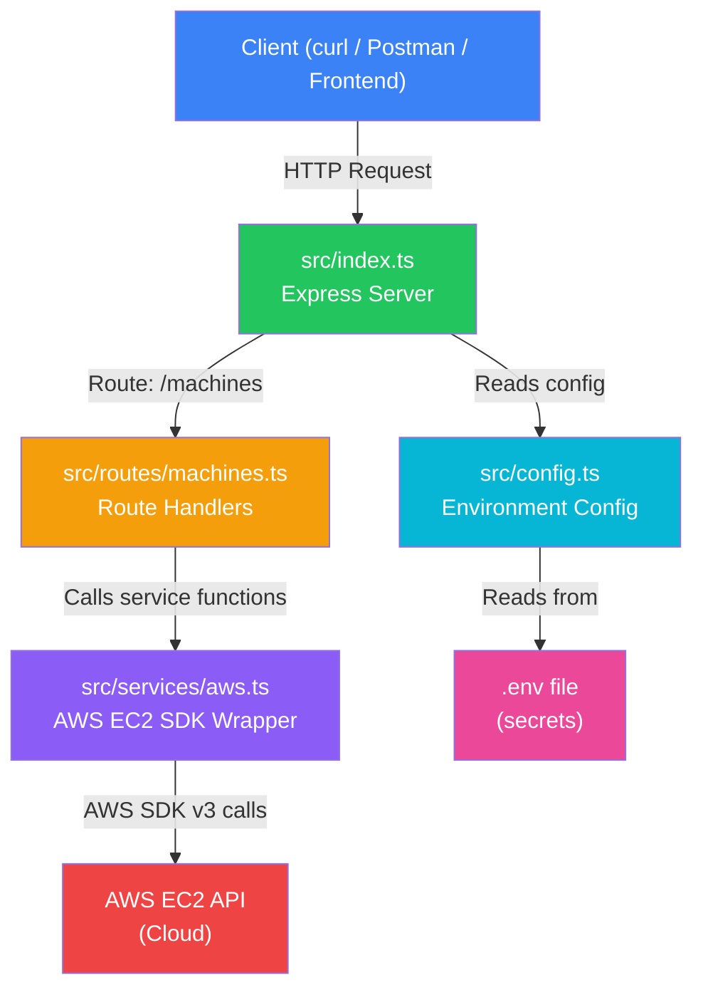
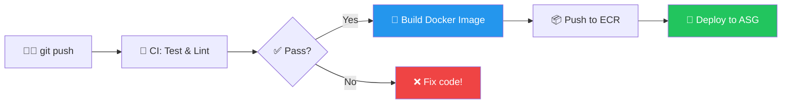

# 🚀 Autoscaling Orchestrator — Complete Project Guide

> **Week 29.1 — Step-by-Step Guide for First-Time Learners**
> Build a Node.js/TypeScript app that manages cloud machines via AWS, runs VS Code in the browser, and deploys with Docker + CI/CD.

---

## 📑 Table of Contents

| #   | Topic                                                                                 |
| --- | ------------------------------------------------------------------------------------- |
| 1   | [What Are We Building?](#1--what-are-we-building)                                     |
| 2   | [Architecture Overview](#2--architecture-overview)                                    |
| 3   | [Prerequisites](#3--prerequisites)                                                    |
| 4   | [Project Setup — Step by Step](#4--project-setup--step-by-step)                       |
| 5   | [Environment Variables & Secrets](#5--environment-variables--secrets)                 |
| 6   | [Code Walkthrough — Every File Explained](#6--code-walkthrough--every-file-explained) |
| 7   | [Running the App Locally](#7--running-the-app-locally)                                |
| 8   | [Testing the API with curl](#8--testing-the-api-with-curl)                            |
| 9   | [Docker — Containerising the App](#9--docker--containerising-the-app)                 |
| 10  | [CI/CD Pipeline — GitHub Actions](#10--cicd-pipeline--github-actions)                 |
| 11  | [Deploying to AWS (End-to-End)](#11--deploying-to-aws-end-to-end)                     |
| 12  | [Interview Cheat Sheet](#12--interview-cheat-sheet)                                   |
| 13  | [Key Takeaways](#13--key-takeaways)                                                   |

---

## 1 — What Are We Building?

### The Big Picture

We're building a **simplified version of platforms like bolt.new and lovable.dev** — those "vibe coding" apps where you get a full development environment in your browser.

Our app does this:

1. **You hit an API** → `POST /machines` with a project name
2. **The app talks to AWS** → creates a new cloud server (EC2 instance)
3. **On that server** → VS Code runs in the browser (via [code-server](https://github.com/coder/code-server))
4. **You get the URL** → open `http://SERVER-IP:8080` and start coding!
5. **When done** → `DELETE /machines/:id` to terminate and stop paying

```
  You (Developer)          Our App              AWS Cloud
  ──────────────          ─────────            ──────────
       │                      │                     │
       │  POST /machines      │                     │
       │  { "projectName":    │                     │
       │    "my-project" }    │                     │
       │─────────────────────→│                     │
       │                      │  AWS SDK: Create    │
       │                      │  EC2 Instance       │
       │                      │────────────────────→│
       │                      │                     │  Boots Ubuntu
       │                      │                     │  Installs Docker
       │                      │                     │  Runs VS Code
       │                      │  Here's the IP!     │
       │                      │←────────────────────│
       │  { instanceId,       │                     │
       │    vscodeUrl:        │                     │
       │    "http://IP:8080" }│                     │
       │←─────────────────────│                     │
       │                      │                     │
       │  Open browser →      │                     │
       │  http://IP:8080      │     VS Code in      │
       │─────────────────────────────────────────→  │
       │                      │     the browser! 🎉 │
```

### Why No Load Balancer?

Unlike traditional auto-scaling (Week 28), here **each machine has its own IP** and is directly accessible. That's because each instance is a _dedicated workspace_ for one project — not a copy of the same app serving many users.

---

## 2 — Architecture Overview

### Project File Structure

```
autoscaling-orchestrator/
├── .github/
│   └── workflows/
│       └── deploy.yml          ← CI/CD pipeline (GitHub Actions)
│
├── src/
│   ├── index.ts                ← Entry point — Express server
│   ├── config.ts               ← Loads .env, validates, exports config object
│   ├── routes/
│   │   └── machines.ts         ← REST API routes (POST/GET/DELETE)
│   └── services/
│       └── aws.ts              ← AWS SDK v3 wrapper (create/delete/list EC2)
│
├── .env.example                ← Template for environment variables
├── .dockerignore               ← Files to exclude from Docker build
├── Dockerfile                  ← Multi-stage Docker build
├── docker-compose.yml          ← Local dev with Docker
├── package.json                ← Dependencies & scripts
└── tsconfig.json               ← TypeScript compiler config
```

### How the Code Flows



### The Layered Architecture

```
  ┌──────────────────────────────────────────┐
  │  HTTP Layer (Express)                    │ ← Handles requests/responses
  │  src/index.ts + src/routes/machines.ts   │
  ├──────────────────────────────────────────┤
  │  Service Layer (Business Logic)          │ ← Talks to AWS
  │  src/services/aws.ts                     │
  ├──────────────────────────────────────────┤
  │  Config Layer                            │ ← Reads .env secrets
  │  src/config.ts                           │
  └──────────────────────────────────────────┘
```

> **Why layers?**
>
> - **Separation of concerns** — each file has ONE job
> - **Easy testing** — mock the service layer, test routes in isolation
> - **Easy to swap** — want Google Cloud instead of AWS? Only change `aws.ts`

---

## 3 — Prerequisites

Before starting, make sure you have these installed:

| Tool            | What It Is                                | Install Command                                      |
| --------------- | ----------------------------------------- | ---------------------------------------------------- |
| **Node.js 22+** | JavaScript runtime                        | `nvm install 22` or [nodejs.org](https://nodejs.org) |
| **npm**         | Package manager (comes with Node.js)      | Comes with Node.js                                   |
| **TypeScript**  | Typed JavaScript (installed via npm)      | `npm install -g typescript`                          |
| **Git**         | Version control                           | `brew install git` (macOS)                           |
| **Docker**      | Containerisation (optional for local dev) | [docker.com](https://docs.docker.com/get-docker/)    |
| **AWS Account** | Cloud provider (free tier available)      | [aws.amazon.com](https://aws.amazon.com/free/)       |
| **AWS CLI**     | Command line tool for AWS (optional)      | `brew install awscli` (macOS)                        |

### AWS Setup (Required for EC2 operations)

1. Create an **IAM User** with `AmazonEC2FullAccess` permission
2. Generate **Access Key ID** and **Secret Access Key**
3. Create a **Key Pair** in EC2 (for SSH access to instances)
4. Create a **Security Group** that allows ports: 22 (SSH), 80 (HTTP), 3000 (app), 8080 (VS Code)

---

## 4 — Project Setup — Step by Step

### Step 1: Navigate to the project directory

```bash
cd "29-week-29/autoscaling-orchestrator"
```

### Step 2: Initialize the project

The `package.json` is already created. Let's understand what's in it:

```json
{
  "name": "autoscaling-orchestrator",
  "version": "1.0.0",
  "description": "A Node.js autoscaling orchestrator for managing EC2 instances...",
  "main": "dist/index.js",
  "scripts": {
    "dev": "tsx watch src/index.ts", // Hot-reload dev server
    "build": "tsc", // Compile TS → JS
    "start": "node dist/index.js", // Run compiled JS (production)
    "lint": "tsc --noEmit", // Type-check without compiling
    "test": "echo \"Tests passed\" && exit 0"
  },
  "dependencies": {
    "@aws-sdk/client-ec2": "^3.700.0", // AWS SDK v3 for EC2
    "dotenv": "^16.4.7", // Load .env files
    "express": "^4.21.2" // Web framework
  },
  "devDependencies": {
    "@types/express": "^5.0.0", // TypeScript types for Express
    "@types/node": "^22.10.0", // TypeScript types for Node.js
    "tsx": "^4.19.0", // Run TypeScript directly (dev)
    "typescript": "^5.7.0" // TypeScript compiler
  }
}
```

> **Key distinction:**
>
> - `dependencies` = needed at runtime (in production)
> - `devDependencies` = needed only during development (types, compiler)

### Step 3: Install dependencies

```bash
npm install
```

This reads `package.json` and installs everything into `node_modules/`.

### Step 4: Create your `.env` file

```bash
cp .env.example .env
```

Then open `.env` and fill in your real AWS credentials. **Never commit this file!**

### Step 5: Verify TypeScript compiles

```bash
npx tsc --noEmit
# If no output = success! ✅
```

---

## 5 — Environment Variables & Secrets

### Why `.env`?

Secrets like AWS keys should **never** be hardcoded in source code because:

- ❌ Anyone who sees your code has your AWS keys
- ❌ If pushed to GitHub, bots scan for keys within seconds and use them to mine crypto
- ✅ `.env` keeps secrets in a separate file that's `.gitignore`d

### The `.env.example` File

```bash
# ── Server ───────────────────────────────────────────────
PORT=3000

# ── AWS Credentials ─────────────────────────────────────
AWS_ACCESS_KEY_ID=your-access-key-id-here
AWS_SECRET_ACCESS_KEY=your-secret-access-key-here
AWS_REGION=us-east-1

# ── EC2 Instance Configuration ──────────────────────────
AWS_AMI_ID=ami-0c7217cdde317cfec         # Ubuntu 22.04 LTS
AWS_INSTANCE_TYPE=t2.micro               # Free tier eligible
AWS_KEY_PAIR_NAME=my-key-pair
AWS_SECURITY_GROUP_ID=sg-xxxxxxxxxxxxxxxxx

# ── Coder / VS Code Server ──────────────────────────────
CODER_PASSWORD=change-me-to-a-strong-password
```

### How It Works in Code

```
  .env file                          config.ts                       rest of the app
  ────────                          ──────────                      ────────────────
  AWS_ACCESS_KEY_ID=AKIA...  ──→  dotenv.config() loads it  ──→  config.aws.accessKeyId
  AWS_SECRET_ACCESS_KEY=xxx  ──→  into process.env          ──→  config.aws.secretAccessKey
  PORT=3000                  ──→                             ──→  config.port
```

### Security Rules

1. **`.env` is in `.gitignore`** — never committed to Git
2. **`.env.example` IS committed** — shows what vars are needed, with placeholder values
3. **In production (CI/CD)** — use GitHub Secrets / AWS Parameter Store, not `.env` files

---

## 6 — Code Walkthrough — Every File Explained

---

### 📄 `src/config.ts` — Configuration Layer

**Purpose:** Read ALL environment variables once, validate them, export a typed config object.

```typescript
import dotenv from "dotenv";

// Load .env file into process.env
// This call reads the .env file from disk and injects each
// KEY=VALUE pair into Node.js's process.env object
dotenv.config();

// ── Helper: crash immediately if a required var is missing ─
// It's better to crash at startup than to get a confusing
// "undefined" error 10 minutes later at runtime.
function requiredEnv(name: string): string {
  const value = process.env[name];
  if (!value) {
    throw new Error(
      `❌ Missing required environment variable: ${name}\n` +
        `   → Copy .env.example to .env and fill in your values.`,
    );
  }
  return value;
}

// ── The config object — used by the rest of the app ────
export const config = {
  port: parseInt(process.env.PORT || "3000", 10),

  aws: {
    accessKeyId: requiredEnv("AWS_ACCESS_KEY_ID"),
    secretAccessKey: requiredEnv("AWS_SECRET_ACCESS_KEY"),
    region: process.env.AWS_REGION || "us-east-1",
  },

  ec2: {
    amiId: requiredEnv("AWS_AMI_ID"),
    instanceType: process.env.AWS_INSTANCE_TYPE || "t2.micro",
    keyPairName: requiredEnv("AWS_KEY_PAIR_NAME"),
    securityGroupId: requiredEnv("AWS_SECURITY_GROUP_ID"),
  },

  coderPassword: process.env.CODER_PASSWORD || "changeme",
};
```

**Key Concepts:**

| Concept               | Explanation                                                                  |
| --------------------- | ---------------------------------------------------------------------------- |
| `dotenv.config()`     | Reads `.env` file and adds each line as a key-value pair to `process.env`    |
| `requiredEnv()`       | Custom function that crashes the app immediately if a variable is missing    |
| `parseInt(... , 10)`  | Converts string `"3000"` to number `3000`. The `10` means base-10 (decimal). |
| `export const config` | Makes this object importable by other files via `import { config } from ...` |

---

### 📄 `src/services/aws.ts` — AWS EC2 Service Layer

**Purpose:** Wrap the AWS SDK v3 EC2 client. Provide simple functions the routes call.

#### Part 1 — Imports & Client Setup

```typescript
import {
  EC2Client, // The main client class
  RunInstancesCommand, // Command to launch instances
  TerminateInstancesCommand, // Command to terminate instances
  DescribeInstancesCommand, // Command to list/describe instances
  type RunInstancesCommandInput,
  type _InstanceType, // AWS SDK's enum for instance types
} from "@aws-sdk/client-ec2";
import { config } from "../config";

// Create ONE shared EC2 client instance.
// This client holds credentials and region config.
const ec2Client = new EC2Client({
  region: config.aws.region,
  credentials: {
    accessKeyId: config.aws.accessKeyId,
    secretAccessKey: config.aws.secretAccessKey,
  },
});
```

> **AWS SDK v3 vs v2:**
>
> - **v2 (old):** `const AWS = require('aws-sdk')` — loads ALL services (huge bundle)
> - **v3 (new):** `import { EC2Client } from "@aws-sdk/client-ec2"` — import ONLY what you need (tree-shakable, smaller)

#### Part 2 — User Data Script

```typescript
// This bash script runs when a new EC2 instance boots.
// It installs Docker and runs code-server (VS Code in browser).
function generateUserData(): string {
  const script = `#!/bin/bash
set -e

# Update system packages
sudo apt-get update -y && sudo apt-get upgrade -y

# Install Docker
sudo apt-get install -y docker.io
sudo systemctl enable docker && sudo systemctl start docker

# Run code-server (VS Code in browser) in a Docker container
sudo docker run -d \\
  --name code-server \\
  -p 8080:8080 \\
  -e PASSWORD=${config.coderPassword} \\
  -v /home/ubuntu/project:/home/coder/project \\
  --restart unless-stopped \\
  codercom/code-server:latest

echo "✅ code-server is running on port 8080"
`;

  // AWS requires User Data to be Base64 encoded
  return Buffer.from(script).toString("base64");
}
```

**What is User Data?**

> When AWS launches an EC2 instance, it can run a script on first boot. This is called **User Data**. It's how we automate setup — no SSH needed!

```
  EC2 Boots Up
       │
       ▼
  Runs User Data Script
       │
       ├── apt-get update
       ├── Install Docker
       └── docker run code-server
              │
              ▼
        VS Code available at
        http://INSTANCE-IP:8080  🎉
```

#### Part 3 — `createMachine()` function

```typescript
export async function createMachine(projectName: string) {
  const params: RunInstancesCommandInput = {
    ImageId: config.ec2.amiId, // Ubuntu AMI
    InstanceType: config.ec2.instanceType as _InstanceType, // t2.micro
    MinCount: 1, // Launch 1 instance
    MaxCount: 1,
    KeyName: config.ec2.keyPairName, // SSH key
    SecurityGroupIds: [config.ec2.securityGroupId], // Firewall
    UserData: generateUserData(), // Startup script

    // Tags = labels attached to the instance in AWS Console
    TagSpecifications: [
      {
        ResourceType: "instance",
        Tags: [
          { Key: "Name", Value: `orchestrator-${projectName}` },
          { Key: "Project", Value: projectName },
          { Key: "ManagedBy", Value: "autoscaling-orchestrator" },
        ],
      },
    ],
  };

  const command = new RunInstancesCommand(params);
  const response = await ec2Client.send(command);

  const instance = response.Instances?.[0];
  if (!instance || !instance.InstanceId) {
    throw new Error("AWS did not return an instance ID");
  }

  return {
    instanceId: instance.InstanceId,
    state: instance.State?.Name || "pending",
    message: `Instance launched. VS Code at http://<PUBLIC-IP>:8080`,
  };
}
```

**AWS SDK v3 Pattern:**

Every operation follows this pattern:

```
  1. Create Params Object    →  { ImageId, InstanceType, ... }
  2. Create Command          →  new RunInstancesCommand(params)
  3. Send via Client         →  ec2Client.send(command)
  4. Read Response           →  response.Instances[0].InstanceId
```

#### Part 4 — `deleteMachine()`, `listMachines()`, `getMachineById()`

```typescript
// Terminate an instance
export async function deleteMachine(instanceId: string) {
  const command = new TerminateInstancesCommand({
    InstanceIds: [instanceId],
  });
  const response = await ec2Client.send(command);
  // Returns previous state and current state (shutting-down)
  return { instanceId, currentState: "shutting-down" };
}

// List all instances managed by us (filtered by tag)
export async function listMachines() {
  const command = new DescribeInstancesCommand({
    Filters: [
      { Name: "tag:ManagedBy", Values: ["autoscaling-orchestrator"] },
      {
        Name: "instance-state-name",
        Values: ["pending", "running", "stopping", "stopped"],
      },
    ],
  });
  const response = await ec2Client.send(command);

  // Flatten nested AWS response → simple array of machine objects
  return (response.Reservations || []).flatMap((r) =>
    (r.Instances || []).map((i) => ({
      instanceId: i.InstanceId,
      state: i.State?.Name,
      publicIp: i.PublicIpAddress || "not-assigned-yet",
      vscodeUrl: i.PublicIpAddress
        ? `http://${i.PublicIpAddress}:8080`
        : "not-available-yet",
    })),
  );
}

// Get one instance by ID
export async function getMachineById(instanceId: string) {
  const command = new DescribeInstancesCommand({
    InstanceIds: [instanceId],
  });
  const response = await ec2Client.send(command);
  const instance = response.Reservations?.[0]?.Instances?.[0];
  if (!instance) return null;

  return {
    instanceId: instance.InstanceId,
    state: instance.State?.Name,
    publicIp: instance.PublicIpAddress || "not-assigned-yet",
    vscodeUrl: instance.PublicIpAddress
      ? `http://${instance.PublicIpAddress}:8080`
      : "not-available-yet",
  };
}
```

---

### 📄 `src/routes/machines.ts` — REST API Routes

**Purpose:** Define HTTP endpoints. Each route validates input, calls the service, returns JSON.

```typescript
import { Router, Request, Response } from "express";
import {
  createMachine,
  deleteMachine,
  listMachines,
  getMachineById,
} from "../services/aws";

const router = Router();

// ── POST /machines → Create a new instance ──────────────
router.post("/", async (req: Request, res: Response) => {
  try {
    const { projectName } = req.body;

    // Validation: projectName is required
    if (!projectName || typeof projectName !== "string") {
      res.status(400).json({
        error: "Missing 'projectName' in request body",
        example: { projectName: "my-cool-project" },
      });
      return;
    }

    console.log(`🚀 Creating machine for: ${projectName}`);
    const result = await createMachine(projectName);
    res.status(201).json({ success: true, data: result });
  } catch (error: any) {
    res.status(500).json({ success: false, error: error.message });
  }
});

// ── GET /machines → List all instances ──────────────────
router.get("/", async (_req, res) => {
  try {
    const machines = await listMachines();
    res.json({ success: true, count: machines.length, data: machines });
  } catch (error: any) {
    res.status(500).json({ success: false, error: error.message });
  }
});

// ── GET /machines/:id → Get one instance ────────────────
router.get("/:id", async (req, res) => {
  try {
    const id = req.params.id as string;
    const machine = await getMachineById(id);
    if (!machine) {
      res.status(404).json({ error: `Machine ${id} not found` });
      return;
    }
    res.json({ success: true, data: machine });
  } catch (error: any) {
    res.status(500).json({ success: false, error: error.message });
  }
});

// ── DELETE /machines/:id → Terminate instance ───────────
router.delete("/:id", async (req, res) => {
  try {
    const id = req.params.id as string;
    const result = await deleteMachine(id);
    res.json({ success: true, data: result });
  } catch (error: any) {
    res.status(500).json({ success: false, error: error.message });
  }
});

export default router;
```

**REST API Summary:**

| Method   | Endpoint        | Body                          | What It Does                    |
| -------- | --------------- | ----------------------------- | ------------------------------- |
| `GET`    | `/health`       | —                             | Health check (is server alive?) |
| `GET`    | `/machines`     | —                             | List all managed instances      |
| `POST`   | `/machines`     | `{ "projectName": "my-app" }` | Create a new EC2 instance       |
| `GET`    | `/machines/:id` | —                             | Get details of one instance     |
| `DELETE` | `/machines/:id` | —                             | Terminate an instance           |

---

### 📄 `src/index.ts` — Entry Point

**Purpose:** Glue everything together. Create the Express app, register middleware & routes, start listening.

```typescript
import express from "express";
import { config } from "./config";
import machineRoutes from "./routes/machines";

const app = express();

// Middleware: parse JSON request bodies
app.use(express.json());

// Health check — used by load balancers and Docker
app.get("/health", (_req, res) => {
  res.status(200).json({
    status: "ok",
    uptime: process.uptime(),
    timestamp: new Date().toISOString(),
  });
});

// Root — welcome message with available endpoints
app.get("/", (_req, res) => {
  res.json({
    name: "Autoscaling Orchestrator API",
    version: "1.0.0",
    endpoints: { ... },
  });
});

// Mount machine routes at /machines
// router.post("/") → becomes POST /machines
// router.get("/:id") → becomes GET /machines/:id
app.use("/machines", machineRoutes);

// Start the server
app.listen(config.port, () => {
  console.log(`🚀 Server running on http://localhost:${config.port}`);
});
```

**What is `app.use("/machines", machineRoutes)`?**

This is called **route mounting**. It takes all the routes defined in `machines.ts` and prefixes them with `/machines`:

```
  In machines.ts:         After mounting at "/machines":
  ─────────────          ────────────────────────────
  POST   /         →     POST   /machines
  GET    /         →     GET    /machines
  GET    /:id      →     GET    /machines/:id
  DELETE /:id      →     DELETE /machines/:id
```

---

### 📄 `tsconfig.json` — TypeScript Configuration

```json
{
  "compilerOptions": {
    "target": "ES2022", // Output modern JavaScript
    "module": "commonjs", // Use require() style imports
    "outDir": "./dist", // Compiled files go here
    "rootDir": "./src", // Source files live here
    "strict": true, // Enable all strict type checks
    "esModuleInterop": true, // Allow default imports from CJS modules
    "skipLibCheck": true, // Skip checking node_modules types (faster)
    "sourceMap": true // Generate .map files for debugging
  },
  "include": ["src/**/*"], // Only compile files in src/
  "exclude": ["node_modules", "dist"]
}
```

**What does `tsc` do?**

```
  src/index.ts          tsc (compiler)        dist/index.js
  src/config.ts    ──────────────────→    dist/config.js
  src/services/aws.ts                     dist/services/aws.js
  src/routes/machines.ts                  dist/routes/machines.js

  TypeScript                              JavaScript
  (humans write)                          (Node.js runs)
```

---

## 7 — Running the App Locally

### Development Mode (with hot-reload)

```bash
# 1. Make sure .env exists with your AWS credentials
cp .env.example .env
# Edit .env with your real values

# 2. Start the development server
npm run dev

# Output:
# ╔══════════════════════════════════════════════════╗
# ║   🚀 Autoscaling Orchestrator is running!       ║
# ║   📡 http://localhost:3000                       ║
# ╚══════════════════════════════════════════════════╝
```

`tsx watch` means:

- **`tsx`** = runs TypeScript directly (no manual compile step)
- **`watch`** = restarts automatically when you save any file

### Production Mode

```bash
# 1. Compile TypeScript → JavaScript
npm run build

# 2. Run the compiled JavaScript
npm start
```

---

## 8 — Testing the API with curl

Once the server is running, test it with `curl` (or Postman):

```bash
# ── Check health ─────────────────────────────────────────
curl http://localhost:3000/health
# → { "status": "ok", "uptime": 5.123, "timestamp": "..." }

# ── See available endpoints ──────────────────────────────
curl http://localhost:3000
# → { "name": "Autoscaling Orchestrator API", "endpoints": {...} }

# ── Create a new machine ────────────────────────────────
curl -X POST http://localhost:3000/machines \
  -H "Content-Type: application/json" \
  -d '{"projectName": "my-cool-project"}'
# → { "success": true, "data": { "instanceId": "i-0abc...", "state": "pending" } }

# ── List all machines ────────────────────────────────────
curl http://localhost:3000/machines
# → { "success": true, "count": 1, "data": [...] }

# ── Get one machine's details ───────────────────────────
curl http://localhost:3000/machines/i-0abc123def456
# → { "success": true, "data": { "instanceId": "i-0abc...", "publicIp": "54.x.x.x", "vscodeUrl": "http://54.x.x.x:8080" } }

# ── Terminate a machine ─────────────────────────────────
curl -X DELETE http://localhost:3000/machines/i-0abc123def456
# → { "success": true, "data": { "instanceId": "i-0abc...", "currentState": "shutting-down" } }
```

---

## 9 — Docker — Containerising the App

### What is Docker and Why Do We Need It?

**Docker** packages your app + ALL its dependencies into a lightweight, portable **container** that runs identically everywhere.

```
  ❌ WITHOUT Docker:
  "It works on my machine!" → Doesn't work on the server.
  Different Node versions, missing packages, OS differences...

  ✅ WITH Docker:
  "It works in my container!" → Works EVERYWHERE identically.
  Same Node.js, same packages, same OS, same everything.
```

### The Dockerfile — Explained Line by Line

```dockerfile
# ═══════════════════════════════════════════════════════
# STAGE 1: Builder — compile TypeScript → JavaScript
# ═══════════════════════════════════════════════════════
FROM node:22-alpine AS builder
# "FROM" = start with the official Node.js 22 image
# "alpine" = a tiny Linux distribution (~5 MB vs ~1 GB for full Ubuntu)
# "AS builder" = name this stage so we can reference it later

WORKDIR /app
# All commands after this will run inside /app in the container

COPY package.json package-lock.json* ./
# Copy ONLY package files first. Why?
# Docker caches each layer. If package.json hasn't changed,
# the next RUN (npm ci) is SKIPPED on rebuild. HUGE speed boost!

RUN npm ci
# "ci" = Clean Install. Faster than "npm install" in CI.
# Installs EXACTLY what's in package-lock.json (no surprises)

COPY . .
# NOW copy all source code

RUN npm run build
# Compile TypeScript → JavaScript → /app/dist/
```

```dockerfile
# ═══════════════════════════════════════════════════════
# STAGE 2: Production — lean, secure, minimal
# ═══════════════════════════════════════════════════════
FROM node:22-alpine AS production
# Start FRESH from a clean Node.js image

WORKDIR /app

COPY package.json package-lock.json* ./
RUN npm ci --omit=dev
# Install ONLY production dependencies (no TypeScript, no tsx)

COPY --from=builder /app/dist ./dist
# Copy ONLY the compiled JavaScript from Stage 1
# Source code, TypeScript, dev tools = thrown away!

RUN addgroup -S appgroup && adduser -S appuser -G appgroup
USER appuser
# Security: run as a non-root user. If the app is hacked,
# the attacker has limited permissions.

EXPOSE 3000
# Document which port the app uses (doesn't actually publish it)

HEALTHCHECK --interval=30s --timeout=5s --start-period=10s --retries=3 \
  CMD wget --spider http://localhost:3000/health || exit 1
# Docker periodically checks if the app is healthy

CMD ["node", "dist/index.js"]
# The command that starts the app
```

### Multi-Stage Build Visual

```
  Builder Stage (thrown away)     Production Stage (final image)
  ┌─────────────────────────┐     ┌─────────────────────────┐
  │ node:22-alpine          │     │ node:22-alpine          │
  │ TypeScript compiler     │     │ dist/ (compiled JS)     │
  │ All devDependencies     │ ──→ │ Production deps only    │
  │ Source code (.ts files) │copy │ Non-root user           │
  │ node_modules (full)     │only │ Health check            │
  │ dist/ (compiled)        │dist │                         │
  └─────────────────────────┘     └─────────────────────────┘
       ~400 MB (discarded)              ~150 MB (shipped!)
```

### `.dockerignore` — What NOT to send to Docker

```
node_modules       ← Install fresh inside container
dist               ← Build fresh inside container
.env               ← NEVER put secrets in the image!
.git               ← Not needed at runtime
*.md               ← Documentation not needed at runtime
```

### `docker-compose.yml` — Local Development

```yaml
services:
  app:
    build: . # Build from the Dockerfile in this directory
    ports:
      - "3000:3000" # Map host:3000 → container:3000
    env_file:
      - .env # Load environment variables from .env
    environment:
      - NODE_ENV=production
    restart: unless-stopped # Auto-restart on crash
    healthcheck:
      test: ["CMD", "wget", "--spider", "http://localhost:3000/health"]
      interval: 30s
      timeout: 5s
      retries: 3
```

### Docker Commands

```bash
# ── Build the image ──────────────────────────────────────
docker build -t autoscaling-orchestrator .
#   -t = tag the image with a name
#   .  = use the Dockerfile in the current directory

# ── Run a container ──────────────────────────────────────
docker run -d -p 3000:3000 --env-file .env --name orchestrator autoscaling-orchestrator
#   -d           = detached mode (runs in background)
#   -p 3000:3000 = map host port → container port
#   --env-file   = load secrets from .env
#   --name       = give the container a friendly name

# ── Or use Docker Compose (simpler!) ────────────────────
docker compose up --build
#   --build = rebuild the image before starting

# ── View running containers ─────────────────────────────
docker ps

# ── View logs ────────────────────────────────────────────
docker logs orchestrator

# ── Stop and remove ──────────────────────────────────────
docker compose down
# or: docker stop orchestrator && docker rm orchestrator
```

---

## 10 — CI/CD Pipeline — GitHub Actions

### What is CI/CD?

| Term   | Full Form              | What It Does                                            |
| ------ | ---------------------- | ------------------------------------------------------- |
| **CI** | Continuous Integration | Automatically test/lint code every time you push to Git |
| **CD** | Continuous Deployment  | Automatically deploy tested code to production          |



### The Pipeline File — `.github/workflows/deploy.yml`

#### Job 1: Test

```yaml
test:
  name: 🧪 Lint & Type Check
  runs-on: ubuntu-latest # Use a fresh Ubuntu VM
  steps:
    - uses: actions/checkout@v4 # Pull the repo code
    - uses: actions/setup-node@v4 # Install Node.js 22
      with:
        node-version: 22
    - run: npm ci # Install dependencies
    - run: npx tsc --noEmit # TypeScript type-check
    - run: npm test # Run tests
```

#### Job 2: Build & Push Docker Image

```yaml
build-and-push:
  needs: test # Only runs if Job 1 passes!
  steps:
    - uses: aws-actions/configure-aws-credentials@v4
      with:
        aws-access-key-id: ${{ secrets.AWS_ACCESS_KEY_ID }}
        aws-secret-access-key: ${{ secrets.AWS_SECRET_ACCESS_KEY }}

    - uses: aws-actions/amazon-ecr-login@v2 # Login to ECR

    - run: |
        docker build -t $REGISTRY/$ECR_REPO:${{ github.sha }} .
        docker push $REGISTRY/$ECR_REPO:${{ github.sha }}
        docker push $REGISTRY/$ECR_REPO:latest
```

> **What is ECR?** AWS Elastic Container Registry — a private Docker Hub for your AWS account. Your images are stored here securely.

#### Job 3: Deploy

```yaml
deploy:
  needs: build-and-push
  steps:
    # Update the Launch Template's User Data to pull new image
    - run: aws ec2 create-launch-template-version ...

    # Tell ASG to replace old instances with new ones
    - run: aws autoscaling start-instance-refresh ...
```

### Required GitHub Secrets

Go to **GitHub Repo → Settings → Secrets → Actions** and add:

| Secret Name             | Value                     |
| ----------------------- | ------------------------- |
| `AWS_ACCESS_KEY_ID`     | Your IAM access key       |
| `AWS_SECRET_ACCESS_KEY` | Your IAM secret key       |
| `AWS_ACCOUNT_ID`        | Your 12-digit AWS account |

### The Full Deployment Flow

```
  Developer               GitHub Actions               AWS
  ─────────               ──────────────              ───
       │
       │  git push main
       │───────────────→  1. Checkout code
       │                  2. npm ci
       │                  3. tsc --noEmit (type-check)
       │                  4. npm test
       │                     │
       │                     ├── PASS? ──→ Continue
       │                     └── FAIL? ──→ Stop & notify ❌
       │                     │
       │                  5. docker build
       │                  6. docker push → ECR
       │                  7. Update Launch Template
       │                  8. Start Instance Refresh ──→ ASG
       │                                                 │
       │                                          Rolling update:
       │                                          ┌──────────────┐
       │                                          │ Launch new    │
       │                                          │ instance (v2) │
       │                                          │ Health check  │
       │                                          │ passes? ✅    │
       │                                          │ Terminate old │
       │                                          │ instance (v1) │
       │                                          │ Repeat...     │
       │                                          └──────────────┘
       │
       │  Zero downtime! 🎉
```

---

## 11 — Deploying to AWS (End-to-End)

### Full Steps — From Zero to Production

#### Step 1: Set up AWS

1. Create an IAM user with EC2 + ECR permissions
2. Create a Key Pair (EC2 → Key Pairs → Create)
3. Create a Security Group allowing ports 22, 80, 3000, 8080
4. Create an ECR repository: `aws ecr create-repository --repository-name autoscaling-orchestrator`

#### Step 2: Create an AMI (Optional — for ASG)

1. Launch an EC2 instance (Ubuntu 22.04, t2.micro)
2. SSH in and install Docker:
   ```bash
   sudo apt-get update -y
   sudo apt-get install -y docker.io
   sudo systemctl enable docker
   ```
3. Create an AMI from this instance (EC2 → Actions → Create Image)

#### Step 3: Create a Launch Template

1. Use the AMI from Step 2
2. Add User Data script that pulls your Docker image from ECR

#### Step 4: Create an Auto Scaling Group

1. Use the Launch Template
2. Set min=1, desired=2, max=5
3. Select 2+ Availability Zones

#### Step 5: Push Code & Let CI/CD Handle It

```bash
git add .
git commit -m "feat: autoscaling orchestrator v1"
git push origin main
# GitHub Actions runs → builds image → pushes to ECR → deploys to ASG
```

#### Step 6: Test

```bash
# Get the instance IPs from the API
curl http://YOUR-SERVER:3000/machines

# Create a new workspace
curl -X POST http://YOUR-SERVER:3000/machines \
  -H "Content-Type: application/json" \
  -d '{"projectName": "test-project"}'

# Open VS Code in browser
open http://INSTANCE-IP:8080
```

---

## 12 — Interview Cheat Sheet

| Question                            | Answer                                                                               |
| ----------------------------------- | ------------------------------------------------------------------------------------ |
| **What does this project do?**      | Manages EC2 instances via REST API — each runs VS Code in the browser (code-server). |
| **Why no Load Balancer?**           | Each instance is a dedicated workspace with its own IP, not a replicated app.        |
| **What is the AWS SDK v3?**         | Modular AWS client — import only what you need, unlike v2 which imported everything. |
| **What is User Data?**              | A bash script that runs when EC2 instance boots — automates setup without SSH.       |
| **What is code-server?**            | Open-source VS Code that runs as a web app — access it via a browser.                |
| **Why multi-stage Docker builds?**  | Smaller image (~150 MB vs ~400 MB) — only production deps, no source code/dev tools. |
| **Why `.env` for secrets?**         | Keeps secrets out of source code; `.gitignore` prevents accidental Git commits.      |
| **What does `npm ci` do in CI/CD?** | Clean install from `package-lock.json` — deterministic, faster than `npm install`.   |
| **What is ECR?**                    | AWS Elastic Container Registry — private Docker image storage.                       |
| **What is Instance Refresh?**       | ASG rolling update — replaces old instances one at a time for zero-downtime deploys. |

---

## 13 — Key Takeaways

```
┌─────────────────────────────────────────────────────────────────┐
│                        🎯 KEY TAKEAWAYS                         │
│                                                                 │
│  1. This app manages EC2 instances via a REST API (Express)     │
│  2. Each instance runs VS Code in the browser (code-server)     │
│  3. AWS SDK v3 is modular — import only @aws-sdk/client-ec2     │
│  4. User Data scripts automate instance setup on boot           │
│  5. .env files keep secrets out of source code                  │
│  6. config.ts validates all env vars at startup (fail fast!)    │
│  7. Multi-stage Docker builds produce small, secure images      │
│  8. GitHub Actions CI/CD: test → build → push → deploy          │
│  9. ECR stores Docker images privately in AWS                   │
│  10. Layered architecture (routes → services → config)          │
│      makes code testable and swappable                          │
└─────────────────────────────────────────────────────────────────┘
```

---

> **📝 Study Tip:** Clone this project, fill in your `.env`, and try creating EC2 instances via curl. Then check the AWS Console to see them appear. It's the best way to learn cloud infrastructure!

---

_Last updated: February 2026 | Week 29.1 — Cohort Study Guide_
