# 🚀 AWS ECR & ECS — Complete Guide for Deploying Containerized Applications

**Reference:** [AWS ECR and ECS - Notion](https://petal-estimate-4e9.notion.site/AWS-ECR-and-ECS-1b07dfd1073580c8b390ec714d183c3d)

---

## 📑 Table of Contents

1. [Context — Why Containers on AWS?](#1--context--why-containers-on-aws)
2. [What is Docker? (Quick Recap)](#2--what-is-docker-quick-recap)
3. [What is AWS ECR?](#3--what-is-aws-ecr-elastic-container-registry)
4. [What is AWS ECS?](#4--what-is-aws-ecs-elastic-container-service)
5. [ECS Architecture Deep Dive](#5--ecs-architecture-deep-dive)
6. [Step 1 — Containerize a Node.js App](#step-1--containerize-a-nodejs-app)
7. [Step 2 — Set Up AWS CLI & IAM User](#step-2--set-up-aws-cli--iam-user)
8. [Step 3 — Create ECR Repository & Push Image](#step-3--create-ecr-repository--push-image)
9. [Step 4 — Create an ECS Cluster](#step-4--create-an-ecs-cluster)
10. [Step 5 — Create a Task Definition](#step-5--create-a-task-definition)
11. [Step 6 — Create a Service in Your Cluster](#step-6--create-a-service-in-your-cluster)
12. [Step 7 — Set Up a Load Balancer](#step-7--set-up-a-load-balancer)
13. [Step 8 — Configure Autoscaling Policies](#step-8--configure-autoscaling-policies)
14. [Complete End-to-End Flow (Summary Diagram)](#complete-end-to-end-flow)
15. [Key Takeaways](#-key-takeaways)

---

## 1. 🌍 Context — Why Containers on AWS?

### The Problem

Imagine you've built a Node.js backend application. It works on your machine. But now you want to:

- Deploy it to the cloud
- Run multiple copies of it (for handling traffic)
- Auto-scale when demand grows
- Ensure zero-downtime deployments

### The Old Way vs. The New Way

| Old Way (EC2 manually)              | New Way (Containers + ECS)         |
| ----------------------------------- | ---------------------------------- |
| SSH into an EC2 instance            | Push a Docker image to ECR         |
| Manually install Node.js, npm, etc. | ECS pulls the image and runs it    |
| Run `node index.js` with PM2        | ECS manages the process lifecycle  |
| Set up a load balancer manually     | ECS + ALB integrates automatically |
| Scaling? Launch new EC2s manually   | ECS auto-scales tasks for you      |

> [!IMPORTANT]
> **The core idea:** Package your app as a Docker container → Store the image in ECR → Deploy and manage it with ECS.

### The Deployment Pipeline We'll Build

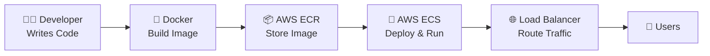

---

## 2. 🐳 What is Docker? (Quick Recap)

Docker packages your application and **all its dependencies** (OS libraries, Node.js runtime, npm packages) into a single portable unit called a **container**.

### Why Docker?

```
❌ "It works on my machine!"
✅ "It works in the container, which works the same EVERYWHERE."
```

### Key Docker Terms

| Term           | Meaning                                                                      |
| -------------- | ---------------------------------------------------------------------------- |
| **Image**      | A snapshot/template of your app + all its dependencies. Like a class in OOP. |
| **Container**  | A running instance of an image. Like an object from a class.                 |
| **Dockerfile** | A recipe file that tells Docker how to build an image.                       |
| **Registry**   | A storage location for Docker images (like DockerHub, **or AWS ECR**).       |
| **Tag**        | A version label for an image (e.g., `latest`, `v1.0`, `prod`).               |

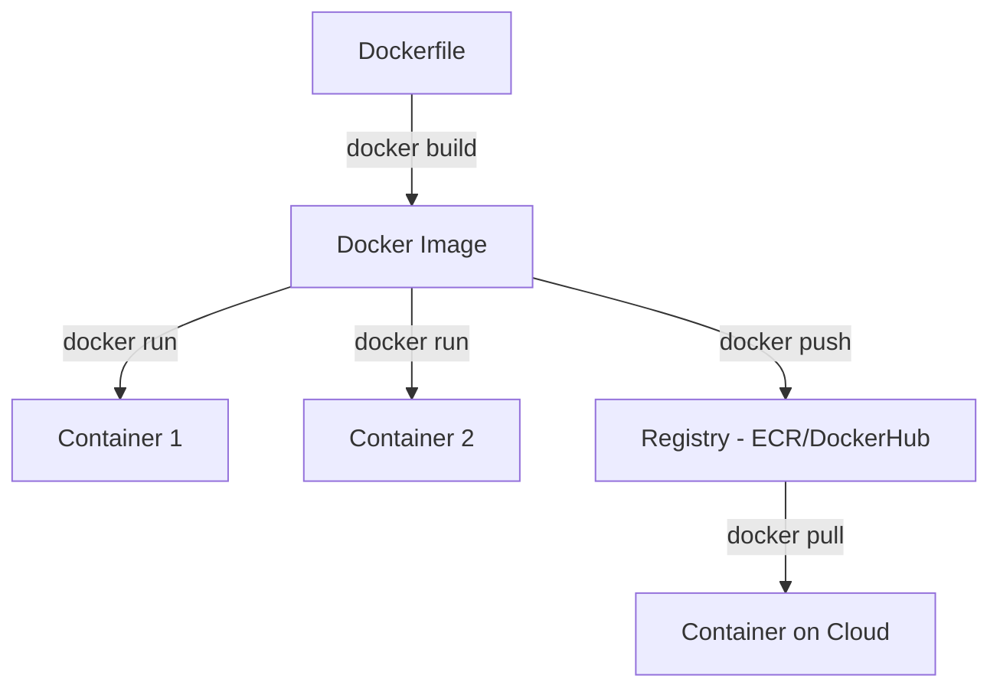

---

## 3. 📦 What is AWS ECR (Elastic Container Registry)?

### Definition

**AWS ECR** is a **fully managed Docker container registry** provided by Amazon. Think of it as a **private DockerHub** hosted on AWS.

### Why ECR Instead of DockerHub?

| Feature                  | DockerHub                   | AWS ECR                                  |
| ------------------------ | --------------------------- | ---------------------------------------- |
| **Integration with AWS** | Manual setup needed         | Native integration with ECS, EKS, Lambda |
| **Security**             | Public by default           | Private by default, IAM-based access     |
| **Performance**          | Pulls from external network | Same AWS network = faster pulls          |
| **Image Scanning**       | Paid feature                | Built-in vulnerability scanning          |
| **Lifecycle Policies**   | Not available               | Auto-cleanup old images                  |
| **Cost**                 | Free tier limited           | Pay per storage (cheap within AWS)       |

### ECR Architecture

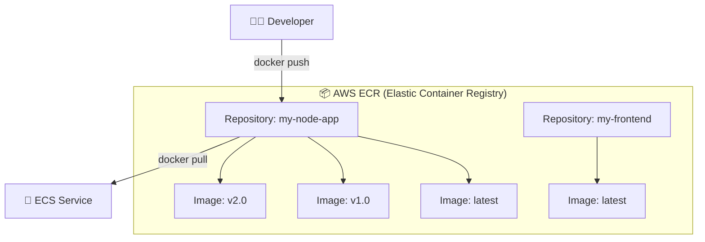

> [!NOTE]
> **One ECR repository per application.** Each repository can hold multiple tagged versions (images) of that application.

### Key ECR Concepts

| Concept               | Explanation                                                                         |
| --------------------- | ----------------------------------------------------------------------------------- |
| **Registry**          | Your AWS account has one default ECR registry per region                            |
| **Repository**        | A collection of Docker images with the same name (e.g., `my-app`)                   |
| **Image**             | A specific version of your Docker image, identified by a **tag**                    |
| **Repository URI**    | The address to push/pull: `<account_id>.dkr.ecr.<region>.amazonaws.com/<repo-name>` |
| **Repository Policy** | IAM-based rules for who can push/pull images                                        |
| **Lifecycle Policy**  | Auto-delete old/untagged images to save storage costs                               |

---

## 4. 🚢 What is AWS ECS (Elastic Container Service)?

### Definition

**AWS ECS** is a **fully managed container orchestration service** that lets you run, stop, and manage Docker containers on a cluster. It's AWS's answer to "How do I run my Docker containers in the cloud without managing servers?"

### ECS vs. Other Orchestration Tools

| Feature        | ECS                               | EKS (Kubernetes)                | Docker Compose             |
| -------------- | --------------------------------- | ------------------------------- | -------------------------- |
| **Complexity** | Simple                            | Complex (steep learning curve)  | Very simple                |
| **Use Case**   | Production-ready AWS deployments  | Multi-cloud, large-scale        | Local dev / small projects |
| **Managed by** | AWS                               | AWS (managed K8s control plane) | You (locally)              |
| **Cost**       | No extra charge (pay for compute) | $0.10/hr for control plane      | Free                       |
| **Best For**   | Teams already on AWS              | Teams needing K8s features      | Local development          |

### ECS Launch Types

ECS can run your containers on two types of infrastructure:

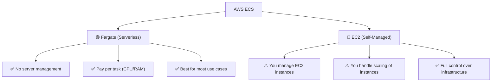

| Feature               | Fargate (Serverless)             | EC2 (Self-Managed)                                     |
| --------------------- | -------------------------------- | ------------------------------------------------------ |
| **Server Management** | AWS manages everything           | You manage EC2 instances                               |
| **Scaling**           | Automatic per-task scaling       | You scale EC2 fleet manually                           |
| **Pricing**           | Pay per task (CPU + memory used) | Pay for EC2 instances (running or not)                 |
| **Use Case**          | Most applications, startups      | GPU workloads, custom AMIs, cost optimization at scale |
| **Complexity**        | Low                              | High                                                   |

> [!TIP]
> **For beginners and most use cases, choose Fargate.** You don't need to worry about managing EC2 instances at all. AWS provisions and manages the underlying compute for you.

---

## 5. 🏗️ ECS Architecture Deep Dive

### The Hierarchy

The ECS architecture follows a top-down hierarchy:

```
AWS ECS
 └── Cluster
      └── Service
           └── Task (running container)
                └── Container(s)
```

### Core Components Explained

#### 1. **Cluster**

A **logical grouping** of services and tasks. Think of it as a "project" or "environment."

```
Examples:
  - "production-cluster" → all production services
  - "staging-cluster" → all staging/test services
```

#### 2. **Task Definition** (The Blueprint 📝)

A **JSON configuration** that describes HOW to run your container(s). It's like a `docker-compose.yml` but for AWS ECS.

A Task Definition specifies:

- Which Docker image to use (from ECR)
- How much CPU and memory to allocate
- Which ports to expose
- Environment variables
- Logging configuration
- IAM roles

```json
// Example Task Definition (simplified)
{
  "family": "my-node-app",
  "networkMode": "awsvpc",
  "containerDefinitions": [
    {
      "name": "node-app-container",
      "image": "123456789.dkr.ecr.us-east-1.amazonaws.com/my-node-app:latest",
      "portMappings": [
        {
          "containerPort": 3000, // Port your app listens on
          "protocol": "tcp"
        }
      ],
      "essential": true, // If this container stops, the task stops
      "memory": 512, // 512 MB RAM
      "cpu": 256, // 0.25 vCPU
      "logConfiguration": {
        "logDriver": "awslogs", // Send logs to CloudWatch
        "options": {
          "awslogs-group": "/ecs/my-node-app",
          "awslogs-region": "us-east-1",
          "awslogs-stream-prefix": "ecs"
        }
      }
    }
  ],
  "requiresCompatibilities": ["FARGATE"],
  "cpu": "256",
  "memory": "512"
}
```

#### 3. **Task** (A Running Instance 🏃)

A **task** is a **running instance** of a Task Definition. When ECS launches a task, it pulls the Docker image from ECR and starts the container(s) defined in the task definition.

```
Task Definition (blueprint)  →  Task (actual running container)
  Class in OOP               →  Object/Instance
  docker-compose.yml          →  docker compose up
```

#### 4. **Service** (The Manager 🎯)

A **service** ensures a specified number of tasks are **always running**. If a task crashes, the service automatically restarts it.

```
Service says: "Keep 3 tasks of 'my-node-app' running at all times"
  Task 1 crashes → Service detects → Launches a new Task 1
```

### Complete ECS Architecture Diagram

```
                        ┌─────────────────────┐
                        │    Internet/Users    │
                        └──────────┬──────────┘
                                   │
                        ┌──────────▼──────────┐
                        │   Load Balancer      │
                        │   (ALB - Port 80)    │
                        └──────────┬──────────┘
                                   │
                        ┌──────────▼──────────┐
                        │    Target Group      │
                        │  (Routes to Tasks)   │
                        └──────────┬──────────┘
                                   │
          ┌────────────────────────────────────────────┐
          │              ECS Cluster                    │
          │                                             │
          │   ┌─────────────────┐  ┌─────────────────┐ │
          │   │   Service A     │  │   Service B      │ │
          │   │  (Backend API)  │  │  (Worker/Cron)   │ │
          │   │                 │  │                   │ │
          │   │  ┌───────────┐  │  │  ┌───────────┐   │ │
          │   │  │  Task 1   │  │  │  │  Task 1   │   │ │
          │   │  │ (Fargate) │  │  │  │ (Fargate) │   │ │
          │   │  └───────────┘  │  │  └───────────┘   │ │
          │   │                 │  │                   │ │
          │   │  ┌───────────┐  │  │  ┌───────────┐   │ │
          │   │  │  Task 2   │  │  │  │  Task 2   │   │ │
          │   │  │ (Fargate) │  │  │  │ (Fargate) │   │ │
          │   │  └───────────┘  │  │  └───────────┘   │ │
          │   │                 │  │                   │ │
          │   │  ┌───────────┐  │  └─────────────────┘ │
          │   │  │  Task 3   │  │                       │
          │   │  │ (Fargate) │  │                       │
          │   │  └───────────┘  │                       │
          │   └─────────────────┘                       │
          │                                             │
          └────────────────────────────────────────────┘
```

### How All Components Connect

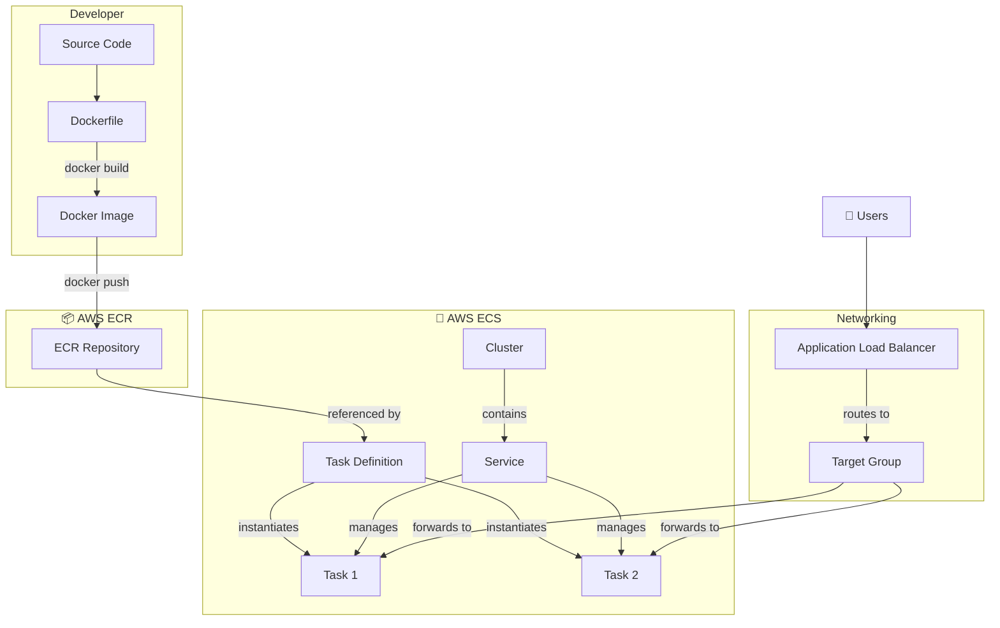

---

## Step 1 — Containerize a Node.js App

### 1.1 Create a Simple Node.js Application

First, create a project folder and initialize it:

```bash
# Create project directory
mkdir my-node-app
cd my-node-app

# Initialize Node.js project
npm init -y

# Install Express.js
npm install express
```

### 1.2 Write the Application Code

Create `index.js`:

```javascript
// index.js
const express = require("express"); // Import Express framework
const app = express(); // Create an Express application instance

const PORT = 3000; // Define the port number (ECS will expose this)

// Define a root route
app.get("/", (req, res) => {
  // This is what users see when they visit the app
  res.json({
    message: "Hello from AWS ECS! 🚀",
    timestamp: new Date().toISOString(),
    hostname: require("os").hostname(), // Shows the container's hostname (useful for debugging)
  });
});

// Health check endpoint (important for Load Balancer)
app.get("/health", (req, res) => {
  // ALB will ping this route to check if the container is healthy
  res.status(200).json({ status: "healthy" });
});

// Start the server
app.listen(PORT, () => {
  console.log(`Server is running on port ${PORT}`);
});
```

> [!NOTE]
> **Why the `/health` endpoint?** The Load Balancer needs a way to check if your container is alive. It sends periodic HTTP requests to this endpoint. If it gets a `200 OK`, the container is considered healthy. If it fails, ECS replaces the container.

### 1.3 Create the Dockerfile

Create a `Dockerfile` in the project root:

```dockerfile
# Step 1: Use an official Node.js runtime as the base image
# 'node:20' means we're using Node.js version 20 on a Debian-based OS
FROM node:20

# Step 2: Set the working directory inside the container
# All subsequent commands will run from /app
WORKDIR /app

# Step 3: Copy package files FIRST (for Docker layer caching optimization)
# If package.json hasn't changed, Docker reuses the cached npm install layer
COPY package*.json ./

# Step 4: Install dependencies
# This runs INSIDE the container, not on your local machine
RUN npm install

# Step 5: Copy the rest of the application code
# This is done AFTER npm install so that code changes don't invalidate the npm cache
COPY . .

# Step 6: Tell Docker that this container listens on port 3000
# This is documentation — it doesn't actually open the port
EXPOSE 3000

# Step 7: Define the command to run when the container starts
# This is equivalent to running 'node index.js' in your terminal
CMD ["node", "index.js"]
```

### 1.4 Build and Test Locally

```bash
# Build the Docker image and tag it as 'my-node-app'
docker build -t my-node-app .

# Run the container locally to test
# -p 3000:3000 maps port 3000 on your machine to port 3000 in the container
docker run -p 3000:3000 my-node-app
```

Visit `http://localhost:3000` — you should see the JSON response.

### Docker Build Process Visualized

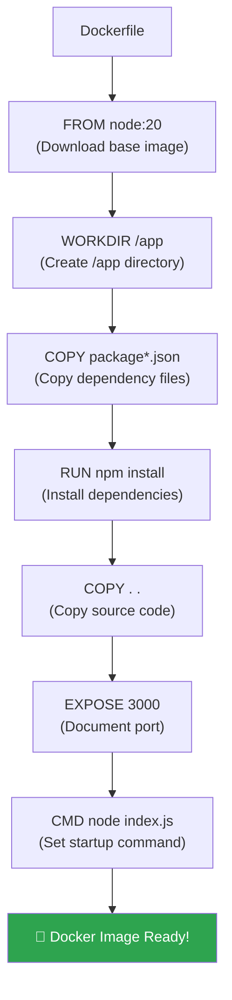

---

## Step 2 — Set Up AWS CLI & IAM User

### 2.1 Why Do We Need a Separate IAM User?

> [!CAUTION]
> **Never use your AWS root account** for daily tasks or programmatic access. The root account has unrestricted access to everything. If credentials are leaked, everything is compromised.

Instead, we create an **IAM user** with only the permissions they need (**Principle of Least Privilege**).

### 2.2 Create an IAM User (AWS Console)

1. **Go to** AWS Console → IAM → Users → **Create User**
2. **User name:** `ecr-ecs-deploy-user` (descriptive name)
3. **Access type:** ✅ Check **Programmatic access** (this gives Access Key + Secret Key)
4. **Attach policies directly.** Add these managed policies:

| Policy Name                            | What It Allows                              |
| -------------------------------------- | ------------------------------------------- |
| `AmazonEC2ContainerRegistryFullAccess` | Push/pull images to/from ECR                |
| `AmazonECS_FullAccess`                 | Create/manage ECS clusters, services, tasks |
| `ElasticLoadBalancingFullAccess`       | Create and manage load balancers (optional) |

5. **Create the user** and **download the credentials** (Access Key ID + Secret Access Key).

> [!WARNING]
> **Save your Secret Access Key immediately!** AWS only shows it once. If you lose it, you'll need to create new credentials.

### 2.3 Install AWS CLI

```bash
# macOS (using Homebrew)
brew install awscli

# Or download directly from AWS
curl "https://awscli.amazonaws.com/AWSCLIV2.pkg" -o "AWSCLIV2.pkg"
sudo installer -pkg AWSCLIV2.pkg -target /

# Linux
curl "https://awscli.amazonaws.com/awscli-exe-linux-x86_64.zip" -o "awscliv2.zip"
unzip awscliv2.zip
sudo ./aws/install

# Verify installation
aws --version
# Output: aws-cli/2.x.x Python/3.x.x ...
```

### 2.4 Configure AWS CLI

```bash
aws configure
```

You'll be prompted for 4 values:

```
AWS Access Key ID [None]: AKIA...............    ← Your IAM user's access key
AWS Secret Access Key [None]: wJalr..........    ← Your IAM user's secret key
Default region name [None]: us-east-1            ← Choose your preferred region
Default output format [None]: json               ← json, yaml, text, or table
```

### What Happens Behind the Scenes

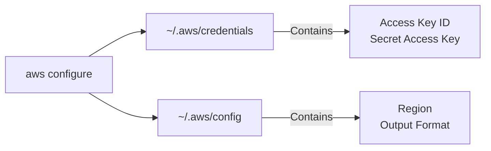

The credentials are stored locally in `~/.aws/credentials`:

```ini
[default]
aws_access_key_id = AKIA...
aws_secret_access_key = wJalr...
```

---

## Step 3 — Create ECR Repository & Push Image

### 3.1 Create an ECR Repository (AWS Console)

1. **Go to** AWS Console → ECR → **Create repository**
2. **Visibility:** Private (recommended for production)
3. **Repository name:** `my-node-app`
4. **Tag immutability:** Disabled (allows overwriting `latest` tag)
5. **Image scanning:** Enable (scans for vulnerabilities on push)
6. Click **Create repository**

### 3.2 Create an ECR Repository (CLI Alternative)

```bash
# Create a private ECR repository
aws ecr create-repository \
  --repository-name my-node-app \
  --region us-east-1 \
  --image-scanning-configuration scanOnPush=true
```

### 3.3 Authenticate Docker with ECR

Before pushing, Docker needs to "log in" to your private ECR registry:

```bash
# This command does 3 things:
# 1. aws ecr get-login-password → Gets a temporary password from AWS
# 2. | (pipe) → Passes the password to the next command
# 3. docker login → Logs Docker into your ECR registry

aws ecr get-login-password --region us-east-1 | \
  docker login --username AWS --password-stdin \
  <your-account-id>.dkr.ecr.us-east-1.amazonaws.com
```

Replace `<your-account-id>` with your 12-digit AWS account ID.

> [!NOTE]
> The `--username AWS` is always literally "AWS" (not your IAM username). The password is the temporary token generated by `get-login-password`. This token expires after **12 hours**.

### 3.4 Tag the Docker Image

Docker images need to be tagged with the **ECR repository URI** before pushing:

```bash
# Format: docker tag <local-image>:<tag> <ecr-repo-uri>:<tag>
docker tag my-node-app:latest \
  123456789012.dkr.ecr.us-east-1.amazonaws.com/my-node-app:latest
```

**Why tag?** Docker needs to know WHERE to push the image. The tag tells Docker: "This image belongs to this specific ECR repository."

### 3.5 Push the Image to ECR

```bash
docker push 123456789012.dkr.ecr.us-east-1.amazonaws.com/my-node-app:latest
```

### Complete ECR Push Flow

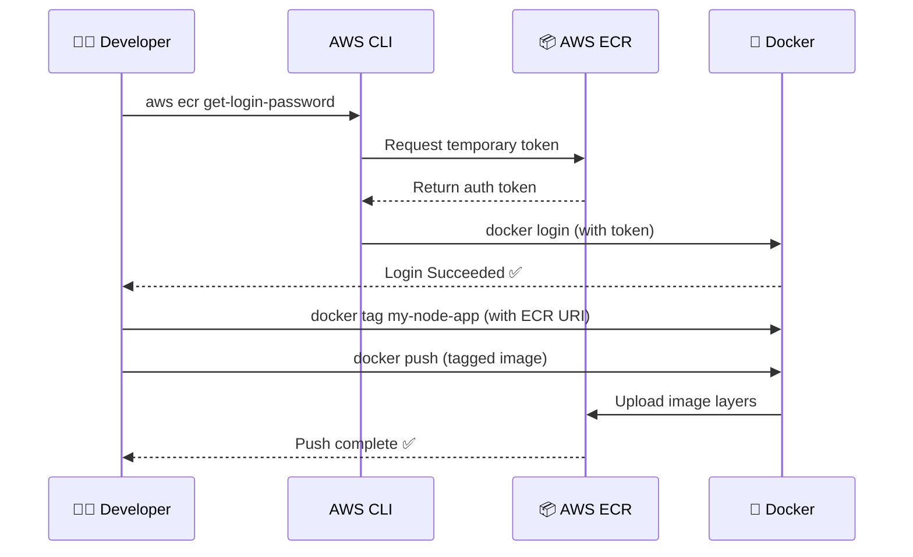

### 3.6 Verify the Push

```bash
# List images in your ECR repository
aws ecr list-images --repository-name my-node-app --region us-east-1
```

Or check the AWS Console → ECR → your repository → you should see the image with the `latest` tag.

---

## Step 4 — Create an ECS Cluster

### 4.1 What is a Cluster?

A cluster is a **logical grouping** — it's the "environment" or "workspace" where your services and tasks live. You might have:

- `production-cluster` — for live traffic
- `staging-cluster` — for testing before production

### 4.2 Create a Cluster (AWS Console)

1. **Go to** AWS Console → ECS → **Create Cluster**
2. **Cluster name:** `my-app-cluster`
3. **Infrastructure:** Select **AWS Fargate (Serverless)**
   - ✅ This is the simplest option — no EC2 management needed
4. Click **Create**

That's it! The cluster is created in seconds. It's essentially an empty container waiting for services.

### 4.3 Create a Cluster (CLI Alternative)

```bash
aws ecs create-cluster --cluster-name my-app-cluster
```

### Cluster Visualization

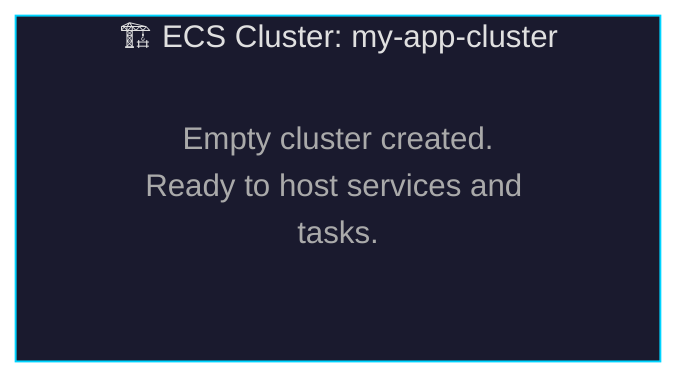

---

## Step 5 — Create a Task Definition

### 5.1 What is a Task Definition?

Think of a Task Definition as a **recipe card** 🗒️ for your container:

| Restaurant Analogy   | ECS Equivalent                      |
| -------------------- | ----------------------------------- |
| Recipe name          | Task Definition family name         |
| Ingredients list     | Docker image, environment variables |
| Cooking temperature  | CPU and memory allocation           |
| Serving plate        | Port mappings                       |
| Special instructions | Health checks, logging config       |

### 5.2 Create a Task Definition (AWS Console)

1. **Go to** AWS Console → ECS → **Task Definitions** → **Create new Task Definition**
2. Fill in the details:

**Task Definition Configuration:**

| Field                  | Value                       | Explanation                           |
| ---------------------- | --------------------------- | ------------------------------------- |
| Task Definition Family | `my-node-app-task`          | A name for this task definition group |
| Launch Type            | `AWS Fargate`               | We're using serverless                |
| OS / Architecture      | `Linux/X86_64`              | Standard Linux containers             |
| Task CPU               | `0.25 vCPU` (256 CPU units) | Start small, scale later              |
| Task Memory            | `0.5 GB` (512 MB)           | Enough for a Node.js app              |
| Task Role              | `ecsTaskExecutionRole`      | Allows ECS to pull images from ECR    |

**Container Definition:**

| Field          | Value                                                          | Explanation                             |
| -------------- | -------------------------------------------------------------- | --------------------------------------- |
| Container Name | `node-app-container`                                           | A name for this container               |
| Image URI      | `123456789.dkr.ecr.us-east-1.amazonaws.com/my-node-app:latest` | Copy from ECR                           |
| Container Port | `3000`                                                         | The port your Express app listens on    |
| Protocol       | `TCP`                                                          | Standard HTTP traffic                   |
| Essential      | `Yes`                                                          | If this container stops, the task stops |

3. Under **Logging**, configure **awslogs** (sends container logs to CloudWatch):

| Field                 | Value              |
| --------------------- | ------------------ |
| Log Driver            | `awslogs`          |
| awslogs-group         | `/ecs/my-node-app` |
| awslogs-region        | `us-east-1`        |
| awslogs-stream-prefix | `ecs`              |

4. Click **Create**

### 5.3 CPU and Memory Options for Fargate

| CPU (vCPU) | Memory Options                 |
| ---------- | ------------------------------ |
| 0.25 vCPU  | 0.5 GB, 1 GB, 2 GB             |
| 0.5 vCPU   | 1 GB – 4 GB (1 GB increments)  |
| 1 vCPU     | 2 GB – 8 GB (1 GB increments)  |
| 2 vCPU     | 4 GB – 16 GB (1 GB increments) |
| 4 vCPU     | 8 GB – 30 GB (1 GB increments) |

> [!TIP]
> **Start with 0.25 vCPU / 0.5 GB** for development and testing. You can always update the task definition with more resources later without downtime.

### 5.4 Understanding the Execution Role

The **Task Execution Role** (`ecsTaskExecutionRole`) is an IAM role that gives ECS permission to:

1. **Pull images** from ECR
2. **Write logs** to CloudWatch
3. **Retrieve secrets** from AWS Secrets Manager (if configured)

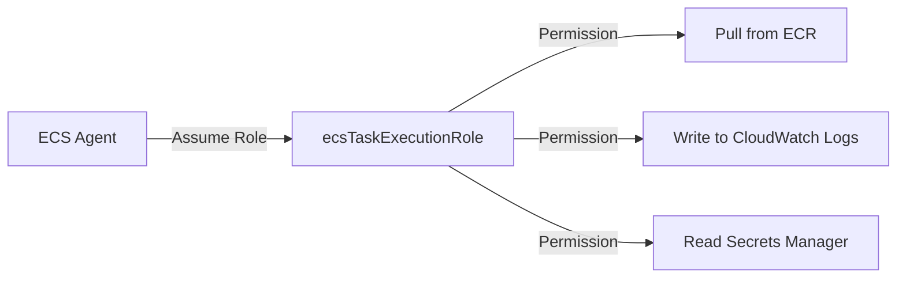

> [!NOTE]
> If this role doesn't exist yet, AWS will offer to create it automatically when you create your first task definition.

---

## Step 6 — Create a Service in Your Cluster

### 6.1 What is a Service?

A **Service** is the ECS component that:

- Keeps a **desired number of tasks** running at all times
- **Replaces failed tasks** automatically
- **Integrates with a Load Balancer** to distribute traffic
- Performs **rolling deployments** when you update the task definition

### 6.2 Create a Service (AWS Console)

1. **Go to** AWS Console → ECS → your cluster (`my-app-cluster`) → **Create Service**
2. Configure:

**Service Configuration:**

| Field           | Value                 | Explanation                                      |
| --------------- | --------------------- | ------------------------------------------------ |
| Launch Type     | `FARGATE`             | Same as task definition                          |
| Task Definition | `my-node-app-task`    | Select your task definition                      |
| Revision        | `LATEST`              | Use the most recent version                      |
| Service Name    | `my-node-app-service` | Name for this service                            |
| Desired Tasks   | `2`                   | Run 2 copies of your app (for high availability) |

**Networking Configuration:**

| Field                 | Value                            | Explanation                          |
| --------------------- | -------------------------------- | ------------------------------------ |
| VPC                   | Select your default VPC          | The virtual network for your tasks   |
| Subnets               | Select at least 2 public subnets | Tasks need network access            |
| Security Group        | Create new or select existing    | Firewall rules for your tasks        |
| Auto-assign Public IP | `ENABLED`                        | Tasks need public IPs to pull images |

**Security Group Rules:**

| Type     | Protocol | Port Range | Source    | Purpose                           |
| -------- | -------- | ---------- | --------- | --------------------------------- |
| Inbound  | TCP      | 3000       | 0.0.0.0/0 | Allow traffic to your app         |
| Inbound  | TCP      | 80         | 0.0.0.0/0 | Allow HTTP traffic (if using ALB) |
| Outbound | All      | All        | 0.0.0.0/0 | Allow outbound internet access    |

3. Click **Create Service**

### 6.3 What Happens When You Create a Service

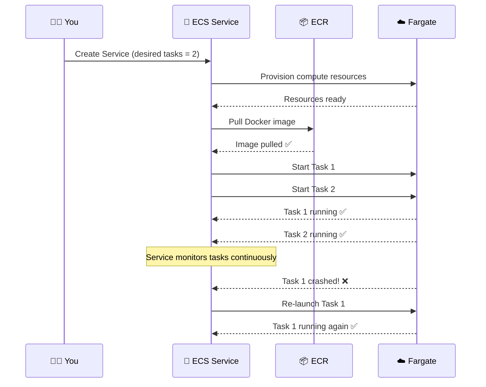

---

## Step 7 — Set Up a Load Balancer

### 7.1 Why Do We Need a Load Balancer?

Without a Load Balancer:

- Each task gets a **different IP address**
- When tasks are replaced (after crashes or deploys), **IPs change**
- Users would need to know which IP to connect to

With a Load Balancer:

- Users connect to **one single URL** (the ALB's DNS name)
- The ALB distributes traffic across **all healthy tasks**
- Failed tasks are automatically removed from the rotation

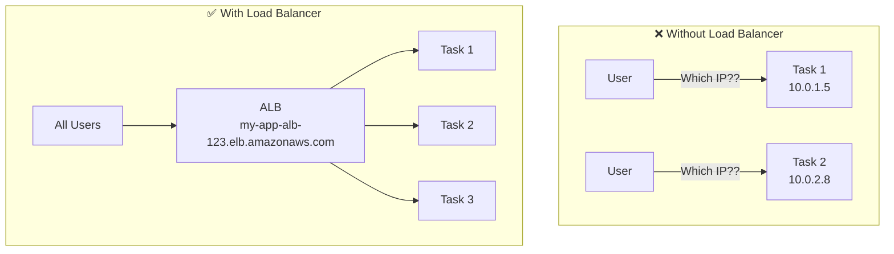

### 7.2 Application Load Balancer (ALB) Components

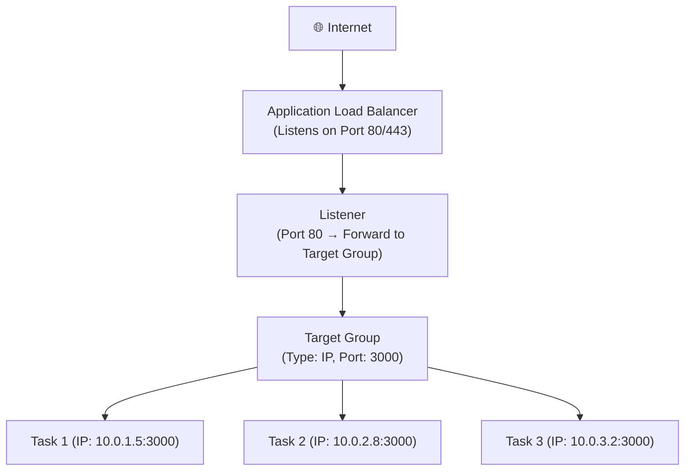

| Component        | Purpose                                                        |
| ---------------- | -------------------------------------------------------------- |
| **ALB**          | The entry point. Receives all incoming traffic.                |
| **Listener**     | A rule: "Listen on port 80, forward to Target Group X"         |
| **Target Group** | A group of targets (your ECS tasks). ALB health-checks them.   |
| **Health Check** | ALB pings `/health` on each task. Unhealthy tasks are removed. |

### 7.3 Create an ALB (AWS Console)

1. **Go to** AWS Console → EC2 → Load Balancers → **Create Load Balancer**
2. Choose **Application Load Balancer**
3. Configure:

| Field              | Value                                     |
| ------------------ | ----------------------------------------- |
| Name               | `my-app-alb`                              |
| Scheme             | Internet-facing                           |
| IP address type    | IPv4                                      |
| VPC                | Same VPC as your ECS cluster              |
| Availability Zones | Select at least 2 (for high availability) |

4. **Create a Target Group:**

| Field                 | Value       | Explanation                                |
| --------------------- | ----------- | ------------------------------------------ |
| Target type           | **IP**      | ECS Fargate tasks use IP-based targets     |
| Target group name     | `my-app-tg` | Name for the target group                  |
| Protocol              | HTTP        |                                            |
| Port                  | 3000        | Your app's container port                  |
| Health check path     | `/health`   | The endpoint we created in our Express app |
| Health check interval | 30 seconds  | How often ALB checks task health           |

5. Add a **Listener** on Port 80 → Forward to `my-app-tg`
6. Click **Create**

### 7.4 Connect ALB to ECS Service

When creating (or updating) your ECS service, under **Load Balancing**:

| Field                     | Value                       |
| ------------------------- | --------------------------- |
| Load balancer type        | Application Load Balancer   |
| Load balancer name        | `my-app-alb`                |
| Container to load balance | `node-app-container : 3000` |
| Target group              | `my-app-tg`                 |

Now your ALB automatically registers/deregisters tasks as they start/stop.

---

## Step 8 — Configure Autoscaling Policies

### 8.1 What is Auto Scaling?

Auto Scaling **automatically adjusts the number of running tasks** based on demand:

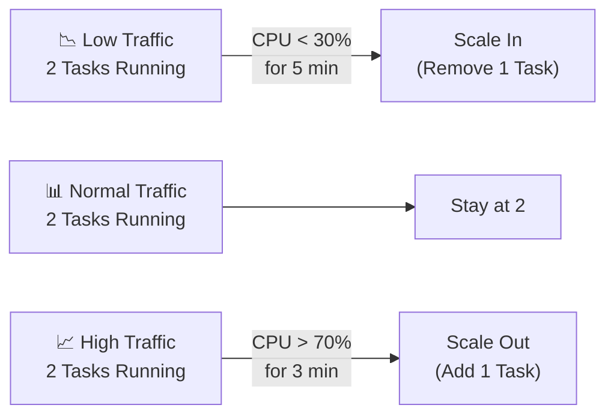

### 8.2 Configure Auto Scaling (AWS Console)

1. **Go to** ECS → your cluster → your service → **Update Service**
2. Click **Service auto scaling** → **Configure Service Auto Scaling**
3. Set:

| Field         | Value | Explanation                         |
| ------------- | ----- | ----------------------------------- |
| Minimum tasks | `1`   | Never go below 1 (always available) |
| Maximum tasks | `5`   | Never exceed 5 (cost control)       |
| Desired tasks | `2`   | Default number of tasks             |

### 8.3 Add a Scaling Policy

**Target Tracking Policy** (Recommended — simplest):

| Field              | Value                             | Explanation                                     |
| ------------------ | --------------------------------- | ----------------------------------------------- |
| Policy name        | `cpu-target-tracking`             | Descriptive name                                |
| ECS service metric | `ECSServiceAverageCPUUtilization` | Scale based on CPU                              |
| Target value       | `70`                              | Keep average CPU at ~70%                        |
| Scale-out cooldown | `60 seconds`                      | Wait 60s after scaling out before scaling again |
| Scale-in cooldown  | `120 seconds`                     | Wait 120s before scaling in (conservative)      |

### 8.4 How Target Tracking Works

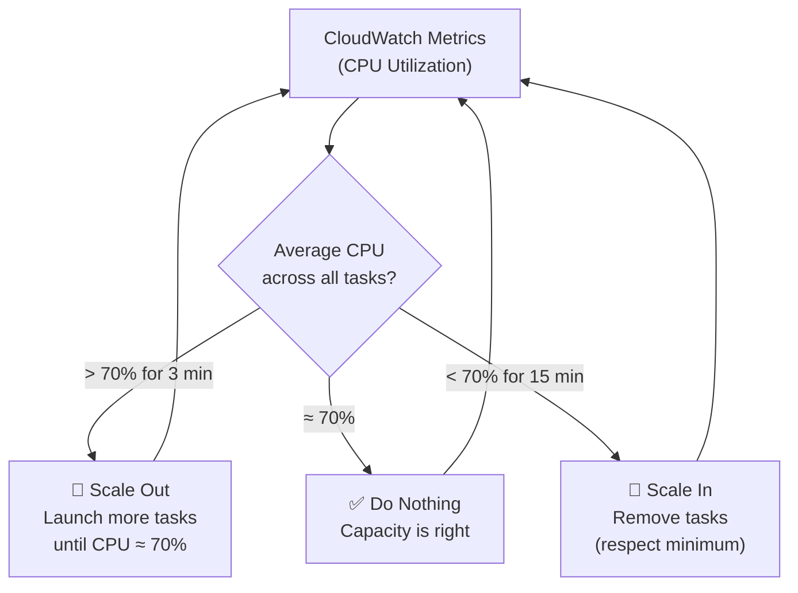

### 8.5 Alternative: Step Scaling Policy

For more granular control, use **Step Scaling**:

| CPU Range  | Action        |
| ---------- | ------------- |
| 0% – 30%   | Remove 1 task |
| 30% – 70%  | Do nothing    |
| 70% – 85%  | Add 1 task    |
| 85% – 100% | Add 2 tasks   |

> [!TIP]
> **Target Tracking is recommended for most use cases.** It's simpler and AWS automatically creates the CloudWatch alarms for you. Use Step Scaling only if you need fine-grained control.

---

## Complete End-to-End Flow

Here's the complete journey from code to production:

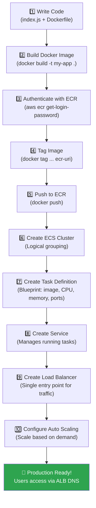

### Quick Reference — Summary of AWS Commands

```bash
# === Step 1: Build Docker Image ===
docker build -t my-node-app .

# === Step 2: Authenticate Docker with ECR ===
aws ecr get-login-password --region us-east-1 | \
  docker login --username AWS --password-stdin \
  <account-id>.dkr.ecr.us-east-1.amazonaws.com

# === Step 3: Tag the image for ECR ===
docker tag my-node-app:latest \
  <account-id>.dkr.ecr.us-east-1.amazonaws.com/my-node-app:latest

# === Step 4: Push to ECR ===
docker push <account-id>.dkr.ecr.us-east-1.amazonaws.com/my-node-app:latest

# === Step 5: Create ECS Cluster (CLI) ===
aws ecs create-cluster --cluster-name my-app-cluster

# === Step 6: Register Task Definition (CLI) ===
aws ecs register-task-definition --cli-input-json file://task-definition.json

# === Step 7: Create Service (CLI) ===
aws ecs create-service \
  --cluster my-app-cluster \
  --service-name my-node-app-service \
  --task-definition my-node-app-task \
  --desired-count 2 \
  --launch-type FARGATE \
  --network-configuration "awsvpcConfiguration={subnets=[subnet-xxx],securityGroups=[sg-xxx],assignPublicIp=ENABLED}"

# === Step 8: Verify ===
aws ecs list-services --cluster my-app-cluster
aws ecs describe-services --cluster my-app-cluster --services my-node-app-service
```

---

## 🎓 Key Takeaways

| #   | Concept             | Key Point                                                                   |
| --- | ------------------- | --------------------------------------------------------------------------- |
| 1   | **ECR**             | Private Docker image registry on AWS. Push your images here.                |
| 2   | **ECS**             | Container orchestration service. Manages running your containers.           |
| 3   | **Cluster**         | A logical grouping of services. One cluster per environment (prod/staging). |
| 4   | **Task Definition** | The blueprint — defines WHAT to run (image, CPU, memory, ports).            |
| 5   | **Task**            | A running instance of a Task Definition (i.e., your running container).     |
| 6   | **Service**         | The manager — ensures desired number of tasks are always running.           |
| 7   | **Fargate**         | Serverless compute — no need to manage EC2 instances.                       |
| 8   | **ALB**             | Distributes traffic across healthy tasks. Single entry point for users.     |
| 9   | **Target Group**    | ALB routes traffic to this group. Health-checks tasks automatically.        |
| 10  | **Auto Scaling**    | Increases/decreases tasks based on CPU/memory metrics.                      |

### Mental Model — The Restaurant Analogy 🍽️

| Restaurant                       | AWS ECS                                 |
| -------------------------------- | --------------------------------------- |
| **Restaurant building**          | ECS Cluster                             |
| **Menu / Recipe**                | Task Definition                         |
| **A plate of food being served** | Task (running container)                |
| **Kitchen staff manager**        | Service (ensures enough plates go out)  |
| **Receptionist at the door**     | Load Balancer (routes customers)        |
| **Waiting list system**          | Auto Scaling (add more chefs when busy) |
| **Recipe ingredient supplier**   | ECR (stores the Docker images)          |

---

> [!IMPORTANT]
> **Next Steps After This Guide:**
>
> - Set up a **CI/CD pipeline** (GitHub Actions / AWS CodePipeline) to automate the build → push → deploy cycle
> - Add **HTTPS** using AWS Certificate Manager + ALB listener on port 443
> - Use **AWS Secrets Manager** for environment variables (database URLs, API keys)
> - Set up **CloudWatch Alarms** for monitoring and alerting
> - Configure **Blue/Green deployments** for zero-downtime releases
